---
## Front matter
lang: ru-RU
title: Лабораторная работа №1
subtitle: Администрирование сетевых подсистем 
author:
  - Мишина А. А.
date: 7 сентября 2024

## i18n babel
babel-lang: russian
babel-otherlangs: english

## Formatting pdf
toc: false
toc-title: Содержание
slide_level: 2
aspectratio: 169
section-titles: true
theme: metropolis
header-includes:
 - \metroset{progressbar=frametitle,sectionpage=progressbar,numbering=fraction}
 - '\makeatletter'

 - '\makeatother'
---

## Цели и задачи

- Целью данной работы является приобретение практических навыков установки Rocky Linux на виртуальную машину с помощью инструмента Vagrant.

# Выполнение лабораторной работы

# Развёртывание лабораторного стенда на ОС Windows

## Rocky и box-файл

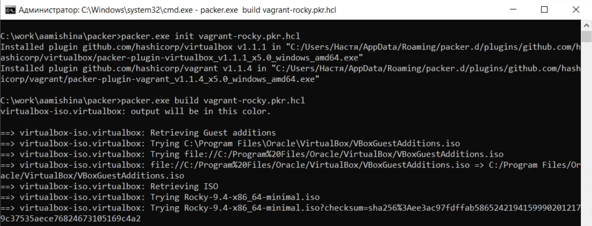{ #fig:001 width=80% }

## box-файл

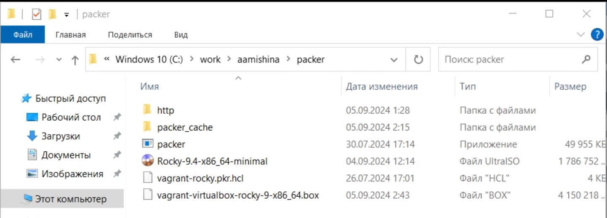{ #fig:002 width=80% }

## Образ ВМ

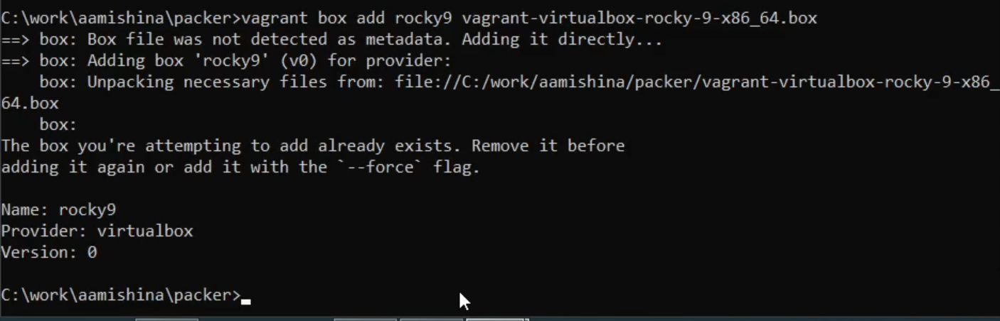{ #fig:003 width=80% }

## Запуск

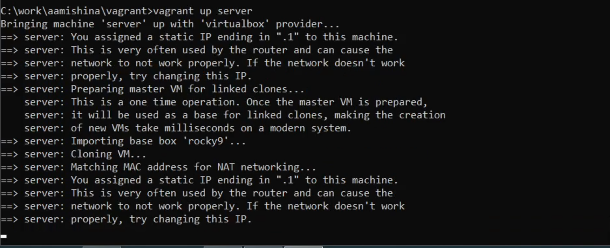{ #fig:004 width=80% }

## Запуск

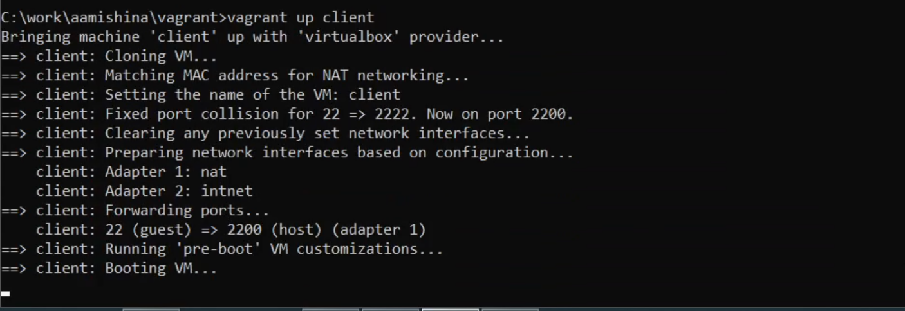{ #fig:005 width=80% }

## Логин

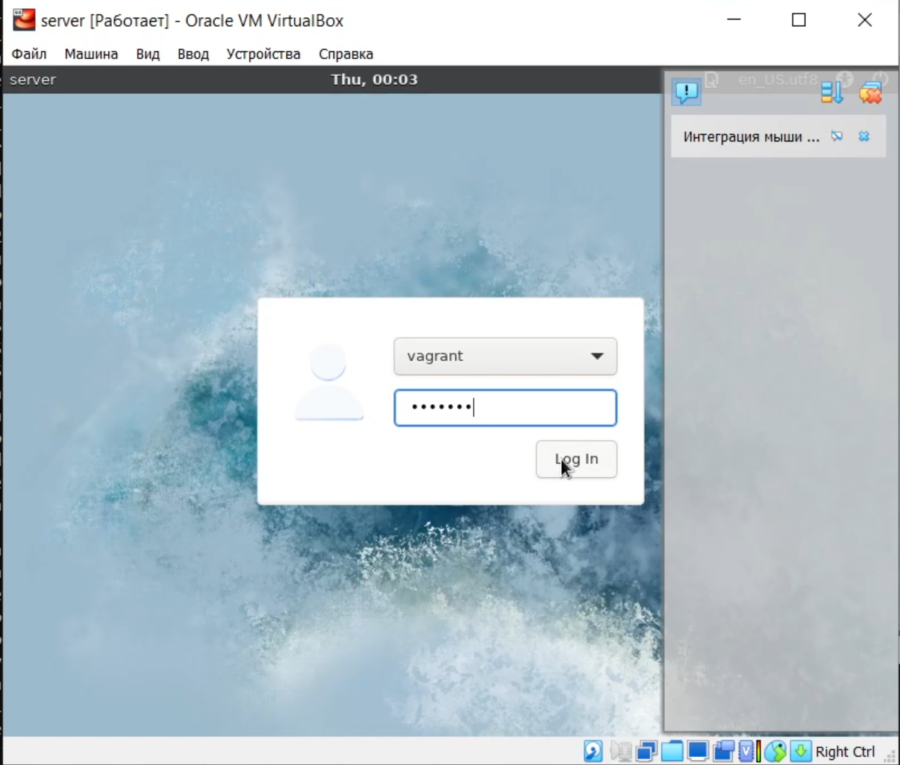{ #fig:006 width=55% }

## Логин

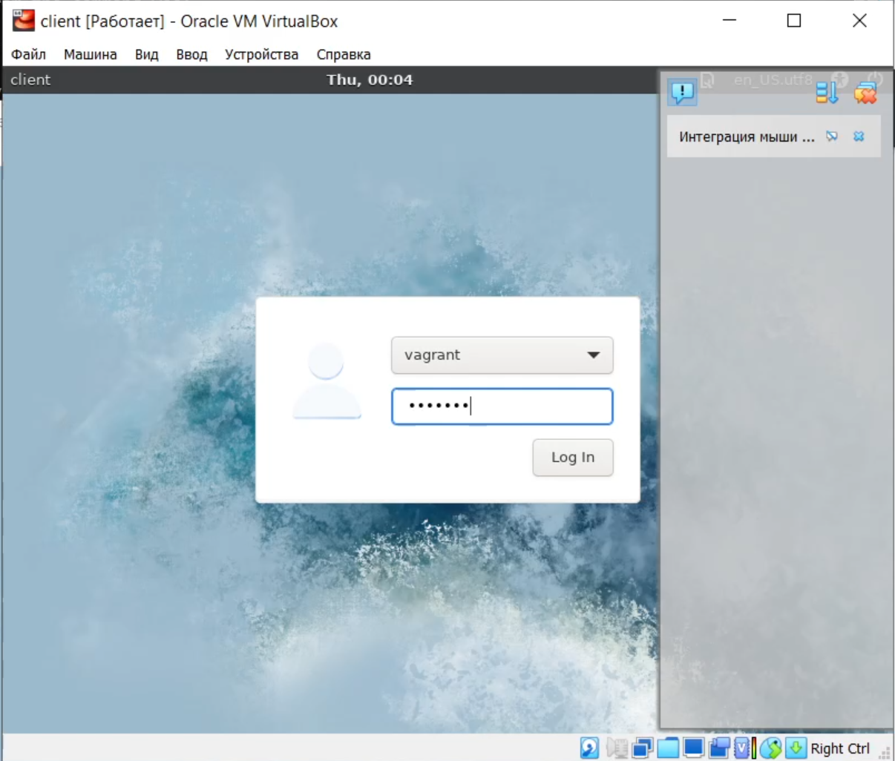{ #fig:007 width=55% }

## Переход к пользователю

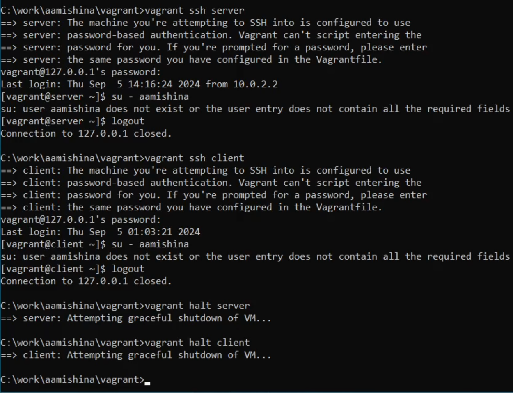{ #fig:008 width=55% }

# Внесение изменений в настройки внутреннего окружения виртуальной машины

## Изменения для внутренних настроек ВМ

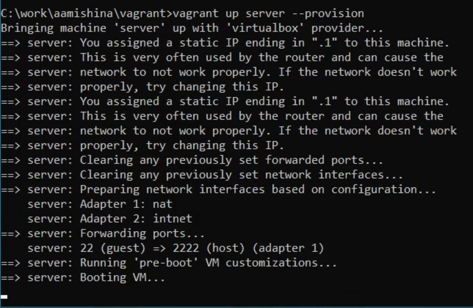{ #fig:009 width=55% }

## Изменения для внутренних настроек ВМ

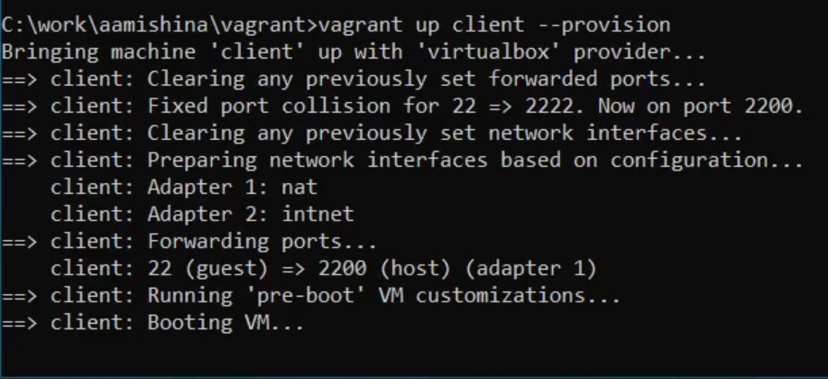{ #fig:010 width=80% }

## Логин

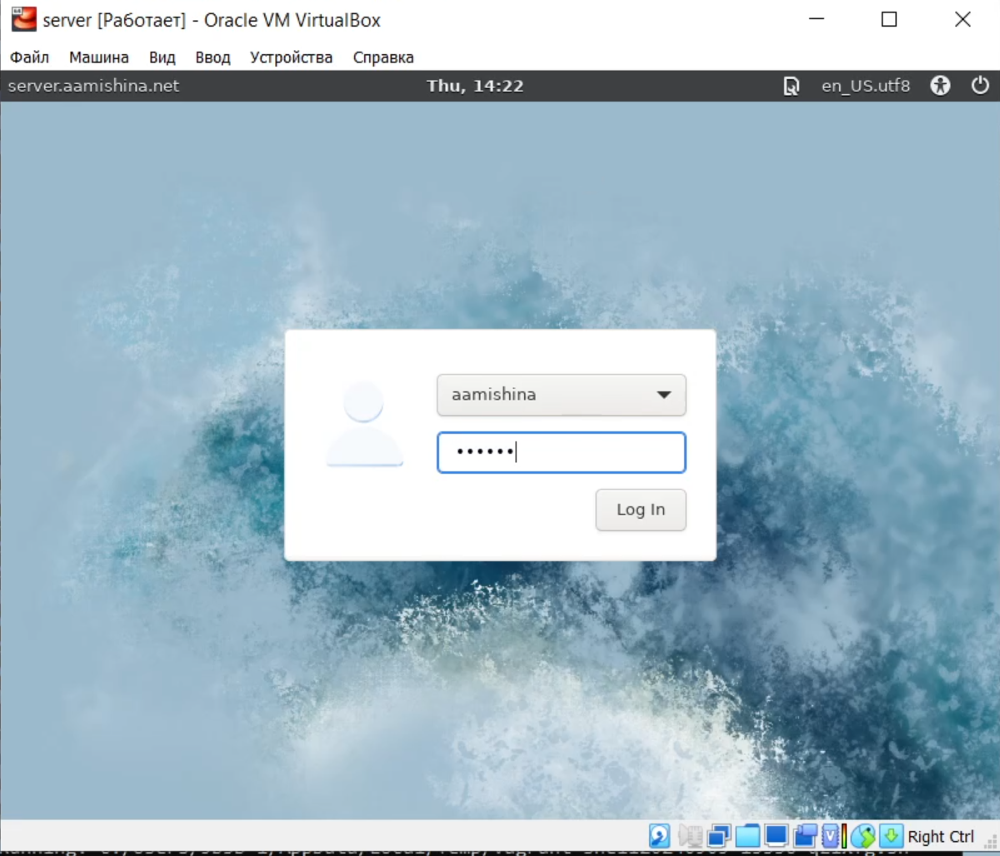{ #fig:011 width=55% }

## Логин

{ #fig:012 width=55% }

## Проверка приглашений

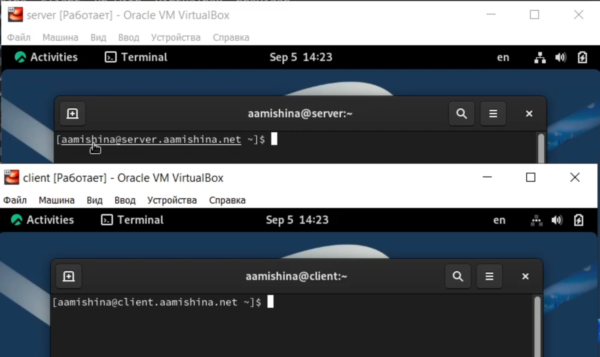{ #fig:013 width=80% }

## Выключение ВМ

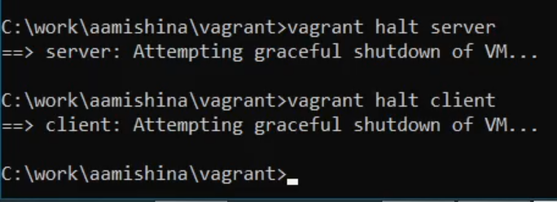{ #fig:014 width=80% }

## Копирование файлов

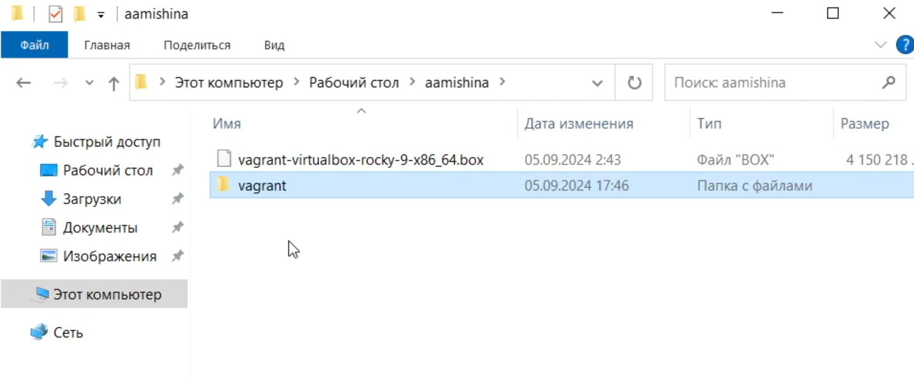{ #fig:015 width=80% }

## Вывод

- В ходе выполнения данной лабораторной работы я приобрела практические навыки установки Rocky Linux на виртуальную машину с помощью инструмента Vagrant.