---
## Front matter
title: "Отчёт по лабораторной работе №1"
subtitle: "Дисциплина: Администрирование сетевых подсистем"
author: "Мишина Анастасия Алексеевна"

## Generic options
lang: ru-RU
toc-title: "Содержание"

## Bibliography
bibliography: bib/cite.bib
csl: pandoc/csl/gost-r-7-0-5-2008-numeric.csl

## Pdf output format
toc: true # Table of contents
toc-depth: 2
lof: true # List of figures
lot: true # List of tables
fontsize: 14pt
linestretch: 1.5
papersize: a4
documentclass: scrreprt
## I18n polyglossia
polyglossia-lang:
  name: russian
  options:
	- spelling=modern
	- babelshorthands=true
polyglossia-otherlangs:
  name: english
## I18n babel
babel-lang: russian
babel-otherlangs: english
## Fonts
mainfont: PT Serif
romanfont: PT Serif
sansfont: PT Sans
monofont: PT Mono
mainfontoptions: Ligatures=TeX
romanfontoptions: Ligatures=TeX
sansfontoptions: Ligatures=TeX,Scale=MatchLowercase
monofontoptions: Scale=MatchLowercase,Scale=0.9
## Biblatex
biblatex: true
biblio-style: "gost-numeric"
biblatexoptions:
  - parentracker=true
  - backend=biber
  - hyperref=auto
  - language=auto
  - autolang=other*
  - citestyle=gost-numeric
## Pandoc-crossref LaTeX customization
figureTitle: "Рис."
tableTitle: "Таблица"
listingTitle: "Листинг"
lofTitle: "Список иллюстраций"
lotTitle: "Список таблиц"
lolTitle: "Листинги"
## Misc options
indent: true
header-includes:
  - \usepackage{indentfirst}
  - \usepackage{float} # keep figures where there are in the text
  - \floatplacement{figure}{H} # keep figures where there are in the text
---

# Цель работы

Целью данной работы является приобретение практических навыков установки Rocky Linux на виртуальную машину с помощью инструмента Vagrant.

# Выполнение лабораторной работы

Для начала создадим необходимые каталоги для работы и добавим в них файлы, описанные в мануале на ТУИСе. Так как я выполняю работу на Windows, расположение у меня следующее C:\\work\\aamishina\\packer и C:\\work\\aamishina\\vagrant. Помещаем в packer образ Rocky Linux, vagrant-rocky.pkr.hcl, каталог http с файлов настроек для установки дистрибутива - ks.cfg. В подкаталог vagrant помещаем Vagrantfile, а также каталог provision с подкаталогами default, server и client (их заполняем скриптами из мануала).

## Развёртывание лабораторного стенда на ОС Windows

Для начала переходим в каталог с файлом packer.exe и выполняем следующие команды: packer.exe init vagrant-rocky.pkr.hcl и packer.exe build vagrant-rocky.pkr.hcl (рис. [-@fig:001]) для начала автоматической установки образа операционной системы Rocky Linux в VirtualBox и последующего формирования box-файла с дистрибутивом Rocky Linux для VirtualBox (рис. [-@fig:002]).

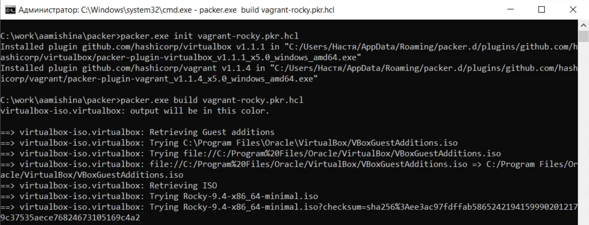{ #fig:001 width=80% }

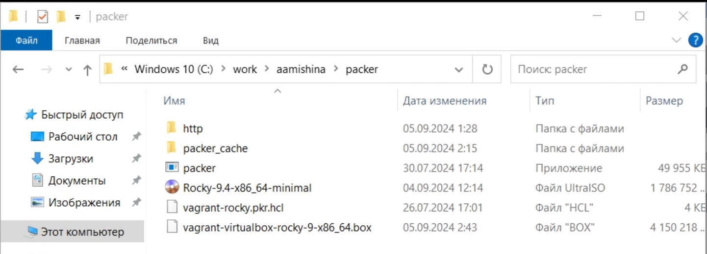{ #fig:002 width=80% }

Зарегистрируем образ виртуальной машины в vagrant: vagrant box add rocky9 vagrant-virtualbox-rocky-9-x86_64.box (рис. [-@fig:003]).

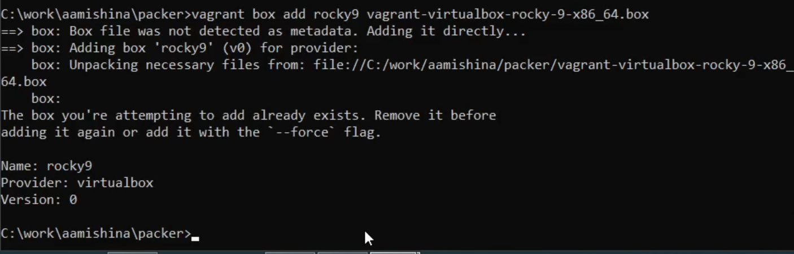{ #fig:003 width=80% }

Запустим виртуальные машины Server: vagrant up server (рис. [-@fig:004]) и Client: vagrant up client (рис. [-@fig:005]).

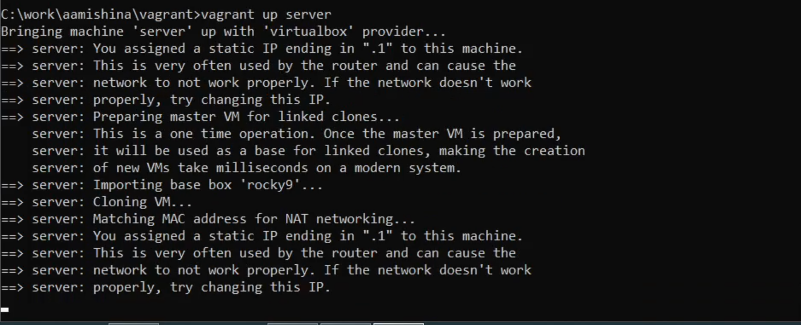{ #fig:004 width=80% }

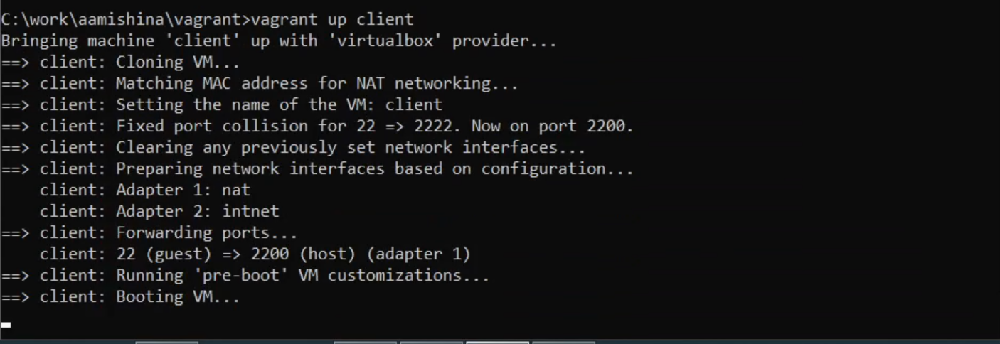{ #fig:005 width=80% }

Запуск обеих виртуальных машин проходит успешно, залогинимся в графическом окружении.(рис. [-@fig:004]) и Client: vagrant up client (рис. [-@fig:005]).

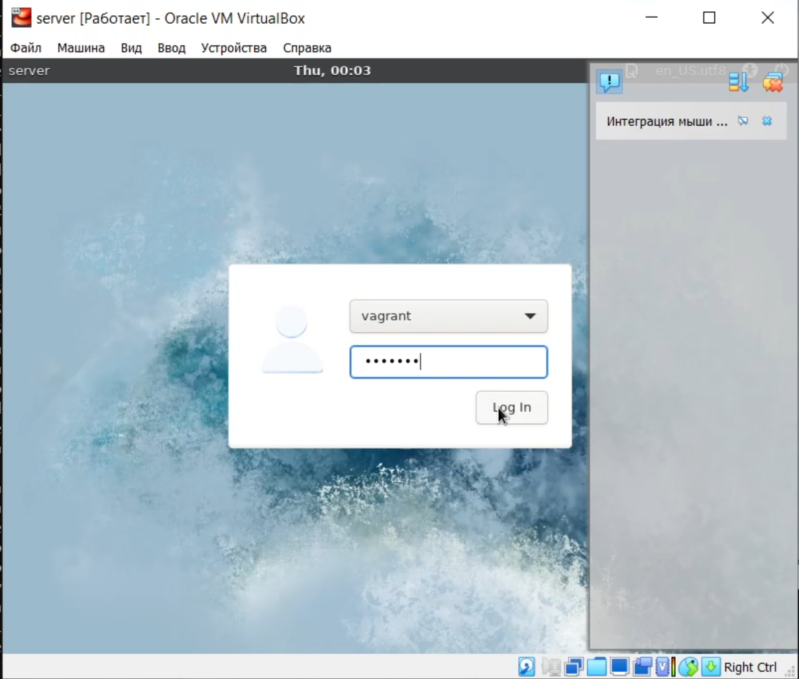{ #fig:006 width=80% }

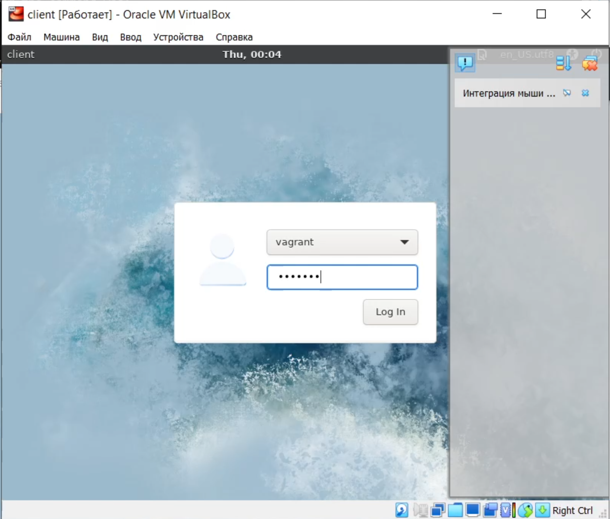{ #fig:007 width=80% }

Подключаемся к серверу из консоли: vagrant ssh server, вводим пароль vagrant. Переходим к пользователю aamishina: su - aamishina. Отлогиниваемся и выполняем тоже самое для клиента. Выключаем обе виртуальные машины: vagrant halt server и vagrant halt client (рис. [-@fig:008]).

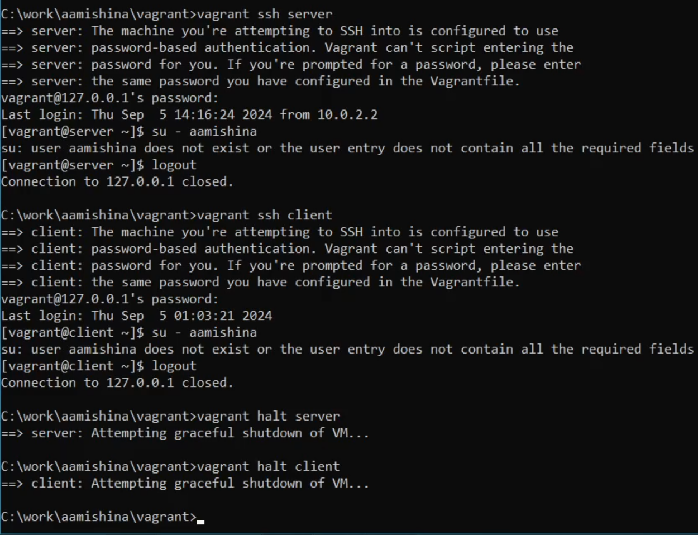{ #fig:008 width=80% }

## Внесение изменений в настройки внутреннего окружения виртуальной машины

Убеждаемся, что в файле Vagrantfile с конфигурацией файла есть отрывок из мануала в ТУИСе.

Фиксируем внесённые изменения для внутренних настроек виртуальных машин, введя в терминале: vagrant up server --provision (рис. [-@fig:009]) и vagrant up client --provision (рис. [-@fig:010]).

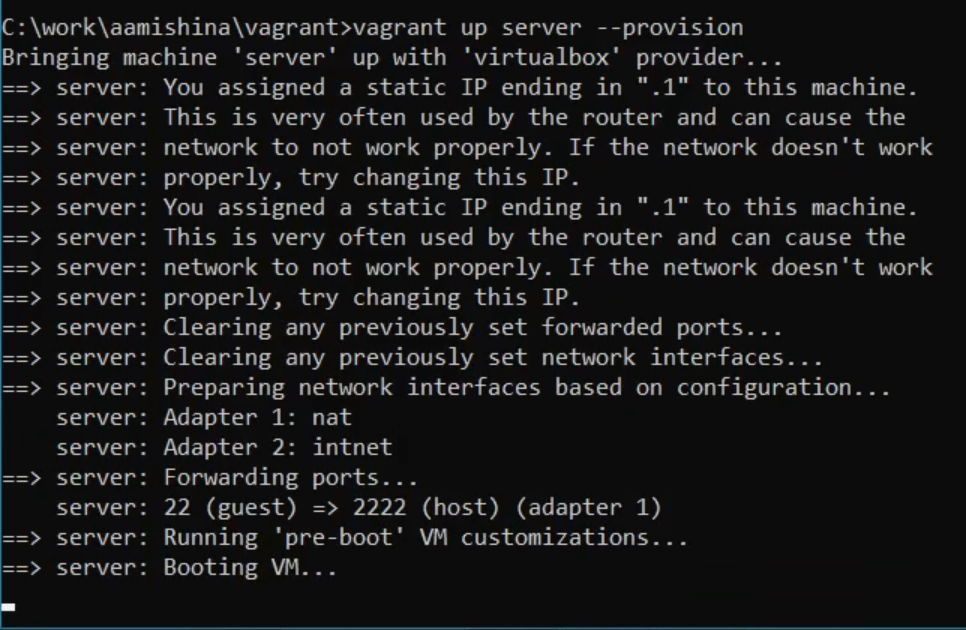{ #fig:009 width=80% }

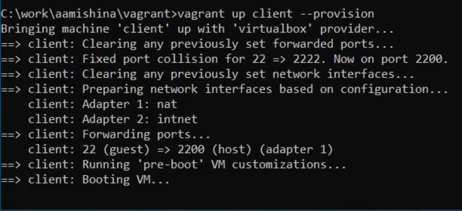{ #fig:010 width=80% }

Залогинимся на сервере (рис. [-@fig:011]) и клиенте (рис. [-@fig:012]) под созданным пользователем.

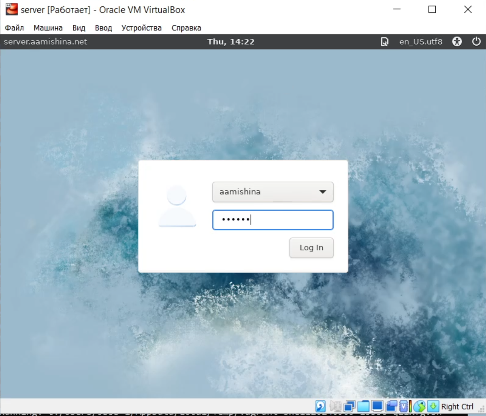{ #fig:011 width=80% }

{ #fig:012 width=80% }

Убедимся, что в терминале приглашение отображается в виде aamishina@server.aamishina.net на сервере и в виде aamishina@client.aamishina.net на клиенте (рис. [-@fig:013]).

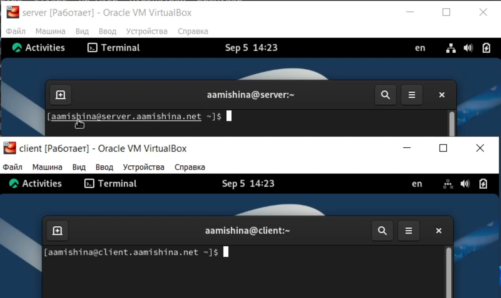{ #fig:013 width=80% }

Выключаем обе виртуальные машины (рис. [-@fig:014]) и копирем необходимые для работы с Vagrant файлы и box-файлы виртуальных машин на внешний носитель или в другой каталог вашей ОС (рис. [-@fig:015]).

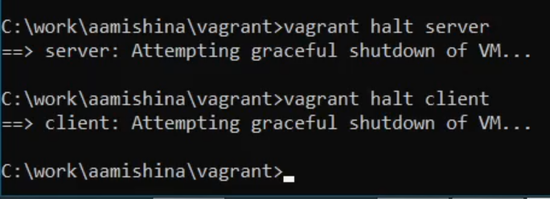{ #fig:014 width=80% }

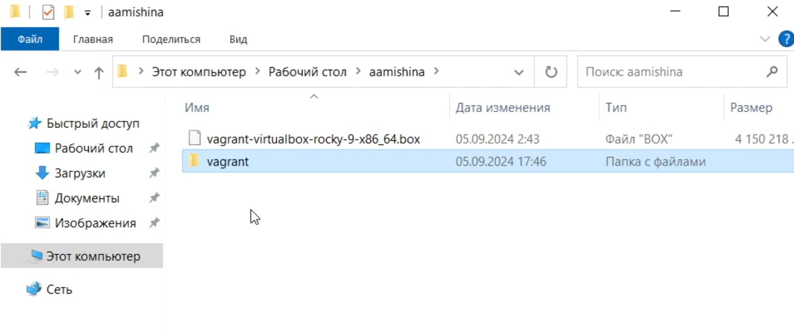{ #fig:015 width=80% }

Контрольные вопросы:

1. Для чего предназначен Vagrant? – Это инструмент для создания и
управления средами виртуальных машин в одном рабочем процессе.
Он позволяет автоматизировать процесс установки на виртуальную
машину как основного дистрибутива операционной системы, так и
настройки необходимого в дальнейшем программного обеспечения.

2. Что такое box-файл? В чём назначение Vagrantfile? - box-файл (или
Vagrant Box) — сохранённый образ виртуальной машины с
развёрнутой в ней операционной системой, box-файл используется
как основа для клонирования виртуальных машин с теми или иными
настройками. Vagrantfile — конфигурационный файл, написанный
на языке Ruby, в котором указаны настройки запуска виртуальной
машины.

3. Приведите описание и примеры вызова основных команд Vagrant.
vagrant help — вызов справки по командам Vagrant;
vagrant box list — список подключённых к Vagrant box-файлов;
vagrant box add — подключение box-файла к Vagrant;
vagrant destroy— отключение box-файла от Vagrant и удаление его из
виртуального окружения;
vagrant init — создание «шаблонного» конфигурационного файла
Vagrantfile для его последующего изменения;
vagrant up — запуск виртуальной машины с использованием инструкций
по запуску из конфигурационного файла Vagrantfile;
vagrant reload — перезагрузка виртуальной машины;
vagrant halt — остановка и выключение виртуальной машины;
vagrant provision — настройка внутреннего окружения имеющейся
виртуальной машины (например, добавление новых инструкций
(скриптов) в ранее созданную виртуальную машину);
vagrant ssh — подключение к виртуальной машине через ssh.

4. Дайте построчные пояснения содержания файлов vagrant-rocky.pkr.hcl,
ks.cfg, Vagrantfile, Makefile.
Vagrantfile - Первые две строки указывают на режим работы с Vagrantfile
и использование языка Ruby. Затем идёт цикл do, заменяющий
конструкцию Vagrant.configure далее по тексту на config. Строка
config.vm.box = "BOX_NAME" задаёт название образа (box-файла)
виртуальной машины (обычно выбирается из официального репозитория).
Строка config.vm.hostname = "HOST_NAME" задаёт имя виртуальной
машины. Конструкция config.vm.network задаёт тип сетевого соединения
и может иметь следующие назначения: – config.vm.network
"private_network", ip: "xxx.xxx.xxx.xxx" — адрес из внутренней сети; –
config.vm.network "public_network", ip: "xxx.xxx.xxx.xxx" — публичный
адрес, по которому виртуальная машина будет доступна; –
config.vm.network "private_network", type: "dhcp" — адрес, назначаемый по протоколу DHCP. Строка config.vm.define "VM_NAME" задаёт название
виртуальной машины, по которому можно обращаться к ней из Vagrant и
VirtualBox. В конце идёт конструкция, определяющая параметры
провайдера, а именно запуск виртуальной машины без графического
интерфейса и с выделением 1 ГБ памяти.

# Выводы

В ходе выполнения данной лабораторной работы я приобрела практические навыки установки Rocky Linux на виртуальную машину с помощью инструмента Vagrant.
