---
## Front matter
title: "Отчёт по лабораторной работе №2"
subtitle: "Дисциплина: Администрирование сетевых подсистем"
author: "Мишина Анастасия Алексеевна"

## Generic options
lang: ru-RU
toc-title: "Содержание"

## Bibliography
bibliography: bib/cite.bib
csl: pandoc/csl/gost-r-7-0-5-2008-numeric.csl

## Pdf output format
toc: true # Table of contents
toc-depth: 2
lof: true # List of figures
lot: true # List of tables
fontsize: 14pt
linestretch: 1.5
papersize: a4
documentclass: scrreprt
## I18n polyglossia
polyglossia-lang:
  name: russian
  options:
	- spelling=modern
	- babelshorthands=true
polyglossia-otherlangs:
  name: english
## I18n babel
babel-lang: russian
babel-otherlangs: english
## Fonts
mainfont: PT Serif
romanfont: PT Serif
sansfont: PT Sans
monofont: PT Mono
mainfontoptions: Ligatures=TeX
romanfontoptions: Ligatures=TeX
sansfontoptions: Ligatures=TeX,Scale=MatchLowercase
monofontoptions: Scale=MatchLowercase,Scale=0.9
## Biblatex
biblatex: true
biblio-style: "gost-numeric"
biblatexoptions:
  - parentracker=true
  - backend=biber
  - hyperref=auto
  - language=auto
  - autolang=other*
  - citestyle=gost-numeric
## Pandoc-crossref LaTeX customization
figureTitle: "Рис."
tableTitle: "Таблица"
listingTitle: "Листинг"
lofTitle: "Список иллюстраций"
lotTitle: "Список таблиц"
lolTitle: "Листинги"
## Misc options
indent: true
header-includes:
  - \usepackage{indentfirst}
  - \usepackage{float} # keep figures where there are in the text
  - \floatplacement{figure}{H} # keep figures where there are in the text
---

# Цель работы

Приобретение практических навыков по установке и конфигурированию DNS- сервера, усвоение принципов работы системы доменных имён.

# Выполнение лабораторной работы

## Установка DNS-сервера

Загрузим нашу операционную систему и перейдем в рабочий каталог с
проектом. Далее запустим виртуальную машину server: vagrant up server. На виртуальной машине server войдём под созданным нами в предыдущей работе пользователем и откроем терминал. Перейдём в режим суперпользователя: sudo -i и установим bind и bind-utils: dnf -y install bind bind-utils (рис. [-@fig:001]).

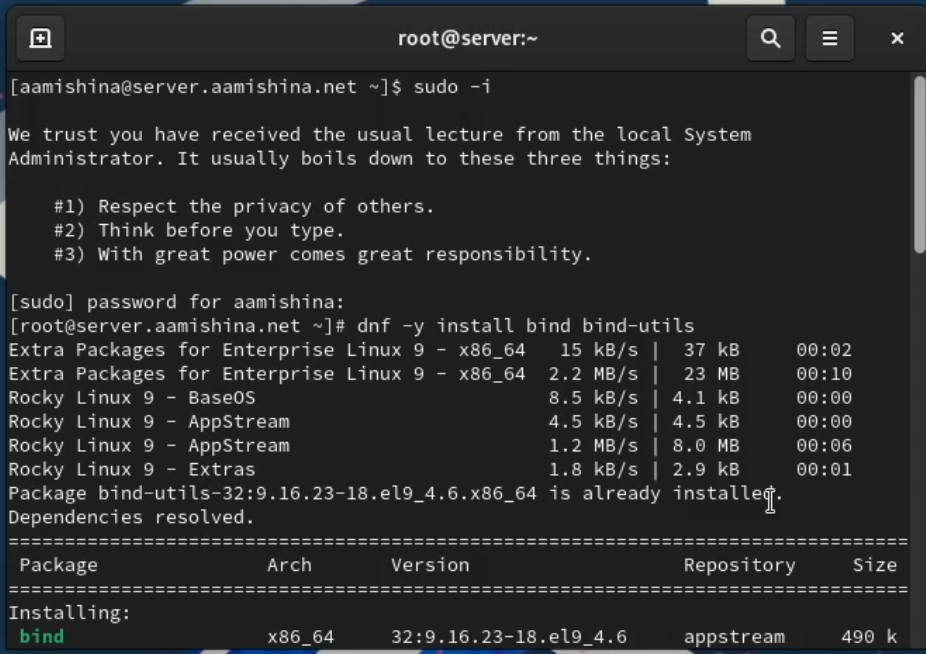{ #fig:001 width=80% }

С помощью утилиты dig сделаем запрос к DNS-адресу www.yandex.ru: dig www.yandex.ru (рис. [-@fig:002]).

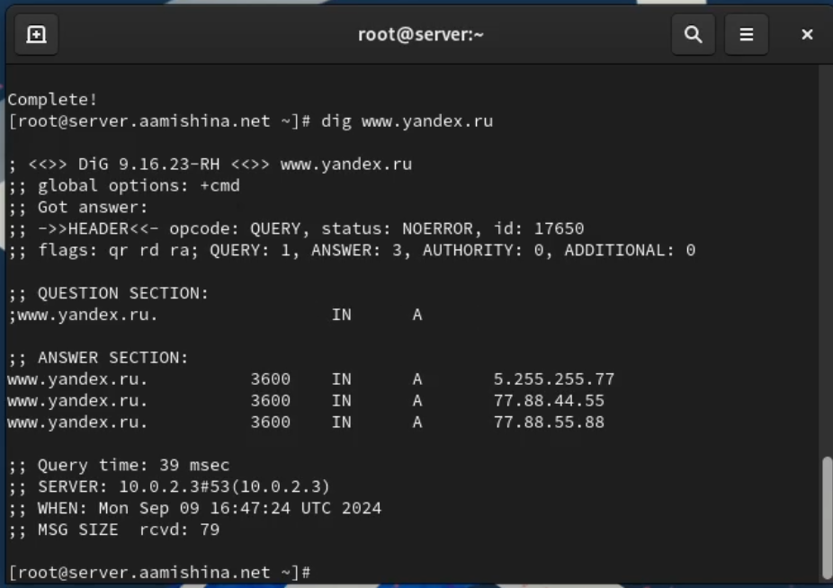{ #fig:002 width=80% }

## Конфигурирование кэширующего DNS-сервера

Просмотрим содержание файлов /etc/resolv.conf (рис. [-@fig:003]), /etc/named.conf (рис. [-@fig:004]), /var/named/named.ca (рис. [-@fig:005]), /var/named/named.localhost (рис. [-@fig:006]), /var/named/named.loopback (рис. [-@fig:007]).

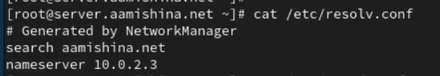{ #fig:003 width=80% }

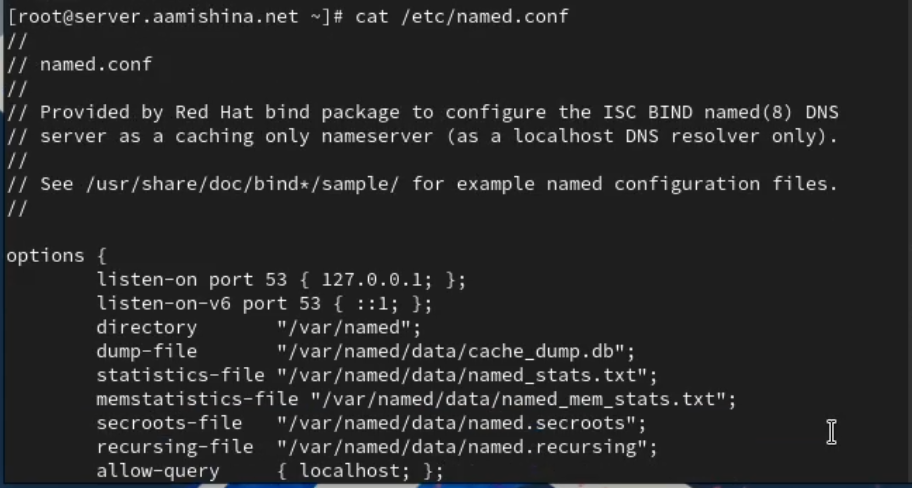{ #fig:004 width=80% }

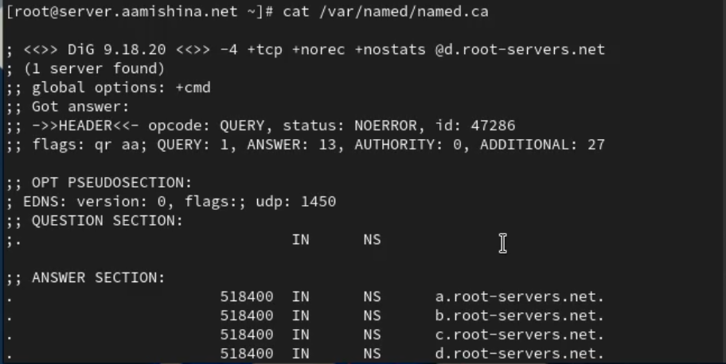{ #fig:005 width=80% }

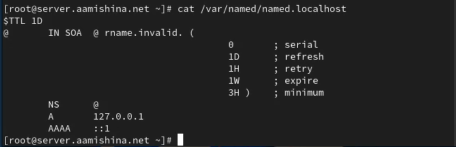{ #fig:006 width=80% }

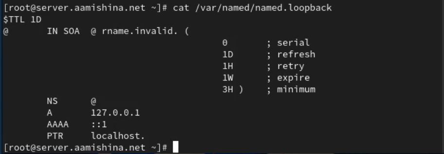{ #fig:007 width=80% }

Запустим DNS-сервер: systemctl start named. Включим запуск DNS-сервера в автозапуск при загрузке системы: systemctl enable named. Проанализируем отличие в выведенной на экран информации при выполнении команд:
dig www.yandex.ru и dig 127.0.0.1 www.yandex.ru (рис. [-@fig:008]).

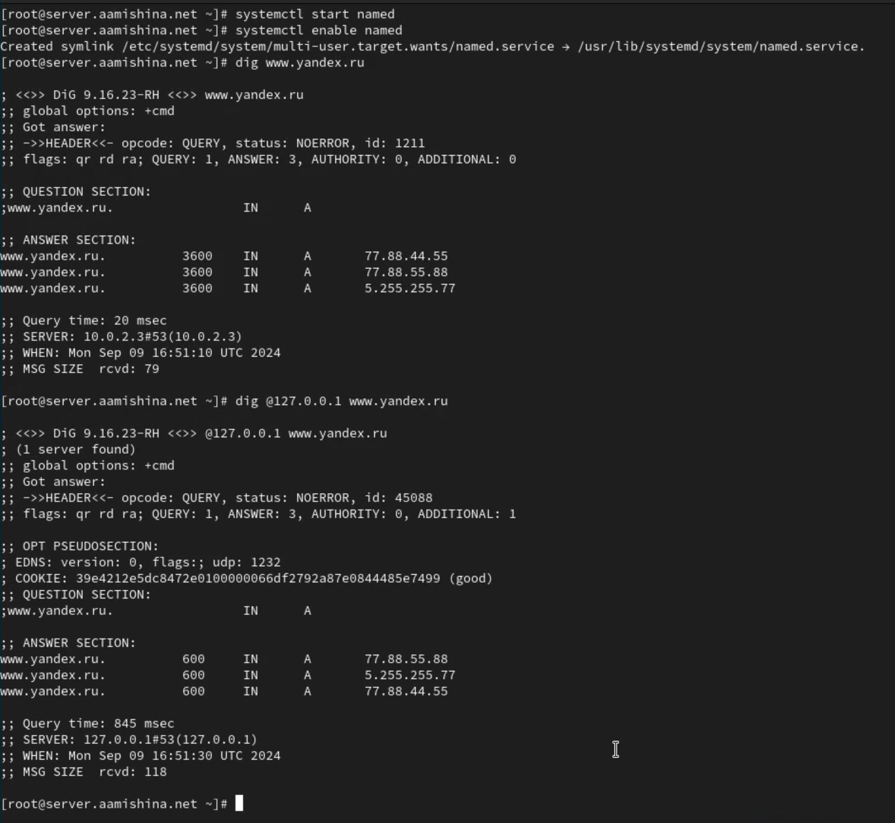{ #fig:008 width=80% }

Сделаем DNS-сервер сервером по умолчанию для хоста server и внутренней виртуальной сети. Для этого изменим настройки сетевого соединения eth0 в NetworkManager, переключив его на работу с внутренней сетью и указав для него в качестве DNS-сервера по умолчанию адрес 127.0.0.1. Сделаем тоже самое для соединения System eth0 (рис. [-@fig:009]).

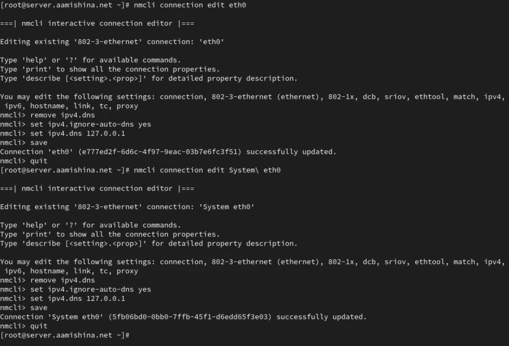{ #fig:009 width=80% }

Перезапустим NetworkManager: systemctl restart NetworkManager. Проверим наличие изменений в файле /etc/resolv.conf (рис. [-@fig:010]).

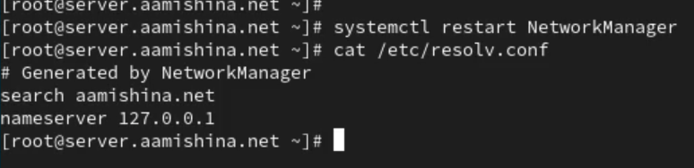{ #fig:010 width=80% }

Теперь нам требуется настроить направление DNS-запросов от всех узлов внутренней сети, включая запросы от узла server, через узел server. Для этого внесём изменения в файл /etc/named.conf, заменив строку listen-on port 53 { 127.0.0.1; }; на listen-on port 53 { 127.0.0.1; any; }; и строку
allow-query { localhost; }; на allow-query { localhost; 192.168.0.0/16; }; (рис. [-@fig:011]).

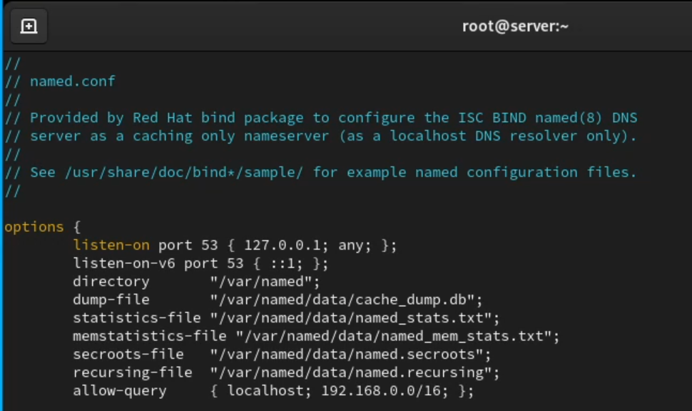{ #fig:011 width=80% }

Внесём изменения в настройки межсетевого экрана узла server, разрешив
работу с DNS: firewall-cmd --add-service=dns и firewall-cmd --add service=dns --permanent. Убедимся, что DNS-запросы идут через узел server, который прослушивает порт 53. Для этого на данном этапе используем команду lsof: lsof | grep UDP (рис. [-@fig:012]).

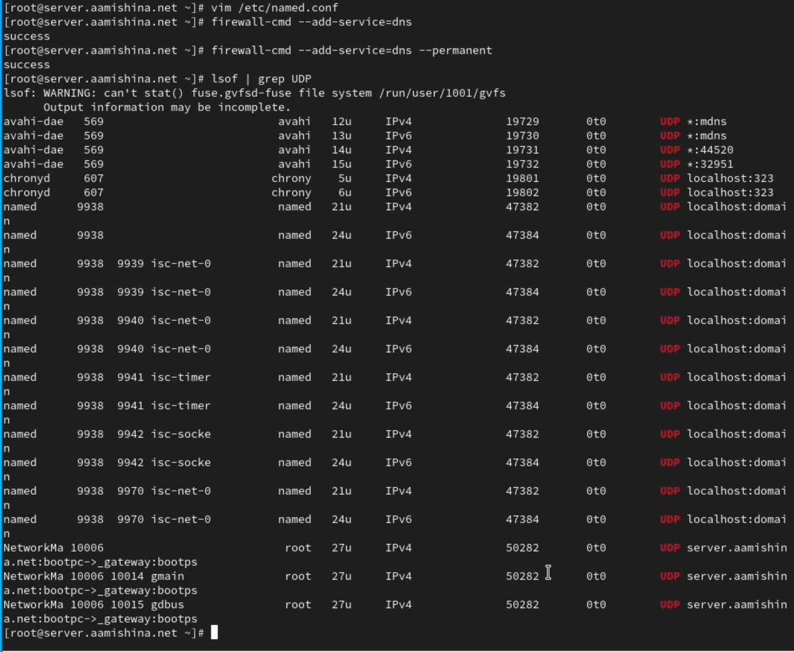{ #fig:012 width=80% }

В случае возникновения в сети ситуации, когда DNS-запросы от сервера фильтруются сетевым оборудованием, следует добавить перенаправление DNS-запросов на конкретный вышестоящий DNS-сервер. Для этого в конфигурационный файл named.conf в секцию options добавим: forwarders { список DNS-серверов }; и forward first; Кроме того, возможно вышестоящий DNS-сервер может не поддерживать технологию DNSSEC, тогда в конфигурационном файле named.conf укажем следующие настройки: dnssec-enable no; и dnssec-validation no; (рис. [-@fig:013]).

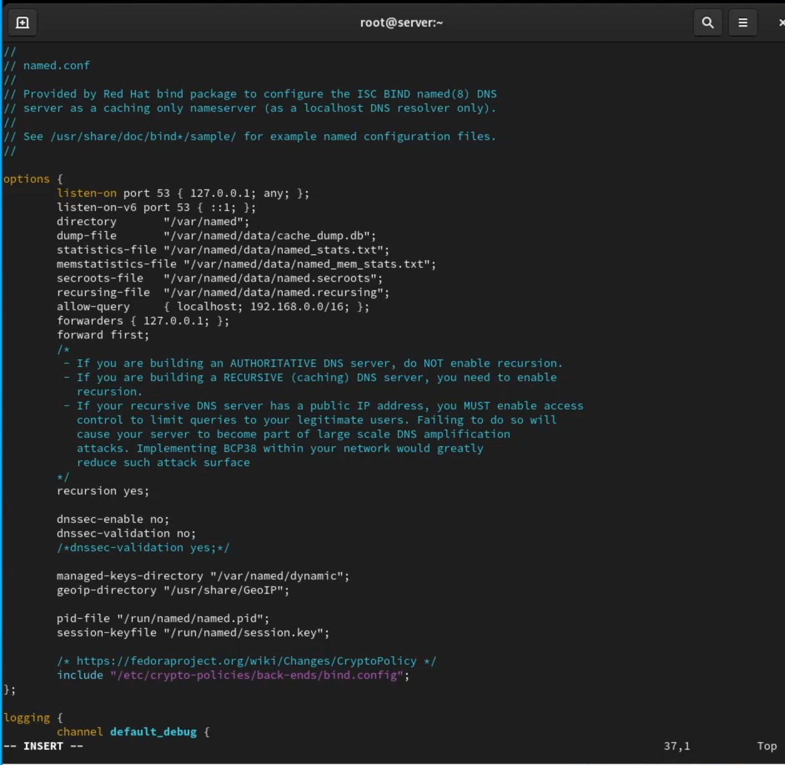{ #fig:013 width=80% }

## Конфигурирование первичного DNS-сервера

Скопируем шаблон описания DNS-зон named.rfc1912.zones из каталога /etc в каталог /etc/named и переименуем его в aamishina.net: cp /etc/named.rfc1912.zones /etc/named/; cd /etc/named и mv /etc/named/named.rfc1912.zones /etc/named/user.net (рис. [-@fig:014]).

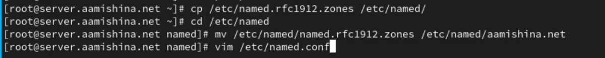{ #fig:014 width=80% }

Включим файл описания зоны /etc/named/aamishina.net в конфигурационном файле DNS /etc/named.conf, добавив в нём в конце строку: include "/etc/named/aamishina.net" (рис. [-@fig:015]).

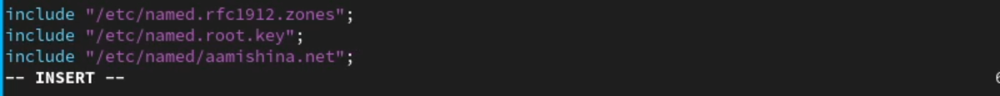{ #fig:015 width=80% }

Откроем файл /etc/named/user.net на редактирование и вместо зоны пропишем свою прямую зону. Далее, вместо зоны пропишем свою обратную зону. Остальные записи в файле /etc/named/aamishina.net удалим (рис. [-@fig:016]).

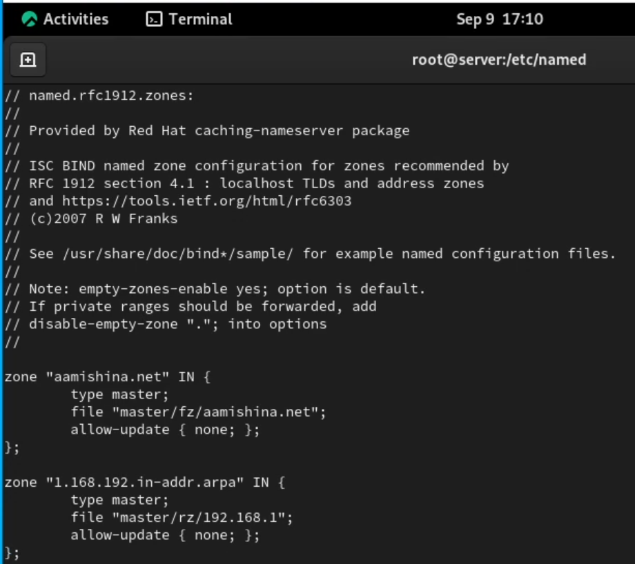{ #fig:016 width=80% }

В каталоге /var/named создадим подкаталоги master/fz и master/rz, в которых будут располагаться файлы прямой и обратной зоны соответственно: cd /var/named; mkdir -p /var/named/master/fz; mkdir -p /var/named/master/rz. Скопируем шаблон прямой DNS-зоны named.localhost из каталога /var/named в каталог /var/named/master/fz и переименуем его в aamishina.net: cp /var/named/named.localhost /var/named/master/fz/; cd /var/named/master/fz/; mv named.localhost aamishina.net (рис. [-@fig:017]).

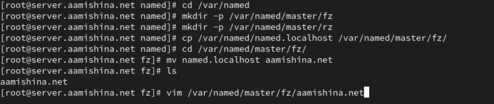{ #fig:017 width=80% }

Изменим файл /var/named/master/fz/aamishina.net, указав необходимые DNS записи для прямой зоны. В этом файле DNS-имя сервера @ rname.invalid. заменим на @ server.aamishina.net. Формат серийного номера ГГГГММДДВВ (ГГГГ — год, ММ — месяц, ДД — день, ВВ — номер ревизии) [1]; адрес в A-записи заменим с 127.0.0.1 на 192.168.1.1; в директиве ORIGIN зададим текущее имя домена aamishina.net, а затем укажем имена и адреса серверов в этом домене в виде A-записей DNS (на данном этапе пропишем сервер с именем ns и адресом
192.168.1.1) (рис. [-@fig:018]).

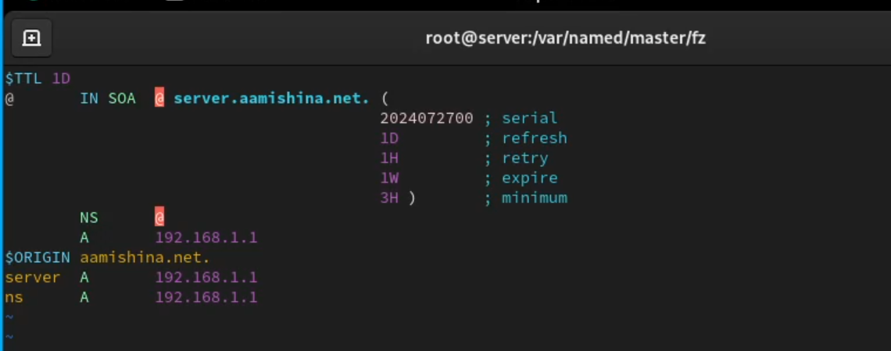{ #fig:018 width=80% }

Скопируем шаблон обратной DNS-зоны named.loopback из каталога /var/named в каталог /var/named/master/rz и переименуем его в 192.168.1: cp /var/named/named.loopback /var/named/master/rz/; cd /var/named/master/rz/ и mv named.loopback 192.168.1 (рис. [-@fig:019]).

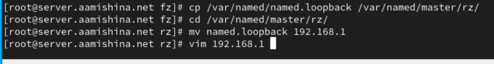{ #fig:019 width=80% }

Изменим файл /var/named/master/rz/192.168.1, указав необходимые DNS записи для обратной зоны. В этом файле DNS-имя сервера @ rname.invalid заменим на @ server.aamishina.net. формат серийного номера ГГГГММДДВВ (ГГГГ — год, ММ — месяц, ДД — день, ВВ — номер ревизии); адрес в A-записи заменим с 127.0.0.1 на 192.168.1.1; в директиве $ORIGIN зададим название обратной зоны в виде 1.168.192.in-addr.arpa., затем зададим PTR-записи (на данном этапе зададим PTR запись, ставящая в соответствие адресу 192.168.1.1
DNS-адрес ns.aamishina.net) (рис. [-@fig:020]).

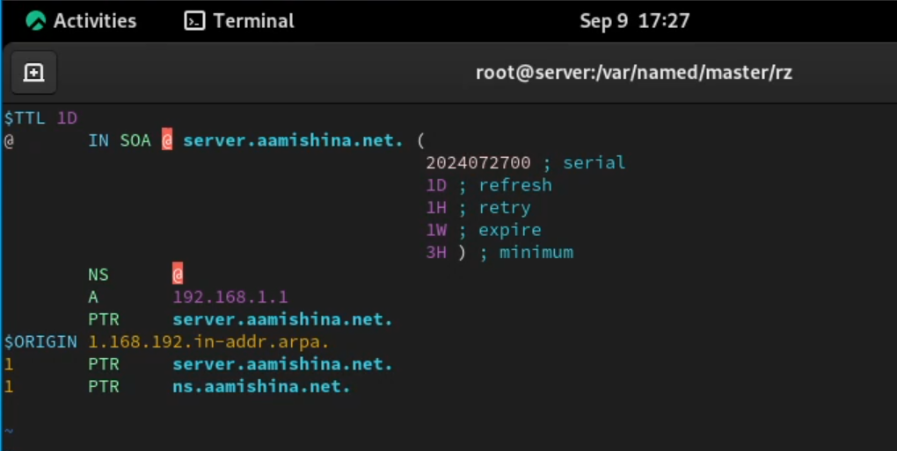{ #fig:020 width=80% }

Далее исправим права доступа к файлам в каталогах /etc/named и /var/named, чтобы демон named мог с ними работать: chown -R named:named /etc/named и chown -R named:named /var/named. В системах с запущенным SELinux все процессы и файлы имеют специальные метки безопасности (так называемый «контекст безопасности»), используемые системой для принятия решений по доступу к этим процессам и файлам. После изменения доступа к конфигурационным файлам named требуется корректно восстановить их метки в SELinux: restorecon -vR /etc и restorecon -vR /var/named. Для проверки состояния переключателей SELinux, относящихся к named, введём: getsebool -a | grep named. Теперь дадим named разрешение на запись в файлы DNS-зоны: setsebool named_write_master_zones 1 и setsebool -P и named_write_master_zones 1 (рис. [-@fig:021]).

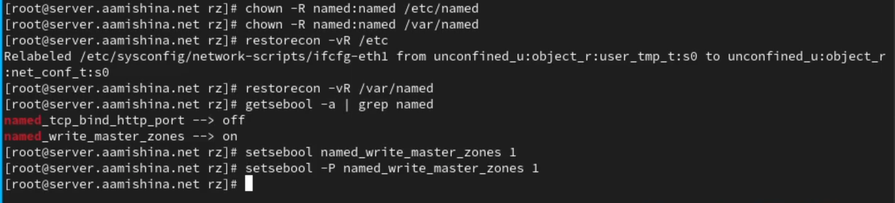{ #fig:021 width=80% }

В дополнительном терминале запустим в режиме реального времени расширенный лог системных сообщений, чтобы проверить корректность работы системы: journalctl -x -f (рис. [-@fig:022]), (рис. [-@fig:023]) и в первом терминале перезапустим DNS-сервер: systemctl restart named (рис. [-@fig:024]).

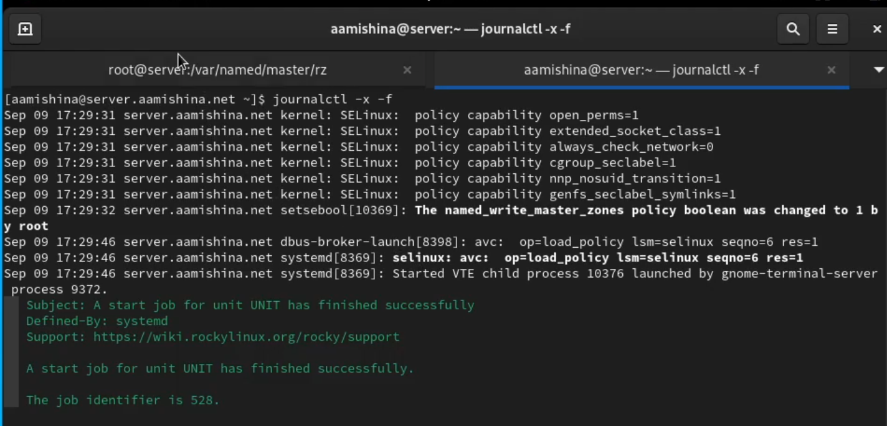{ #fig:022 width=80% }

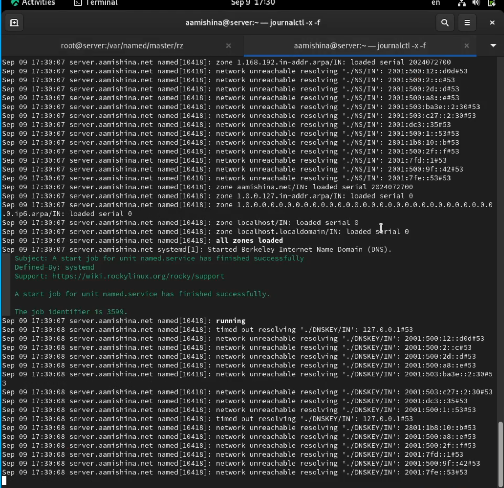{ #fig:023 width=80% }

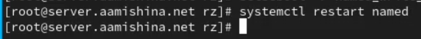{ #fig:024 width=80% }

## Анализ работы DNS-сервера

При помощи утилиты dig получим описание DNS-зоны с сервера ns.aamishina.net: dig ns.user.net (рис. [-@fig:025]).

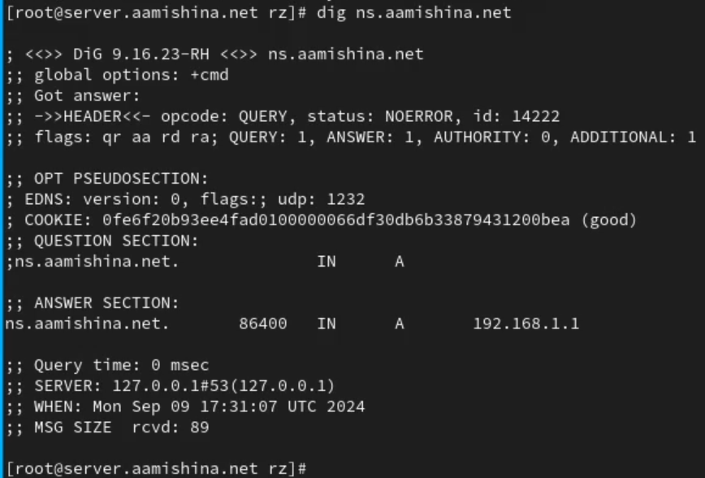{ #fig:025 width=80% }

При помощи утилиты host проанализируем корректность работы DNS-
сервера: host -l aamishina.net; host -a aamishina.net; host -t A aamishina.net; host -t PTR 192.168.1.1 (рис. [-@fig:026]).

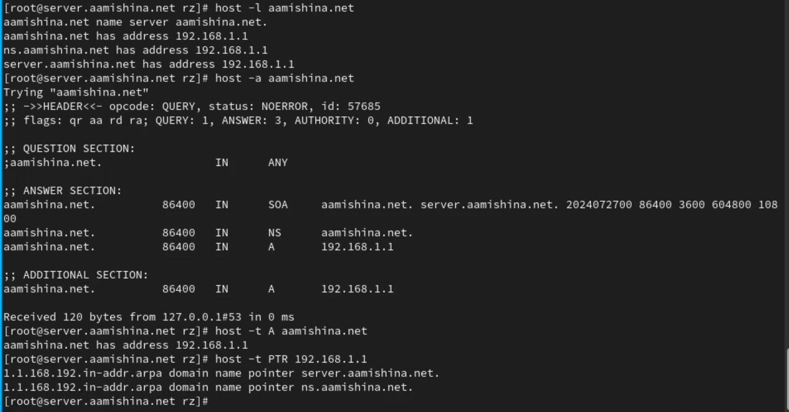{ #fig:026 width=80% }

## Внесение изменений в настройки внутреннего окружения виртуальной машины

На виртуальной машине server перейдём в каталог для внесения изменений в настройки внутреннего окружения /vagrant/provision/server/, создадим в нём
каталог dns, в который поместим в соответствующие каталоги конфигурационные файлы DNS: cd /vagrant; mkdir -p /vagrant/provision/server/dns/etc/named; mkdir -p /vagrant/provision/server/dns/var/named/master/; cp -R /etc/named.conf /vagrant/provision/server/dns/etc/; cp -R /etc/named/* /vagrant/provision/server/dns/etc/named/; cp -R /var/named/master/* /vagrant/provision/server/dns/var/named/master/. В каталоге /vagrant/provision/server создадим исполняемый файл dns.sh: touch dns.sh и chmod +x dns.sh (рис. [-@fig:027]).

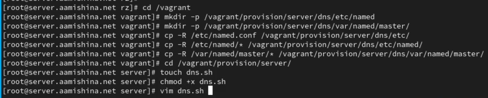{ #fig:027 width=80% }

Откроем его на редактирование и пропишем в нём следующий скрипт (приведён в лабораторной работе). Этот скрипт, по сути, повторяет произведённые нами действия по установке и настройке DNS-сервера (рис. [-@fig:028]):

1. подставляет в нужные каталоги подготовленные вами конфигурационные файлы;
2. меняет соответствующим образом права доступа, метки безопасности SELinux и правила межсетевого экрана;
3. настраивает сетевое соединение так, чтобы сервер выступал DNS-сервером по умолчанию для узлов внутренней виртуальной сети;
4. запускает DNS-сервер;

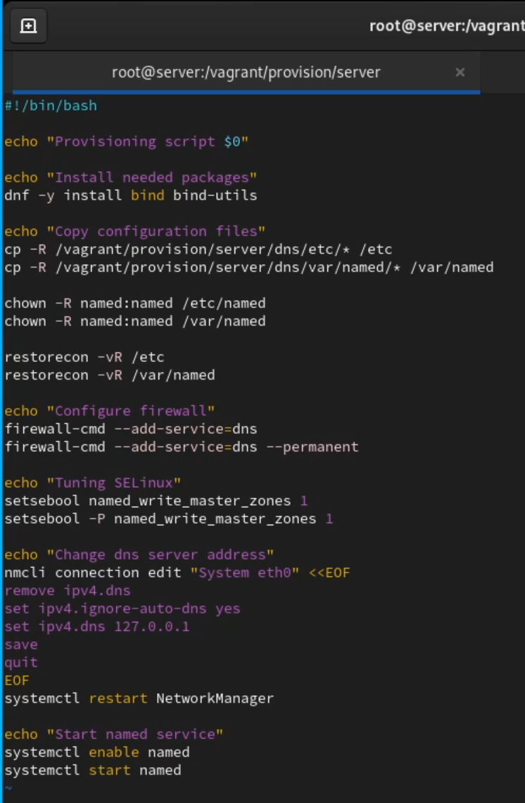{ #fig:028 width=80% }

Для отработки созданного скрипта во время загрузки виртуальной машины server в конфигурационном файле Vagrantfile добавим определённые параметры
в разделе конфигурации для сервера (рис. [-@fig:029]).

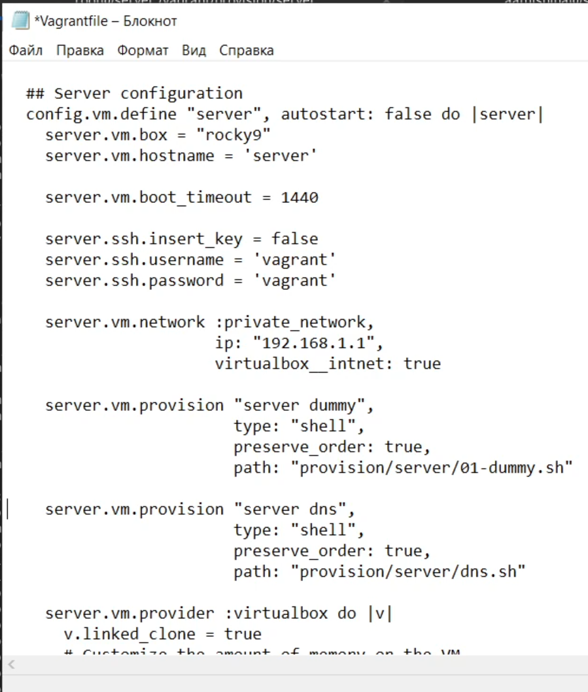{ #fig:029 width=80% }

Контрольные вопросы:

1. Что такое DNS? - Это система, предназначенная для преобразования
человекочитаемых доменных имен в IP-адреса, используемые
компьютерами для идентификации друг друга в сети.

2. Каково назначение кэширующего DNS-сервера? - Его задача - хранить
результаты предыдущих DNS-запросов в памяти. Когда клиент делает
запрос, кэширующий DNS проверяет свой кэш, и если он содержит
соответствующую информацию, сервер возвращает ее без необходимости
обращаться к другим DNS-серверам. Это ускоряет процесс запроса.

3. Чем отличается прямая DNS-зона от обратной? - Прямая зона преобразует
доменные имена в IP-адреса, обратная зона выполняет обратное:
преобразует IP-адреса в доменные имена.

4. В каких каталогах и файлах располагаются настройки DNS-сервера?
Кратко охарактеризуйте, за что они отвечают. - В Linux-системах обычно
используется файл /etc/named.conf для общих настроек. Зоны хранятся в
файлах в каталоге /var/named/, например, /var/named/example.com.zone.

5. Что указывается в файле resolv.conf? - Содержит информацию о DNS-
серверах, используемых системой, а также о параметрах конфигурации.

6. Какие типы записи описания ресурсов есть в DNS и для чего они
используются? - A (IPv4-адрес), AAAA (IPv6-адрес), CNAME
(каноническое имя), MX (почтовый сервер), NS (имя сервера), PTR
(обратная запись), SOA (начальная запись зоны), TXT (текстовая
информация).

7. Для чего используется домен in-addr.arpa? - Используется для обратного
маппинга IP-адресов в доменные имена.

8. Для чего нужен демон named? - Это DNS-сервер, реализация BIND
(Berkeley Internet Name Domain).

9. В чём заключаются основные функции slave-сервера и master-сервера? -
Master-сервер хранит оригинальные записи зоны, slave-серверы получают
копии данных от master-сервера.

10. Какие параметры отвечают за время обновления зоны? - refresh, retry,
expire, и minimum.

11. Как обеспечить защиту зоны от скачивания и просмотра? - Это может
включать в себя использование TSIG (Transaction SIGnatures) для
аутентификации между серверами.

12. Какая запись RR применяется при создании почтовых серверов? - MX
(Mail Exchange).

13. Как протестировать работу сервера доменных имён? - Используйте
команды nslookup, dig, или host.

14. Как запустить, перезапустить или остановить какую-либо службу в
системе? - systemctl start|stop|restart <service>.

15. Как посмотреть отладочную информацию при запуске какого-либо
сервиса или службы? - Используйте опции, такие как -d или -v при запуске
службы.

16. Где храниться отладочная информация по работе системы и служб? Как
её посмотреть? - В системных журналах, доступных через journalctl.

17. Как посмотреть, какие файлы использует в своей работе тот или иной
процесс? Приведите несколько примеров. - lsof -p <pid> или fuser -v <file>.

18. Приведите несколько примеров по изменению сетевого соединения при
помощи командного интерфейса nmcli. - Примеры включают nmcli
connection up|down <connection_name>.

19. Что такое SELinux? - Это мандатный контроль доступа для ядра Linux.

20. Что такое контекст (метка) SELinux? - Метка, определяющая, какие
ресурсы могут быть доступны процессу или объекту.

21. Как восстановить контекст SELinux после внесения изменений в
конфигурационные файлы? - restorecon -Rv <directory>.

22. Как создать разрешающие правила политики SELinux из файлов
журналов, содержащих сообщения о запрете операций? - Используйте
audit2allow.

23. Что такое булевый переключатель в SELinux? - Это параметр, который
включает или отключает определенные аспекты защиты SELinux.

24. Как посмотреть список переключателей SELinux и их состояние? -
getsebool -a.

25. Как изменить значение переключателя SELinux? - setsebool -P
<boolean_name> <on|off>.

# Выводы

В ходе выполнения данной лабораторной работы я приобрела практические навыки по установке и конфигурированию DNS-сервера, усвоила принципы работы системы доменных имён.