---
## Front matter
title: "Отчёт по лабораторной работе №3"
subtitle: "Дисциплина: Администрирование сетевых подсистем"
author: "Мишина Анастасия Алексеевна"

## Generic options
lang: ru-RU
toc-title: "Содержание"

## Bibliography
bibliography: bib/cite.bib
csl: pandoc/csl/gost-r-7-0-5-2008-numeric.csl

## Pdf output format
toc: true # Table of contents
toc-depth: 2
lof: true # List of figures
lot: true # List of tables
fontsize: 14pt
linestretch: 1.5
papersize: a4
documentclass: scrreprt
## I18n polyglossia
polyglossia-lang:
  name: russian
  options:
	- spelling=modern
	- babelshorthands=true
polyglossia-otherlangs:
  name: english
## I18n babel
babel-lang: russian
babel-otherlangs: english
## Fonts
mainfont: PT Serif
romanfont: PT Serif
sansfont: PT Sans
monofont: PT Mono
mainfontoptions: Ligatures=TeX
romanfontoptions: Ligatures=TeX
sansfontoptions: Ligatures=TeX,Scale=MatchLowercase
monofontoptions: Scale=MatchLowercase,Scale=0.9
## Biblatex
biblatex: true
biblio-style: "gost-numeric"
biblatexoptions:
  - parentracker=true
  - backend=biber
  - hyperref=auto
  - language=auto
  - autolang=other*
  - citestyle=gost-numeric
## Pandoc-crossref LaTeX customization
figureTitle: "Рис."
tableTitle: "Таблица"
listingTitle: "Листинг"
lofTitle: "Список иллюстраций"
lotTitle: "Список таблиц"
lolTitle: "Листинги"
## Misc options
indent: true
header-includes:
  - \usepackage{indentfirst}
  - \usepackage{float} # keep figures where there are in the text
  - \floatplacement{figure}{H} # keep figures where there are in the text
---

# Цель работы

Приобретение практических навыков по установке и конфигурированию DHCP-сервера.

# Выполнение лабораторной работы

## Установка DHCP-сервера

Загрузим нашу операционную систему и перейдем в рабочий каталог с проектом. Далее запустим виртуальную машину server: vagrant up server. На виртуальной машине server войдём под созданным нами в предыдущей работе пользователем и откроем терминал. Перейдём в режим суперпользователя: sudo -i и установим dhcp: dnf -y install dhcp-server (рис. [-@fig:001]).

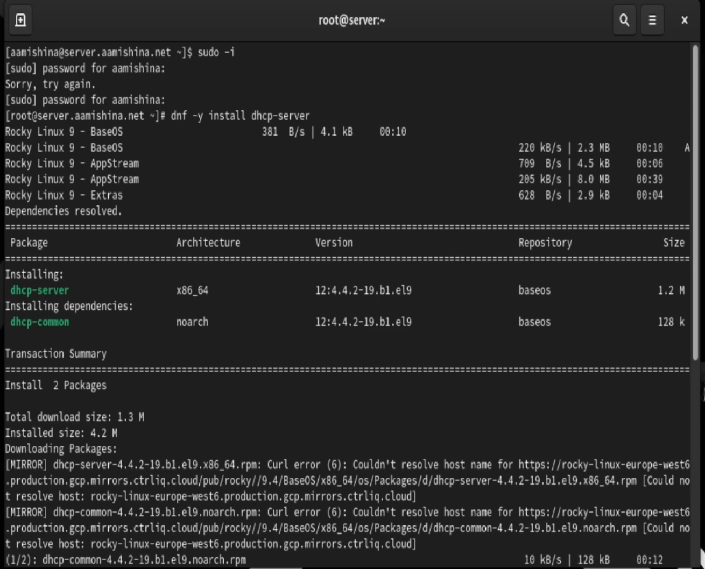{ #fig:001 width=80% }

##  Конфигурирование DHCP-сервера

Копируем файл примера конфигурации DHCP dhcpd.conf.example из каталога
/usr/share/doc/dhcp* в каталог /etc/dhcp и переименовываем его в файл с названием dhcpd.conf (рис. [-@fig:1]).

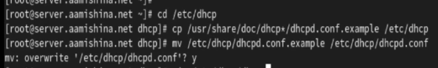{#fig:1 width=70%}

Редактируем файл /etc/dhcp/dhcpd.conf (рис. [-@fig:2])

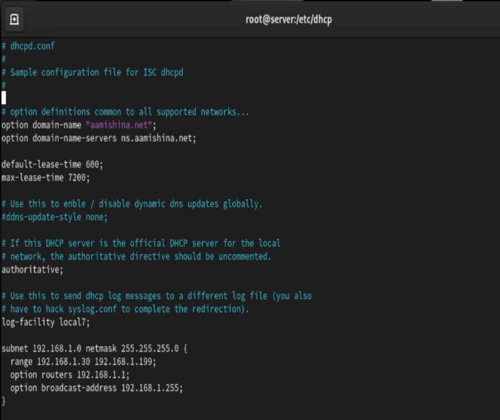{#fig:2 width=70%}

Настраиваем привязку dhcpd к интерфейсу eth1 виртуальной машины server. Вводим cp /lib/systemd/system/dhcpd.service /etc/systemd/system/ и редактируем файл /etc/systemd/system/dhcpd.service (рис. [-@fig:3])

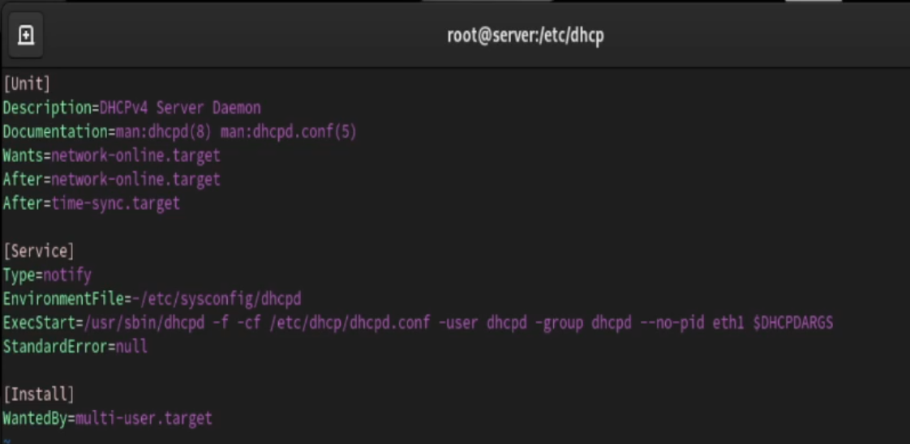{#fig:3 width=70%}

Перезагружаем конфигурацию dhcpd и разрешаем загрузку DHCP-сервера при запуске виртуальной машины server (рис. [-@fig:4])

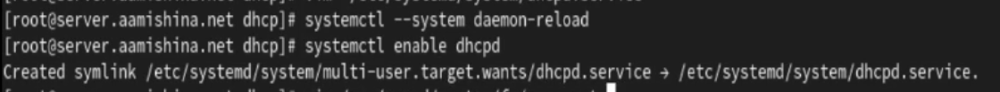{#fig:4 width=70%}

Добавляем запись для DHCP-сервера в конце файла прямой DNS-зоны (рис. [-@fig:5]) и в конце файла обратной зоны (рис. [-@fig:6]).

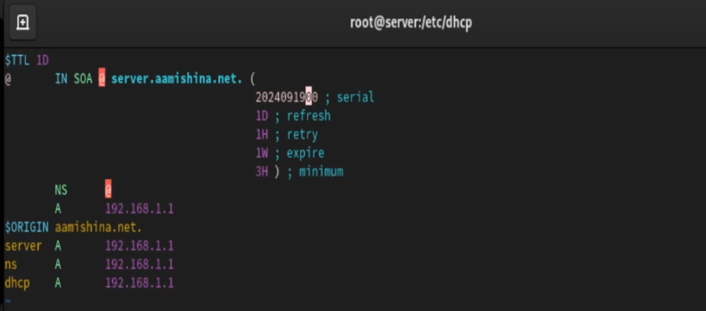{#fig:5 width=70%}

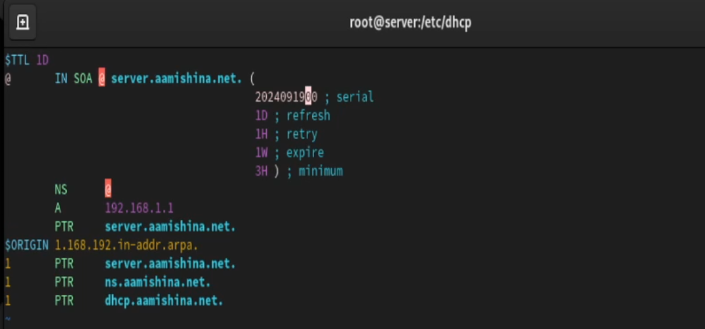{#fig:6 width=70%}

Перезапускаем named и обращаемся к DHCP-серверу по имени (рис. [-@fig:7]). 

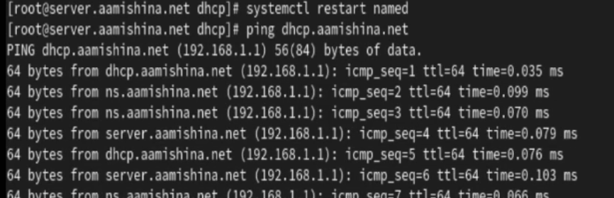{#fig:7 width=80%}

Вносим изменения в настройки межсетевого экрана узла server, разрешив работу с DHCP. Восстанавливаем контекст безопасности SELinux (рис. [-@fig:8]).

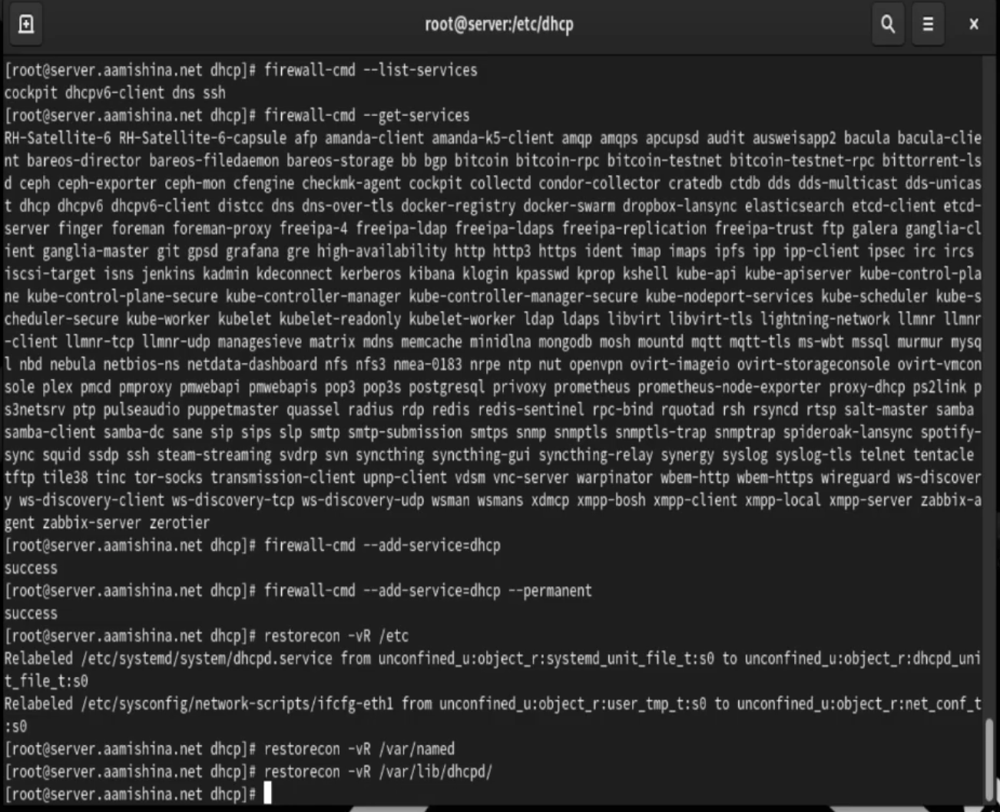{#fig:8 width=70%}

В дополнительном терминале запускаем мониторинг происходящих в системе процессов в реальном времени (рис. [-@fig:9]).

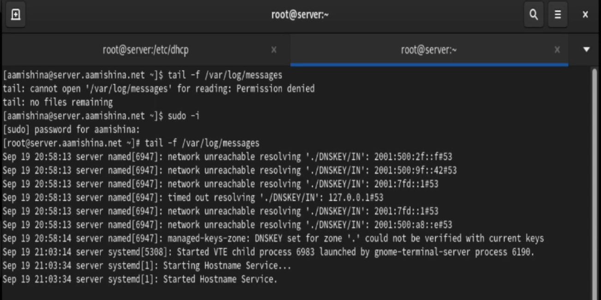{#fig:9 width=70%}

В основном терминале запускаем DHCP-сервер (рис. [-@fig:10]).

{#fig:10 width=70%}

## Анализ работы DHCP-сервера

Проверяем файл 01-routing.sh в подкаталоге vagrant/provision/client (рис. [-@fig:11]). В Vagrantfile проверяем, что скрипт подключен.

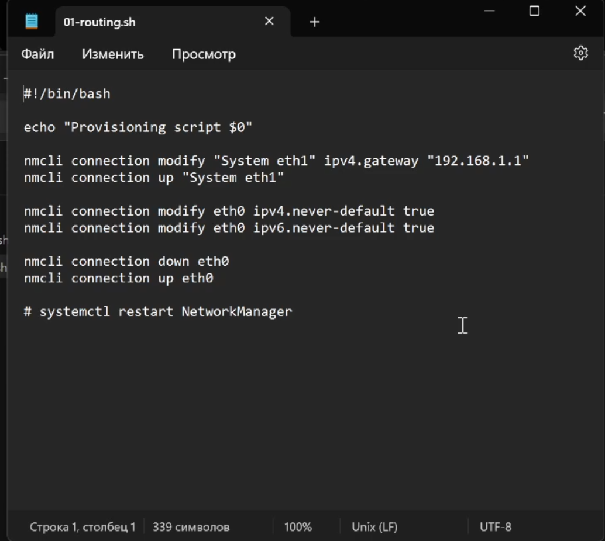{#fig:11 width=70%}

Включаем ВМ client. На server видим запись о подключении к ВМ узла client и выдачи ему IP-адреса из соответствующего диапазона адресов (рис. [-@fig:12]).

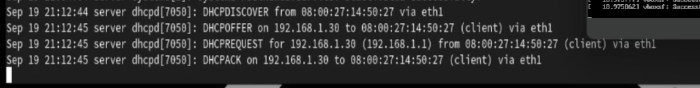{#fig:12 width=70%}

Также просматриваем файл /var/lib/dhcpd/dhcpd.leases (рис. [-@fig:13])

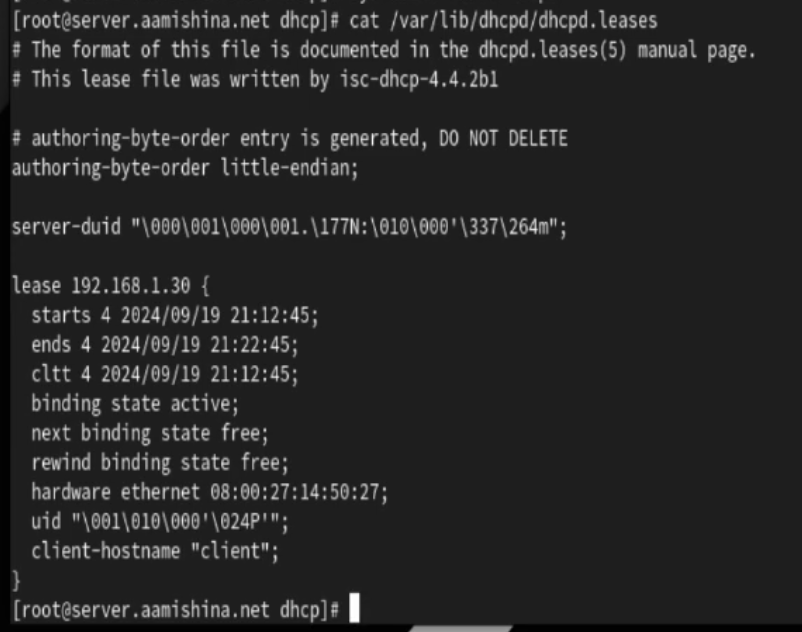{#fig:13 width=70%}

На ВМ client вводим ifconfig и просматриваем имеющиеся интерфейсы  (рис. [-@fig:14])

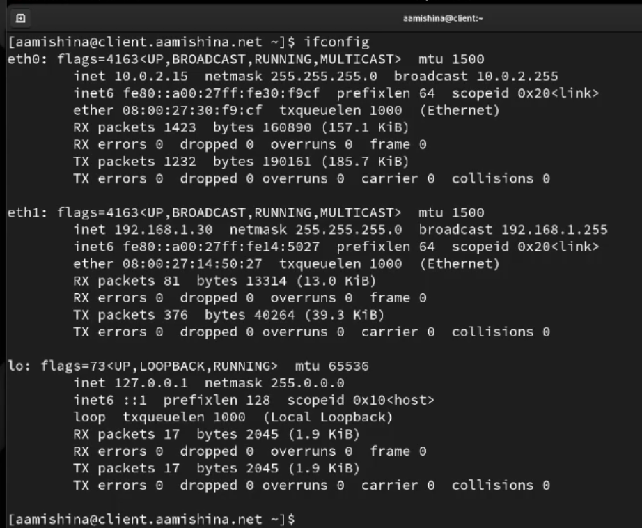{#fig:14 width=70%}

Редактируем файл /etc/named/aamishina.net (рис. [-@fig:15]).

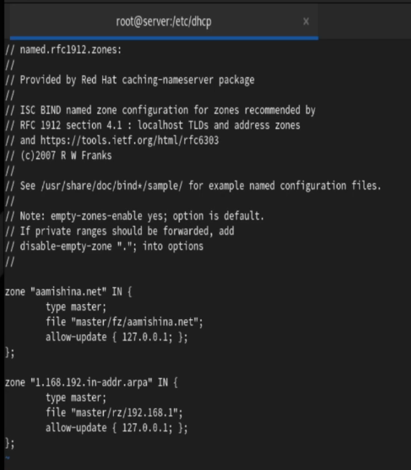{#fig:15 width=70%}

Перезапускаем DNS-сервер. Редактируем файл /etc/dhcp/dhcpd.conf (рис. [-@fig:16]).

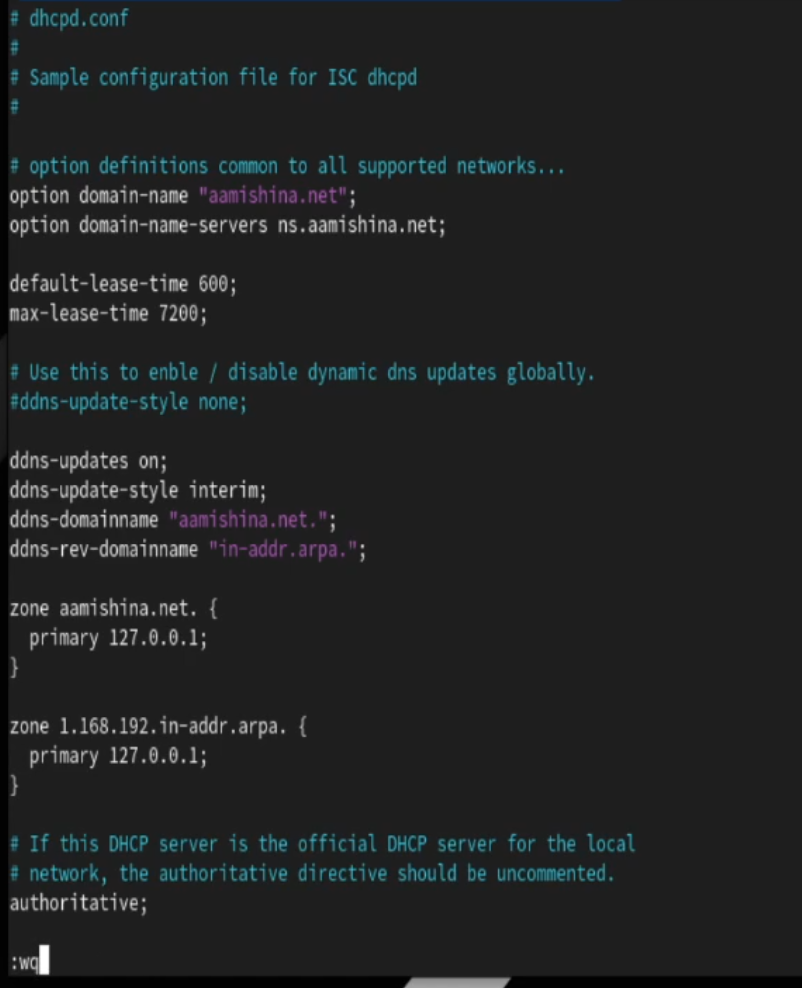{#fig:16 width=70%}

Перезапускаем DHCP-сервер. В каталоге прямой DNS-зоны появился файл aamishina.net.jnl (рис. [-@fig:17]).

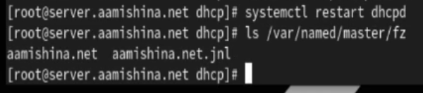{#fig:17 width=70%}

## Анализ работы DHCP-сервера после настройки обновления DNS-зоны

На виртуальной машине client открываем терминал и с помощью утилиты dig убеждаемся в наличии DNS-записи о клиенте в прямой DNS-зоне (рис. [-@fig:18]).

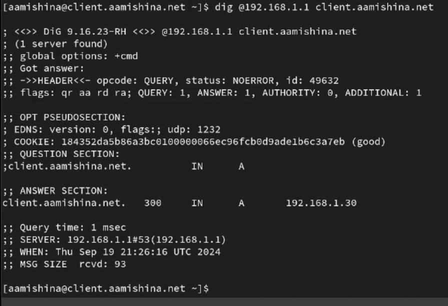{#fig:18 width=70%}

## Внесение изменений в настройки внутреннего окружения виртуальной машины

На ВМ server переходим в каталог для внесения изменений в настройки внутреннего окружения /vagrant/provision/server/, создаем в нём каталог dhcp, в который помещаем в соответствующие подкаталоги конфигурационные файлы DHCP. Заменяем конфигурационные файлы DNS-сервера (рис. [-@fig:19]). В каталоге /vagrant/provision/server создаем исполняемый файл dhcp.sh (рис. [-@fig:20]).

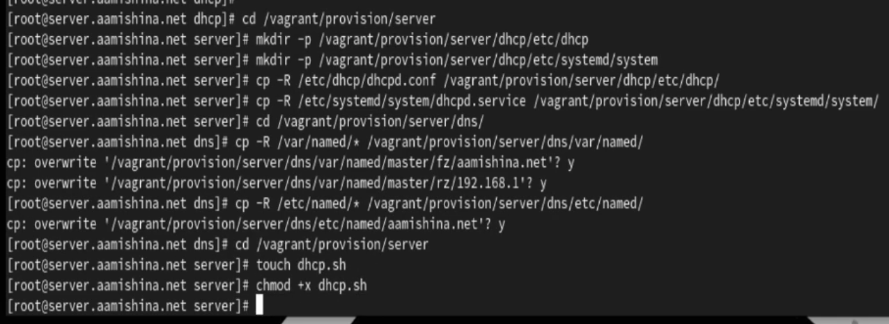{#fig:19 width=70%}

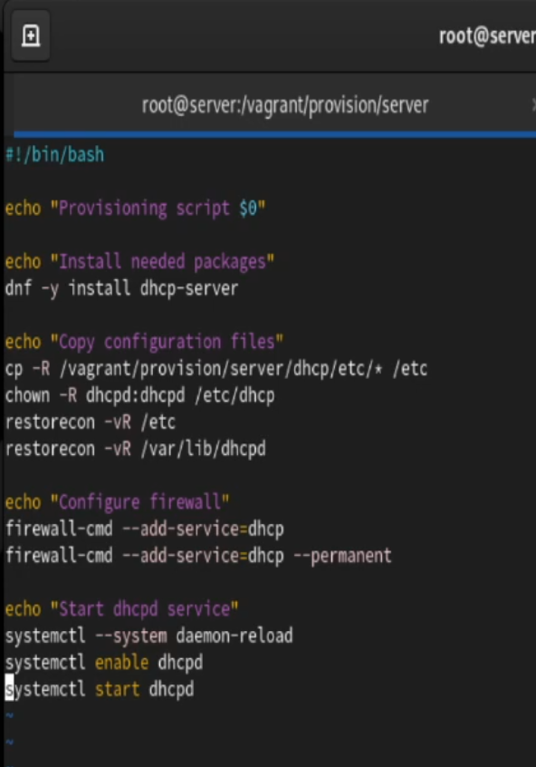{#fig:20 width=70%}

Для отработки скрипта во время запуска добавляем в Vagrantfile в разделе конфигурации для сервера листинг из манула на ТУИСе (рис. [-@fig:21]). После этого выключаем ВМ.

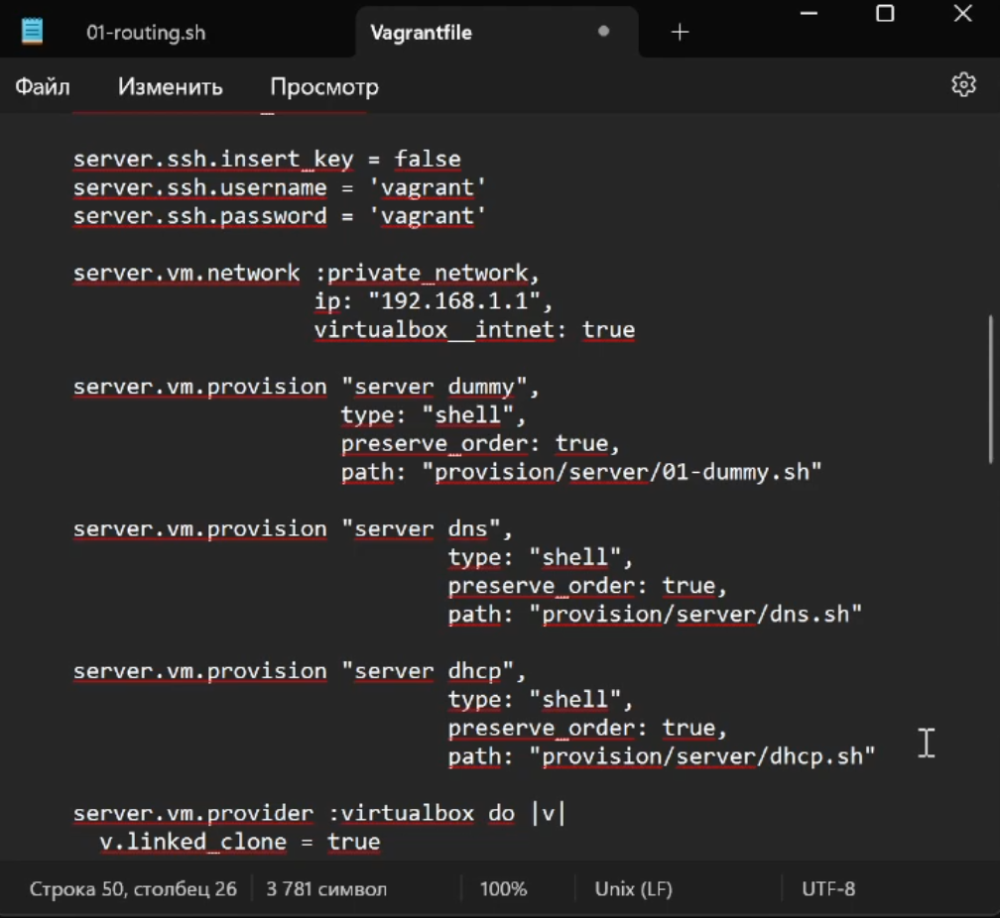{#fig:21 width=70%}

Контрольные вопросы:

1. В каких файлах хранятся настройки сетевых подключений? 

- В Linux настройки сети обычно хранятся в текстовых файлах в
директории /etc/network/ или /etc/sysconfig/network-scripts/.

2. За что отвечает протокол DHCP? 

- Протокол DHCP (Dynamic Host Configuration Protocol) отвечает за автоматическое присвоение
сетевых настроек устройствам в сети, таких как IP-адресов,
маски подсети, шлюза, DNS-серверов и других параметров.

3. Поясните принцип работы протокола DHCP. Какими сообщениями обмениваются клиент и сервер, используя протокол DHCP? 

- Принцип работы протокола DHCP:

Discover (Обнаружение): Клиент отправляет в сеть запрос на
обнаружение DHCP-сервера.

Offer (Предложение): DHCP-сервер отвечает клиенту, предлагая
ему конфигурацию сети.

Request (Запрос): Клиент принимает предложение и отправляет
запрос на использование предложенной конфигурации.

Acknowledgment (Подтверждение): DHCP-сервер подтверждает
клиенту, что предложенная конфигурация принята и может быть
использована.

4. В каких файлах обычно находятся настройки DHCP-сервера? За что
отвечает каждый из файлов? 

- Настройки DHCP-сервера обычно
хранятся в файлах конфигурации, таких как /etc/dhcp/dhcpd.conf. Они содержат информацию о диапазонах IP-адресов, параметрах сети и других опциях DHCP.

5. Что такое DDNS? Для чего применяется DDNS? 

- DDNS (Dynamic Domain Name System) - это система динамического доменного
имени. Она используется для автоматического обновления записей DNS, когда IP-адрес узла изменяется. DDNS применяется, например, в домашних сетях, где IP-адреса часто изменяются
посредством DHCP.

6. Какую информацию можно получить, используя утилиту ifconfig? Приведите примеры с использованием различных опций. 

- Утилита ifconfig используется для получения информации о сетевых
интерфейсах.

Примеры:

ifconfig: Показывает информацию обо всех активных сетевых
интерфейсах.

ifconfig eth0: Показывает информацию о конкретном интерфейсе
(в данном случае, eth0).

7. Какую информацию можно получить, используя утилиту ping? Приведите примеры с использованием различных опций. - Утилита ping используется для проверки доступности узла в сети.

Примеры:

ping google.com: Пингует домен google.com.

ping -c 4 192.168.1.1: Пингует IP-адрес 192.168.1.1 и отправляет 4
эхо-запроса.

# Выводы

В результате выполнения работы были приобретены практические навыки по установке и конфигурированию DHCP-сервера.