---
## Front matter
lang: ru-RU
title: Лабораторная работа №4
subtitle: Администрирование сетевых подсистем
author:
  - Мишина А. А.
date: 24 сентября 2024

## i18n babel
babel-lang: russian
babel-otherlangs: english

## Formatting pdf
toc: false
toc-title: Содержание
slide_level: 2
aspectratio: 169
section-titles: true
theme: metropolis
header-includes:
 - \metroset{progressbar=frametitle,sectionpage=progressbar,numbering=fraction}
 - '\makeatletter'

 - '\makeatother'
---

## Цели и задачи

- Приобретение практических навыков по установке и базовому конфигурированию HTTP-сервера Apache.

# Выполнение лабораторной работы

# Установка HTTP-сервера

## HTTP-сервер

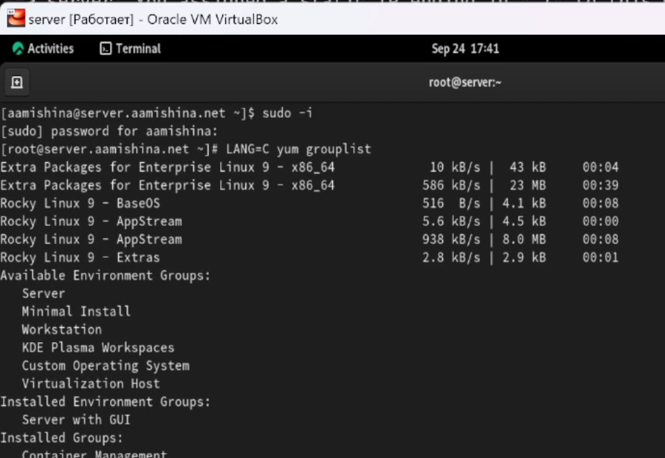{ #fig:001 width=60% }

## Каталоги

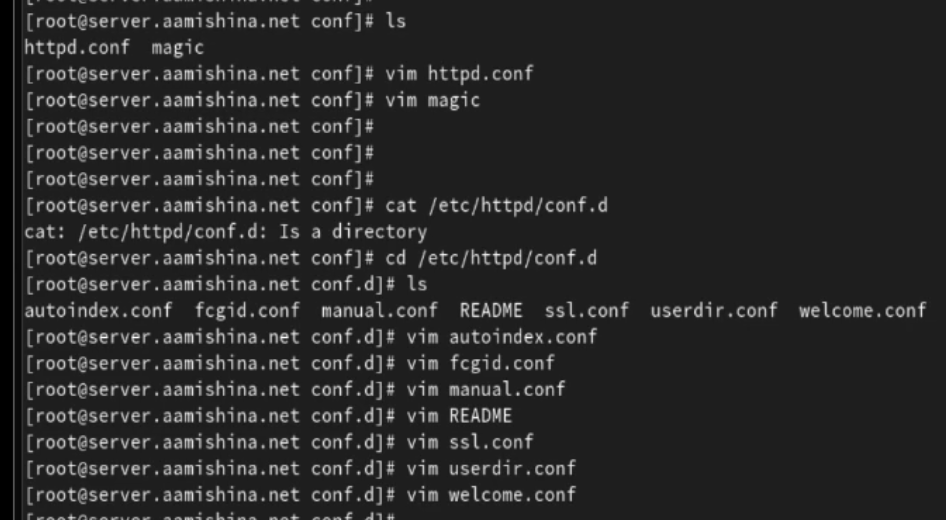{#fig:1 width=70%}

## Межсетевой экран узла server

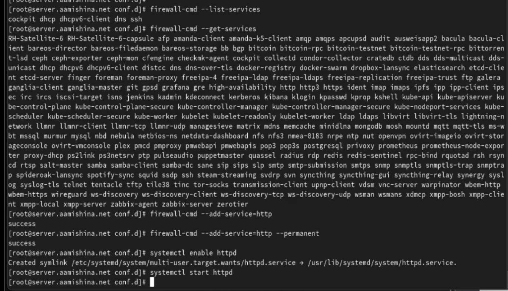{#fig:2 width=70%}

## Проверка запуска сервера

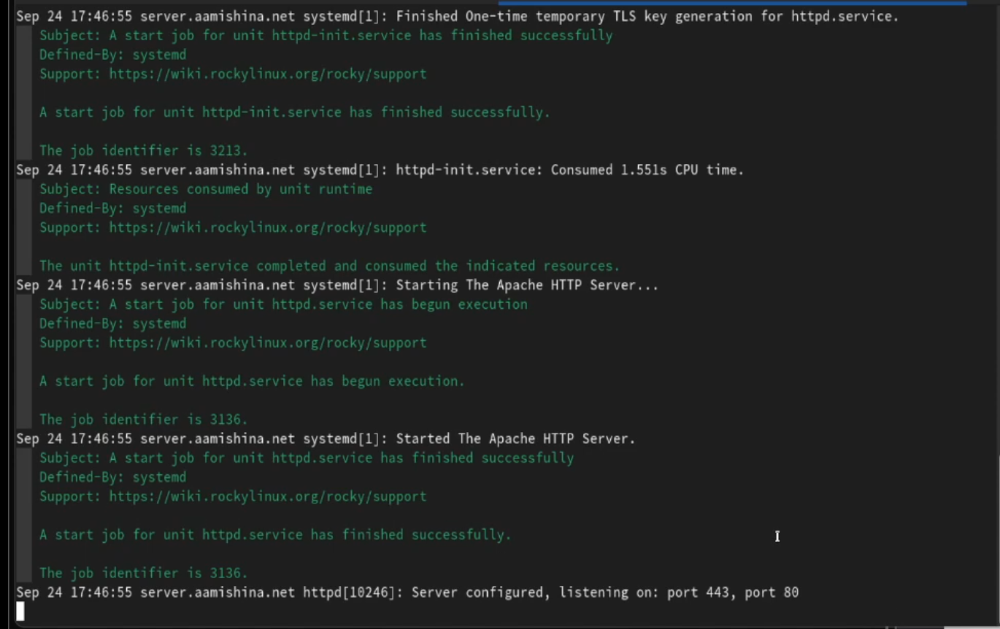{#fig:3 width=70%}

# Анализ работы HTTP-сервера 

## ВМ client

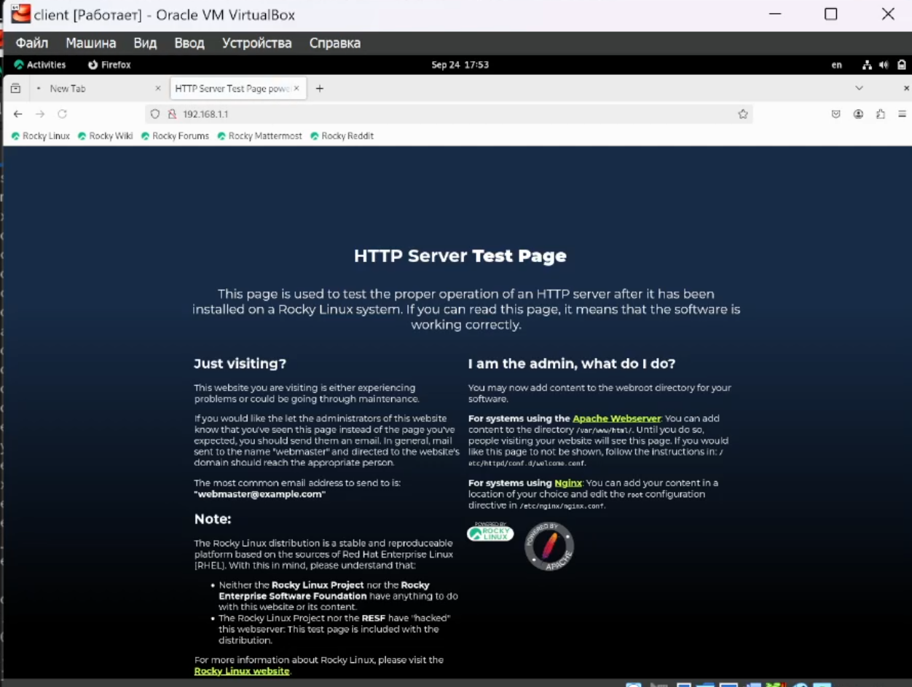{#fig:4 width=50%}

## Мониторинг и лог

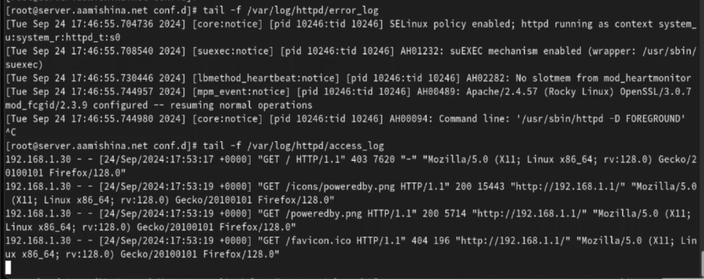{#fig:5 width=70%}

# Настройка виртуального хостинга для HTTP-сервера

## Прямая зона

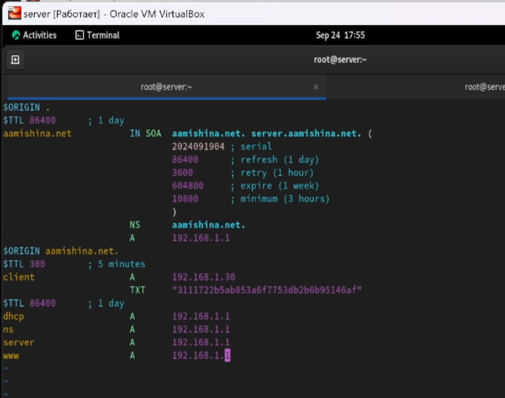{#fig:6 width=50%}

## Обратная зона

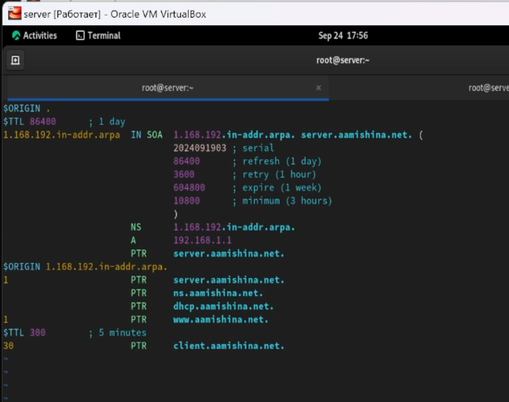{#fig:7 width=50%}

## Файлы и перезапуск

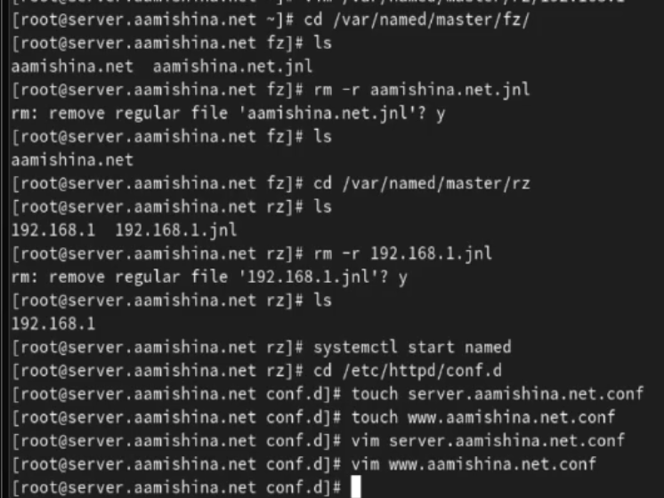{#fig:8 width=50%}

## Файл

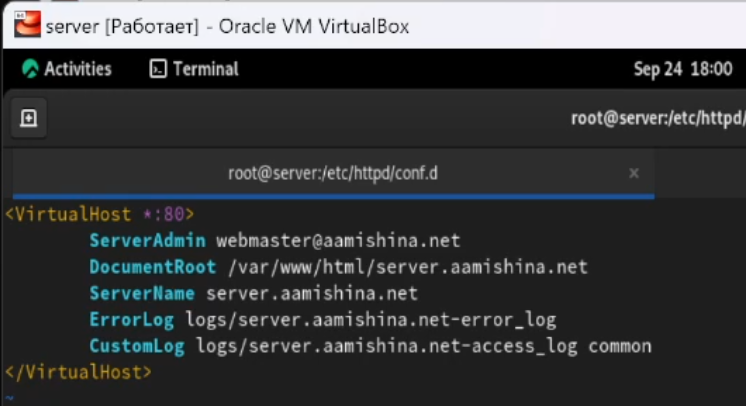{#fig:9 width=70%}

## Файл

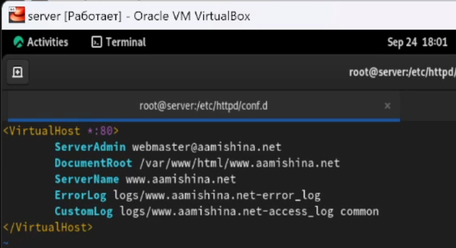{#fig:10 width=70%}

## Welcome to the server.aamishina.net server.

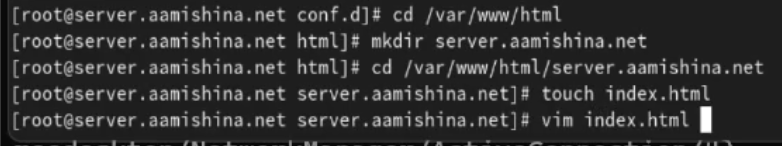{#fig:11 width=70%}

## Права доступа и SELinux

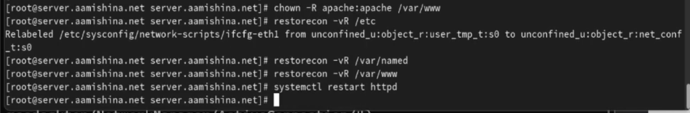{#fig:12 width=70%}

## server

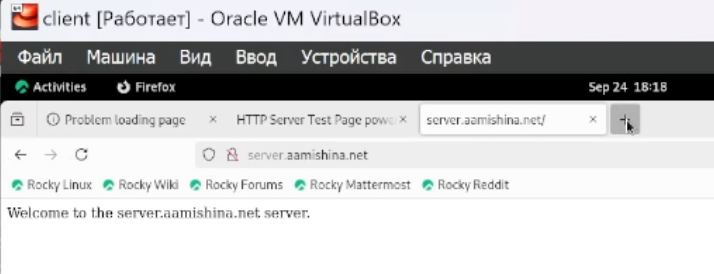{#fig:13 width=70%} 

## www

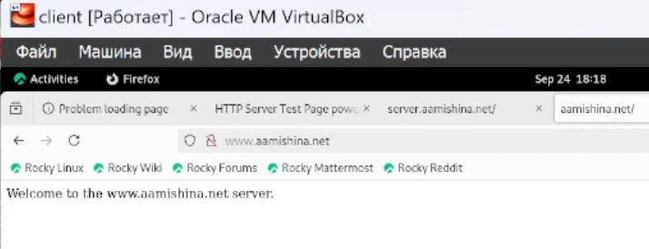{#fig:14 width=70%}

# Внесение изменений в настройки внутреннего окружения виртуальной машины

## Конфигурационные файлы

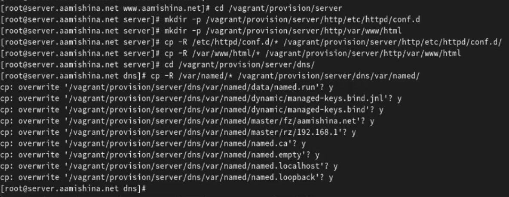{#fig:15 width=70%} 

## Скрипт http.sh

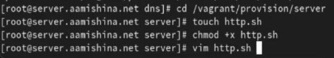{#fig:16 width=70%}

## Vagrantfile

{#fig:17 width=50%}

## Вывод

- В результате выполнения работы были приобретены практические навыки по установке и базовому конфигурированию HTTP-сервера Apache.