---
## Front matter
title: "Отчёт по лабораторной работе №4"
subtitle: "Дисциплина: Администрирование сетевых подсистем"
author: "Мишина Анастасия Алексеевна"

## Generic options
lang: ru-RU
toc-title: "Содержание"

## Bibliography
bibliography: bib/cite.bib
csl: pandoc/csl/gost-r-7-0-5-2008-numeric.csl

## Pdf output format
toc: true # Table of contents
toc-depth: 2
lof: true # List of figures
lot: true # List of tables
fontsize: 14pt
linestretch: 1.5
papersize: a4
documentclass: scrreprt
## I18n polyglossia
polyglossia-lang:
  name: russian
  options:
	- spelling=modern
	- babelshorthands=true
polyglossia-otherlangs:
  name: english
## I18n babel
babel-lang: russian
babel-otherlangs: english
## Fonts
mainfont: PT Serif
romanfont: PT Serif
sansfont: PT Sans
monofont: PT Mono
mainfontoptions: Ligatures=TeX
romanfontoptions: Ligatures=TeX
sansfontoptions: Ligatures=TeX,Scale=MatchLowercase
monofontoptions: Scale=MatchLowercase,Scale=0.9
## Biblatex
biblatex: true
biblio-style: "gost-numeric"
biblatexoptions:
  - parentracker=true
  - backend=biber
  - hyperref=auto
  - language=auto
  - autolang=other*
  - citestyle=gost-numeric
## Pandoc-crossref LaTeX customization
figureTitle: "Рис."
tableTitle: "Таблица"
listingTitle: "Листинг"
lofTitle: "Список иллюстраций"
lotTitle: "Список таблиц"
lolTitle: "Листинги"
## Misc options
indent: true
header-includes:
  - \usepackage{indentfirst}
  - \usepackage{float} # keep figures where there are in the text
  - \floatplacement{figure}{H} # keep figures where there are in the text
---

# Цель работы

Приобретение практических навыков по установке и базовому конфигурированию HTTP-сервера Apache.

# Выполнение лабораторной работы

## Установка HTTP-сервера

Загрузим нашу операционную систему и перейдем в рабочий каталог с проектом. Далее запустим виртуальную машину server: vagrant up server. На виртуальной машине server войдём под созданным нами в предыдущей работе пользователем и откроем терминал. Перейдём в режим суперпользователя: sudo -i и установим из репозитория стандартный веб-сервер (HTTP-сервер и утилиты httpd, криптоутилиты и пр.): LANG=C yum grouplist и dnf -y groupinstall "Basic Web Server" (рис. [-@fig:001]).

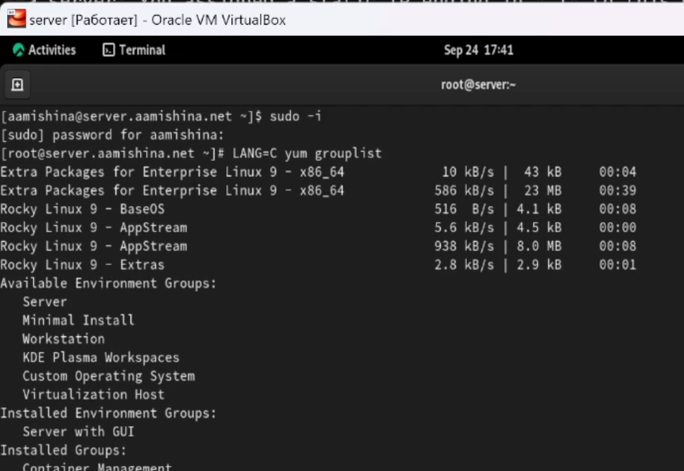{ #fig:001 width=80% }

## Базовое конфигурирование HTTP-сервера

Просматриваем содержание конфигурационных файлов в каталогах /etc/httpd/conf и /etc/httpd/conf.d (рис. [-@fig:1]).

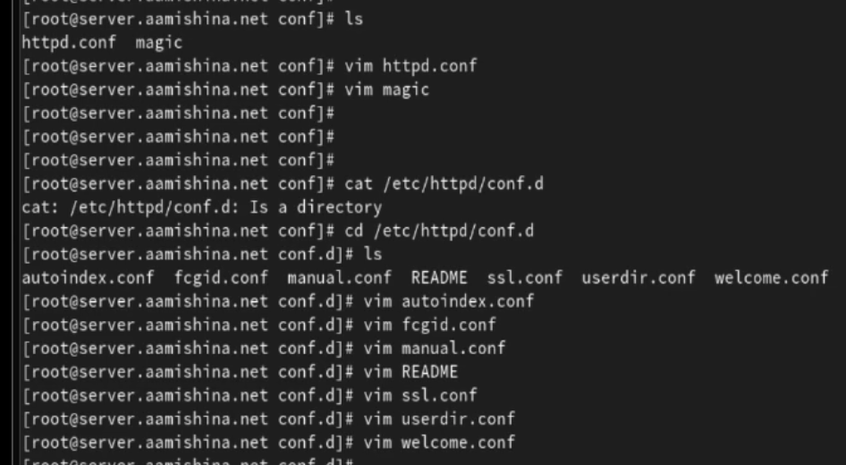{#fig:1 width=70%}

Вносим изменения в настройки межсетевого экрана узла server, разрешив работу с http. Во втором терминале открываем расширенный лог системных сообщений. В первом терминале активируем и запускаем HTTP-сервер: systemctl enable httpd и systemctl start httpd (рис. [-@fig:2]).

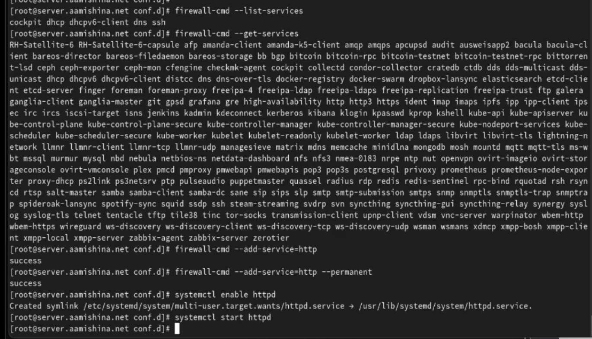{#fig:2 width=70%}

В логе системных сообщений видим, что веб-сервер запущен (рис. [-@fig:3])

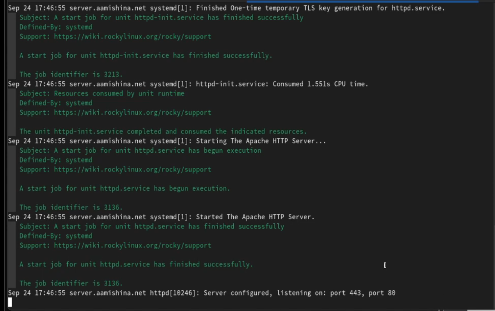{#fig:3 width=70%}

## Анализ работы HTTP-сервера 

На виртуальной машине server открываем лог ошибок работы веб-сервера: tail -f /var/log/httpd/error_log;  мониторинг доступа к веб-серверу: tail -f /var/log/httpd/access_log.

Запустив ВМ client, открывем браузер и в адресной строке вводим 192.168.1.1 (рис. [-@fig:4])

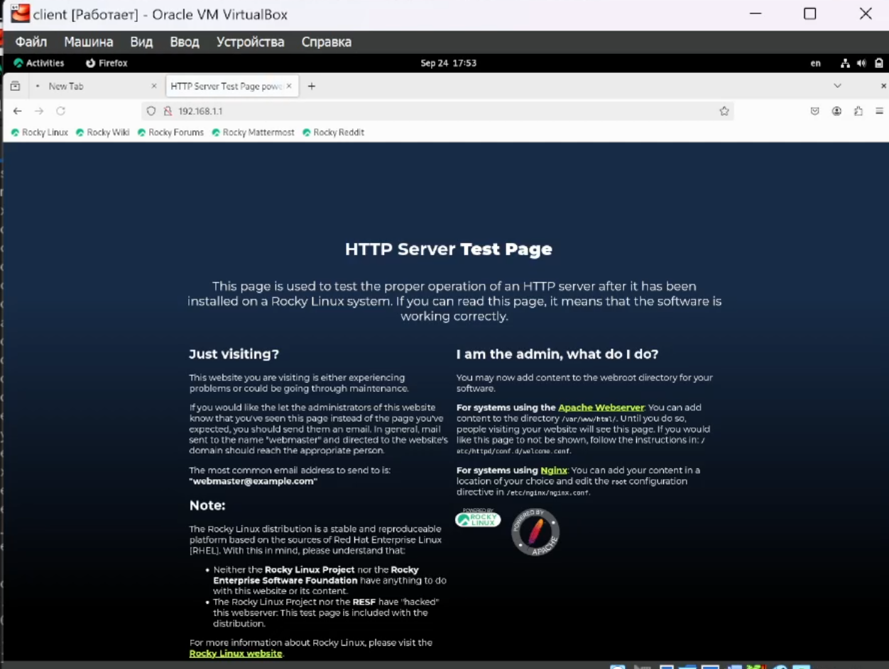{#fig:4 width=70%}

Видим записи в мониторинге доступа и в логе ошибок о подключении к серверу (рис. [-@fig:5]).

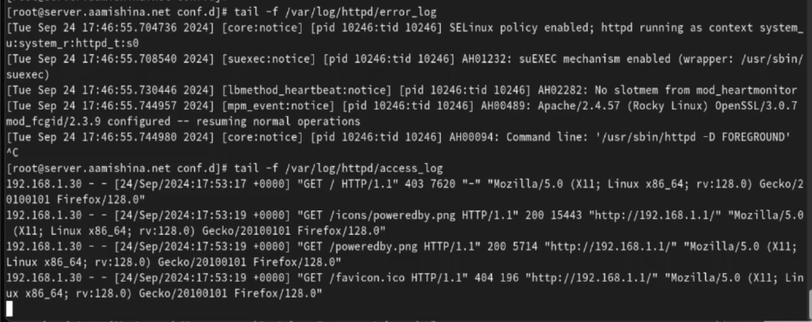{#fig:5 width=70%}

## Настройка виртуального хостинга для HTTP-сервера

Останавливаем работу DNS-сервера: systemctl stop named. Добавляем запись для HTTP-сервера в конце файла прямой DNS-зоны (рис. [-@fig:6]). 

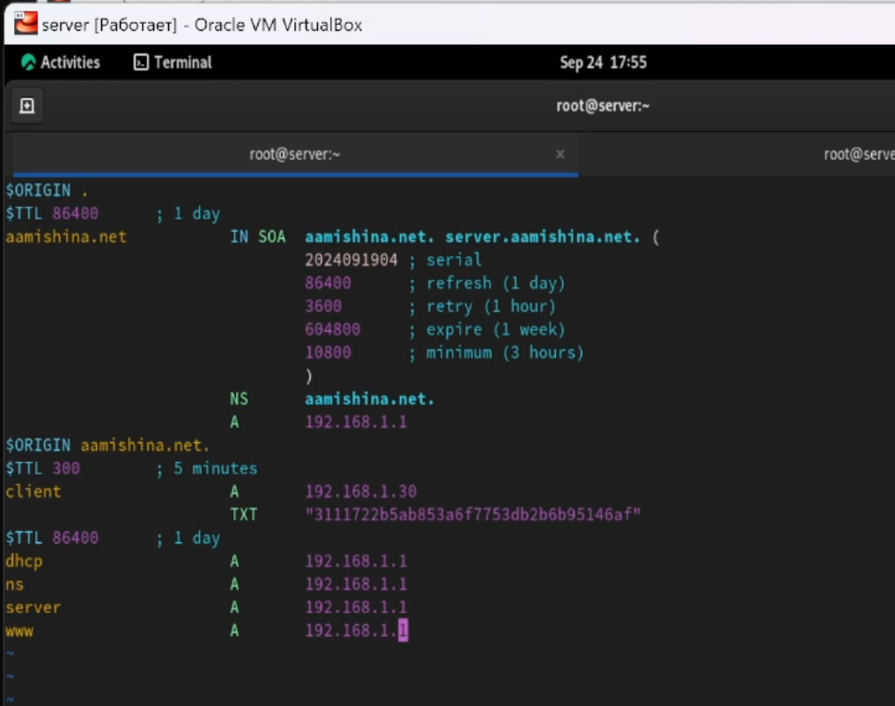{#fig:6 width=70%}

Добавляем также запись в конце файла обратной зоны (рис. [-@fig:7])

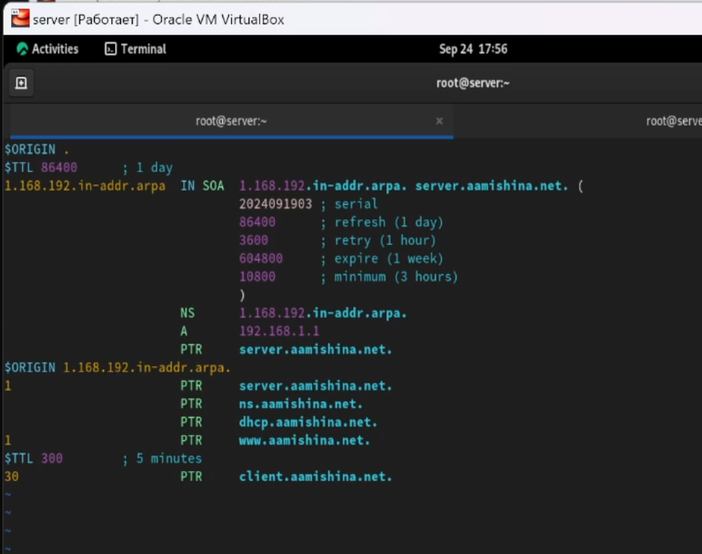{#fig:7 width=70%}

Удаляем из соответствующих каталогов файлы журналов DNS. Перезапускаем DNS-сервер. В каталоге /etc/httpd/conf.d создаем файлы server.aamishina.net.conf и www.aamishina.net.conf: cd /etc/httpd conf.d, touch server.aamishina.net.conf и touch www.aamishina.net.conf/(рис. [-@fig:8]).

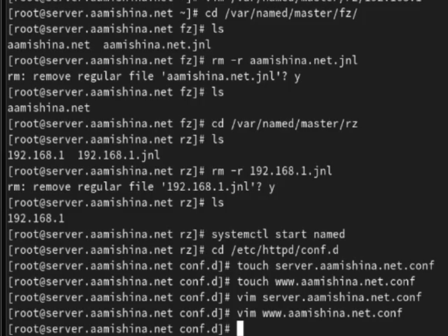{#fig:8 width=70%}

Редактируем server.aamishina.net.conf (рис. [-@fig:9]).

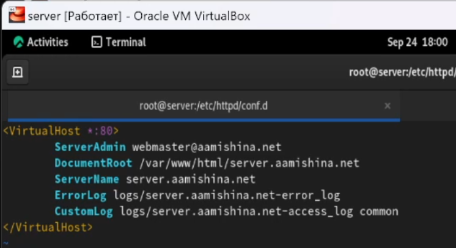{#fig:9 width=70%}

Редактируем www.aamishina.net.conf (рис. [-@fig:10]).

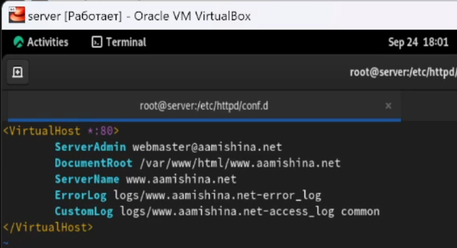{#fig:10 width=70%}

Переходим в /var/www/html создаем каталог server.aamishina.net и в нем файл index.html (рис. [-@fig:11]). Вводим в файл сообщение *Welcome to the server.aamishina.net server.* Аналогично создаем каталог и файл для www.aamishina.net.

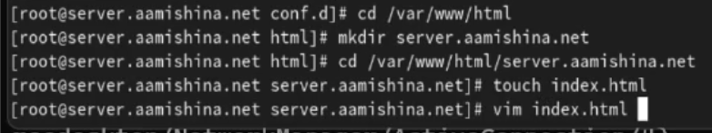{#fig:11 width=70%}

Корректируем права доступа в каталог с веб-контентом, восстанавливаем контекст безопасности в SELinux, перезагружаем HTTP-сервер (рис. [-@fig:12])

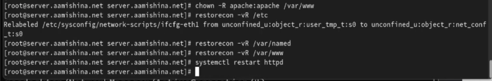{#fig:12 width=70%}

На ВМ client ввожу в адресную строку браузера server.aamishina.net  (рис. [-@fig:13]) и www.aamishina.net (рис. [-@fig:14]).

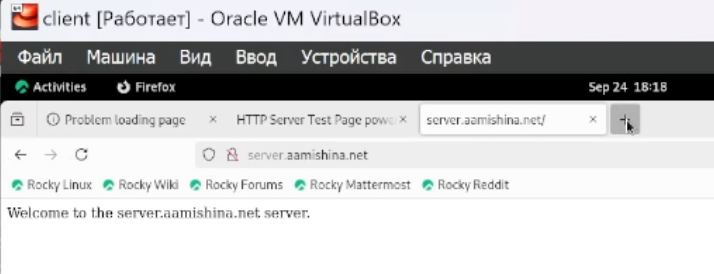{#fig:13 width=70%} 

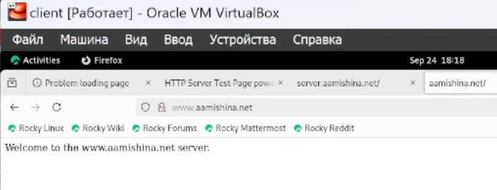{#fig:14 width=70%}

## Внесение изменений в настройки внутреннего окружения виртуальной машины

На ВМ server переходим в каталог для внесения изменений в настройки внутреннего окружения /vagrant/provision/server/, создаем в нём каталог http, в который помещаем в соответствующие подкаталоги конфигурационные файлы HTTP-сервера. Также заменяем конфигурационные файлы DNS-сервера: cd /vagrant/provision/server/dns/ и cp -R /var/named/* /vagrant/provision/server/dns/var/named/ (рис. [-@fig:15]).

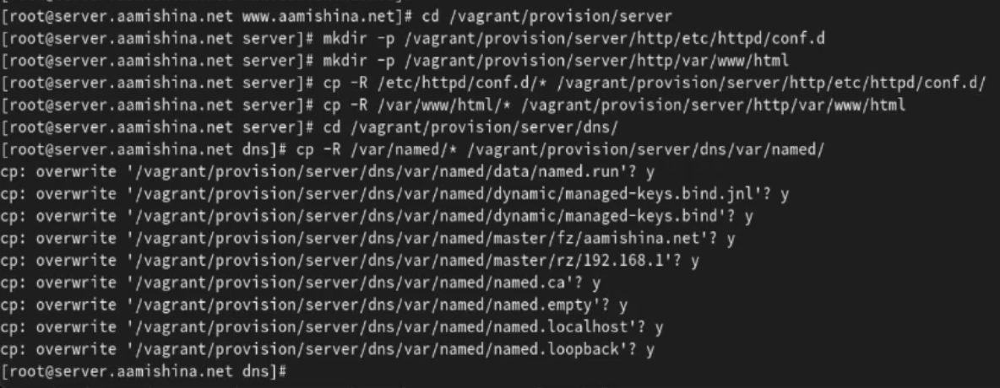{#fig:15 width=70%} 

В каталоге /vagrant/provision/server создаем исполняемый файл http.sh, заполняем его листингом из ТУИСа (рис. [-@fig:16]).

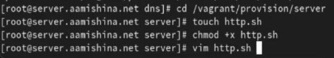{#fig:16 width=70%}

Для отработки скрипта во время запуска добавляем в Vagrantfile в разделе конфигурации для сервера отрывок из мануала на ТУИСе (рис. [-@fig:17]). После этого выключаю ВМ: vagrant halt client и vagrant halt server.

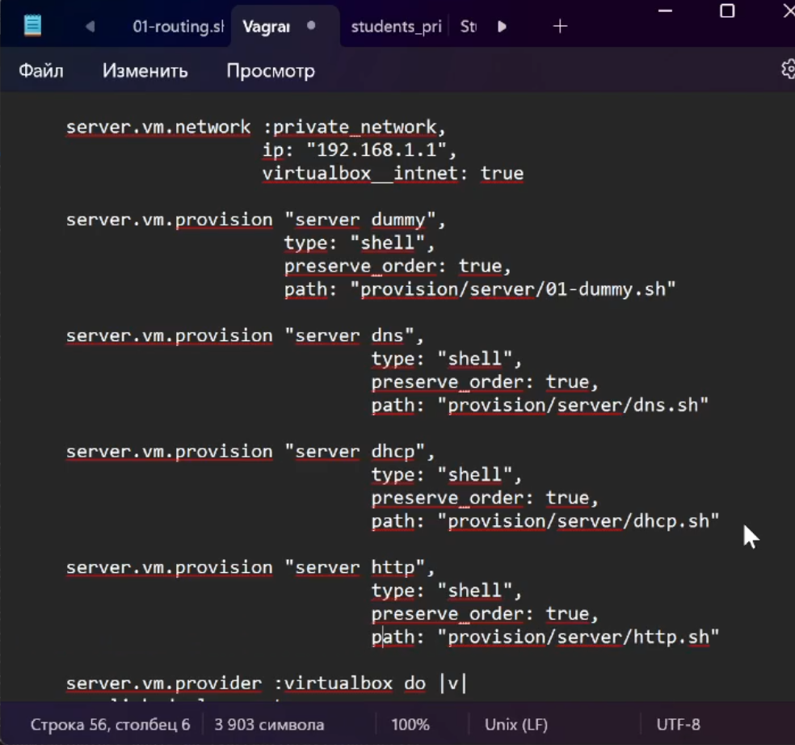{#fig:17 width=70%}

# Ответы на контрольные вопросы

1. Через какой порт по умолчанию работает Apache? 

- По умолчанию Apache работает через порт 80 для HTTP и порт 443 для HTTPS.

2. Под каким пользователем запускается Apache и к какой группе относится этот пользователь?

- Apache обычно запускается от имени пользователя www-data (или apache, в зависимости от дистрибутива) и относится к группе с тем же именем.

3. Где располагаются лог-файлы веб-сервера? Что можно по ним
отслеживать? 

- Лог-файлы веб-сервера обычно располагаются в директории логов. Например, в Ubuntu логи Apache хранятся в /var/log/apache2/, а в CentOS - в /etc/httpd/logs/. Лог-файлы содержат информацию о запросах к серверу, ошибки, статусы запросов и другие события, что позволяет администраторам отслеживать активность и выявлять проблемы.

4. Где по умолчанию содержится контент веб-серверов? 

- Контент веб-серверов по умолчанию обычно находится в директории, называемой "DocumentRoot". Например, в Apache на Linux DocumentRoot по умолчанию установлен в /var/www/html/. В этой директории содержатся файлы, которые веб-сервер отдает при запросах.

5. Каким образом реализуется виртуальный хостинг? Что он даёт? 

- Виртуальный хостинг в Apache позволяет хостить несколько сайтов на одном сервере. Разные сайты обслуживаются на одном IP-адресе, но на разных доменных именах.
Это основывается на значении заголовка "Host" в HTTP-запросе, который используется для определения, какой виртуальный хост должен обработать запрос.
Виртуальный хостинг позволяет хозяину сервера размещать несколько сайтов на одном физическом сервере, управлять ими независимо, и предоставлять услуги хостинга для различных клиентов или проектов.

# Выводы

В результате выполнения работы были приобретены практические навыки по установке и базовому конфигурированию HTTP-сервера Apache.