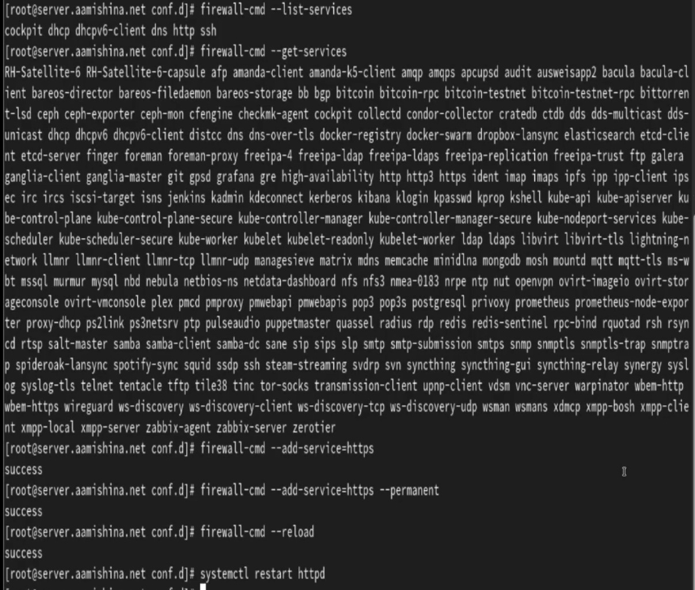

---
## Front matter
lang: ru-RU
title: Лабораторная работа №5
subtitle: Администрирование сетевых подсистем
author:
  - Мишина А. А.
date: 2 октября 2024

## i18n babel
babel-lang: russian
babel-otherlangs: english

## Formatting pdf
toc: false
toc-title: Содержание
slide_level: 2
aspectratio: 169
section-titles: true
theme: metropolis
header-includes:
 - \metroset{progressbar=frametitle,sectionpage=progressbar,numbering=fraction}
 - '\makeatletter'

 - '\makeatother'
---

## Цели и задачи

- Приобретение практических навыков по расширенному конфигурированию HTTP-сервера Apache в части безопасности и возможности использования PHP.

# Выполнение лабораторной работы

# Конфигурирование HTTP-сервера для работы через протокол HTTPS

## Ключ и сертификат

{#fig:1 width=40%}

## Сертификат

{#fig:2 width=70%}

## www.aamishina.net

{#fig:3 width=30%}

## Межсетевой экран

{#fig:4 width=50%}

## ВМ client

{#fig:5 width=70%}

## Сертификат

{#fig:6 width=70%}

# Конфигурирование HTTP-сервера для работы с PHP

## index.php

{#fig:7 width=70%}

## index.php

{#fig:8 width=70%}

## Корректировка и перезагрузка

{#fig:9 width=70%}

## ВМ Client

{#fig:10 width=50%}

# Внесение изменений в настройки внутреннего окружения виртуальной машины

## Настройки внутреннего окружения

{#fig:11 width=70%}

## http.sh

{#fig:12 width=30%}

## Вывод

- В результате выполнения работы были приобретены практические навыки по расширенному конфигурированию HTTP-сервера Apache в части безопасности и возможности использования PHP.