---
## Front matter
lang: ru-RU
title: Лабораторная работа №6
subtitle: Администрирование сетевых подсистем
author:
  - Мишина А. А.
date: 9 октября 2024

## i18n babel
babel-lang: russian
babel-otherlangs: english

## Formatting pdf
toc: false
toc-title: Содержание
slide_level: 2
aspectratio: 169
section-titles: true
theme: metropolis
header-includes:
 - \metroset{progressbar=frametitle,sectionpage=progressbar,numbering=fraction}
 - '\makeatletter'

 - '\makeatother'
---

## Цели и задачи

- Приобретение практических навыков по установке и конфигурированию системы управления базами данных на примере программного обеспечения MariaDB.

# Выполнение лабораторной работы

# Установка MariaDB

## Начало работы

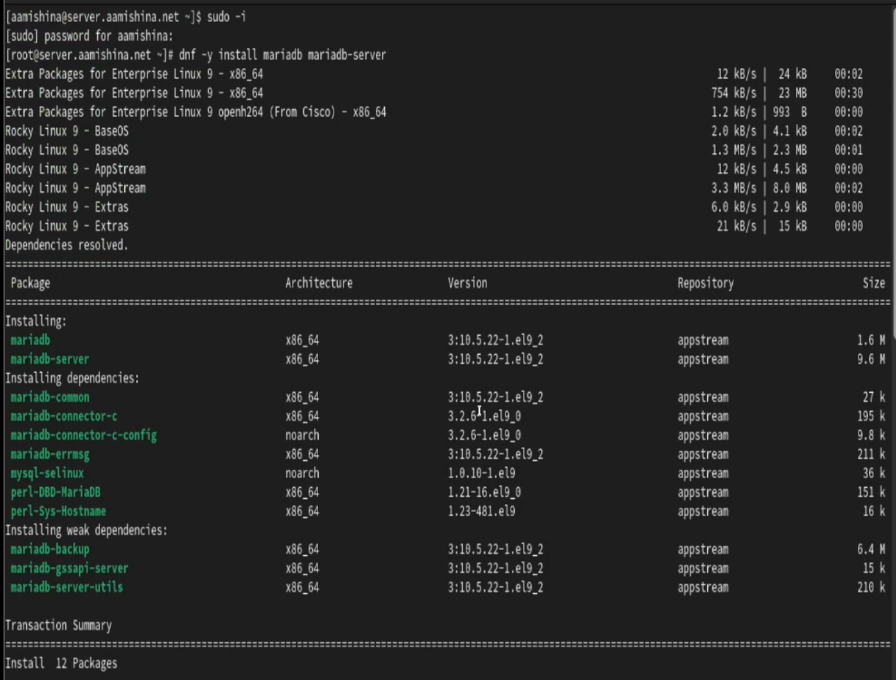{#fig:1 width=50%}

## Запуск mariadb

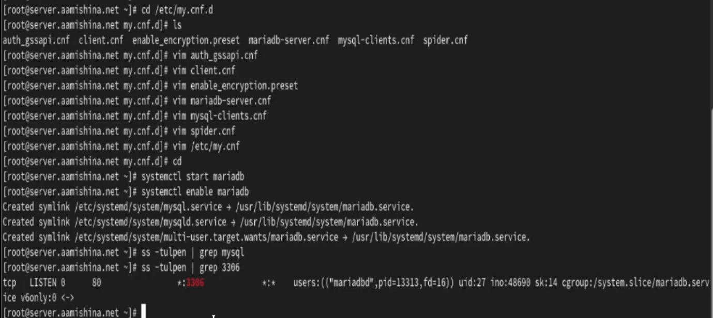{#fig:2 width=70%}

## Вход в базу данных

- mysql_secure_installation

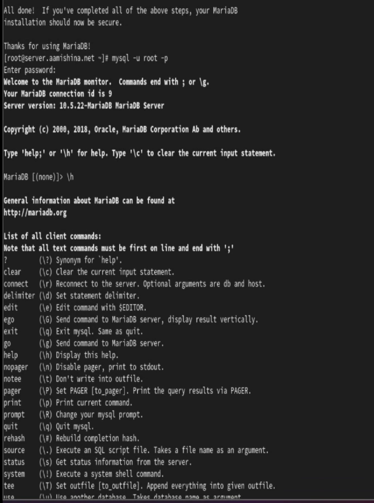{#fig:3 width=30%}

## Базы данных в системе

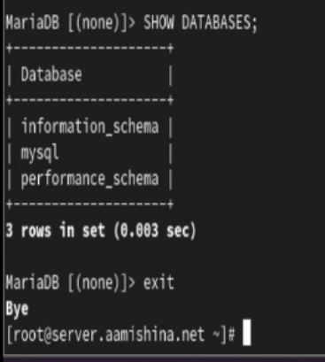{#fig:4 width=40%}

# Конфигурация кодировки символов

## Статус

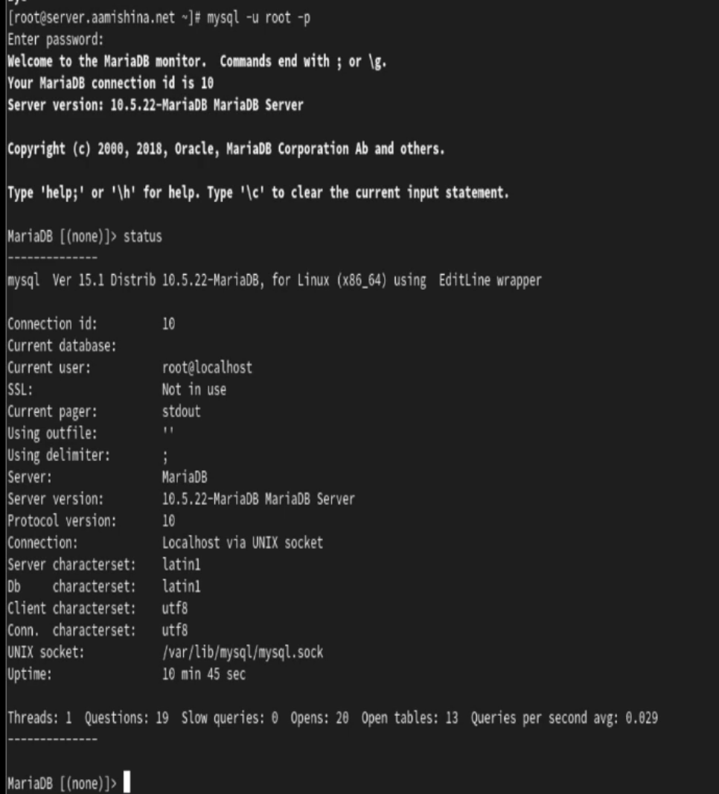{#fig:5 width=30%}

## Файл utf8.cnf

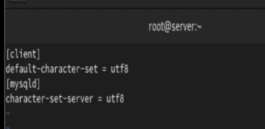{#fig:6 width=70%}

## Новый статус

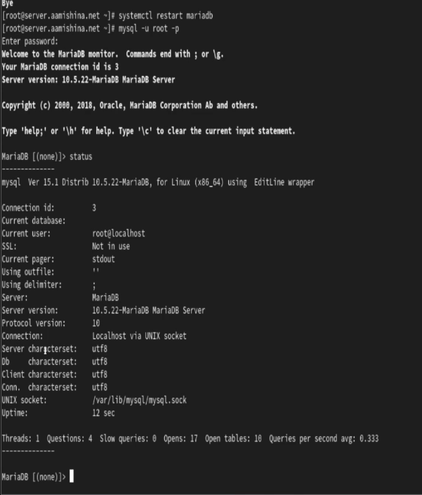{#fig:7 width=30%}

# Создание базы данных

## База данных

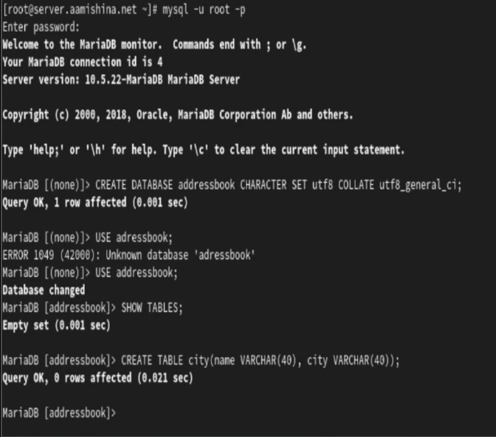{#fig:8 width=50%}

## Заполнение

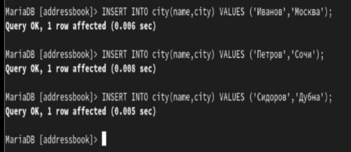{#fig:9 width=70%}

## Просмотр

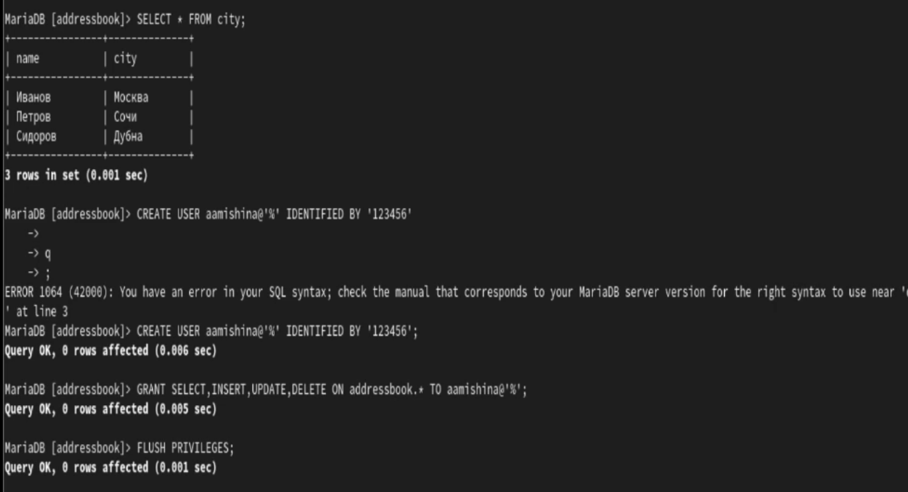{#fig:10 width=70%}

## Информация

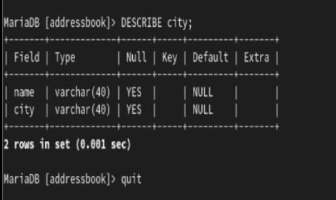{#fig:11 width=70%}

## Список БД

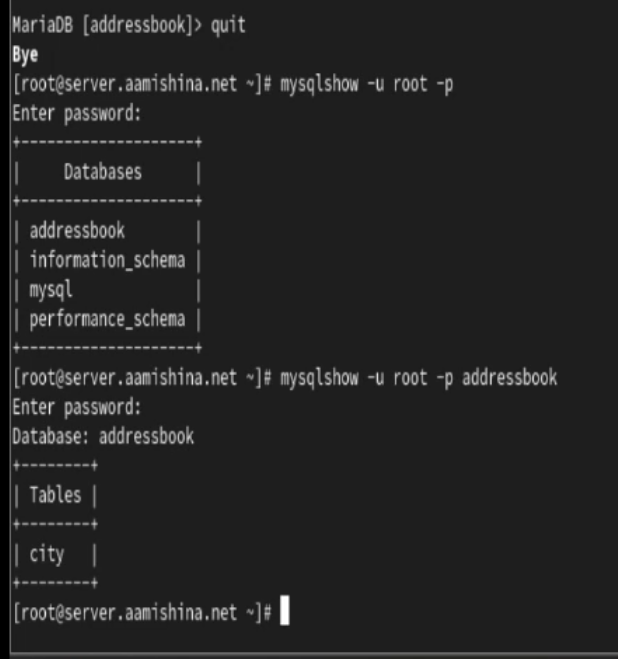{#fig:12 width=30%}

# Резервные копии

## Резервные копии

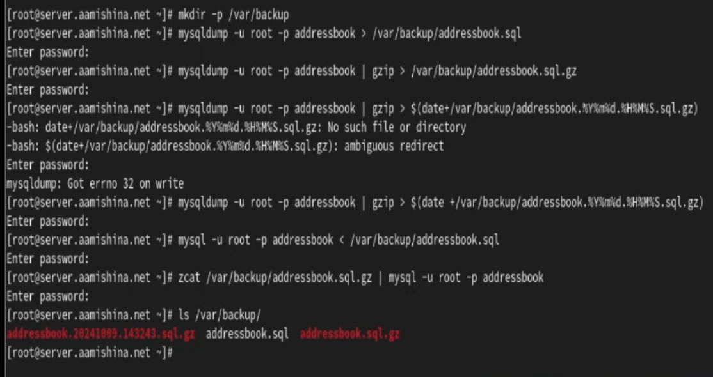{#fig:13 width=70%}

# Внесение изменений в настройки внутреннего окружения виртуальной машины

## Внесение изменений в настройки внутреннего окружения

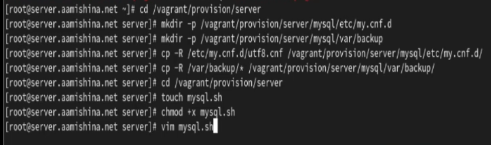{#fig:14 width=70%}

## Файл mysql.sh

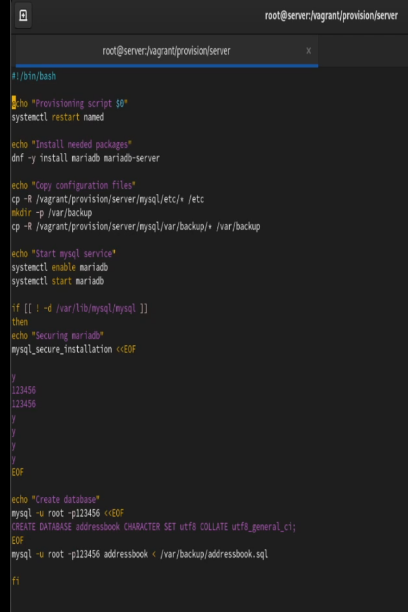{#fig:15 width=20%}

## Вывод

- В результате выполнения работы были приобретены практические навыки по установке и конфигурированию системы управления базами данных на примере программного обеспечения MariaDB.