---
## Front matter
title: "Отчёт по лабораторной работе №6"
subtitle: "Дисциплина: Администрирование сетевых подсистем"
author: "Мишина Анастасия Алексеевна"

## Generic options
lang: ru-RU
toc-title: "Содержание"

## Bibliography
bibliography: bib/cite.bib
csl: pandoc/csl/gost-r-7-0-5-2008-numeric.csl

## Pdf output format
toc: true # Table of contents
toc-depth: 2
lof: true # List of figures
lot: true # List of tables
fontsize: 14pt
linestretch: 1.5
papersize: a4
documentclass: scrreprt
## I18n polyglossia
polyglossia-lang:
  name: russian
  options:
	- spelling=modern
	- babelshorthands=true
polyglossia-otherlangs:
  name: english
## I18n babel
babel-lang: russian
babel-otherlangs: english
## Fonts
mainfont: PT Serif
romanfont: PT Serif
sansfont: PT Sans
monofont: PT Mono
mainfontoptions: Ligatures=TeX
romanfontoptions: Ligatures=TeX
sansfontoptions: Ligatures=TeX,Scale=MatchLowercase
monofontoptions: Scale=MatchLowercase,Scale=0.9
## Biblatex
biblatex: true
biblio-style: "gost-numeric"
biblatexoptions:
  - parentracker=true
  - backend=biber
  - hyperref=auto
  - language=auto
  - autolang=other*
  - citestyle=gost-numeric
## Pandoc-crossref LaTeX customization
figureTitle: "Рис."
tableTitle: "Таблица"
listingTitle: "Листинг"
lofTitle: "Список иллюстраций"
lotTitle: "Список таблиц"
lolTitle: "Листинги"
## Misc options
indent: true
header-includes:
  - \usepackage{indentfirst}
  - \usepackage{float} # keep figures where there are in the text
  - \floatplacement{figure}{H} # keep figures where there are in the text
---

# Цель работы

Приобретение практических навыков по установке и конфигурированию системы управления базами данных на примере программного обеспечения MariaDB.

# Выполнение лабораторной работы

## Установка MariaDB

Запускаем ВМ через рабочий каталог. На ВМ server входим под собственным пользователем и переходим в режим суперпользователя. Устанавливаем необходимые пакеты: dnf -y install mariadb mariadb-server (рис. [-@fig:1]).

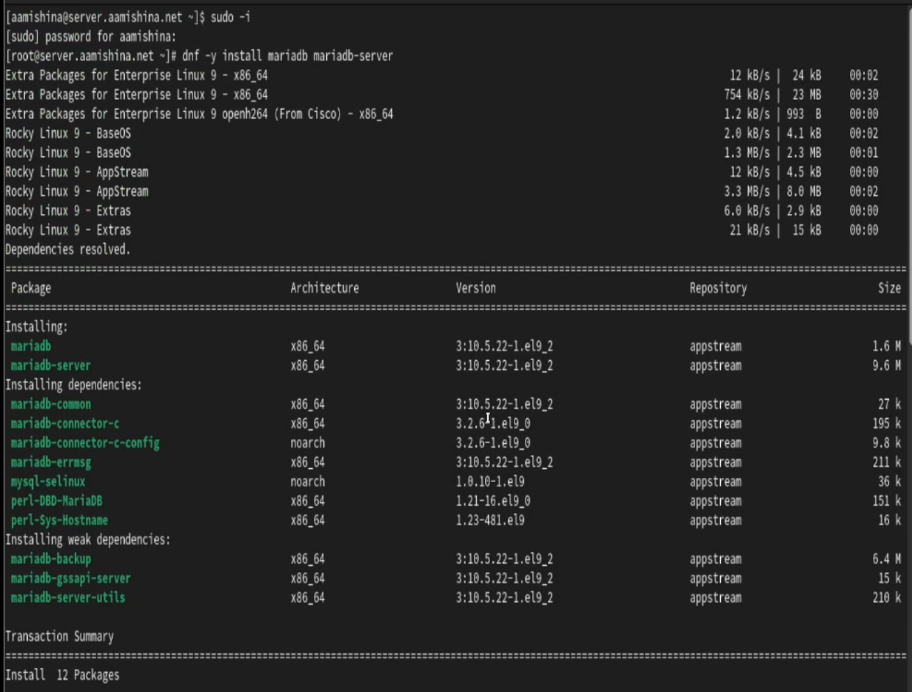{#fig:1 width=70%}

Просматриваем конфигурационные файлы mariadb в каталоге /etc/my.cnf.d и в файле /etc/my.cnf. Запускаем и включаем ПО mariadb. Убеждаемся, что прослушивается порт 3306 (рис. [-@fig:2]).

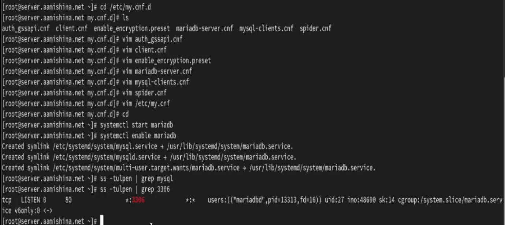{#fig:2 width=70%}

Запускаем скрипт конфигурации безопасности mysqld - mysql_secure_installation. Устанавливаем пароль для пользователя root базы данных, отключаем удалённый корневой доступ и удаляем тестовую базу данных и любых анонимных пользователей. Входим в базу данных с правами администратора и просматриваем список команд (рис. [-@fig:3])

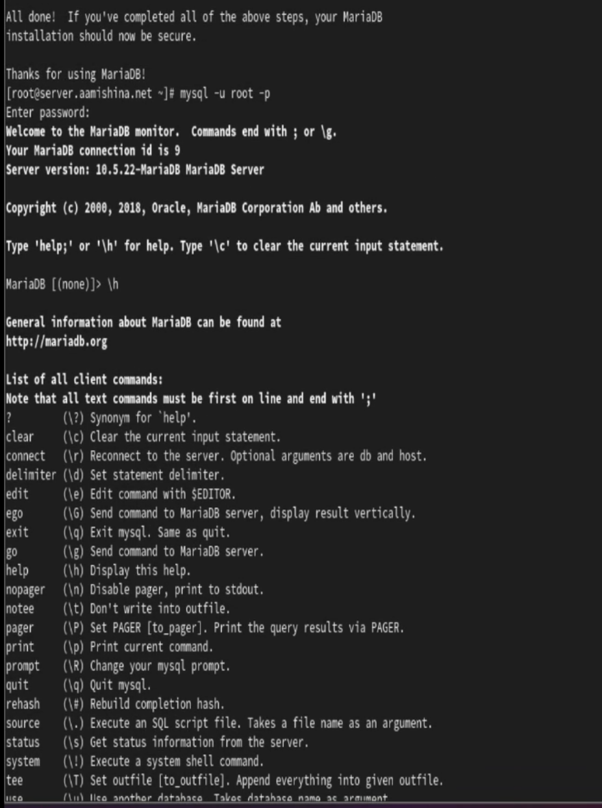{#fig:3 width=70%}

Просматриваем имеющиеся базы данных, введя запрос, после чего выходим из оболочки. В системе есть БД information_schema, mysql, performance_schema (рис. [-@fig:4])

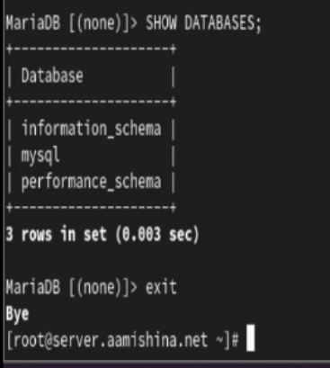{#fig:4 width=70%}

## Конфигурация кодировки символов

Входим в БД с правами администратора и просматриваем статус (рис. [-@fig:5]). 

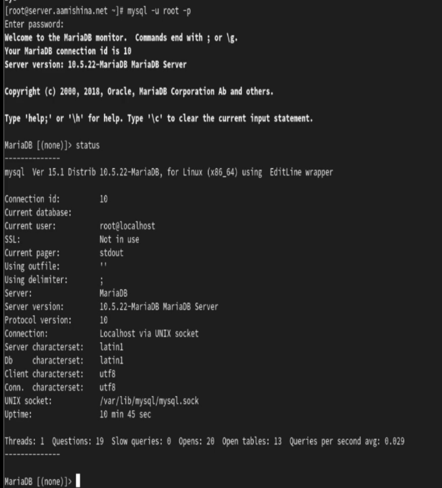{#fig:5 width=70%}

В каталоге /etc/my.cnf.d создаем файл utf8.cnf и редактируем его (рис. [-@fig:6]). 

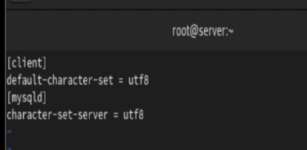{#fig:6 width=70%}

Перезапустив MariaDB, входим в БД и просматриваем статус. Наблюдаем изменения в Server characterset и Db characterset. Теперь поддерживаются не только латинские символы, но и кириллица (рис. [-@fig:7]). 

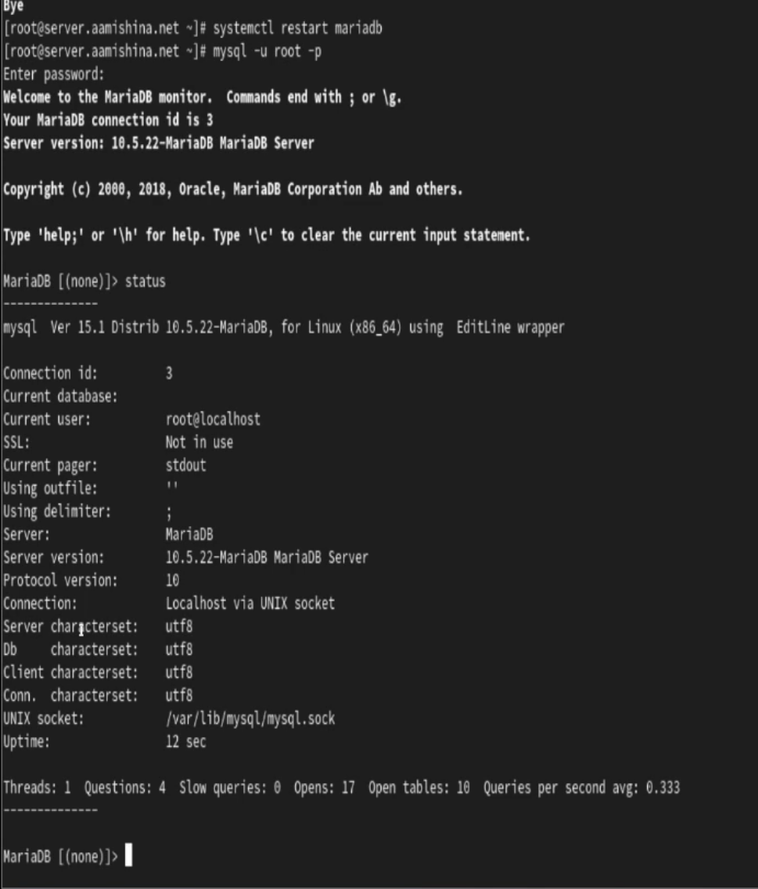{#fig:7 width=70%}

## Создание базы данных

Входим в БД с правами администратора. Создаем БД addressbook и переходим к ней. Создаем таблицу city с полями name и city (рис. [-@fig:8]).

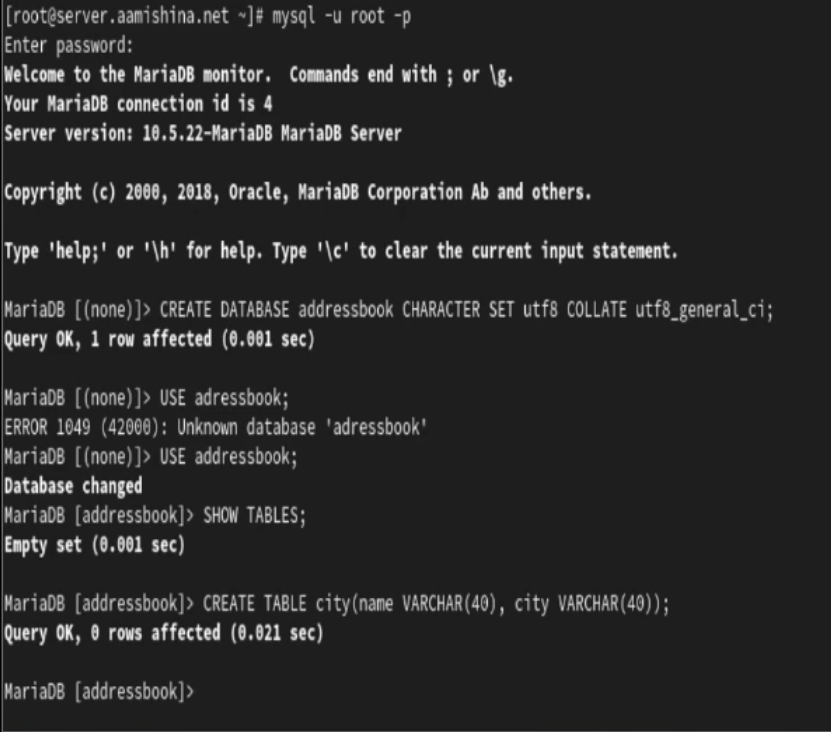{#fig:8 width=70%}

Заполняем таблицу (рис. [-@fig:9]).

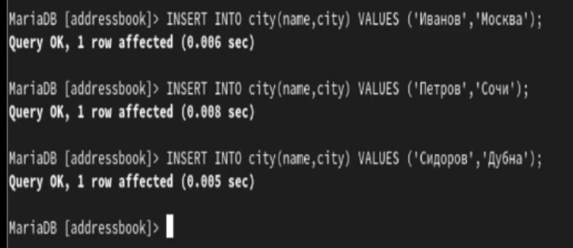{#fig:9 width=70%}

Вводим запрос SELECT * FROM city;. Выводятся все данные из только что созданной таблицы. Далее создаем пользователя, предоставляем права доступа, обновляем привилегии (рис. [-@fig:10]).

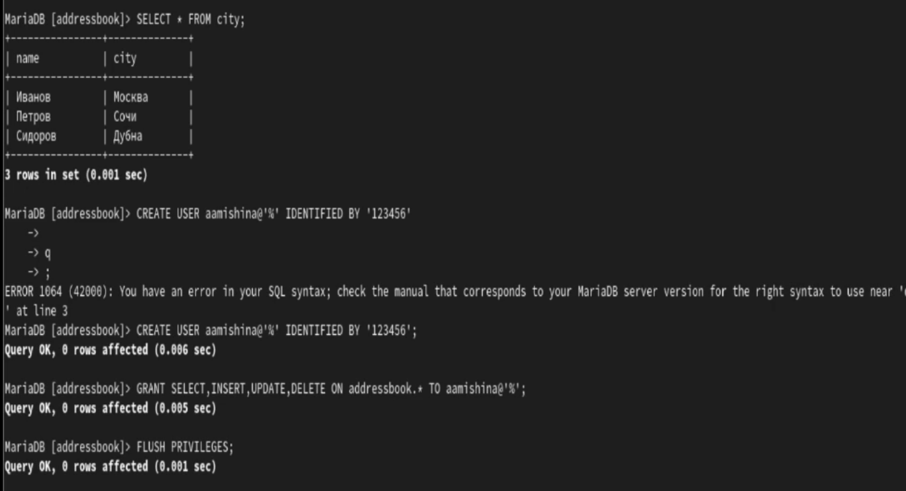{#fig:10 width=70%}

Просматриваем общую информацию о таблице (рис. [-@fig:11]).

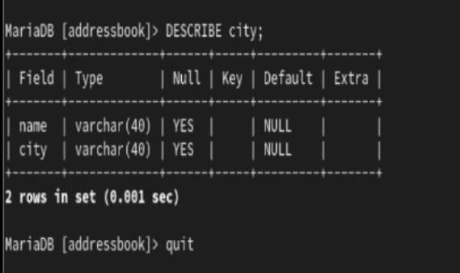{#fig:11 width=70%}

Просматриваем список баз данных (к имеющимся ранее БД добавилась addressbook), а также список таблиц БД adressbbok (рис. [-@fig:12])

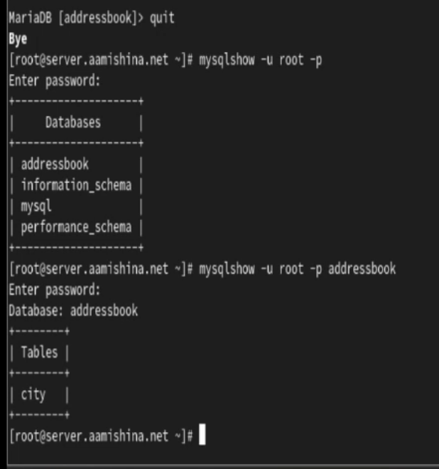{#fig:12 width=70%}

## Резервные копии

Создаем каталог /var/backup для резервных копий. Создаем резервную копию БД addressbook, сжатую резервную копию, сжатую резервную копию с указанием даты создания копии: mysqldump -u root -p addressbook > /var/backup/addressbook.sql, mysqldump -u root -p addressbook | gzip > /var/backup/addressbook.sql.gz и mysqldump -u root -p addressbook | gzip > $(date +/var/backup/addressbook.%Y%m%d.%H%M%S.sql.gz). Восстанавливаем БД из резервной копии, а также из сжатой резервной копии (рис. [-@fig:13]).

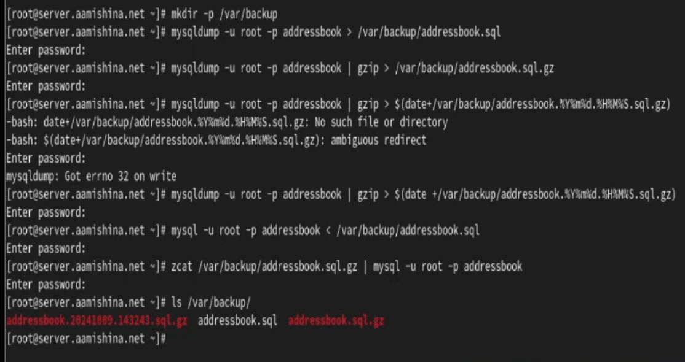{#fig:13 width=70%}

## Внесение изменений в настройки внутреннего окружения виртуальной машины

На ВМ server переходим в каталог для внесения изменений в настройки внутреннего окружения /vagrant/provision/server/ и копируем в соответствующие каталоги конфигурационные файлы. Создаем скрипт /vagrant/provision/server/mysql.sh (рис. [-@fig:14]), (рис. [-@fig:1]).

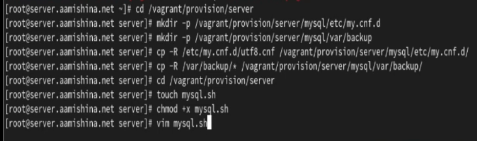{#fig:14 width=70%}

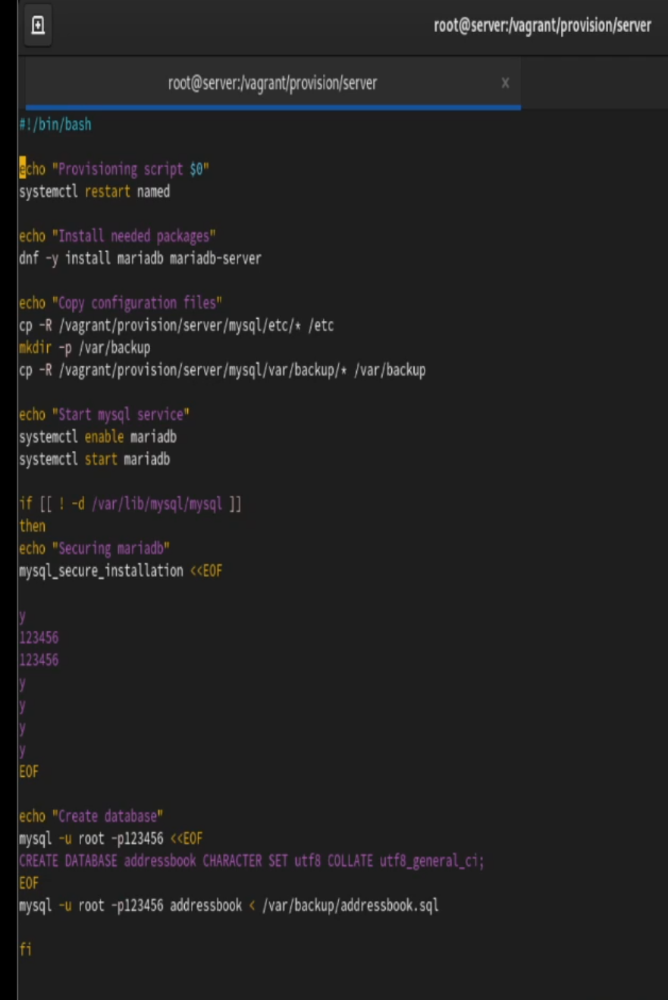{#fig:15 width=70%}

Для отработки созданного скрипта во время загрузки виртуальных машин в конфигурационном файле Vagrantfile добавляем запись в конфигурации сервера.

# Выводы

В результате выполнения работы были приобретены практические навыки по установке и конфигурированию системы управления базами данных на примере программного обеспечения MariaDB.

# Ответы на контрольные вопросы

1. Какая команда отвечает за настройки безопасности в MariaDB? 

- Настройки безопасности в MariaDB обычно управляются с помощью команды mysql_secure_installation. Эта команда выполняет несколько шагов, включая установку пароля для пользователя root, удаление анонимных учетных записей, отключение удаленного входа для пользователя root и удаление тестовых баз данных.

2. Как настроить MariaDB для доступа через сеть? 

- Для настройки MariaDB для доступа через сеть, вы можете отредактировать файл конфигурации MariaDB (обычно называемый my.cnf) и убедиться, что параметр bind-address установлен на IP-адрес, доступный в вашей сети. Также, убедитесь, что пользователь имеет права доступа извне, например, с использованием команды GRANT.

3. Какая команда позволяет получить обзор доступных баз данных после входа в среду оболочки MariaDB? 

- SHOW DATABASES;

4. Какая команда позволяет узнать, какие таблицы доступны в базе
данных? 

- SHOW TABLES;

5. Какая команда позволяет узнать, какие поля доступны в таблице? -

- DESCRIBE table_name;

6. Какая команда позволяет узнать, какие записи доступны в таблице?

-  SELECT * FROM table_name;

7. Как удалить запись из таблицы? 

- DELETE FROM table_name WHERE condition;, где condition - условие, определяющее, какие записи следует удалить.

8. Где расположены файлы конфигурации MariaDB? Что можно настроить с их помощью? 

- Файлы конфигурации MariaDB обычно располагаются в различных местах в зависимости от системы, но основной файл - my.cnf. Он может быть в /etc/my.cnf, /etc/mysql/my.cnf или /usr/etc/my.cnf. С помощью этих файлов можно настроить различные параметры, такие как порт, пути к файлам данных, параметры безопасности и другие.

9. Где располагаются файлы с базами данных MariaDB? 

- Файлы с базами данных MariaDB располагаются в директории данных. Обычно это /var/lib/mysql/ на Linux-системах.

10. Как сделать резервную копию базы данных и затем её восстановить? 

- Для создания резервной копии базы данных используйте команду mysqldump. Например, mysqldump -u username -p dbname > backup.sql. Для восстановления базы данных из резервной копии используйте команду mysql -u username -p dbname < backup.sql.