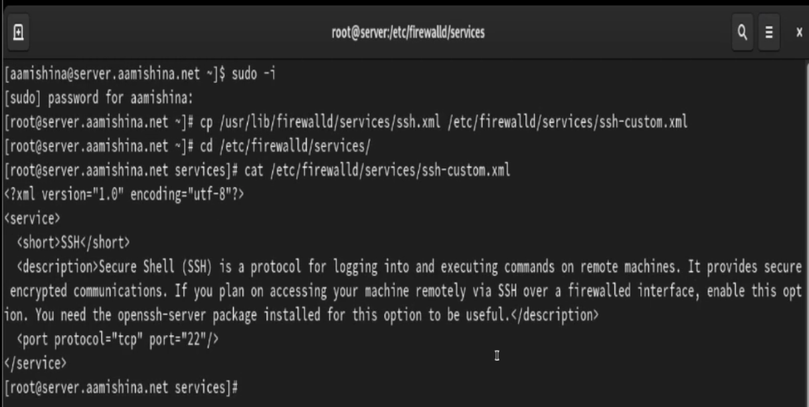

---
## Front matter
lang: ru-RU
title: Лабораторная работа №7
subtitle: Администрирование сетевых подсистем
author:
  - Мишина А. А.
date: 16 октября 2024

## i18n babel
babel-lang: russian
babel-otherlangs: english

## Formatting pdf
toc: false
toc-title: Содержание
slide_level: 2
aspectratio: 169
section-titles: true
theme: metropolis
header-includes:
 - \metroset{progressbar=frametitle,sectionpage=progressbar,numbering=fraction}
 - '\makeatletter'

 - '\makeatother'
---

## Цели и задачи

- Получить навыки настройки межсетевого экрана в Linux в части переадресации портов и настройки Masquerading.

# Выполнение лабораторной работы

# Создание пользовательской службы firewalld

## ssh-custom

{#fig:1 width=70%}

## ssh-custom

{#fig:2 width=70%}

## Список доступных служб

{#fig:3 width=50%}

## Активация службы

{#fig:4 width=70%}

# Перенаправление портов

## ВМ Client

- Переадресация порта: firewall-cmd --add-forward-port=port=2022:proto=tcp:toport=22

{#fig:5 width=70%}

## ВМ Client

{#fig:6 width=70%}

# Настройка Port Forwarding и Masquerading

## Перенаправление пакетов

{#fig:7 width=35%}

# Внесение изменений в настройки внутреннего окружения виртуальной машины

## Внесение изменений в настройки внутреннего окружения

{#fig:8 width=70%}

## Файл firewall.sh

{#fig:9 width=70%}

## Вывод

- В результате выполнения работы были приобретены практические навыки по установке и конфигурированию системы управления базами данных на примере программного обеспечения MariaDB.