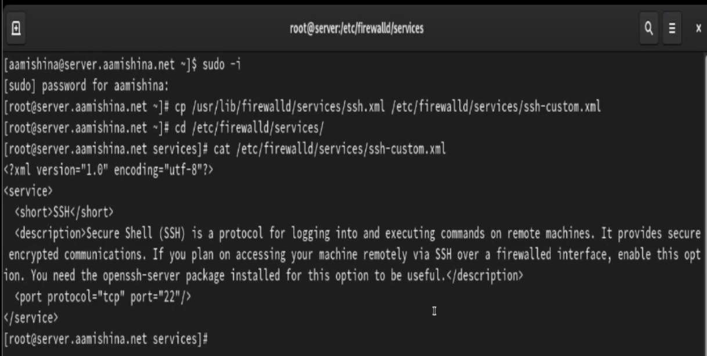
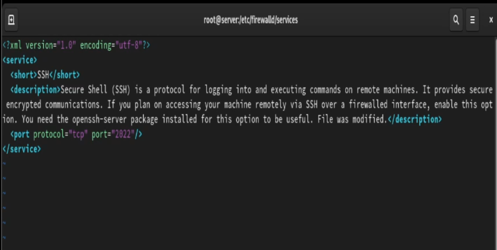
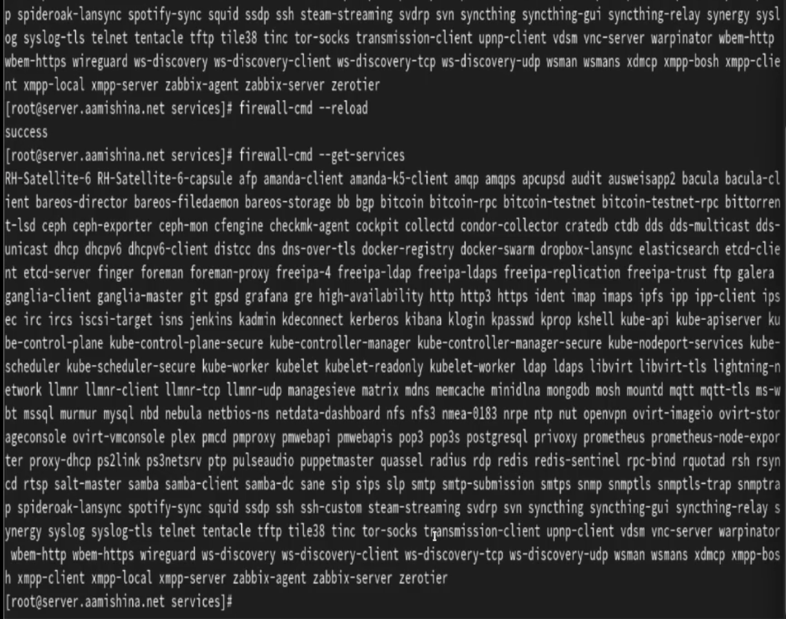
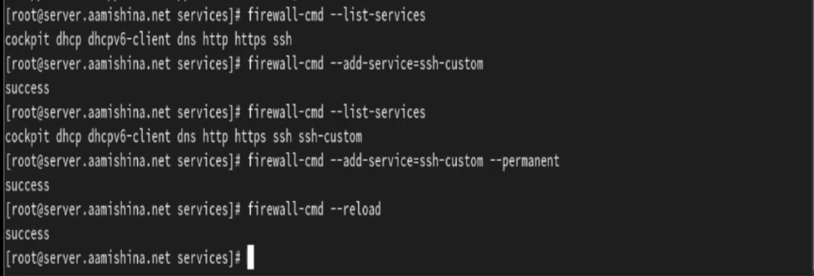
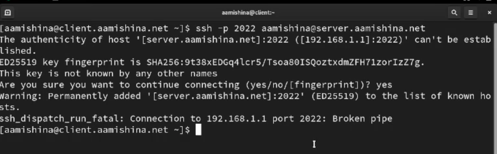
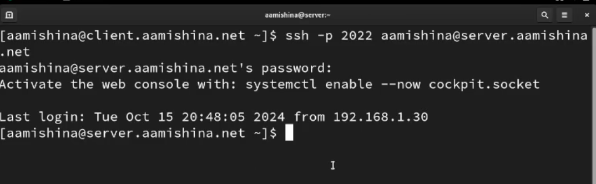
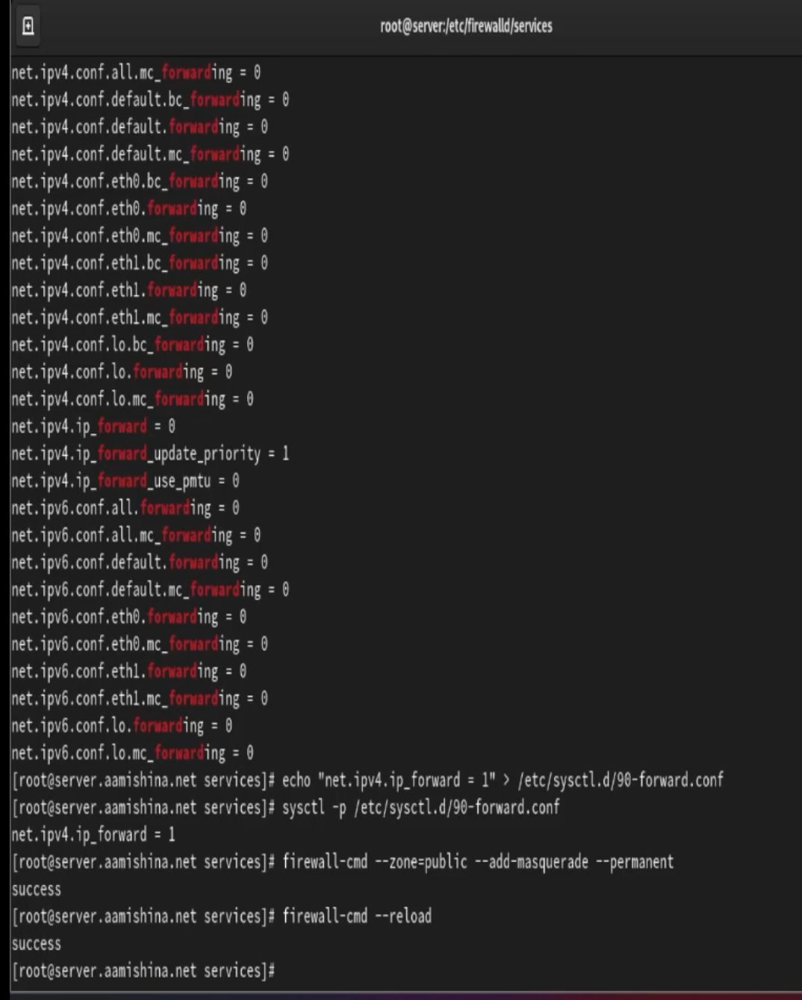
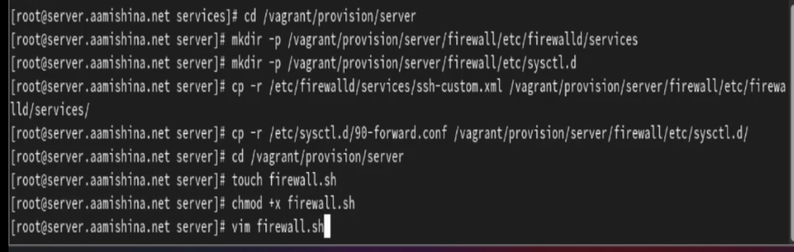
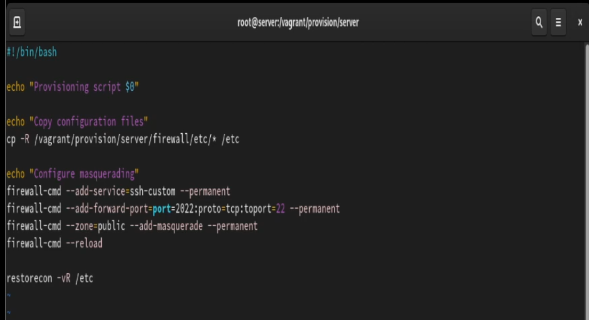

---
## Front matter
title: "Отчёт по лабораторной работе №7"
subtitle: "Дисциплина: Администрирование сетевых подсистем"
author: "Мишина Анастасия Алексеевна"

## Generic options
lang: ru-RU
toc-title: "Содержание"

## Bibliography
bibliography: bib/cite.bib
csl: pandoc/csl/gost-r-7-0-5-2008-numeric.csl

## Pdf output format
toc: true # Table of contents
toc-depth: 2
lof: true # List of figures
lot: true # List of tables
fontsize: 14pt
linestretch: 1.5
papersize: a4
documentclass: scrreprt
## I18n polyglossia
polyglossia-lang:
  name: russian
  options:
	- spelling=modern
	- babelshorthands=true
polyglossia-otherlangs:
  name: english
## I18n babel
babel-lang: russian
babel-otherlangs: english
## Fonts
mainfont: PT Serif
romanfont: PT Serif
sansfont: PT Sans
monofont: PT Mono
mainfontoptions: Ligatures=TeX
romanfontoptions: Ligatures=TeX
sansfontoptions: Ligatures=TeX,Scale=MatchLowercase
monofontoptions: Scale=MatchLowercase,Scale=0.9
## Biblatex
biblatex: true
biblio-style: "gost-numeric"
biblatexoptions:
  - parentracker=true
  - backend=biber
  - hyperref=auto
  - language=auto
  - autolang=other*
  - citestyle=gost-numeric
## Pandoc-crossref LaTeX customization
figureTitle: "Рис."
tableTitle: "Таблица"
listingTitle: "Листинг"
lofTitle: "Список иллюстраций"
lotTitle: "Список таблиц"
lolTitle: "Листинги"
## Misc options
indent: true
header-includes:
  - \usepackage{indentfirst}
  - \usepackage{float} # keep figures where there are in the text
  - \floatplacement{figure}{H} # keep figures where there are in the text
---

# Цель работы

Получить навыки настройки межсетевого экрана в Linux в части переадресации портов и настройки Masquerading.


# Выполнение лабораторной работы

## Создание пользовательской службы firewalld

Запускаем ВМ через рабочий каталог. На ВМ server входим под собственным пользователем и переходим в режим суперпользователя. На основе существующего файла описания службы ssh создаем файл с собственным описанием. Просматриваем содержимое файла (рис. [-@fig:1]).

{#fig:1 width=70%}

Открываем файл на редактирование и меняем порт 22 на порт 2022, в описании службы указав, что файл был модифицирован (рис. [-@fig:2])

{#fig:2 width=70%}

Просматриваем список доступных служб (новой службы пока нет). Перезагружаем правила межсетевого экрана, снова просматриваем список доступных служб и видим новую (рис. [-@fig:3])

{#fig:3 width=70%}

Новая служба отображается в списке доступных, но пока не активирована. Добавляем новую службу в FirewallD и просматриваем список активных служб (служба появилась). Перегружаем правила межсетевого экрана с сохранением информации о состоянии (рис. [-@fig:4])

{#fig:4 width=70%}

##  Перенаправление портов

Организовываем переадресацию с порта 2022 на порт 22 на сервере, введя команду: firewall-cmd --add-forward-port=port=2022:proto=tcp:toport=22.

На клиенте пробуем получить доступ по SSH через порт 2022. Доступ получен (рис. [-@fig:5]), (рис. [-@fig:6]). 

{#fig:5 width=70%}

{#fig:6 width=70%}

## Настройка Port Forwarding и Masquerading

На сервере просматриваем, активирована ли в ядре системы возможность перенаправления IPv4-пакетов пакетов. Включаем перенаправление пакетов на сервере. Включаем маскарадинг на сервере (рис. [-@fig:7]). Убеждаемся, что на клиенте доступен выход в интернет (веб-страницы в браузере загружаются успешно).

{#fig:7 width=70%}

## Внесение изменений в настройки внутреннего окружения виртуальной машины

На ВМ server переходим в каталог для внесения изменений в настройки внутреннего окружения /vagrant/provision/server/ и копируем в соответствующие каталоги конфигурационные файлы. Создаем скрипт firewall.sh (рис. [-@fig:8]). 

{#fig:8 width=70%}

Редактируем скрипт (рис. [-@fig:9]).

{#fig:9 width=70%}

Для отработки созданного скрипта во время загрузки виртуальной машины server в конфигурационном файле Vagrantfile добавляем в разделе конфигурации для сервера следующую запись:

```
server.vm.provision "server firewall",
type: "shell",
preserve_order: true,
path: "provision/server/firewall.sh"
```

# Выводы

В результате выполнения работы получены навыки настройки межсетевого экрана в Linux в части переадресации портов и настройки Masquerading.

# Ответы на контрольные вопросы

1. Где хранятся пользовательские файлы firewalld? 

- В firewalld пользовательские файлы хранятся в директории /etc/firewalld/.

2. Какую строку надо включить в пользовательский файл службы, чтобы указать порт TCP 2022? 

- Для указания порта TCP 2022 в пользовательском файле службы, вы можете добавить строку в секцию port следующим образом:

<port protocol="tcp" port="2022"/>

3. Какая команда позволяет вам перечислить все службы, доступные в настоящее время на вашем сервере? 

- firewall-cmd --get-services

4. В чем разница между трансляцией сетевых адресов (NAT) и маскарадингом (masquerading)? 

- Разница между трансляцией сетевых адресов (NAT) и маскарадингом (masquerading) заключается в том, что в случае NAT исходный IP-адрес пакета заменяется на IP-адрес маршрутизатора, а в случае маскарадинга используется маршрутизатора.

5. Какая команда разрешает входящий трафик на порт 4404 и перенаправляет его в службу ssh по IP-адресу 10.0.0.10? 

```
firewall-cmd --zone=public --add-port=4404/tcp --permanent
firewall-cmd --zone=public --add-forward-port=port=4404
            :proto=tcp:toport=22:toaddr=10.0.0.10 --permanent
firewall-cmd --reload
```

6. Какая команда используется для включения маcкарадинга IP- пакетов для всех пакетов, выходящих в зону public? 

- firewall-cmd --zone=public --add-masquerade --permanent
- firewall-cmd --reload