---
## Front matter
lang: ru-RU
title: Лабораторная работа №8
subtitle: Администрирование сетевых подсистем
author:
  - Мишина А. А.
date: 23 октября 2024

## i18n babel
babel-lang: russian
babel-otherlangs: english

## Formatting pdf
toc: false
toc-title: Содержание
slide_level: 2
aspectratio: 169
section-titles: true
theme: metropolis
header-includes:
 - \metroset{progressbar=frametitle,sectionpage=progressbar,numbering=fraction}
 - '\makeatletter'

 - '\makeatother'
---

## Цели и задачи

- Приобретение практических навыков по установке и конфигурированию SMTP-сервера.

# Выполнение лабораторной работы

# Установка Postfix

## Межсетевой экран

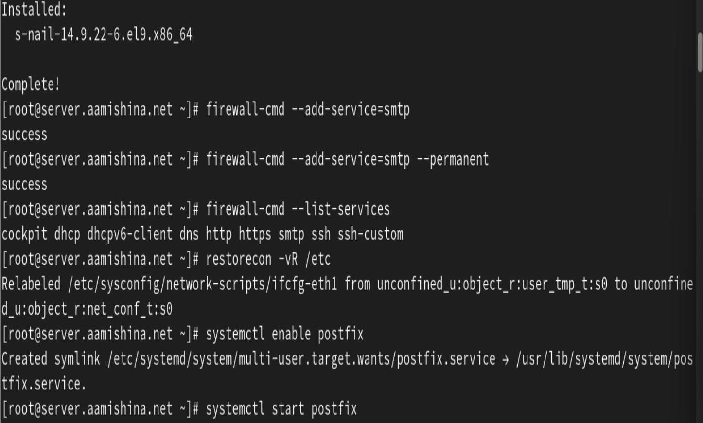{#fig:1 width=70%}

# Изменение параметров Postfix с помощью postconf

## Настройка postfix

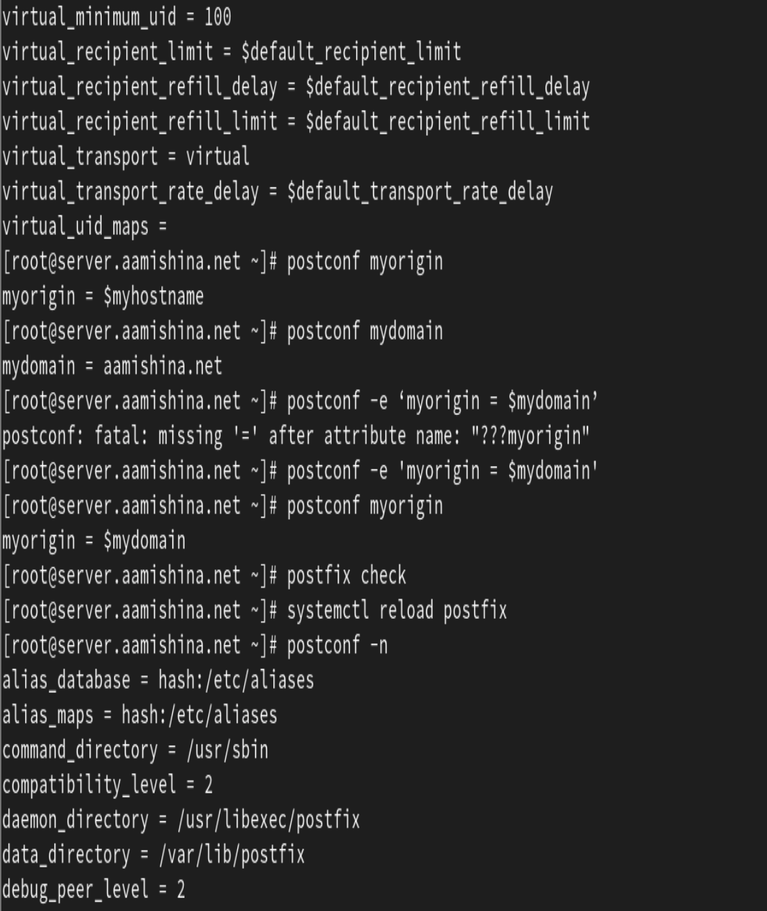{#fig:2 width=30%}

## Настройка postfix

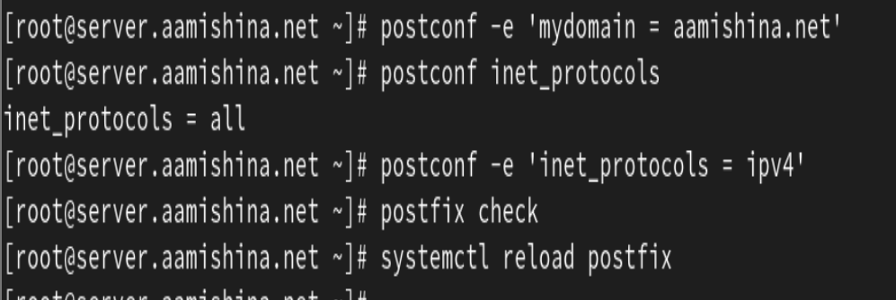{#fig:3 width=70%}

# Проверка работы Postfix

## Письмо

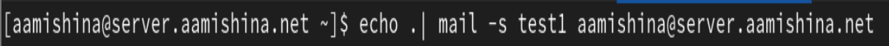{#fig:4 width=70%}

## Письмо

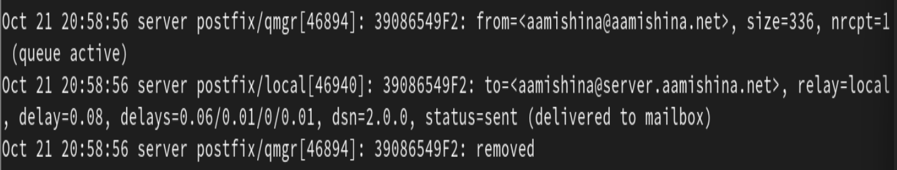{#fig:5 width=70%}

## Письмо

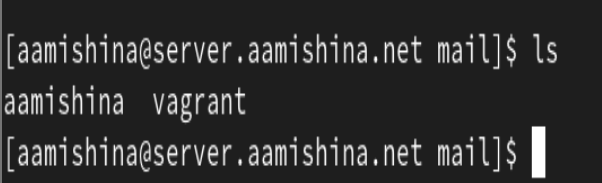{#fig:6 width=70%}

## ВМ client

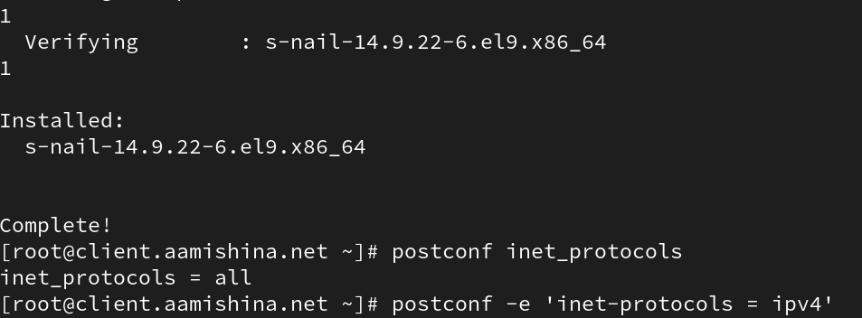{#fig:7 width=70%}

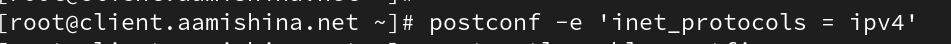{#fig:8 width=70%}

## Запуск postfix

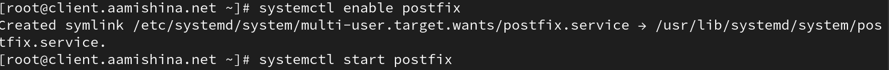{#fig:9 width=70%}

- На клиенте под учётной записью пользователя отправляем второе письмо. Письмо на сервер не доставлено.

## Настройка postfix

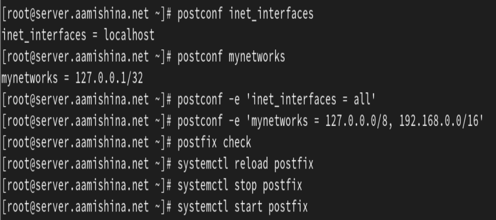{#fig:10 width=70%}

## Письмо

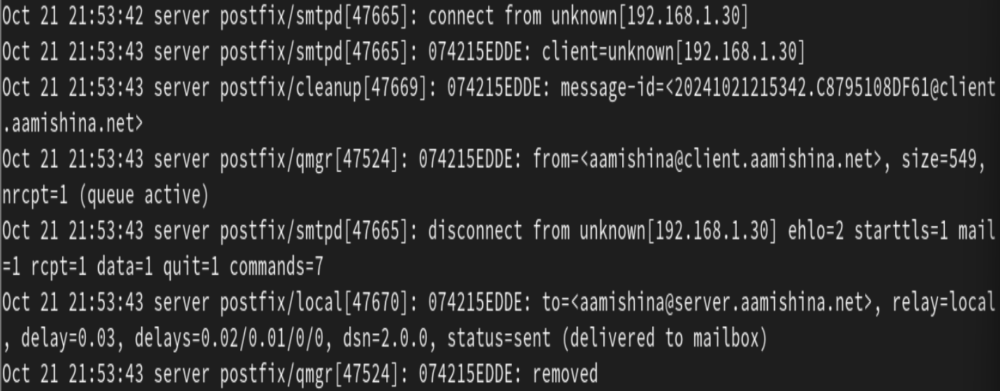{#fig:11 width=70%}

## Письмо

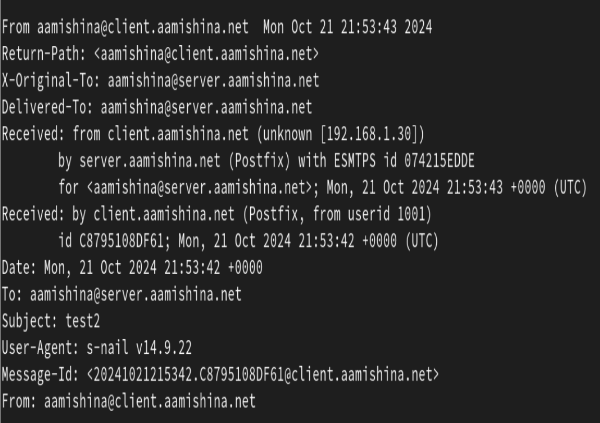{#fig:12 width=70%}

# Конфигурация Postfix для домена

## Письмо на домен

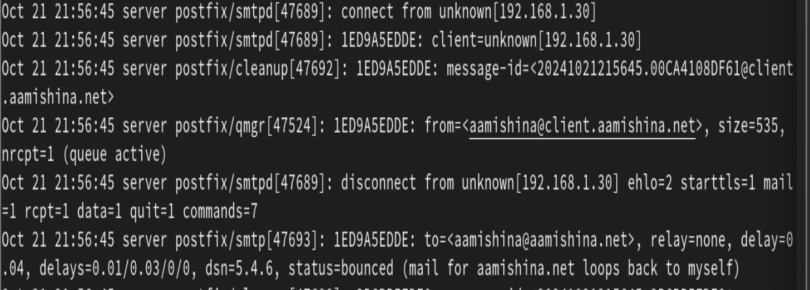{#fig:13 width=70%}

## Файл прямой DNS-зоны

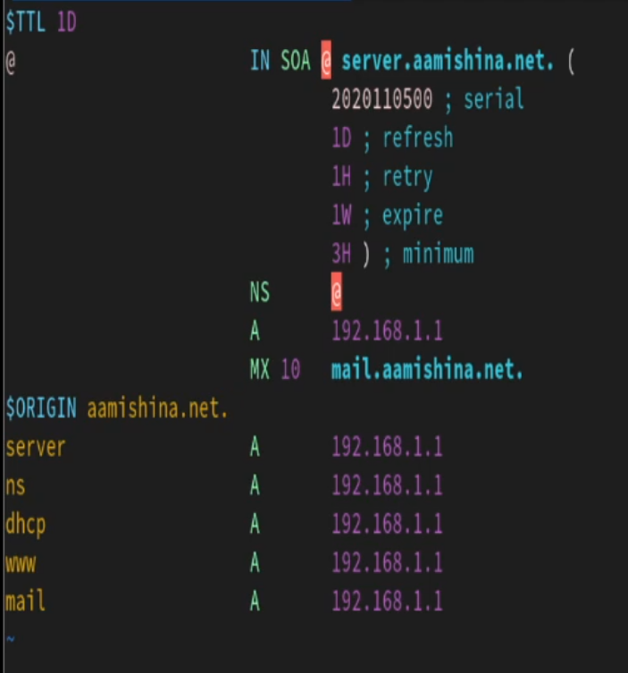{#fig:14 width=40%}

## Файл обратной DNS-зоны

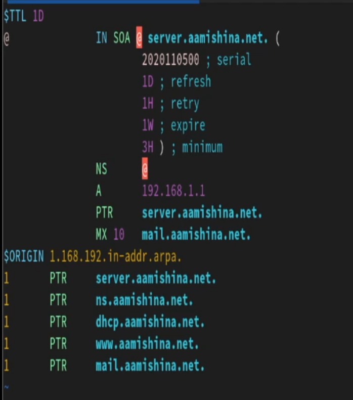{#fig:15 width=40%}

## Добавление домена

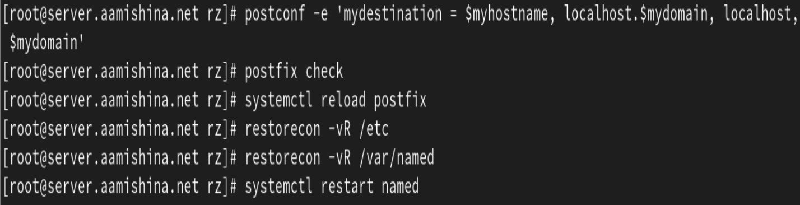{#fig:16 width=70%}

## Письмо на домен

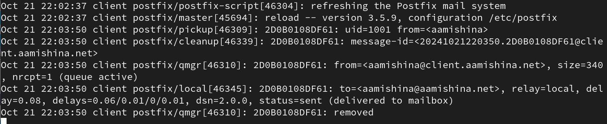{#fig:17 width=70%}

## Письмо на домен

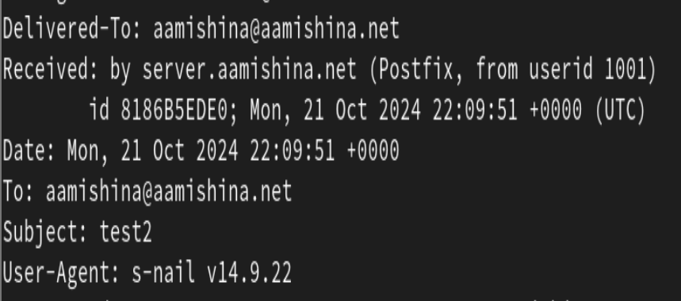{#fig:18 width=70%}

# Внесение изменений в настройки внутреннего окружения виртуальной машины

## ВМ server

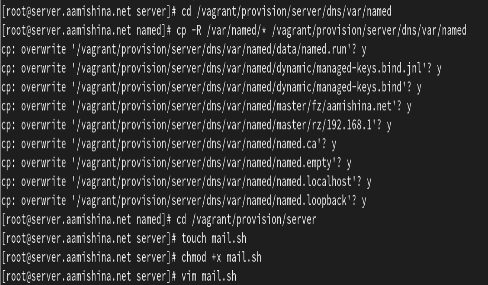{#fig:19 width=70%}

## ВМ server

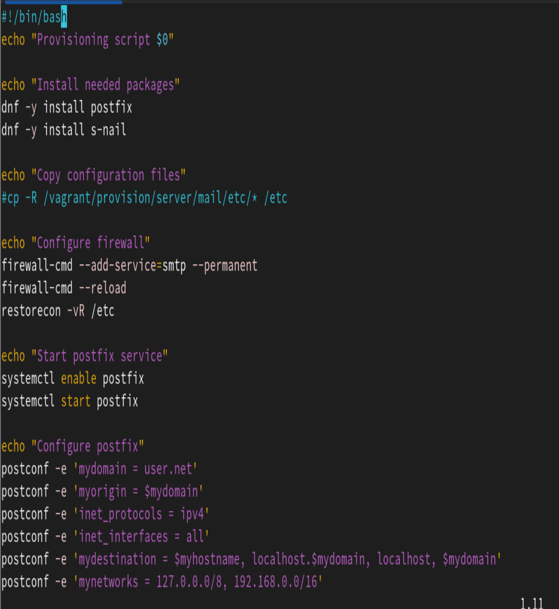{#fig:20 width=40%}

## ВМ client

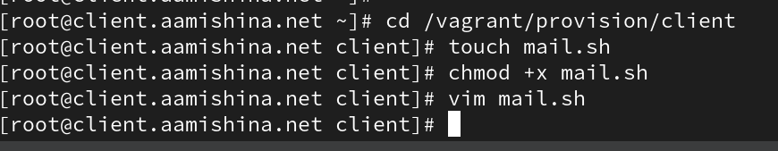{#fig:21 width=70%}

## ВМ client

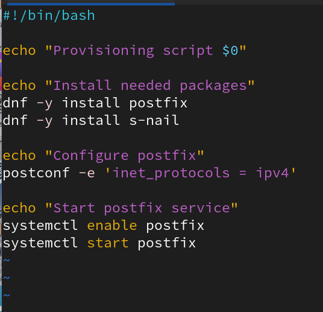{#fig:22 width=50%}

## Вывод

- В результате выполнения работы были приобретены практические навыки по установке и конфигурированию SMTP-сервера.