---
## Front matter
title: "Отчёт по лабораторной работе №8"
subtitle: "Дисциплина: Администрирование сетевых подсистем"
author: "Мишина Анастасия Алексеевна"

## Generic options
lang: ru-RU
toc-title: "Содержание"

## Bibliography
bibliography: bib/cite.bib
csl: pandoc/csl/gost-r-7-0-5-2008-numeric.csl

## Pdf output format
toc: true # Table of contents
toc-depth: 2
lof: true # List of figures
lot: true # List of tables
fontsize: 14pt
linestretch: 1.5
papersize: a4
documentclass: scrreprt
## I18n polyglossia
polyglossia-lang:
  name: russian
  options:
	- spelling=modern
	- babelshorthands=true
polyglossia-otherlangs:
  name: english
## I18n babel
babel-lang: russian
babel-otherlangs: english
## Fonts
mainfont: PT Serif
romanfont: PT Serif
sansfont: PT Sans
monofont: PT Mono
mainfontoptions: Ligatures=TeX
romanfontoptions: Ligatures=TeX
sansfontoptions: Ligatures=TeX,Scale=MatchLowercase
monofontoptions: Scale=MatchLowercase,Scale=0.9
## Biblatex
biblatex: true
biblio-style: "gost-numeric"
biblatexoptions:
  - parentracker=true
  - backend=biber
  - hyperref=auto
  - language=auto
  - autolang=other*
  - citestyle=gost-numeric
## Pandoc-crossref LaTeX customization
figureTitle: "Рис."
tableTitle: "Таблица"
listingTitle: "Листинг"
lofTitle: "Список иллюстраций"
lotTitle: "Список таблиц"
lolTitle: "Листинги"
## Misc options
indent: true
header-includes:
  - \usepackage{indentfirst}
  - \usepackage{float} # keep figures where there are in the text
  - \floatplacement{figure}{H} # keep figures where there are in the text
---

# Цель работы

Приобретение практических навыков по установке и конфигурированию SMTP-сервера.

# Выполнение лабораторной работы

## Установка Postfix

Запускаем ВМ через рабочий каталог. На ВМ server входим под собственным пользователем и переходим в режим суперпользователя. Устанавливаем необходимые пакеты: dnf -y install postfix и dnf -y install s-nail.

Сконфигурируем межсетевой экран, разрешив работать службе протокола SMTP:

```
firewall-cmd --add-service=smtp
firewall-cmd --add-service=smtp --permanent
firewall-cmd --list-services
```

Восстанавливаем контекст безопасности в SELinux: restorecon -vR /etc, запускаем Postfix: systemctl enable postfix и systemctl start postfix (рис. [-@fig:1]).

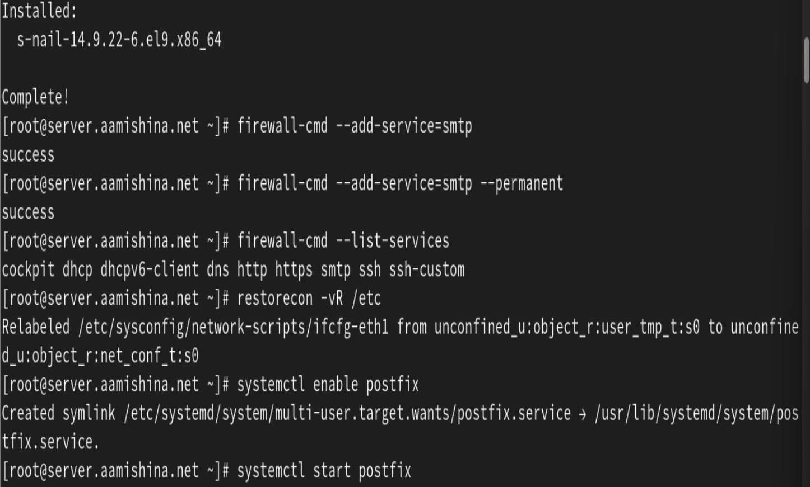{#fig:1 width=70%}

## Изменение параметров Postfix с помощью postconf

Первоначальную настройку Postfix осуществляем, используя postconf.
Для просмотра списка текущих настроек Postfix введем: postconf.
Посмотрим текущее значение параметра myorigin: postconf myorigin.
Посмотрим текущее значение параметра mydomain: postconf mydomain. Указано mydomain = aamishina.net. Заменим значение параметра myorigin на значение параметра mydomain: postconf -e ‘myorigin = $mydomain’. Повторим команду postconf myorigin, видим, что замена параметра была произведена. Проверим корректность содержания конфигурационного файла main.cf: postfix check. Перезагрузим конфигурационные файлы Postfix: systemctl reload postfix. Просмотрим все параметры с значением, отличным от значения по умолчанию: postconf -n (рис. [-@fig:2]).

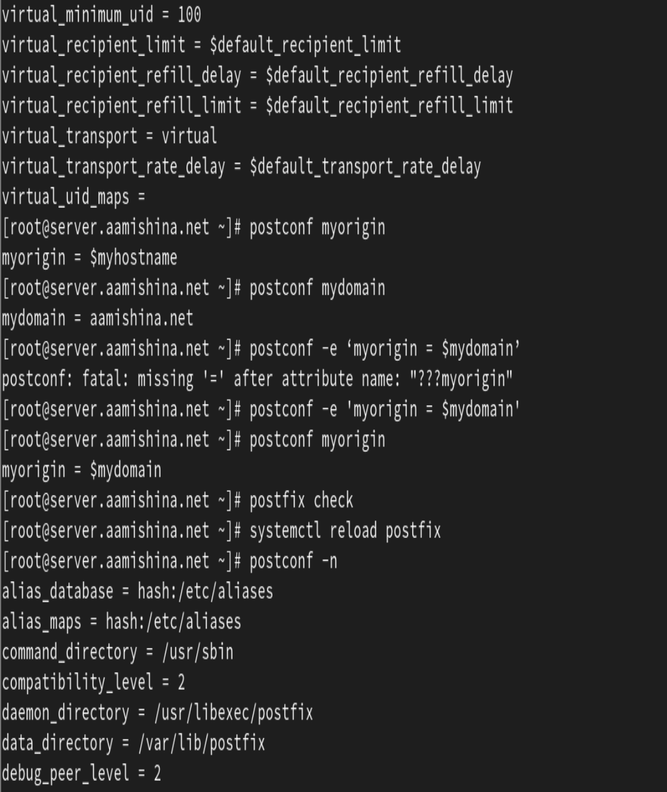{#fig:2 width=70%}

Зададим жёстко значение домена: postconf -e 'mydomain = aamishina.net'. Отключим IPv6 в списке разрешённых в работе Postfix протоколов и оставим только IPv4: postconf inet_protocols и postconf -e 'inet_protocols = ipv4'. Перезагрузим конфигурацию Postfix: postfix check и systemctl reload postfix (рис. [-@fig:3]).

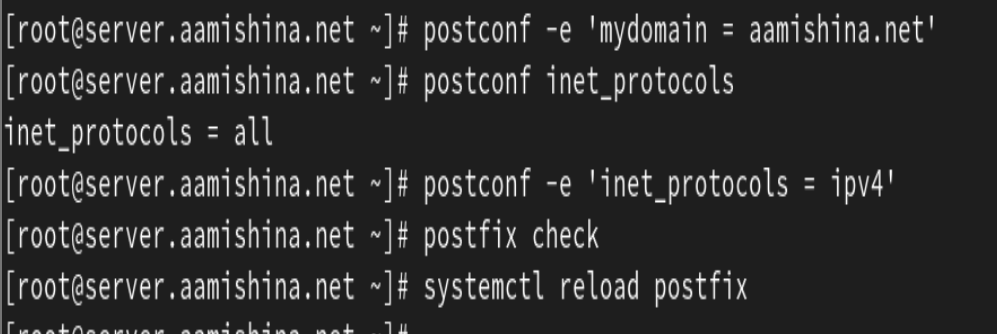{#fig:3 width=70%}

## Проверка работы Postfix

На сервере под учётной записью пользователя отправим себе письмо, используя утилиту mail: echo .| mail -s test1 aamishina@server.aamishina.net (рис. [-@fig:4]).

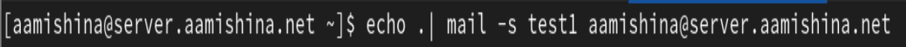{#fig:4 width=70%}

На втором терминале запускаем мониторинг работы почтовой службы и посмотрим, что произошло с сообщением: tail -f /var/log/maillog (рис. [-@fig:5]).

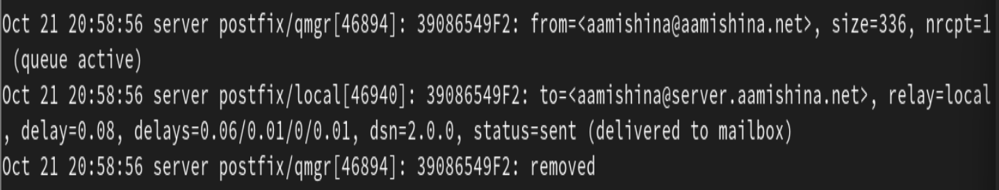{#fig:5 width=70%}

Дополнительно посмотрим содержание каталога /var/spool/mail, там появился каталог пользователя aamishina с отправленным письмом (рис. [-@fig:6]).

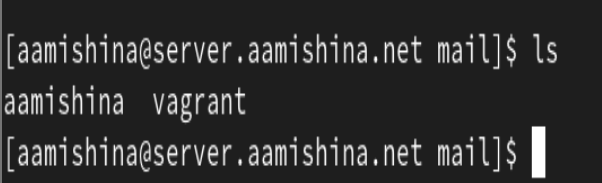{#fig:6 width=70%}

На виртуальной машине client войдем под пользователем и откроем терминал. Перейдем в режим суперпользователя: sudo -i. На клиенте установим необходимые для работы пакеты: dnf -y install postfix и dnf -y install s-nail.

Отключим IPv6 в списке разрешённых в работе Postfix протоколов и оставим только IPv4: postconf inet_protocols и postconf -e 'inet_protocols = ipv4' (изначально я допустила ошибку, исправила ее позднее, видно на скриншотах) (рис. [-@fig:7]), (рис. [-@fig:8]).

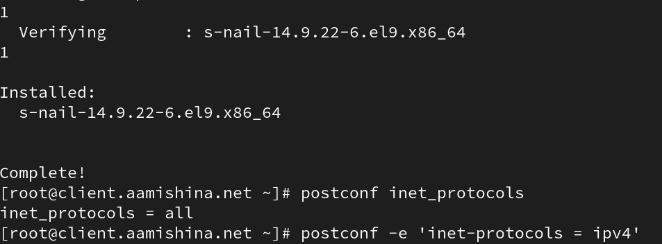{#fig:7 width=70%}

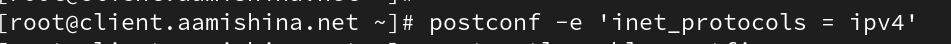{#fig:8 width=70%}

На клиенте запускаем Postfix: systemctl enable postfix и systemctl start postfix (рис. [-@fig:9]).

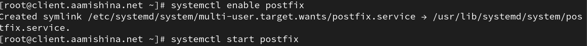{#fig:9 width=70%}

На клиенте под учётной записью пользователя аналогичным образом отправляем себе второе письмо, используя утилиту mail. Письмо на сервер не доставлено.

На сервере в конфигурации Postfix посмотрим значения параметров сетевых интерфейсов inet_interfaces и сетевых адресов mynetworks:
postconf inet_interfaces и postconf mynetworks. Разрешим Postfix прослушивать соединения не только с локального узла, но и с других интерфейсов сети: postconf -e 'inet_interfaces = all'. Добавим адрес внутренней сети, разрешив таким образом пересылку сообщений
между узлами сети: postconf -e 'mynetworks = 127.0.0.0/8, 192.168.0.0/16'. Перезагрузим конфигурацию Postfix и перезапустим Postfix (рис. [-@fig:10]). 

```
postfix check
systemctl reload postfix
systemctl stop postfix
systemctl start postfix
```

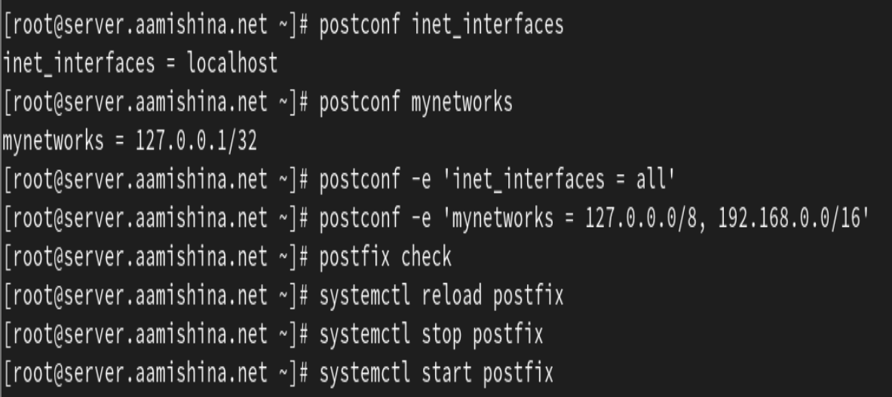{#fig:10 width=70%}

Повторим отправку сообщения с клиента. В журнале видим информацию о том, что установлено соединение с сервером, письмо получено, соединение разорвано (рис. [-@fig:11]), (рис. [-@fig:12]).

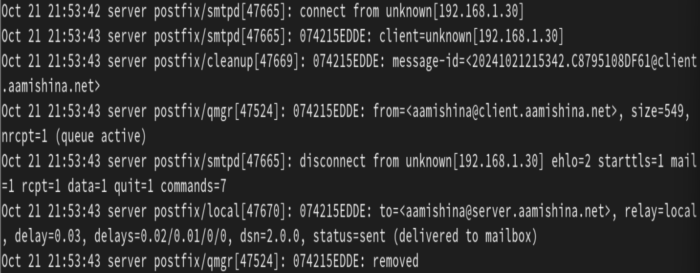{#fig:11 width=70%}

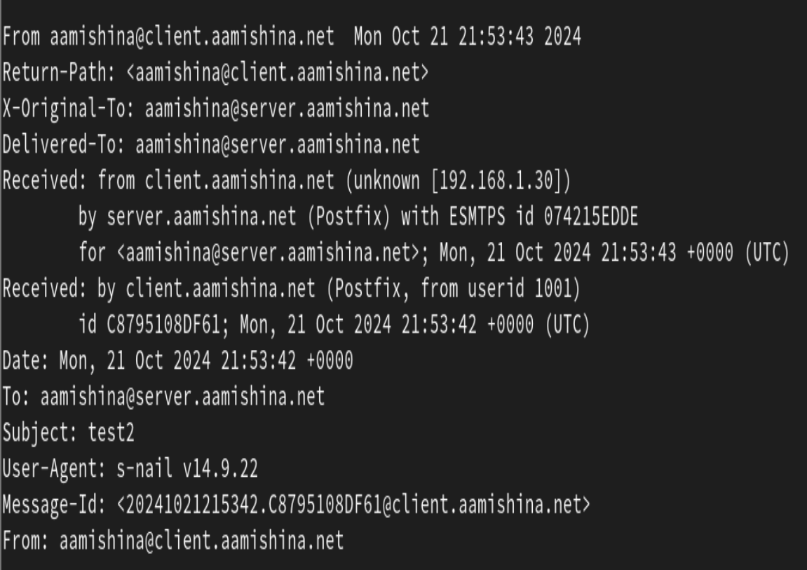{#fig:12 width=70%}

## Конфигурация Postfix для домена

С клиента отправим письмо на свой доменный адрес: echo .| mail -s test2 aamishina@aamishina.net. Запускаем мониторинг работы почтовой службы и посмотрим, что произошло с сообщением: tail -f /var/log/maillog (рис. [-@fig:13]).

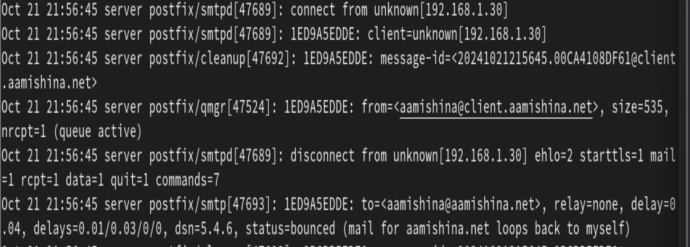{#fig:13 width=70%}

Дополнительно посмотрим, какие сообщения ожидают в очереди на отправление: postqueue -p. Для настройки возможности отправки сообщений не на конкретный узел сети, а на доменный адрес пропишим MX-запись с указанием имени почтового сервера mail.aamishina.net в файле прямой DNS-зоны (рис. [-@fig:14]) и в файле обратной DNS-зоны (рис. [-@fig:15]).

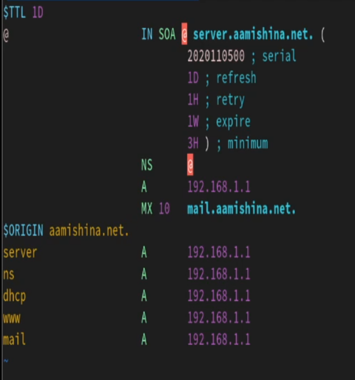{#fig:14 width=70%}

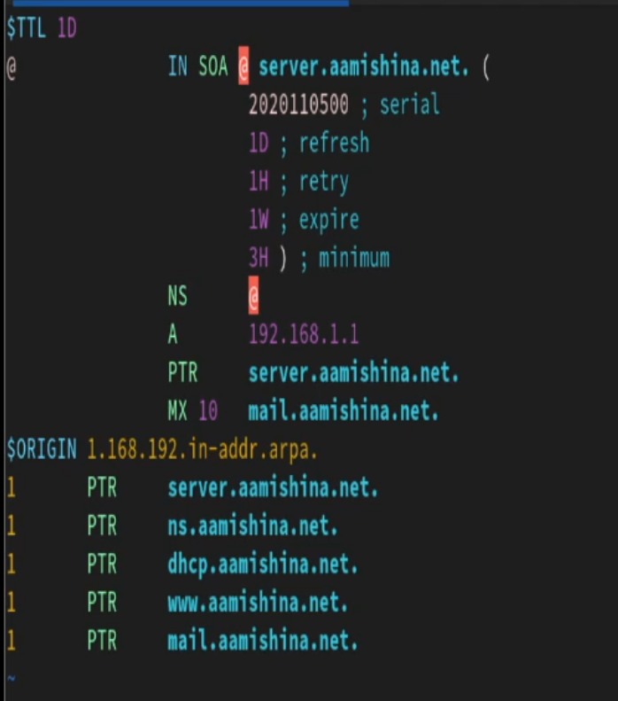{#fig:15 width=70%}

В конфигурации Postfix добавим домен в список элементов сети, для которых данный сервер является конечной точкой доставки почты: postconf -e 'mydestination = $myhostname, localhost.$mydomain, localhost, $mydomain'. Перезагрузим конфигурацию Postfix: postfix check и systemctl reload postfix. Восстановим контекст безопасности в SELinux: restorecon -vR /etc и restorecon -vR /var/named. Перезапустим DNS: systemctl restart named. Попробуем отправить сообщения, находящиеся в очереди на отправление: postqueue -f (рис. [-@fig:16]).

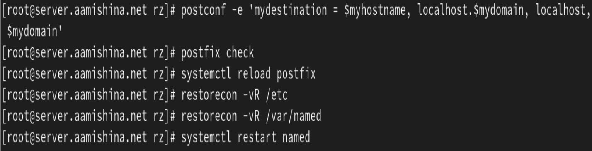{#fig:16 width=70%}

Проверим отправку почты с клиента на доменный адрес, сообщение доставлено (рис. [-@fig:17]).

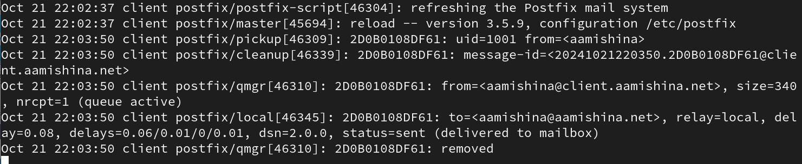{#fig:17 width=70%}

Проверяем /var/spool/mail/aamishina и убеждаемся, что сообщение доставлено (рис. [-@fig:18]).

{#fig:18 width=70%}

## Внесение изменений в настройки внутреннего окружения виртуальной машины

На виртуальной машине server перейдем в каталог для внесения изменений в настройки внутреннего окружения /vagrant/provision/server/. Заменим конфигурационные файлы DNS-сервера: cd /vagrant/provision/server/dns/var/named и cp -R /var/named/* /vagrant/provision/server/dns/var/named. В каталоге /vagrant/provision/server создадим исполняемый файл mail.sh: cd /vagrant/provision/server, touch mail.sh и chmod +x mail.sh (рис. [-@fig:19]). Открыв его на редактирование, пропишим в нём скрипт из мануала в ТУИСе (рис. [-@fig:20]).

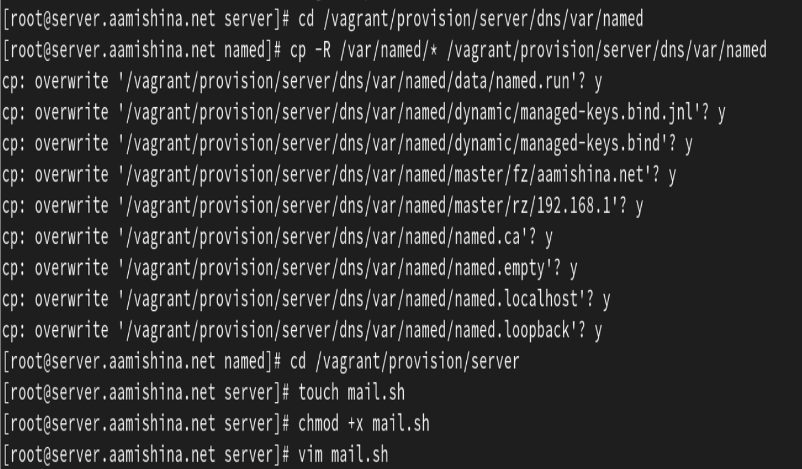{#fig:19 width=70%}

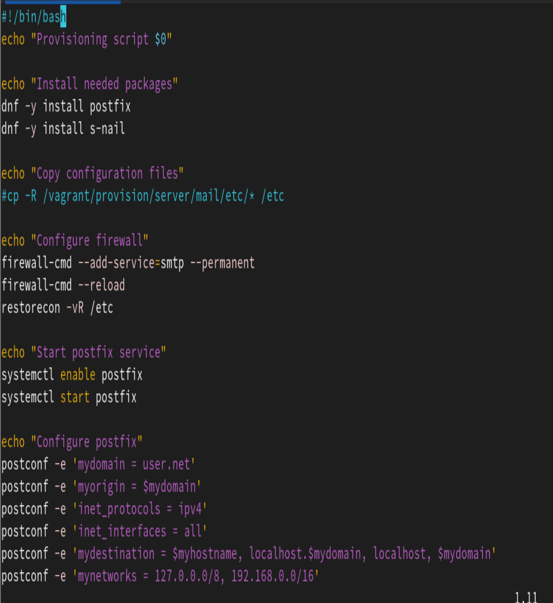{#fig:20 width=70%}

На виртуальной машине client перейдем в каталог для внесения изменений в настройки внутреннего окружения /vagrant/provision/client/: cd /vagrant/provision/client. В каталоге /vagrant/provision/client создадим исполняемый файл mail.sh: touch mail.sh
и chmod +x mail.sh (рис. [-@fig:21]). Открыв его на редактирование, пропишим в нем скрипт (рис. [-@fig:22]).

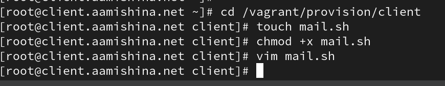{#fig:21 width=70%}

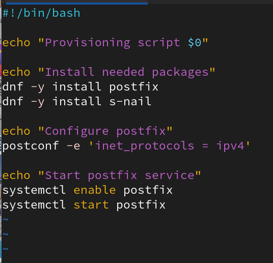{#fig:22 width=70%}

Для отработки созданного скрипта во время загрузки виртуальной машины server в конфигурационном файле Vagrantfile необходимо добавить в разделе конфигурации для сервера и клиента скрипты из ТУИС.

# Выводы

В результате выполнения работы были приобретены практические навыки по установке и конфигурированию SMTP-сервера.

# Ответы на контрольные вопросы

1. В каком каталоге и в каком файле следует смотреть конфигурацию Postfix?

- Конфигурация Postfix обычно хранится в файле `main.cf`, а путь к
этому файлу может различаться в разных системах. Однако, обычно
он находится в каталоге `/etc/postfix/`. Таким образом, путь к файлу
конфигурации будет `/etc/postfix/main.cf`.

2. Каким образом можно проверить корректность синтаксиса конфигурационном файле Postfix? 

- ` postfix check`

3. В каких параметрах конфигурации Postfix требуется внести изменения в
значениях для настройки возможности отправки писем не на локальный
хост, а на доменные адреса? 

- Для настройки возможности отправки
писем не на локальный хост, а на доменные адреса, вы можете
изменить параметры `myhostname` и `mydomain` в файле `main.cf`.

4. Приведите примеры работы с утилитой `mail` по отправке письма,
просмотру имеющихся писем, удалению письма. 

- Отправка письма: `echo "Текст письма" user@example.com`

- Просмотр имеющихся писем: `mail`

- Удаление письма: `mail -d номер_письма`

5. Приведите примеры работы с утилитой postqueue. Как посмотреть очередь
сообщений? Как определить число сообщений в очереди? Как отправить
все сообщения, находящиеся в очереди? Как удалить письмо из очереди? 

- Просмотр очереди сообщений: `postqueue -p`

- Определение числа сообщений в очереди: `postqueue -p | grep -c "^[A-F0-9]"`

- Отправка всех сообщений из очереди: `postqueue -f`

- Удаление письма из очереди: `postsuper -d ID_СООБЩЕНИЯ`