---
## Front matter
lang: ru-RU
title: Лабораторная работа №9
subtitle: Администрирование сетевых подсистем
author:
  - Мишина А. А.
date: 29 октября 2024

## i18n babel
babel-lang: russian
babel-otherlangs: english

## Formatting pdf
toc: false
toc-title: Содержание
slide_level: 2
aspectratio: 169
section-titles: true
theme: metropolis
header-includes:
 - \metroset{progressbar=frametitle,sectionpage=progressbar,numbering=fraction}
 - '\makeatletter'

 - '\makeatother'
---

## Цели и задачи

- Приобретение практических навыков по установке и простейшему конфигурированию POP3/IMAP-сервера.

# Выполнение лабораторной работы

##  Установка Dovecot

- dnf -y install dovecot telnet.

# Настройка dovecot

## Почтовые протоколы

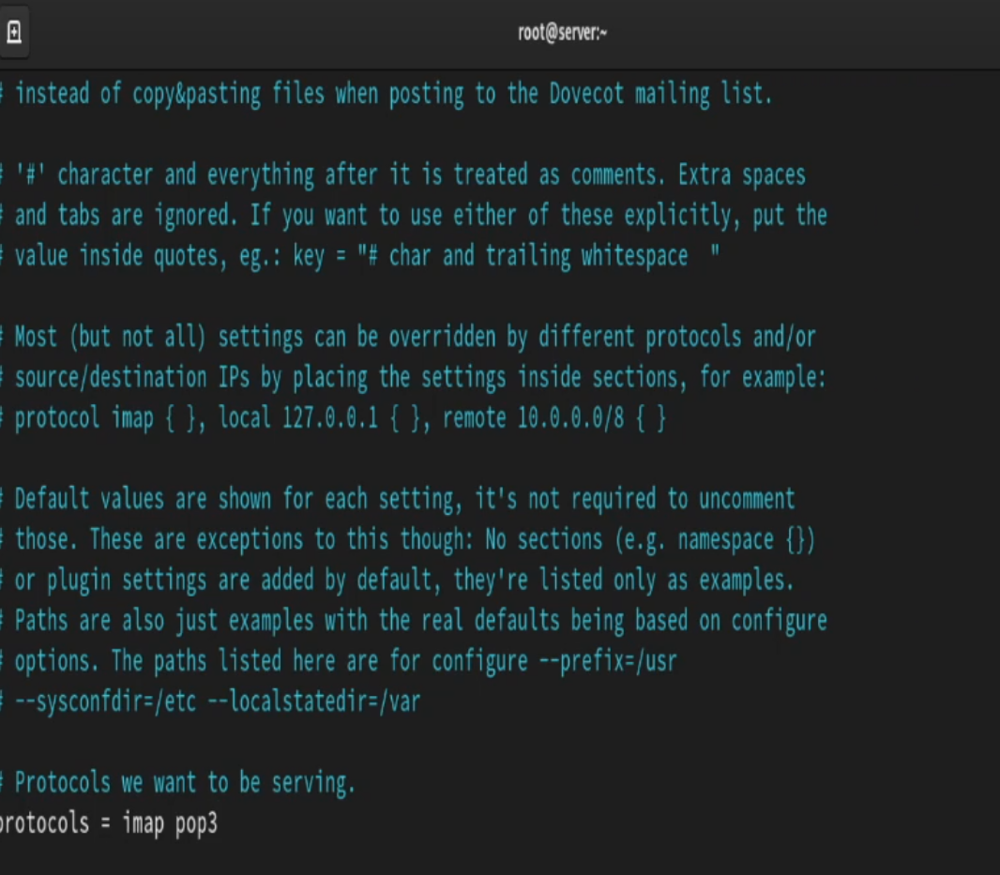{#fig:1 width=50%}

## Метод аутентификации

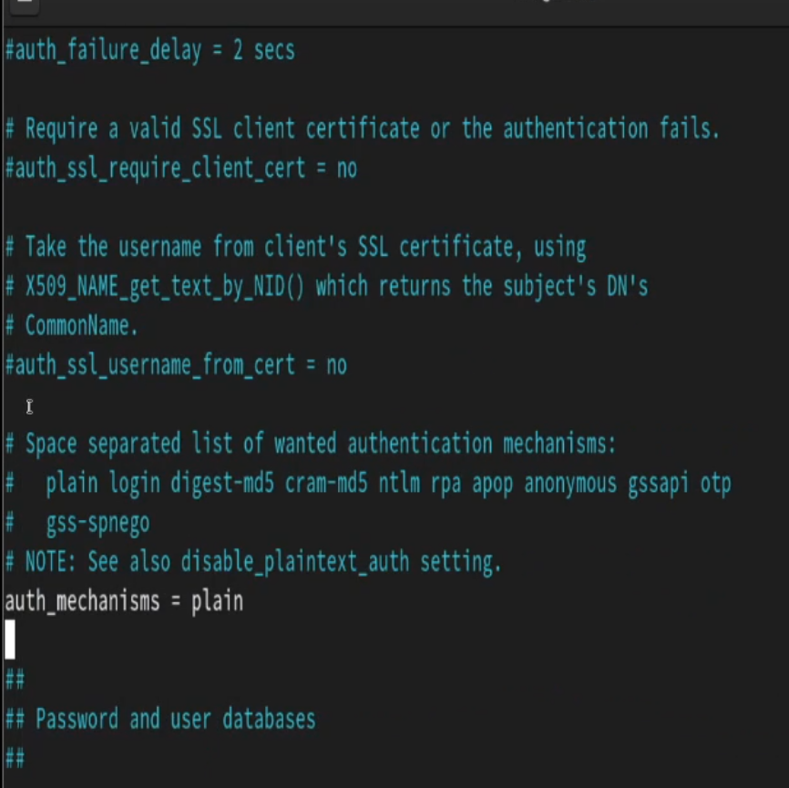{#fig:2 width=50%}

## Месторасположение почтовых ящиков

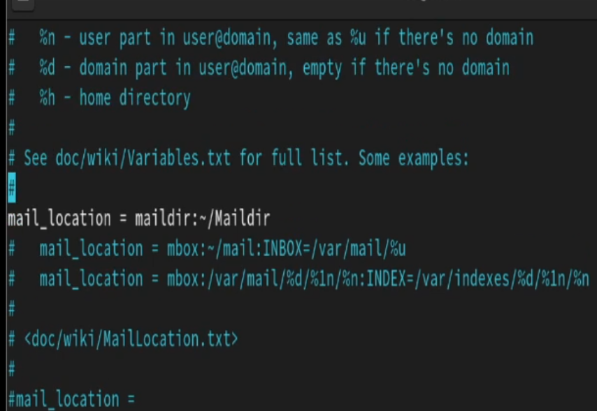{#fig:3 width=70%}

## Postfix, firewall, dovecot

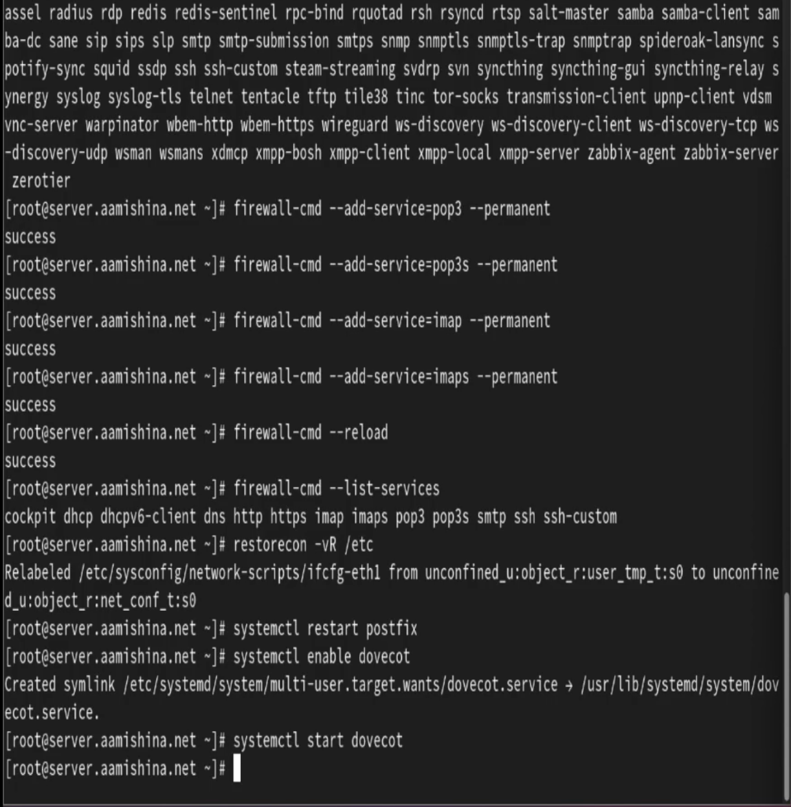{#fig:4 width=40%}

# Проверка работы Dovecot

## Почта

- tail -f /var/log/maillog

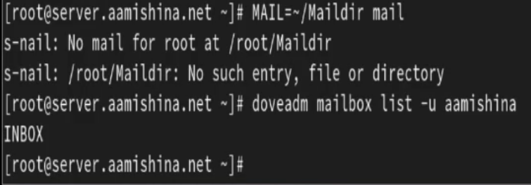{#fig:5 width=70%}

## ВМ client

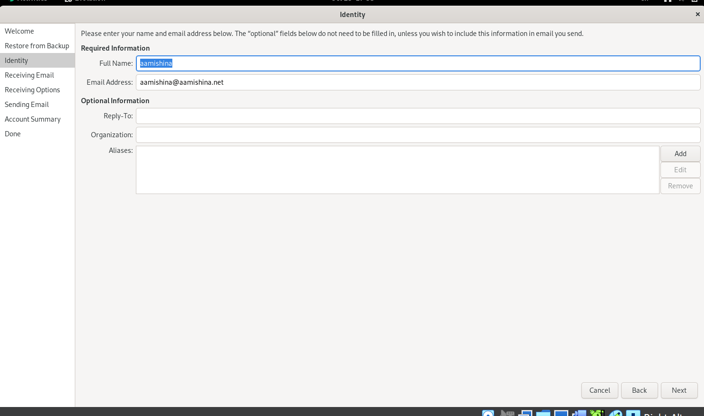{#fig:6 width=70%}

## Evolution

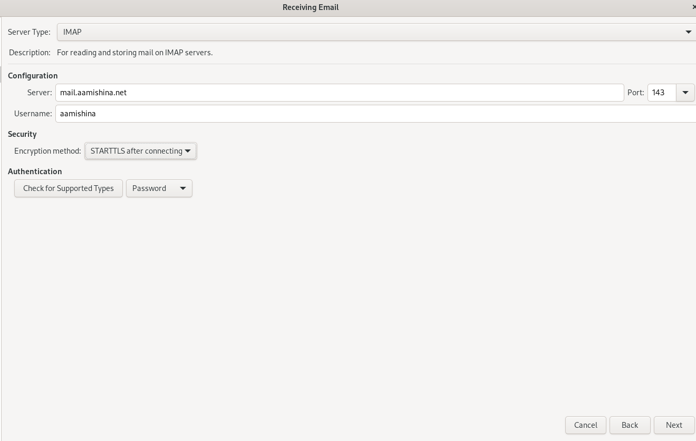{#fig:7 width=70%}

## Evolution

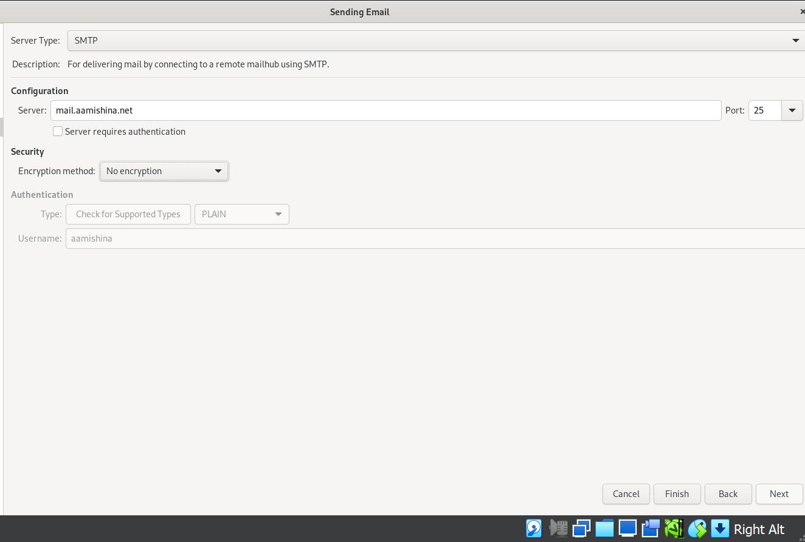{#fig:8 width=70%}

## Письма

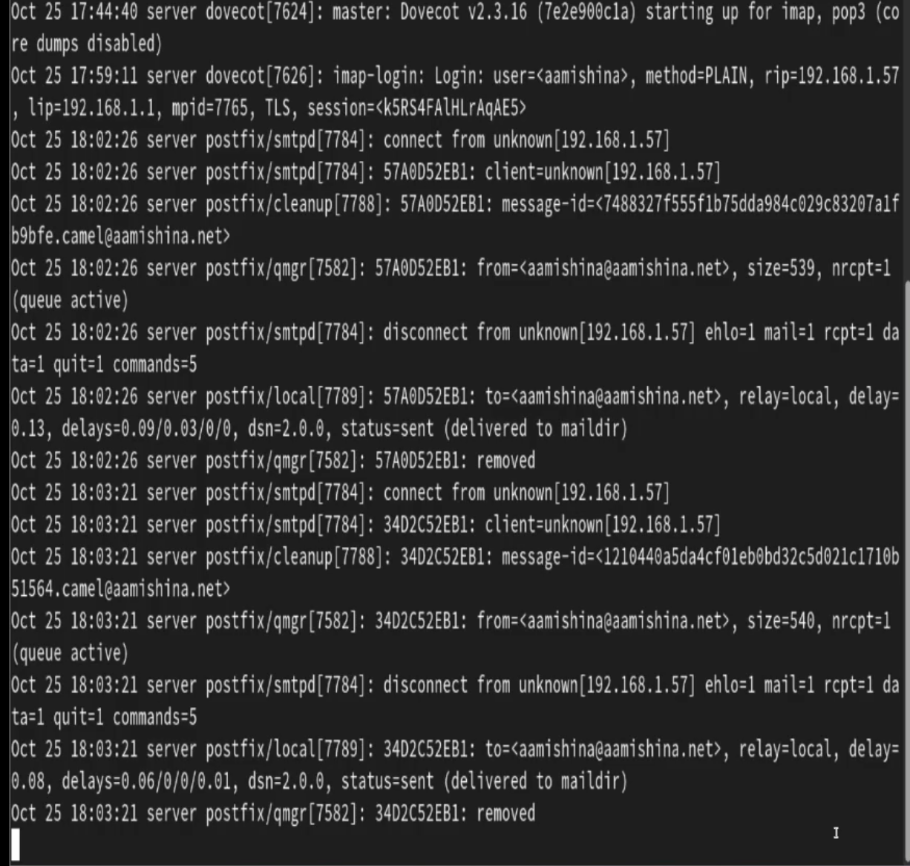{#fig:9 width=50%}

## Письма

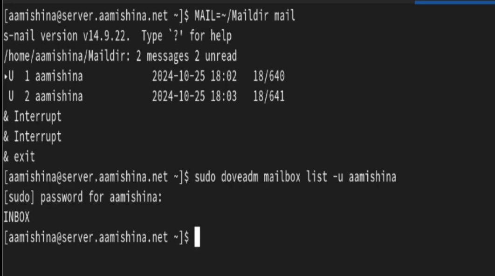{#fig:10 width=70%}

## telnet

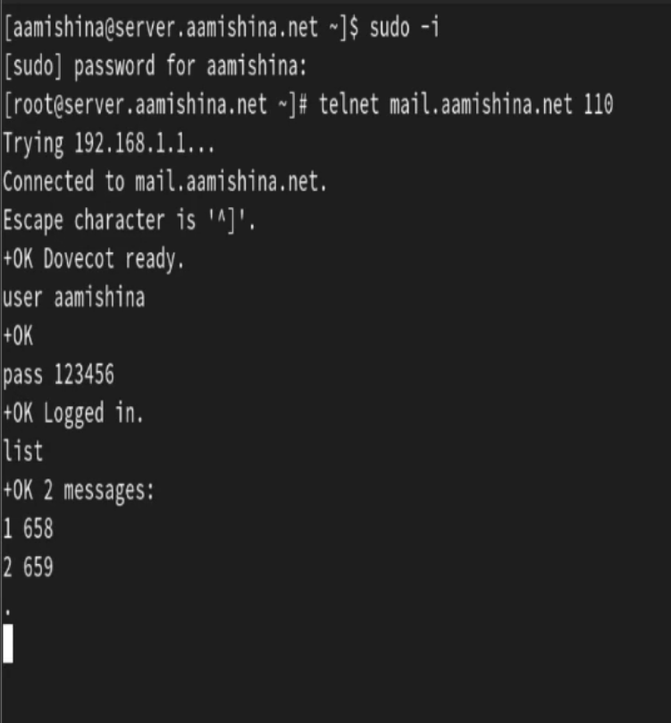{#fig:11 width=30%}

## telnet

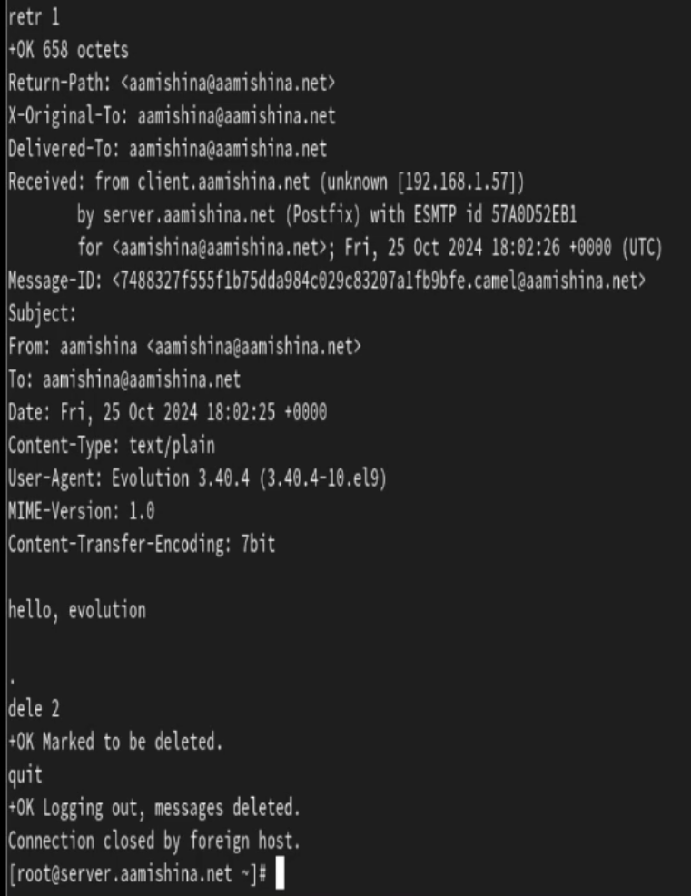{#fig:12 width=30%}

# Внесение изменений в настройки внутреннего окружения виртуальной машины

## ВМ server

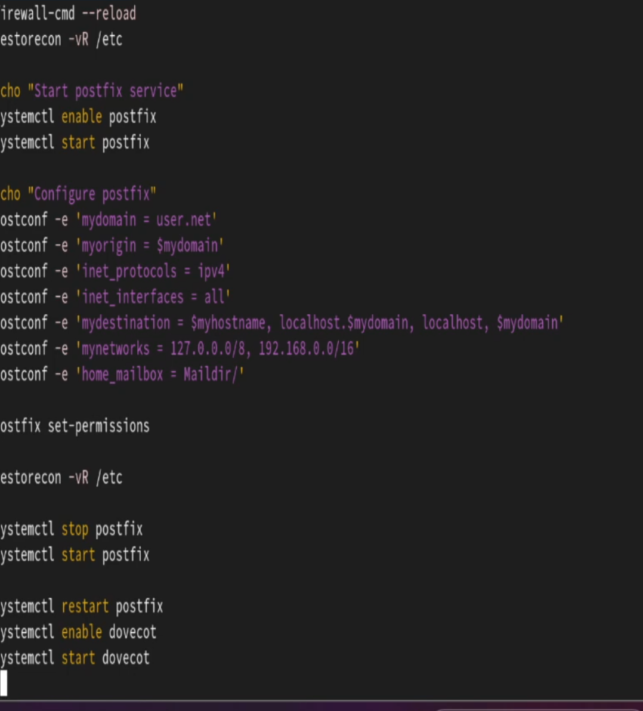{#fig:13 width=30%}

## ВМ client

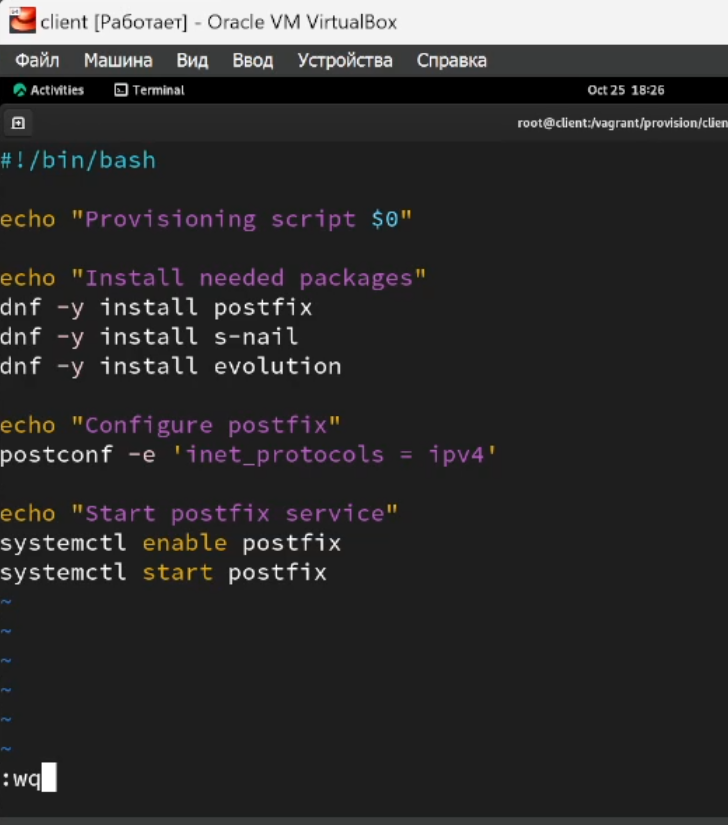{#fig:14 width=30%}

## Выводы

- В результате выполнения работы были приобретены практические навыки по установке и простейшему конфигурированию POP3/IMAP-сервера.