---
## Front matter
title: "Отчёт по лабораторной работе №10"
subtitle: "Дисциплина: Администрирование сетевых подсистем"
author: "Мишина Анастасия Алексеевна"

## Generic options
lang: ru-RU
toc-title: "Содержание"

## Bibliography
bibliography: bib/cite.bib
csl: pandoc/csl/gost-r-7-0-5-2008-numeric.csl

## Pdf output format
toc: true # Table of contents
toc-depth: 2
lof: true # List of figures
lot: true # List of tables
fontsize: 14pt
linestretch: 1.5
papersize: a4
documentclass: scrreprt
## I18n polyglossia
polyglossia-lang:
  name: russian
  options:
	- spelling=modern
	- babelshorthands=true
polyglossia-otherlangs:
  name: english
## I18n babel
babel-lang: russian
babel-otherlangs: english
## Fonts
mainfont: PT Serif
romanfont: PT Serif
sansfont: PT Sans
monofont: PT Mono
mainfontoptions: Ligatures=TeX
romanfontoptions: Ligatures=TeX
sansfontoptions: Ligatures=TeX,Scale=MatchLowercase
monofontoptions: Scale=MatchLowercase,Scale=0.9
## Biblatex
biblatex: true
biblio-style: "gost-numeric"
biblatexoptions:
  - parentracker=true
  - backend=biber
  - hyperref=auto
  - language=auto
  - autolang=other*
  - citestyle=gost-numeric
## Pandoc-crossref LaTeX customization
figureTitle: "Рис."
tableTitle: "Таблица"
listingTitle: "Листинг"
lofTitle: "Список иллюстраций"
lotTitle: "Список таблиц"
lolTitle: "Листинги"
## Misc options
indent: true
header-includes:
  - \usepackage{indentfirst}
  - \usepackage{float} # keep figures where there are in the text
  - \floatplacement{figure}{H} # keep figures where there are in the text
---

# Цель работы

Приобретение практических навыков по конфигурированию SMTP-сервера в части настройки аутентификации.

# Выполнение лабораторной работы

## Настройка LMTP в Dovecote

Включим виртуальную машину сервер и откроем терминал и перейдем в режим суперпользователя.

В дополнительном терминале запустим мониторинг работы почтовой службы с помощью команды `tail -f /var/log/maillog`. Затем добавим в список протоколов, с которыми модет работать  Dovecot, протокол LMTP. Для этого в файле /etc/dovecot/dovecot.conf укажем(рис. @fig:001):

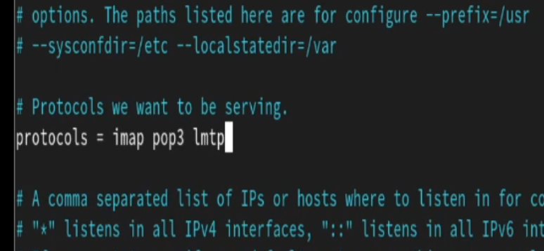{#fig:001 width=70%}

Настроим в Dovecot сервис lmtp для связи с Postfix. Для этого в файле /etc/dovecot/conf.d/10-master.conf заменим определение сервиса lmtp на следующую запись(рис. @fig:002):

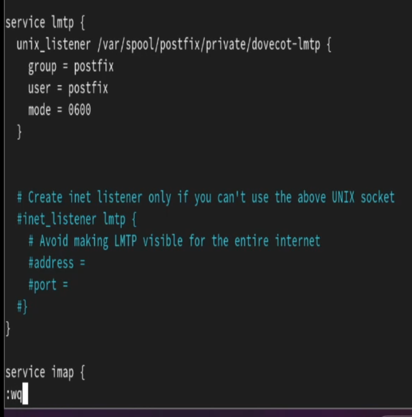{#fig:002 width=70%}

Переопределим в Postfix с помощью postconf передачу сообщений не на прямую, а через заданный unix-сокет с помощью команды: postconf -e 'mailbox_transport = lmtp:unix:private/dovecot-lmtp'.

В файле /etc/dovecot/conf.d/10-auth.conf зададим формат имени пользователя для аутентификации в форме логина пользователя без указания домена:(@fig:003):

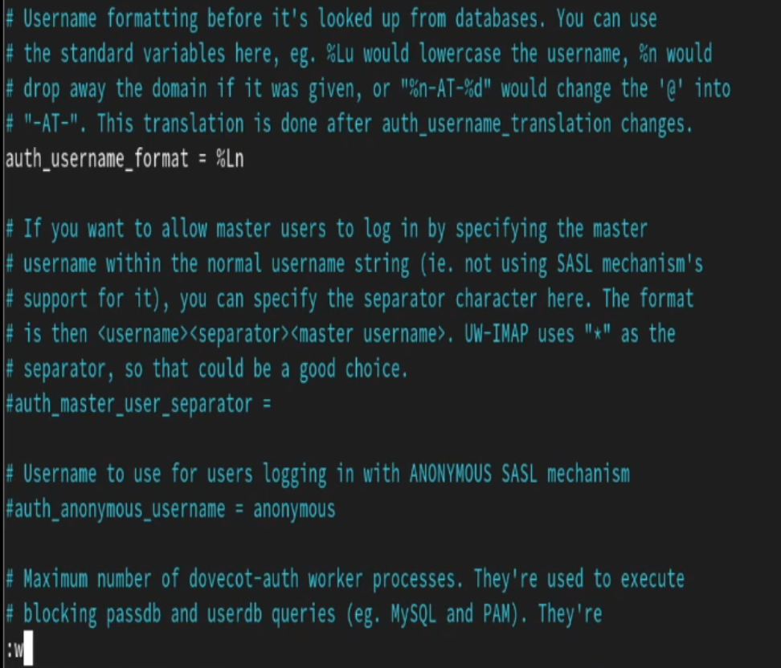{#fig:003 width=70%}

Затем перезапустим Postfix и Dovecot и из-под учетной записи своего пользователя отправим письмо с клиента.

Посмотрим информацию, которая вывелась при мониторинге почтовой службы(рис. @fig:004):

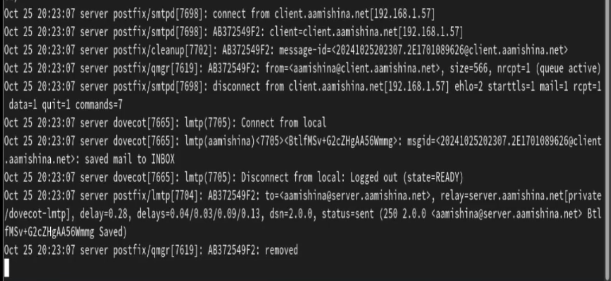{#fig:004 width=70%}

На сервере посмотрим почтовый ящик пользователя(@fig:005):

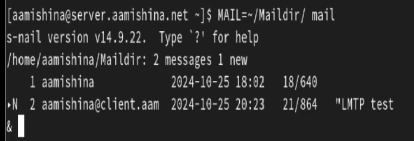{#fig:005 width=70%}

## Настройка SMTP-аутентификации

В файле /etc/dovecot/conf.d/10-master.conf определим службу аутентификации пользователей(рис. @fig:006):

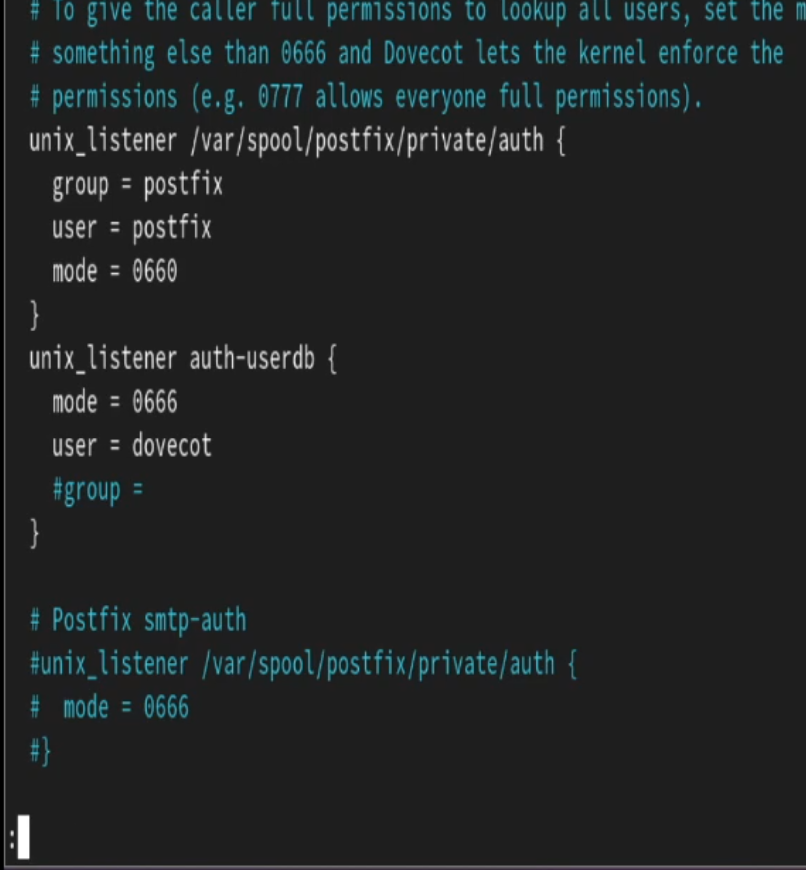{#fig:006 width=70%}

В Postfix зададим каталог для доставки почты, затем сконфигурируем межсетевой экран, разрешив работать службам  протоколов POP3 и IMAP, восстановим контекст безопасности SELinux, а затем перезапустим Postfix и запустим Dovecot

Мы указываем, что для аутентификации сервиса определена группа и пользователь postfix, задав права 0660 -- владелец и группа могут читать и редактировать,остальные не имеют права выполнять никаких действий, и определен пользователь dovecot с правом 0600 -- только владелец файла может читать/записывать.

Для Postfix зададим тип аутентификации SASL для smtpd и путь к соответствующему
unix-сокету, затем настроим Postfix для приёма почты из Интернета только для обслуживаемых нашим сервером пользователей или для произвольных пользователей локальной машины(имеется в виду локальных пользователей сервера), обеспечивая тем самым запрет на использование почтового сервера в качестве SMTP relay для спам-рассылок, а также в настройках Postfix ограничим приём почты только локальным адресом SMTP-сервера сети(@fig:007):

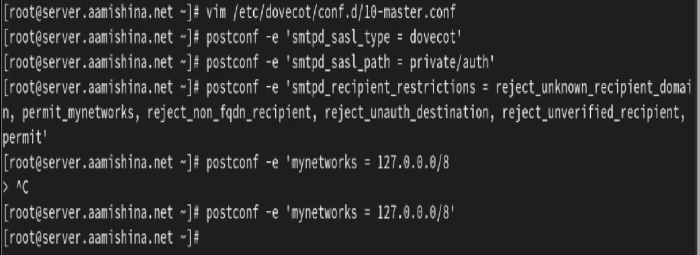{#fig:007 width=70%}

- reject_unknown_recipient_domain -- отклонить запрос, если домен отправителя не имеет в DNS записей: MX и A
- permit_mynetworks -- разрешает все адреса, перечисленные в настройках mynetworks
- reject_non_fqdn_recipient -- отказать в соединении, если адрес получателя неверный
- reject_unauth_destination --  запрещает подключение к службе без авторизации
- reject_unverified_recipient -- отклонить запрос, если известно, что почта на адрес RCPT TO была отклонена или когда адрес получателя недоступен
- permit -- Разрешить подключение. Присутствует в конце каждого блока (если письмо не попало не под одно правило запрета - доставляем)

Для проверки работы аутентификации временно запустим SMTP-сервер (порт 25) с возможностью аутентификации. Для этого изменим в файле /etc/postfix/master.cf(@fig:008):

{#fig:008 width=70%}

Перезапустим Postfix и Dovecot

Теперь на клиенте установим telnet с помощью команд: sudo -i и dnf -y install telnet.

На клиенте получим строку для аутентификации и подключимся на клиенте к SMTP-серверу посредством telnet. Протестируем соединение и проверим авторизацию(@fig:009):

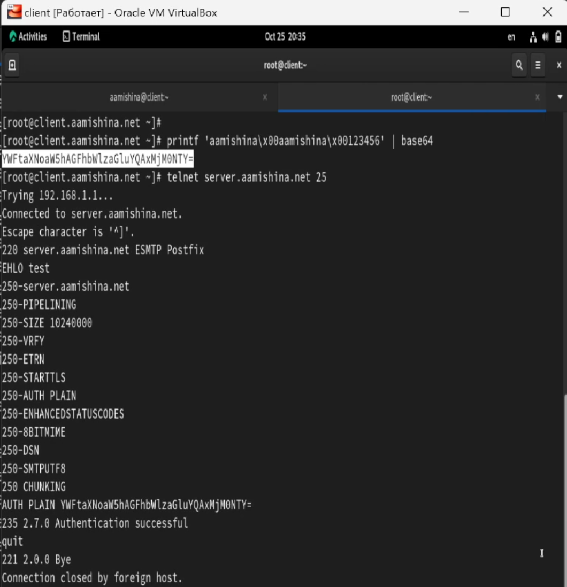{#fig:009 width=70%}

## Настройка SMTP over TLS

Настроим на сервере TLS, воспользовавшись временным сертификатом Dovecot. Предварительно скопируем необходимые файлы сертификата и ключа из каталога /etc/pki/dovecot в каталог /etc/pki/tls/ в соответствующие подкаталоги, затем сконфигурируем Postfix, указав пути к сертификату и ключу, а также к каталогу для хранения TLS-сессий и уровень безопасности(рис. @fig:010):

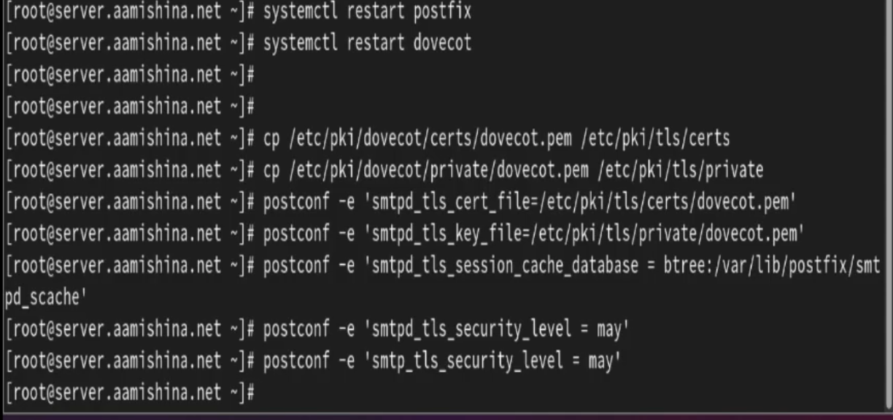{#fig:010 width=70%}

Для того чтобы запустить SMTP-сервер на 587-м порту, заменим содержимое файла /etc/postfix/master.cf(рис. @fig:011):

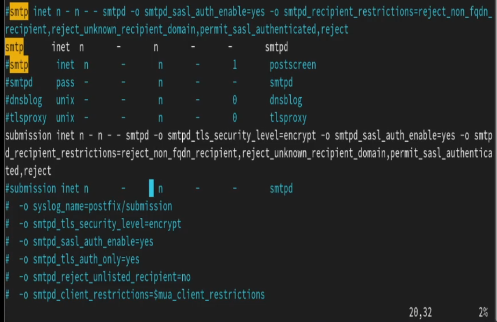{#fig:011 width=70%}

Настроим межсетевой экран, разрешив работать службе smtp-submission и перезапустим Postfix(@fig:012)

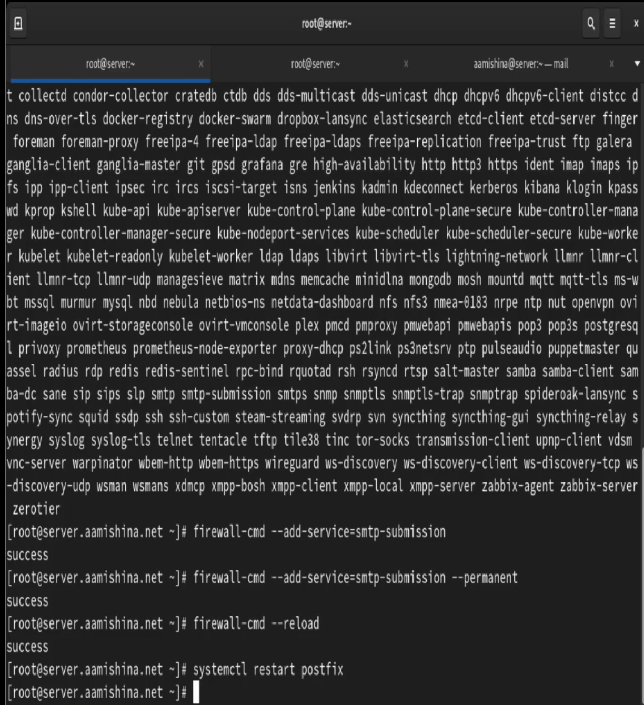{#fig:012 width=70%}

На клиенте подключитесь к SMTP-серверу через 587-й порт посредством openssl(рис. @fig:013):

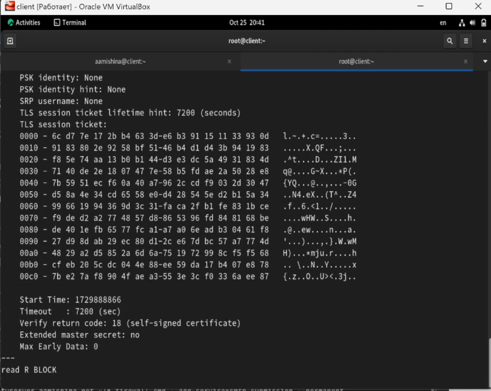{#fig:013 width=70%}

И протестируем подключение и аутентификацию по telnet(рис. @fig:014):

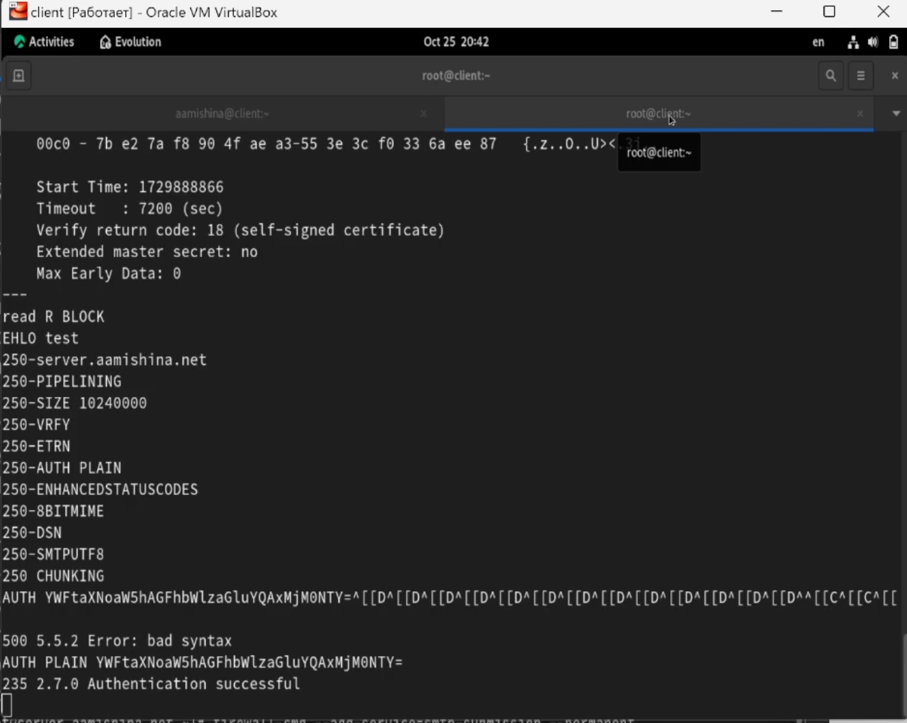{#fig:014 width=70%}

Проверим корректность отправки почтовых сообщений с клиента посредством почтового клиента Evolution, предварительно скорректировав настройки учётной записи, а именно для SMTP-сервера укажем порт 587, STARTTLS и обычный пароль(@fig:015,  @fig:016):

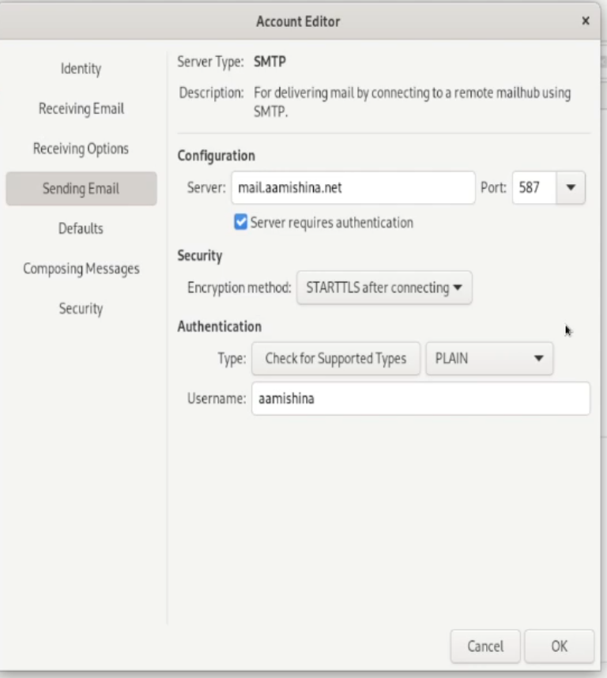{#fig:015 width=70%}

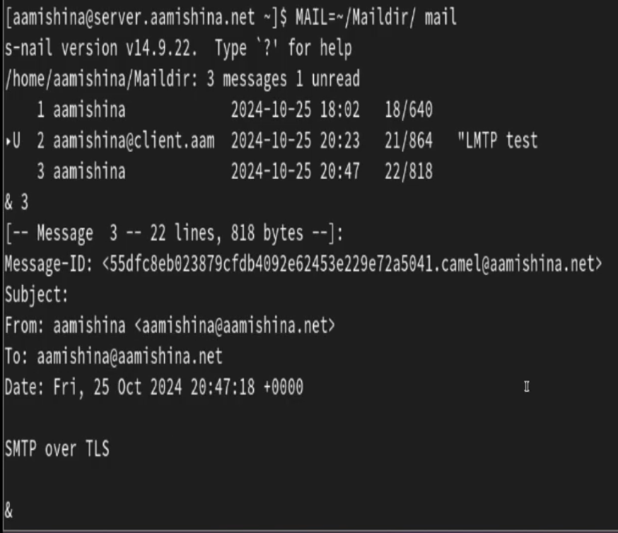{#fig:016 width=70%}

## Внесение изменений в настройки внутреннего окружения виртуальной машины

На виртуальной машине server перейдем в каталог для внесения изменений в настройки внутреннего окружения /vagrant/provision/server/. В соответствующие подкаталоги поместим конфигурационные файлы Dovecot и Postfix(рис. @fig:017)

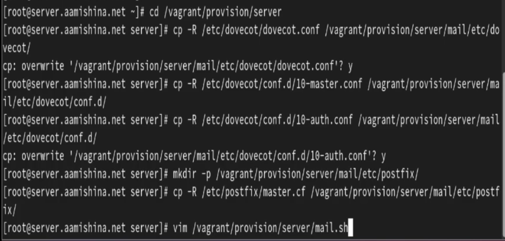{#fig:017 width=70%}

Внесем соответствующие изменения по расширенной конфигурации SMTP-сервера в файл /vagrant/provision/server/mail.sht(@fig:018):

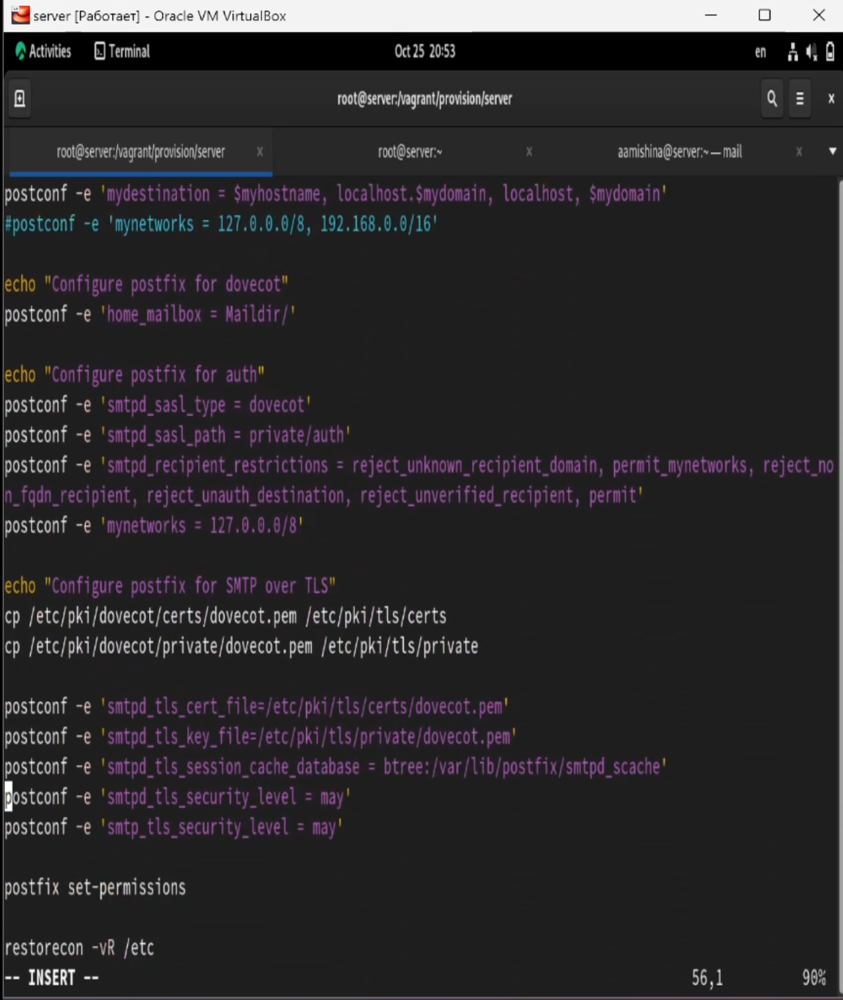{#fig:018 width=70%}

На виртуальной машине client внесем изменения в файл /vagrant/provision/client/mail.sh, добавив установку telnet.(@fig:019):

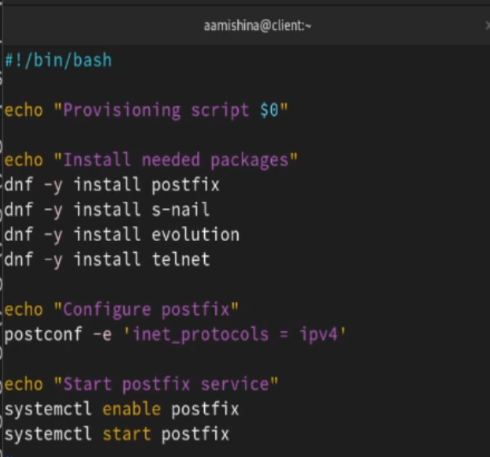{#fig:019 width=70%}

# Контрольные вопросы

1. Приведите пример задания формата аутентификации пользователя в
Dovecot в форме логина с указанием домена.

- ` auth_username_format = %Lu@%d`

2. Какие функции выполняет почтовый Relay-сервер?

- Почтовый Relay-сервер выполняет функции пересылки почты от одного
почтового сервера к другому, облегчая маршрутизацию электронных сообщений между различными почтовыми системами.

3. Какие угрозы безопасности могут возникнуть в случае настройки почтового
сервера как Relay-сервера?

Угрозы безопасности, связанные с настройкой почтового сервера как Relay-сервера, могут включать рассылку нежелательной почты (спам), перехват и
изменение электронных сообщений, а также использование сервера для
ретрансляции вредоносных сообщений.

# Выводы

В результате выполнения данной работы были приобретены практические навыки по конфигурированию SMTP-сервера в части настройки аутентификации.