---
## Front matter
lang: ru-RU
title: Лабораторная работа №11
subtitle: Администрирование сетевых подсистем
author:
  - Мишина А. А.
date: 16 ноября 2024

## i18n babel
babel-lang: russian
babel-otherlangs: english

## Formatting pdf
toc: false
toc-title: Содержание
slide_level: 2
aspectratio: 169
section-titles: true
theme: metropolis
header-includes:
 - \metroset{progressbar=frametitle,sectionpage=progressbar,numbering=fraction}
 - '\makeatletter'

 - '\makeatother'
---

## Цель работы

Приобретение практических навыков по настройке удалённого доступа к серверу с помощью SSH.

# Выполнение лабораторной работы

# Запрет удалённого доступа по SSH для пользователя root

## Запрет удалённого доступа по SSH для пользователя root

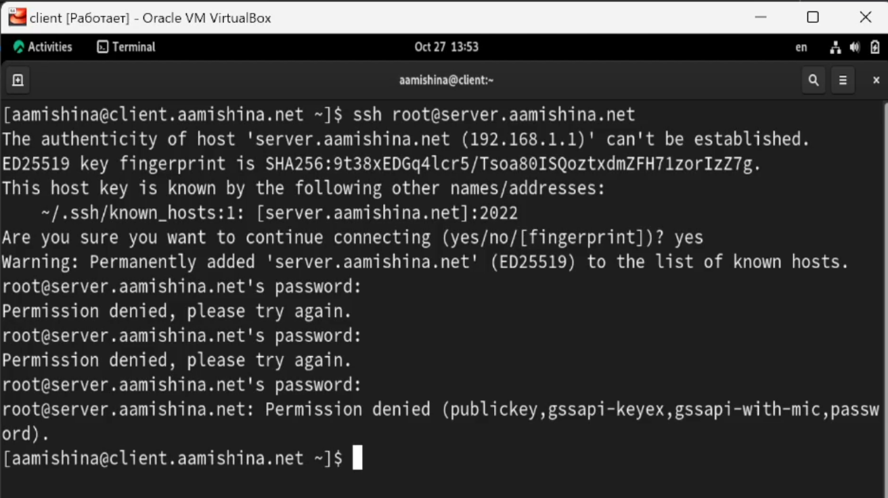{#fig:001 width=70%}

## Запрет удалённого доступа по SSH для пользователя root

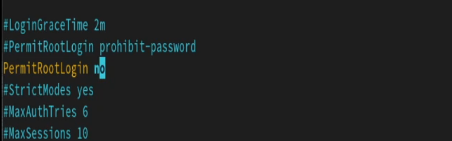{#fig:002 width=70%}

# Ограничение списка пользователей для удалённого доступа по SSH

## Ограничение списка пользователей для удалённого доступа по SSH

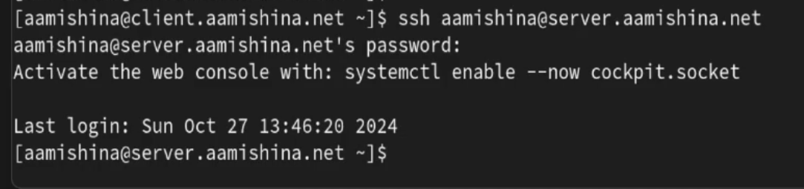{#fig:003 width=70%}

## Ограничение списка пользователей для удалённого доступа по SSH

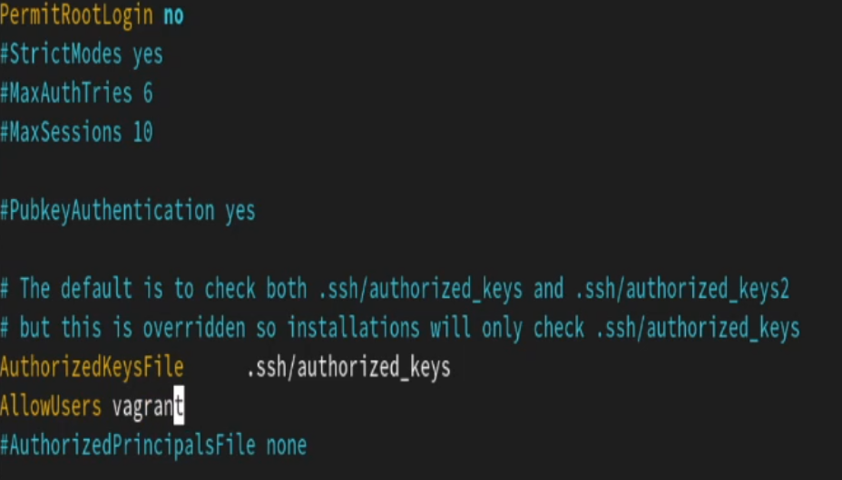{#fig:004 width=70%}

## Ограничение списка пользователей для удалённого доступа по SSH

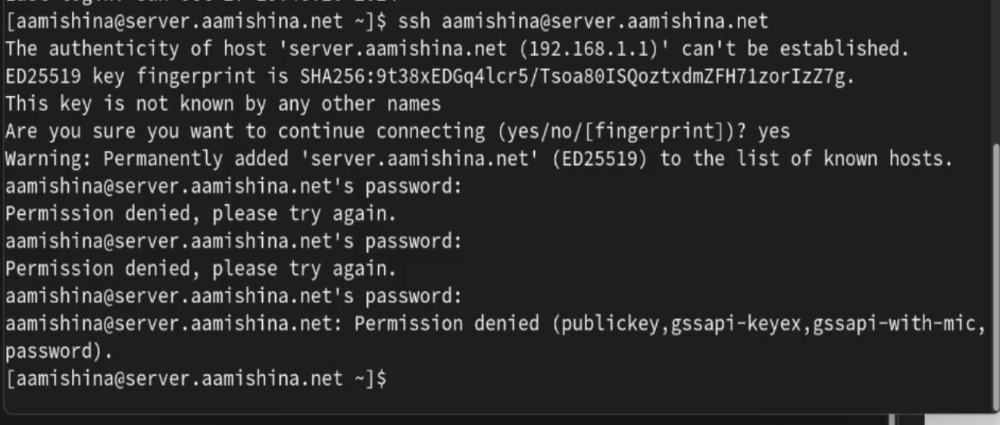{#fig:005 width=70%}

## Ограничение списка пользователей для удалённого доступа по SSH

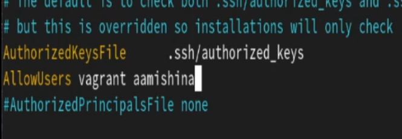{#fig:006 width=70%}

## Ограничение списка пользователей для удалённого доступа по SSH

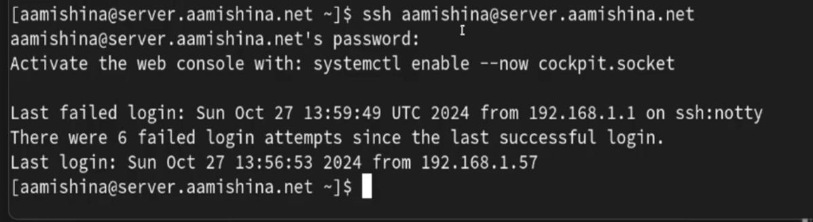{#fig:007 width=70%}

# Настройка дополнительных портов для удалённого доступа по SSH

## Настройка дополнительных портов для удалённого доступа по SSH

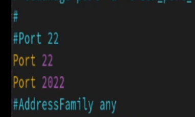{#fig:008 width=70%}

## Настройка дополнительных портов для удалённого доступа по SSH

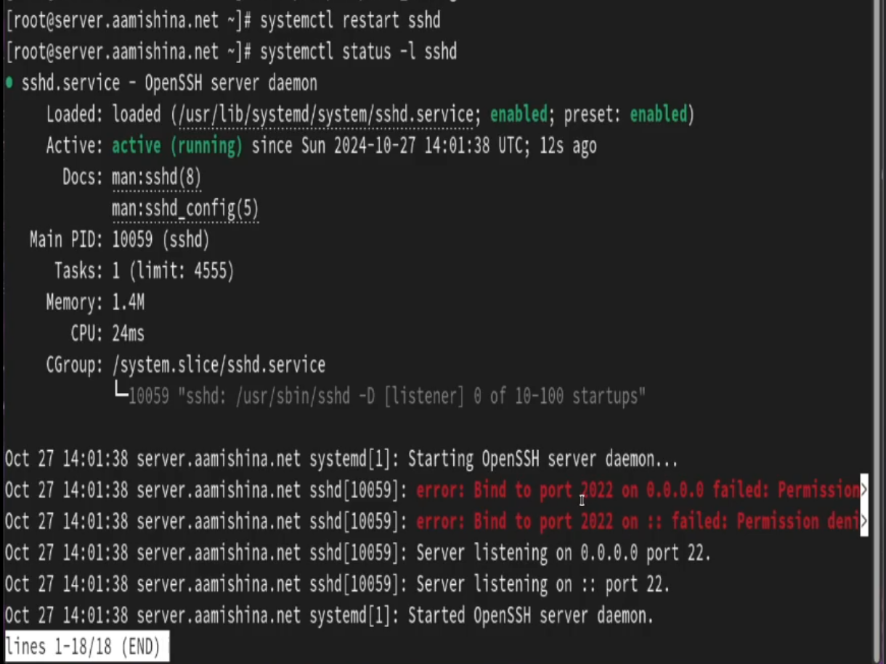{#fig:009 width=50%}

## Настройка дополнительных портов для удалённого доступа по SSH

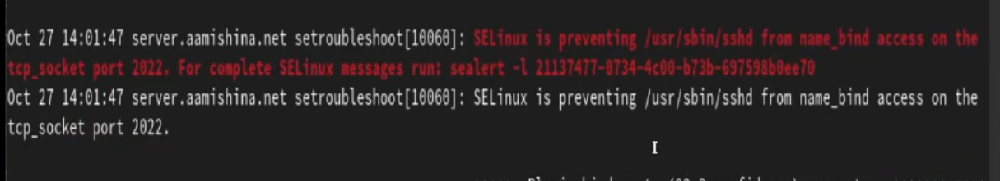{#fig:010 width=70%}

## Настройка дополнительных портов для удалённого доступа по SSH

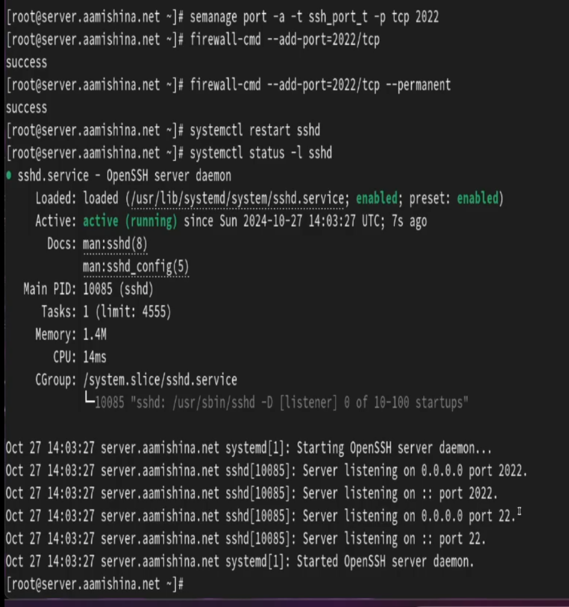{#fig:011 width=35%}

## Настройка дополнительных портов для удалённого доступа по SSH

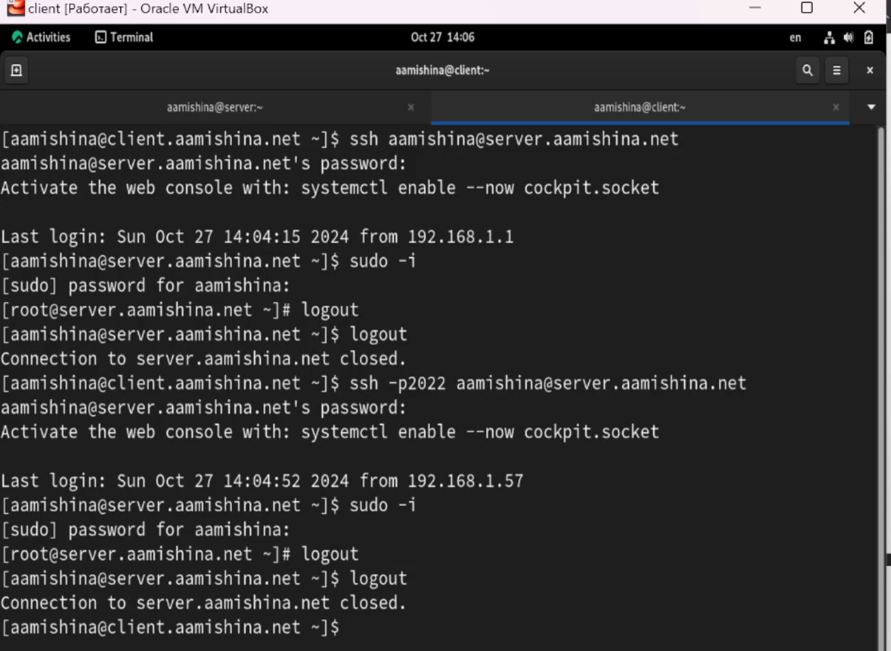{#fig:012 width=60%}

# Настройка удалённого доступа по SSH по ключу

## Настройка удалённого доступа по SSH по ключу

На сервере в конфигурационном файле /etc/ssh/sshd_config зададим параметр,
разрешающий аутентификацию по ключу, написав:

```
PubkeyAuthentication yes
```

## Настройка удалённого доступа по SSH по ключу

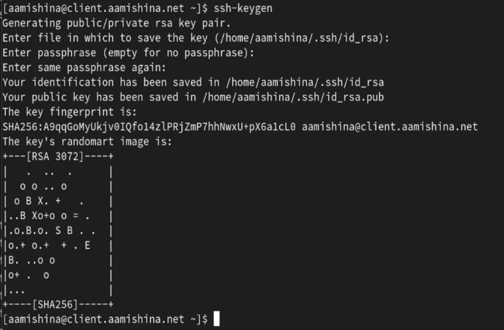{#fig:013 width=70%}

## Настройка удалённого доступа по SSH по ключу

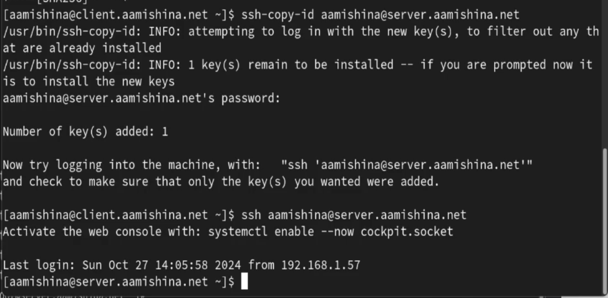{#fig:014 width=70%}

# Организация туннелей SSH, перенаправление TCP-портов

## Организация туннелей SSH, перенаправление TCP-портов

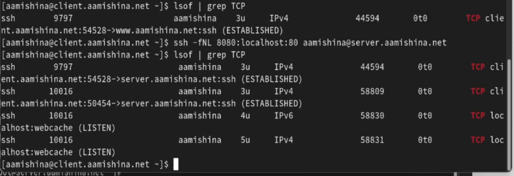{#fig:015 width=70%}

## Организация туннелей SSH, перенаправление TCP-портов

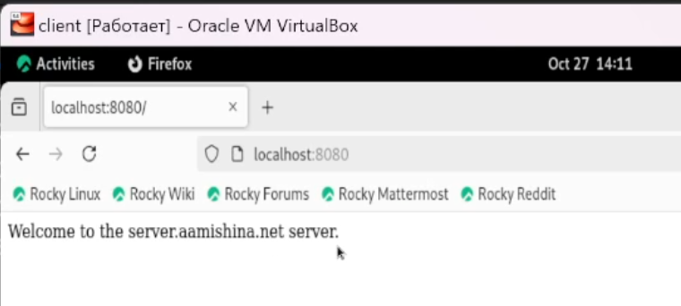{#fig:016 width=70%}

# Запуск консольных приложений через SSH

## Запуск консольных приложений через SSH

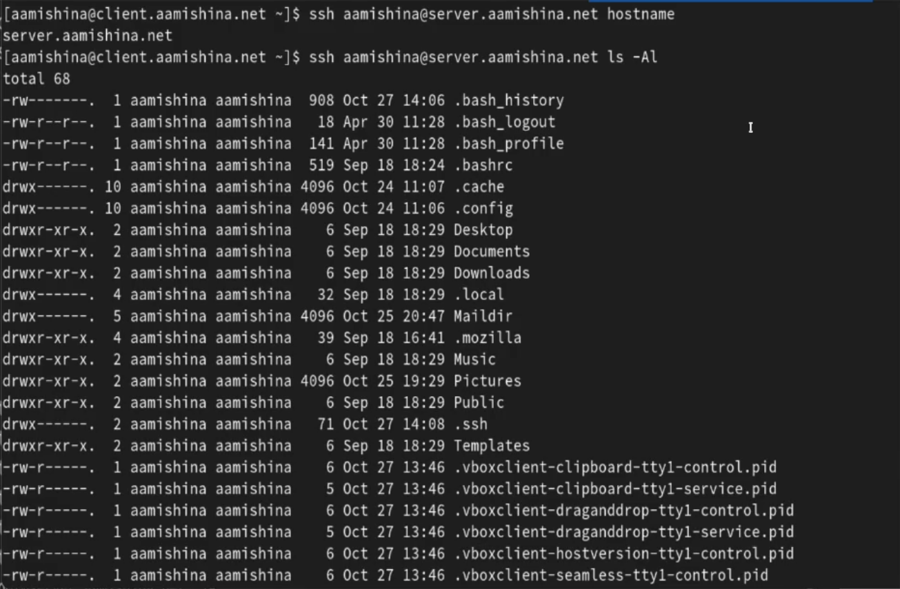{#fig:017 width=70%}

## Запуск консольных приложений через SSH

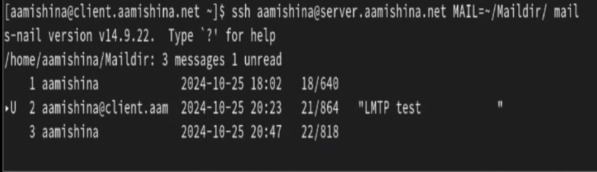{#fig:018 width=70%}

# Запуск графических приложений через SSH (X11Forwarding)

## Запуск графических приложений через SSH (X11Forwarding)

На сервере в конфигурационном файле /etc/ssh/sshd_config разрешим отображать на локальном клиентском компьютере графические интерфейсы X11, прописав:
```
X11Forwarding yes
```

## Запуск графических приложений через SSH (X11Forwarding)

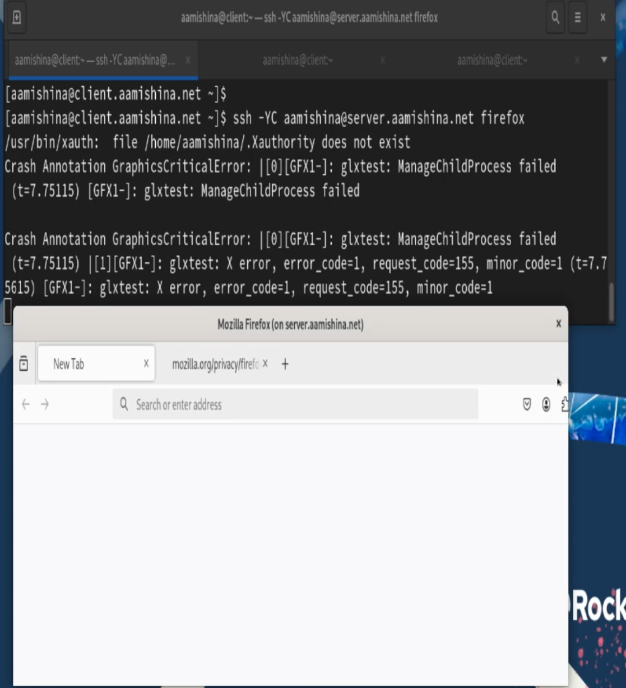{#fig:019 width=40%}

# Внесение изменений в настройки внутреннего окружения виртуальной машины

## Внесение изменений в настройки внутреннего окружения виртуальной машины

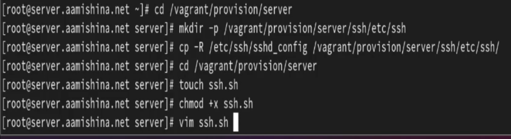{#fig:020 width=70%}

## Внесение изменений в настройки внутреннего окружения виртуальной машины

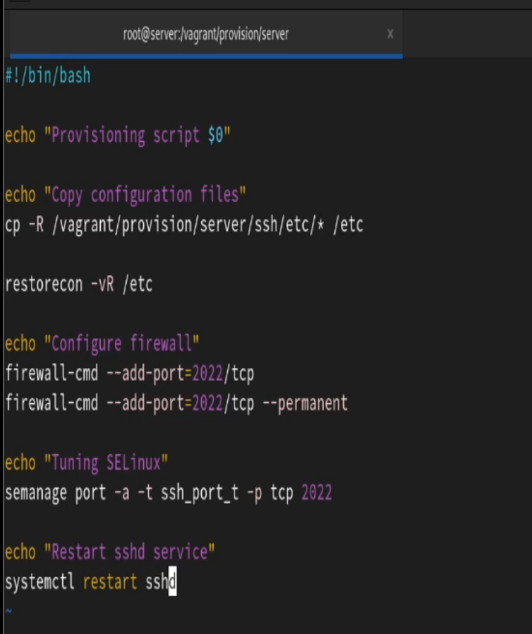{#fig:021 width=30%}

## Внесение изменений в настройки внутреннего окружения виртуальной машины

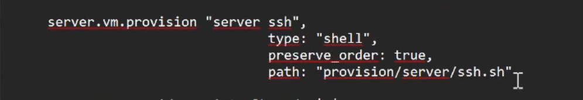{#fig:022 width=70%}

## Вывод

В результате выполнения данной работы были приобретены практические навыки по настройке удалённого доступа к серверу с помощью SSH.