---
## Front matter
title: "Отчёт по лабораторной работе №11"
subtitle: "Дисциплина: Администрирование сетевых подсистем"
author: "Мишина Анастасия Алексеевна"

## Generic options
lang: ru-RU
toc-title: "Содержание"

## Bibliography
bibliography: bib/cite.bib
csl: pandoc/csl/gost-r-7-0-5-2008-numeric.csl

## Pdf output format
toc: true # Table of contents
toc-depth: 2
lof: true # List of figures
lot: true # List of tables
fontsize: 14pt
linestretch: 1.5
papersize: a4
documentclass: scrreprt
## I18n polyglossia
polyglossia-lang:
  name: russian
  options:
	- spelling=modern
	- babelshorthands=true
polyglossia-otherlangs:
  name: english
## I18n babel
babel-lang: russian
babel-otherlangs: english
## Fonts
mainfont: PT Serif
romanfont: PT Serif
sansfont: PT Sans
monofont: PT Mono
mainfontoptions: Ligatures=TeX
romanfontoptions: Ligatures=TeX
sansfontoptions: Ligatures=TeX,Scale=MatchLowercase
monofontoptions: Scale=MatchLowercase,Scale=0.9
## Biblatex
biblatex: true
biblio-style: "gost-numeric"
biblatexoptions:
  - parentracker=true
  - backend=biber
  - hyperref=auto
  - language=auto
  - autolang=other*
  - citestyle=gost-numeric
## Pandoc-crossref LaTeX customization
figureTitle: "Рис."
tableTitle: "Таблица"
listingTitle: "Листинг"
lofTitle: "Список иллюстраций"
lotTitle: "Список таблиц"
lolTitle: "Листинги"
## Misc options
indent: true
header-includes:
  - \usepackage{indentfirst}
  - \usepackage{float} # keep figures where there are in the text
  - \floatplacement{figure}{H} # keep figures where there are in the text
---

# Цель работы

Приобретение практических навыков по настройке удалённого доступа к серверу с помощью SSH.

# Выполнение лабораторной работы

## Запрет удалённого доступа по SSH для пользователя root

Затем запустим виртуальную машину server. Откроем терминал и перейдем в режим суперпользователя.

В дополнительном терминале запустим мониторинг  системных событий с помощью команды `journalctl -x -f`. С клиента попытаемся получить доступ к серверу посредством SSH-соединения через пользователя root(рис. @fig:001):

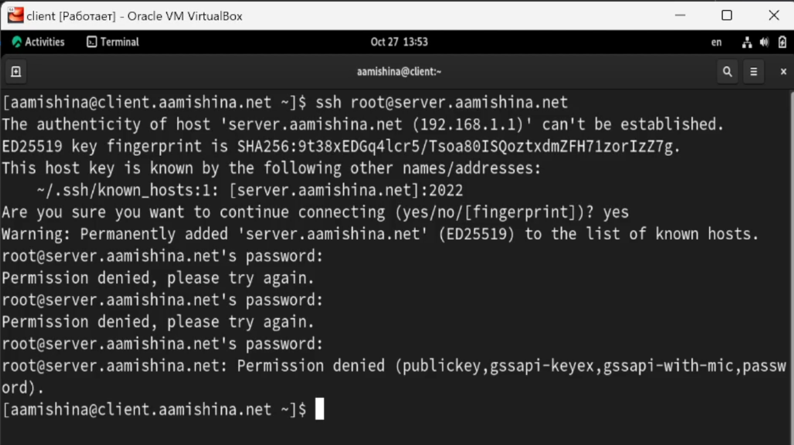{#fig:001 width=70%}

При попытке соединения, так как мы делаем это первый раз, добавлям сервер в список известных хостов. Затем требуется ввести пароль от пользователя root, но соединение отклоняется.

На сервере откроем файл /etc/ssh/sshd_config конфигурации sshd для редактирования и запретим вход на сервер пользователю root, установив(рис. @fig:002):

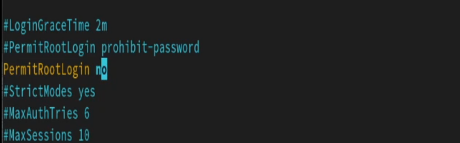{#fig:002 width=70%}

После сохранения изменений в файле конфигурации перезапустим sshd с помощью команды `systemctl restart sshd`. Повторяем попытку получения доступа через root, вновь получаем отказ в доступе.

## Ограничение списка пользователей для удалённого доступа по SSH

С клиента попытаемся получить доступ к серверу посредством SSH-соединения через пользователя aamishina (рис. @fig:003):

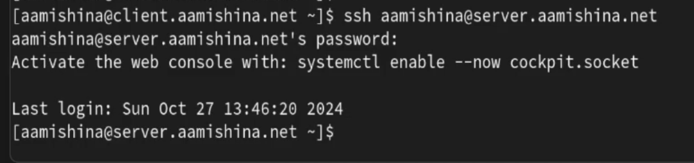{#fig:003 width=70%}

Соединениие проходит удачно.

На сервере откроем файл /etc/ssh/sshd_config конфигурации sshd на редактирование и добавим строку(@fig:004):

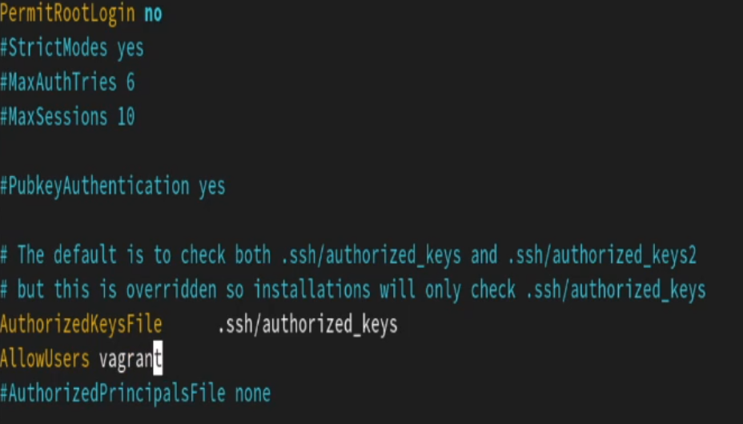{#fig:004 width=70%}

После сохранения изменений в файле конфигурации перезапустим sshd.

Повторим попытку получения доступа с клиента к серверу посредством SSH-соединения через пользователя aamishina(рис. @fig:005):

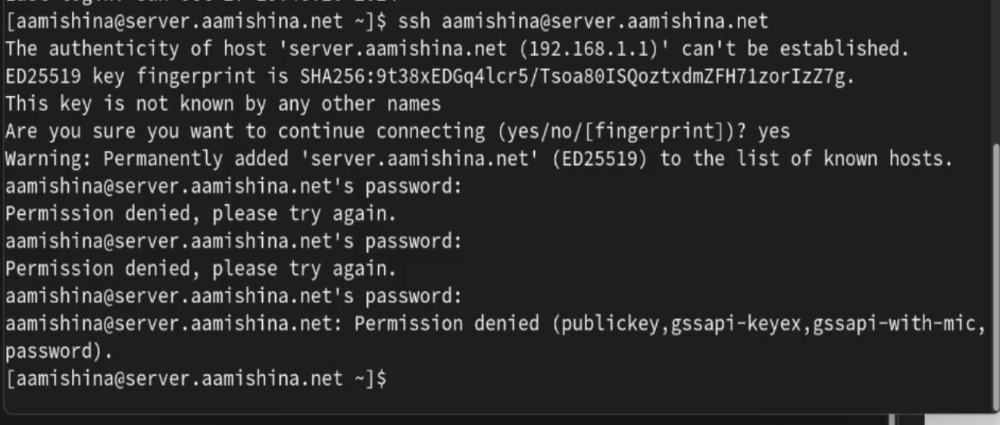{#fig:005 width=70%}

В этот раз соединение не устанавливается, так как в списке разрешенных пользователей нет нашего.

В файле /etc/ssh/sshd_config конфигурации sshd внесем следующее изменение(@fig:006):

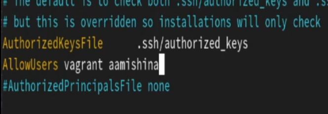{#fig:006 width=70%}

Снова попытаемся установить соединение с клиента к серверу(@fig:007):

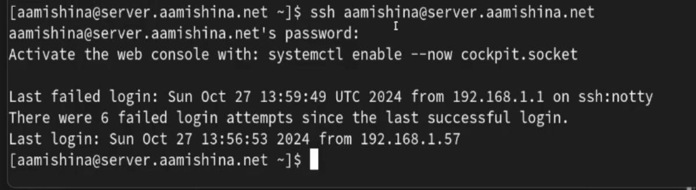{#fig:007 width=70%}

В этот раз доступ получен.

## Настройка дополнительных портов для удалённого доступа по SSH

На сервере в файле конфигурации sshd /etc/ssh/sshd_config найдем строку Port и ниже этой строки добавим(@fig:008):

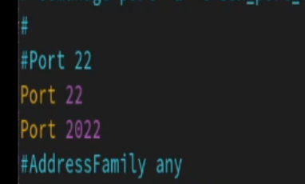{#fig:008 width=70%}

Эта запись сообщает процессу sshd о необходимости организации соединения через два разных порта, что даёт гарантию возможности открыть сеансы SSH, даже если была сделана ошибка в конфигурации.

После сохранения изменений в файле конфигурации перезапустим sshd.

Посмотрим расширенный статус работы sshd(@fig:009):

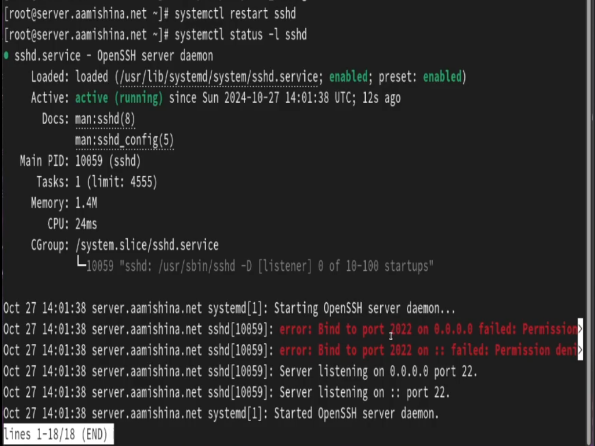{#fig:009 width=70%}

Система сообщает об отказе в работе sshd через порт 2022. Дополнительно посмотрим сообщения в терминале с мониторингом системных событий(рис. @fig:010):

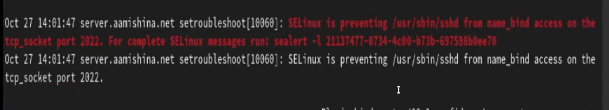{#fig:010 width=70%}

Можно увидеть, что отказ происходит из-за запрета SELinux на работу с этим портом.

Исправим на сервере метки SELinux к порту 2022 и в настройках межсетевого экрана откроем порт 2022 протокола. Вновь перезапустим sshd и посмотрите расширенный статус его работы. Статус показывает, что процесс sshd теперь прослушивает два порта(@fig:011)

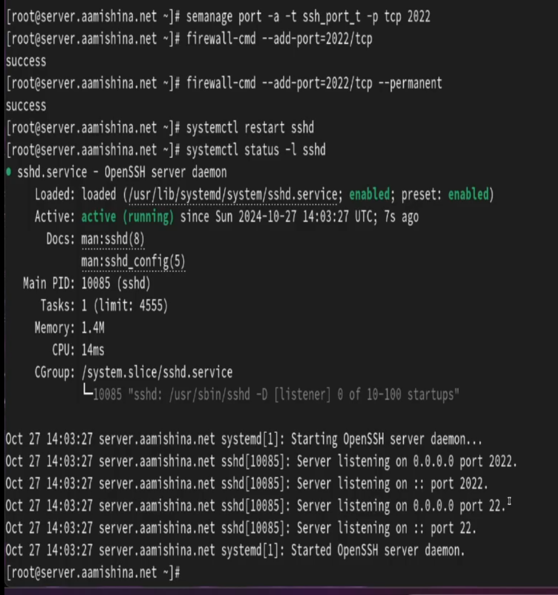{#fig:011 width=70%}

С клиента попытаемся получить доступ к серверу посредством SSH-соединения через пользователя aamishina обычным способом и указав порт 2022(рис. @fig:012):

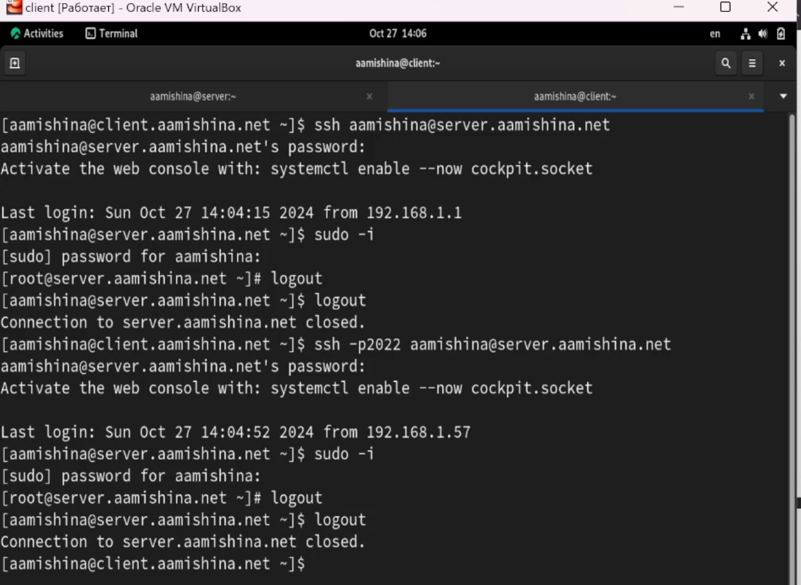{#fig:012 width=70%}

## Настройка удалённого доступа по SSH по ключу

Создадим пару из открытого и закрытого ключей для входа на сервер.

На сервере в конфигурационном файле /etc/ssh/sshd_config зададим параметр, разрешающий аутентификацию по ключу, написав:

```
PubkeyAuthentication yes
```

После сохранения изменений в файле конфигурации перезапустим sshd.

На клиенте сформируем SSH-ключ, введя в терминале(@fig:013):

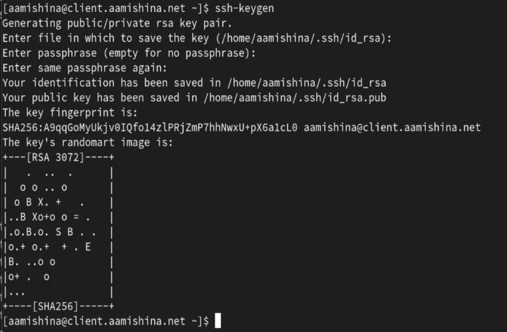{#fig:013 width=70%}

Закрытый ключ теперь будет записан в файл ~/.ssh/id_rsa, а открытый ключ записывается в файл ~/.ssh/id_rsa.pub.

Скопируем открытый ключ на сервер, введя на клиенте:
```
ssh-copy-id user@server.user.net
```

Попробуем получить доступ с клиента к серверу посредством SSH-соединения(@fig:014):

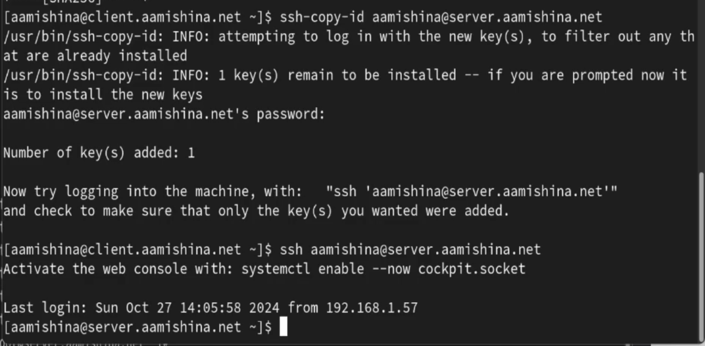{#fig:014 width=70%}

## Организация туннелей SSH, перенаправление TCP-портов

На клиенте посмотрим, запущены ли какие-то службы с протоколом TCP, на данный момент их нет. Перенаправим порт 80 на server.aamishina.net на порт 8080 на локальной машине и вновь на клиенте посмотрим, запущены ли какие-то службы с протоколом TCP(рис. @fig:015)

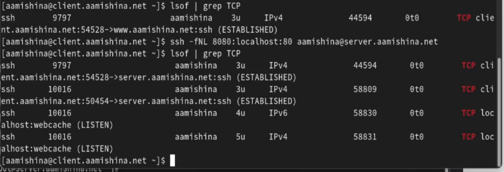{#fig:015 width=70%}

Появилось три новые службы, использующие TCP протокол -- появился доступ к server.aamishina.net по ssh, а также к локальному хосту по IPv4 и IPv6.

На клиенте запустим браузер и в адресной строке введем localhost:8080. Отображается страница с приветствием «Welcome to the server.aamishina.net server»(@fig:016):

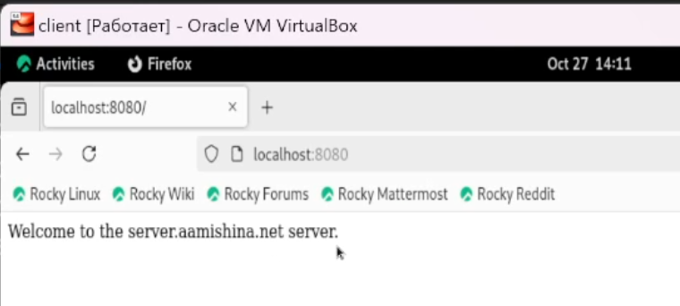{#fig:016 width=70%}

## Запуск консольных приложений через SSH

На клиенте откроем терминал под пользователем aamishina и посмотрим с клиента имя узла сервера, файлов на сервере (рис. @fig:017) и почту(рис. @fig:018):

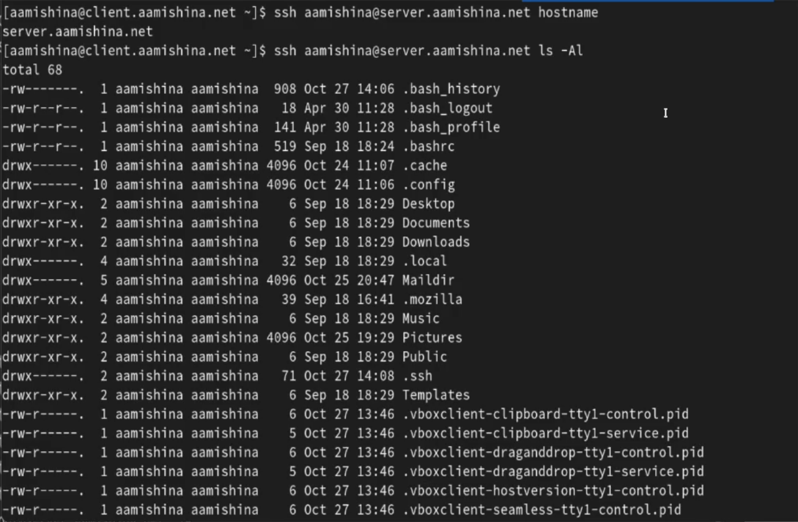{#fig:017 width=70%}

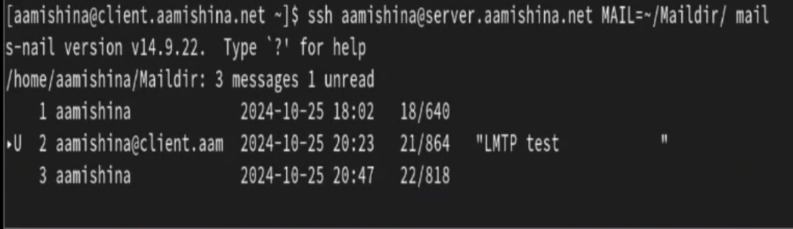{#fig:018 width=70%}

## Запуск графических приложений через SSH (X11Forwarding)

На сервере в конфигурационном файле /etc/ssh/sshd_config разрешим отображать на локальном клиентском компьютере графические интерфейсы X11, прописав:

```
X11Forwarding yes
```

После сохранения изменения в конфигурационном файле перезапустим sshd.

Попробуем с клиента удалённо подключиться к серверу и запустить графическое приложение firefox(рис. @fig:019):

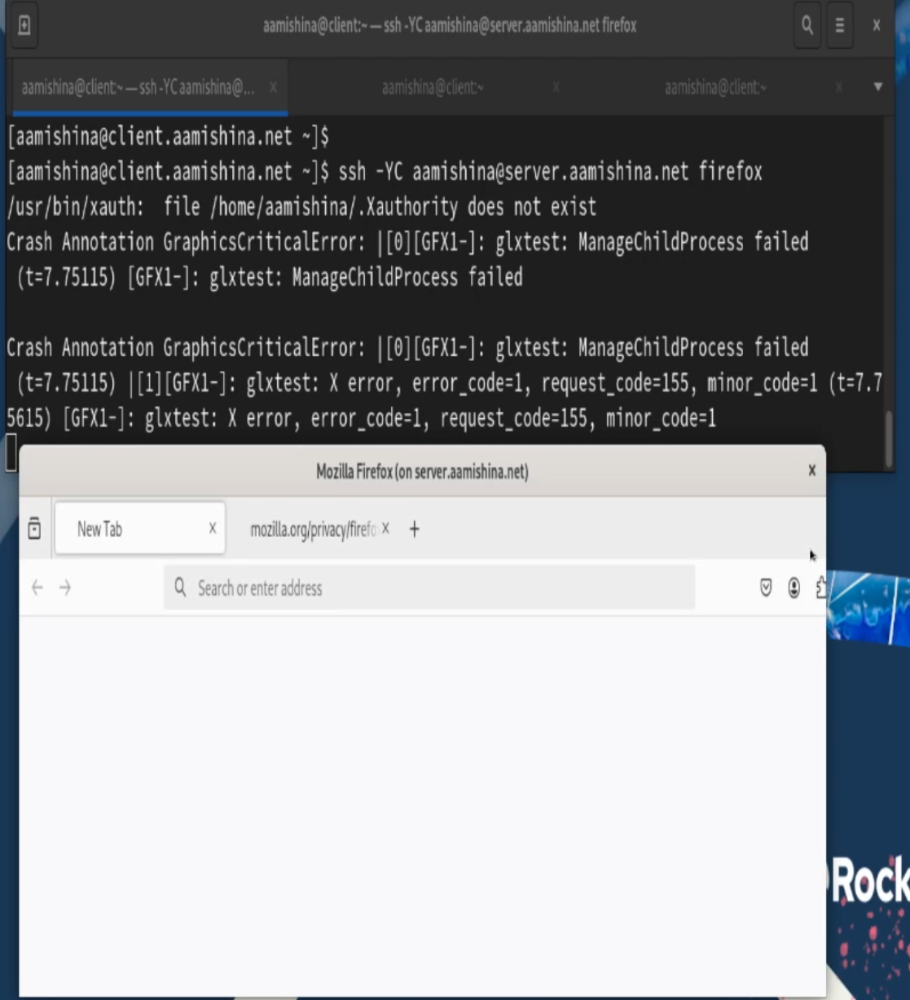{#fig:019 width=70%}

## Внесение изменений в настройки внутреннего окружения виртуальной машины

На виртуальной машине server перейдем в каталог для внесения изменений в настройки внутреннего окружения /vagrant/provision/server/, создадим в нём каталог ssh, в который поместим в соответствующие подкаталоги конфигурационный файл sshd_config и в каталоге /vagrant/provision/server создадим исполняемый файл ssh.sh(рис. @fig:020)

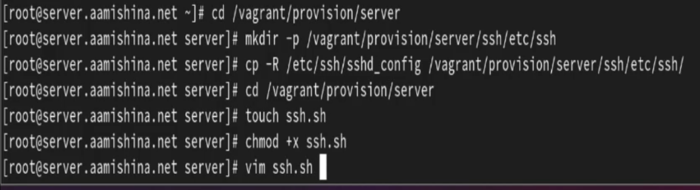{#fig:020 width=70%}

Пропишем скрипт в /vagrant/provision/server/ssh.sh (@fig:021):

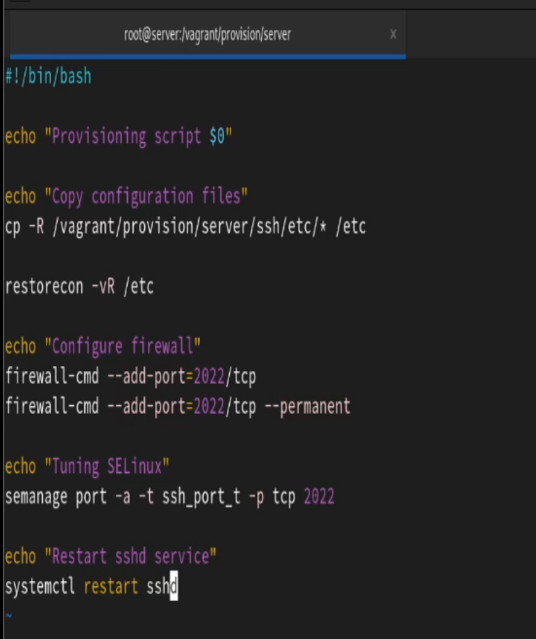{#fig:021 width=70%}

Для отработки созданного скрипта во время загрузки виртуальной машины server в конфигурационном файле Vagrantfile добавим следующую запись в разделе конфигурации для сервера(@fig:022):

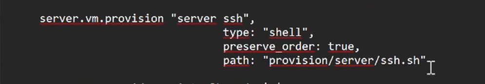{#fig:022 width=70%}

# Контрольные вопросы

1. Вы хотите запретить удалённый доступ по SSH на сервер пользователю root и разрешить доступ пользователю alice. Как это сделать?

В файле `/etc/ssh/sshd_config` конфигурации прописать `PermitRootLogin no` и `AllowUsers alice`.

2. Как настроить удалённый доступ по SSH через несколько портов? Для чего это может потребоваться?

Для настройки удалённого доступа по SSH через несколько портов нужно отредактировать файл конфигурации SSH и добавить строку `Port <порт>`.

3. Какие параметры используются для создания туннеля SSH, когда команда ssh устанавливает фоновое соединение и не ожидает какой-либо конкретной команды?

Для установки фонового соединения без команды используется параметр -N при использовании команды ssh: `ssh -N <hostname>`

4. Как настроить локальную переадресацию с локального порта 5555 на порт 80 сервера server2.example.com?
 
 `ssh -fNL 80:localhost:55555 server2.example.com`

5. Как настроить SELinux, чтобы позволить SSH связываться с портом 2022?

`semanage port -a -t ssh_port_t -p tcp 2022`

6. Как настроить межсетевой экран на сервере, чтобы разрешить входящие подключения по SSH через порт 2022?

` firewall-cmd --add-port=2022/tcp --permanent`

# Выводы

В результате выполнения данной работы были приобретены практические навыки по настройке удалённого доступа к серверу с помощью SSH.