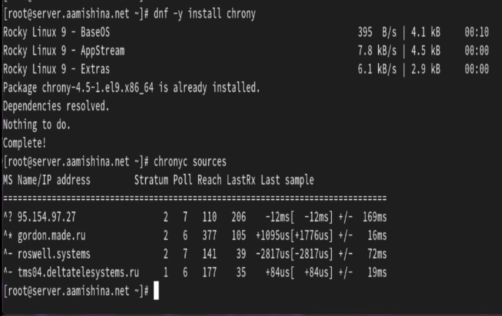

---
## Front matter
lang: ru-RU
title: Лабораторная работа №12
subtitle: Администрирование сетевых подсистем
author:
  - Мишина А. А.
date: 20 ноября 2024

## i18n babel
babel-lang: russian
babel-otherlangs: english

## Formatting pdf
toc: false
toc-title: Содержание
slide_level: 2
aspectratio: 169
section-titles: true
theme: metropolis
header-includes:
 - \metroset{progressbar=frametitle,sectionpage=progressbar,numbering=fraction}
 - '\makeatletter'

 - '\makeatother'
---

## Цель работы

- Приобретение практических навыков по управлению системным временем и настройке синхронизации времени.

# Выполнение лабораторной работы

# Настройка параметров времени

## ВМ server

{#fig:001 width=40%}

## ВМ client

{#fig:002 width=60%}

# Управление синхронизацией времени

## Источники времени

{#fig:003 width=70%}

## Источники времени

{#fig:004 width=70%}

## ВМ server

{#fig:005 width=70%}

## ВМ client

{#fig:006 width=70%}

## Источники времени

{#fig:007 width=40%}

## Источники времени

{#fig:008 width=45%}

# Внесение изменений в настройки внутреннего окружения виртуальных машины

## ВМ server

{#fig:009 width=70%}

## ВМ server

{#fig:010 width=50%}

## ВМ client

{#fig:011 width=70%}

## ВМ client

{#fig:012 width=50%}

## Выводы

- В результате выполнения данной работы были приобретены практические навыки по управлению системным временем и настройке синхронизации времени.