---
## Front matter
title: "Отчёт по лабораторной работе №12"
subtitle: "Дисциплина: Администрирование сетевых подсистем"
author: "Мишина Анастасия Алексеевна"

## Generic options
lang: ru-RU
toc-title: "Содержание"

## Bibliography
bibliography: bib/cite.bib
csl: pandoc/csl/gost-r-7-0-5-2008-numeric.csl

## Pdf output format
toc: true # Table of contents
toc-depth: 2
lof: true # List of figures
lot: true # List of tables
fontsize: 14pt
linestretch: 1.5
papersize: a4
documentclass: scrreprt
## I18n polyglossia
polyglossia-lang:
  name: russian
  options:
	- spelling=modern
	- babelshorthands=true
polyglossia-otherlangs:
  name: english
## I18n babel
babel-lang: russian
babel-otherlangs: english
## Fonts
mainfont: PT Serif
romanfont: PT Serif
sansfont: PT Sans
monofont: PT Mono
mainfontoptions: Ligatures=TeX
romanfontoptions: Ligatures=TeX
sansfontoptions: Ligatures=TeX,Scale=MatchLowercase
monofontoptions: Scale=MatchLowercase,Scale=0.9
## Biblatex
biblatex: true
biblio-style: "gost-numeric"
biblatexoptions:
  - parentracker=true
  - backend=biber
  - hyperref=auto
  - language=auto
  - autolang=other*
  - citestyle=gost-numeric
## Pandoc-crossref LaTeX customization
figureTitle: "Рис."
tableTitle: "Таблица"
listingTitle: "Листинг"
lofTitle: "Список иллюстраций"
lotTitle: "Список таблиц"
lolTitle: "Листинги"
## Misc options
indent: true
header-includes:
  - \usepackage{indentfirst}
  - \usepackage{float} # keep figures where there are in the text
  - \floatplacement{figure}{H} # keep figures where there are in the text
---

# Цель работы

Приобретение практических навыков по управлению системным временем и настройке синхронизации времени.

# Выполнение лабораторной работы

## Настройка параметров времени

Запустим виртуальные машины сервер и клиент. На сервере и клиенте посмотрим параметры настройки даты и времени, текущее системное время и аппаратное время (рис. [-@fig:001]), (рис. [-@fig:002]):

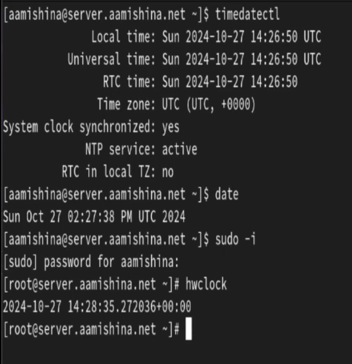{#fig:001 width=70%}

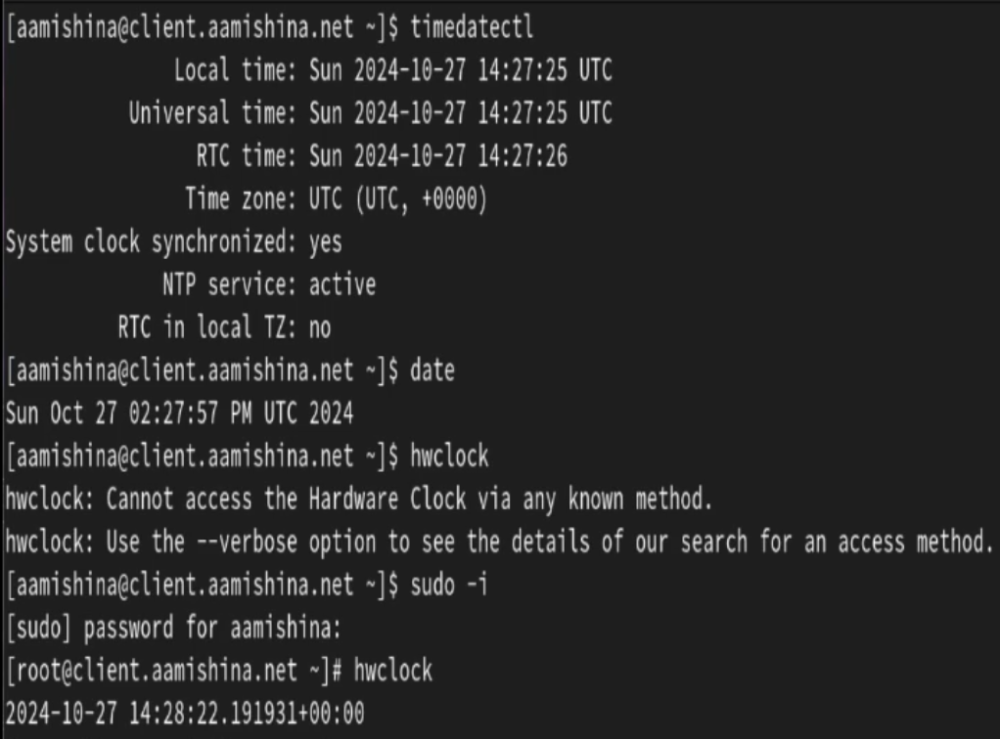{#fig:002 width=70%}

Можно увидеть, что устройство находится во временной зоне UTC+0000 -- это всемирное координированное время, сетевая синхронизацию времени включена.

## Управление синхронизацией времени

Установим на сервер необходимые пакеты и проверим источники времени на клиенте и сервере (рис. [-@fig:003]), (рис. [-@fig:004]):

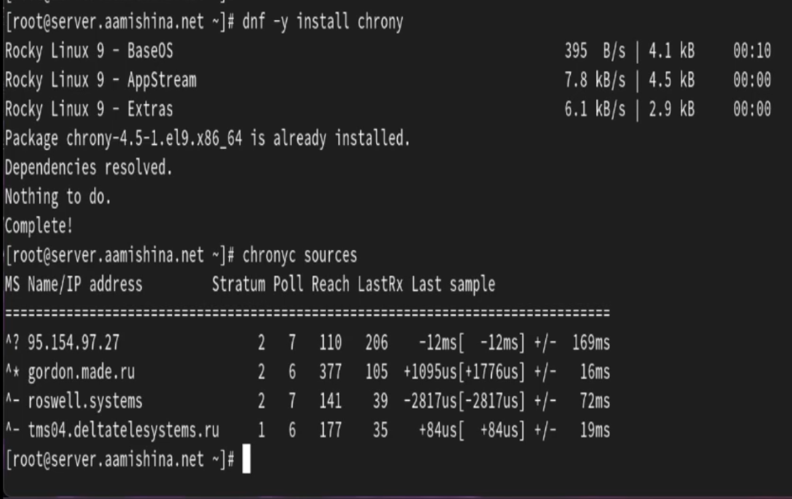{#fig:003 width=70%}

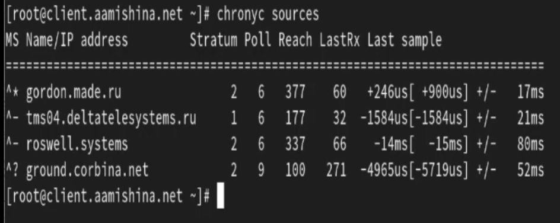{#fig:004 width=70%}

Эта команда выводит источники синхронизации. В первом столбце указан IP-адрес или имя источника. Во втором показан слой источника. Уровень 1 указывает на компьютер с локально подключенными эталонными часами. Компьютер, синхронизированный с компьютером уровня 1, находится на уровне 2. В нашем случае есть источники первого и второго уровня. Так же указаны скорости опроса источника в виде логарифма по основанию 2 интервала в секундах. Таким образом, значения у наших источников 6, 7 и 9 означают, что измерение выполняется каждые 64, 128 и 512 секунд. Следующий столбец показывает регистр досягаемости источника, напечатанный в виде восьмеричного числа. Регистр имеет 8 бит и обновляется при каждом полученном или пропущенном пакете от источника. Например, значение 377 указывает, что для всех последних восьми передач был получен действительный ответ. В следующем столбце показано, как давно была получена последняя выборка от источника. Последний столбец показывает смещение между местными часами и источником при последнем измерении.

На сервере откроем на редактирование файл /etc/chrony.conf и добавим строку (рис. [-@fig:005]):

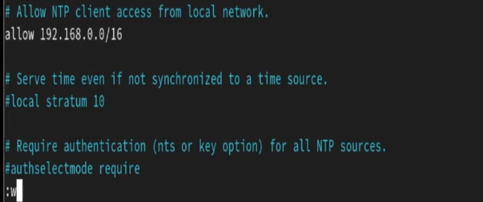{#fig:005 width=70%}

Затем на сервере перезапустим службу chronyd и настроим межсетевой экран для работы с ntp:

```
systemctl restart chronyd

firewall-cmd --add-service=ntp --permanent
firewall-cmd --reload
```

На клиенте откроем файл /etc/chrony.conf и добавим строку, указывающую источником синхронизации сервер (рис. [-@fig:006]):

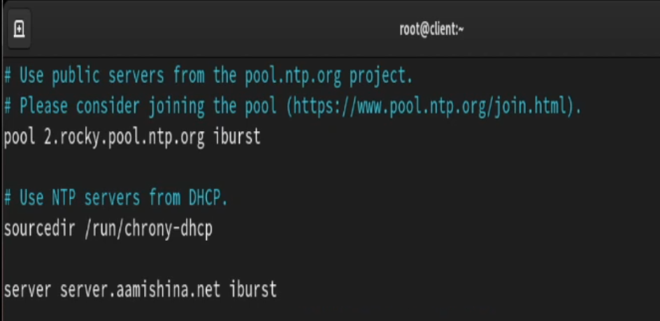{#fig:006 width=70%}

Затем на клиенте перезапустим службу chronyd. Проверим источники времени на клиенте (рис. [-@fig:007]) и сервере (рис. [-@fig:008]). Теперь на клиенте появился источник синхронизации времени mail.aamishina.net, имеющий уровень 3 (то есть синхронизируется с источниками, которые синхронизируются от первичного источника).

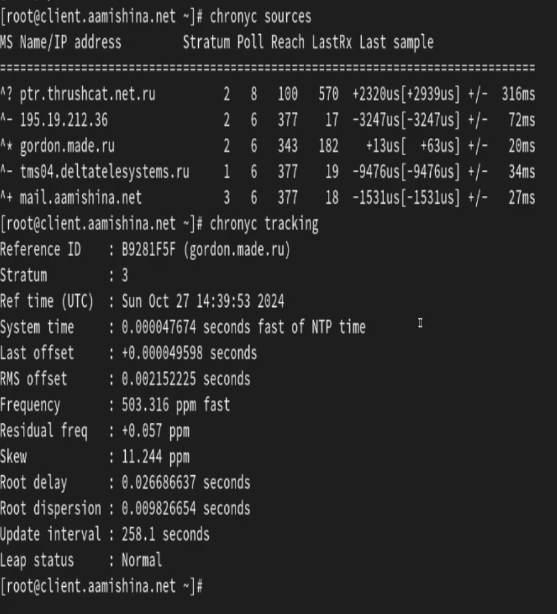{#fig:007 width=70%}

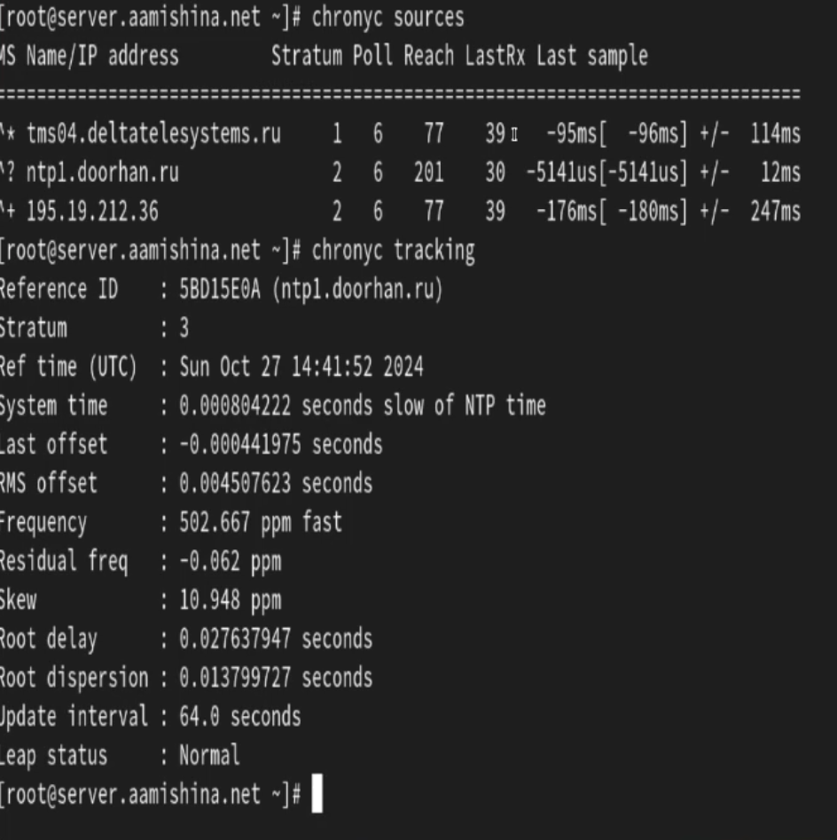{#fig:008 width=70%}

## Внесение изменений в настройки внутреннего окружения виртуальных машины

На виртуальной машине server перейдем в каталог для внесения изменений в настройки внутреннего окружения /vagrant/provision/server/, создадим в нём каталоги /ntp/etc, в который поместим конфигурационный файл hrony.conf и в каталоге /vagrant/provision/server создадим исполняемый файл ntp.sh (рис. [-@fig:009]).

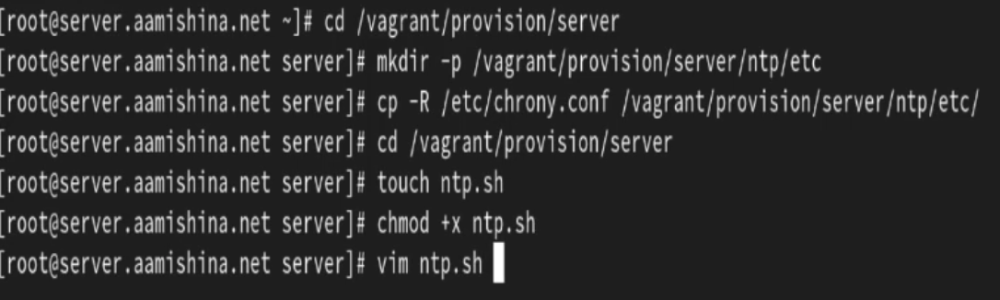{#fig:009 width=70%}

Пропишем скрипт в /vagrant/provision/server/ntp.sh (рис. [-@fig:010]):

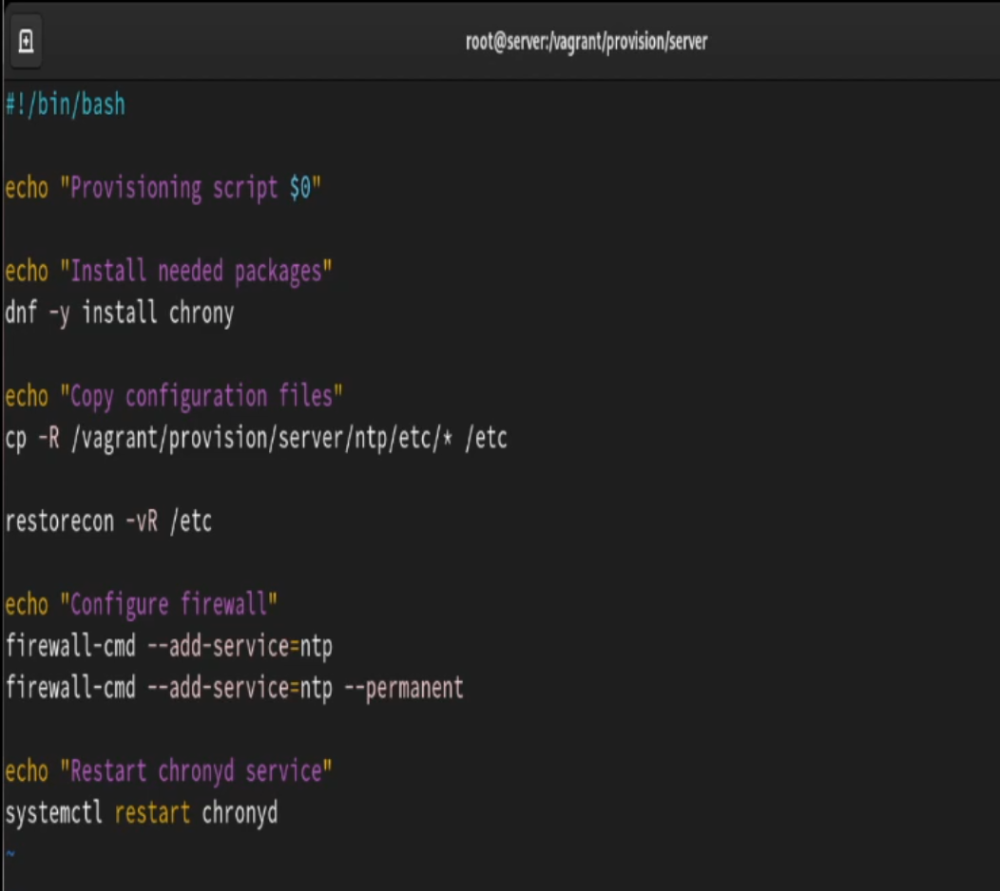{#fig:010 width=70%}

То же самое сделаем на виртуальной машине client (рис. [-@fig:011]).

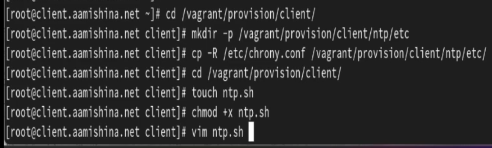{#fig:011 width=70%}

И пропишем скрипт в /vagrant/provision/client/ntp.sh (рис. [-@fig:012]):

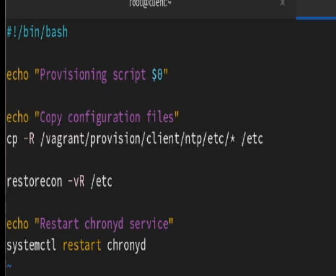{#fig:012 width=70%}

Затем для отработки созданных скриптов в конфигурационном файле Vagrantfile необходимо добавить в соответствующих разделах конфигураций для сервера и клиента:

```
server.vm.provision "server ntp",
type: "shell",
preserve_order: true,
path: "provision/server/ntp.sh"

client.vm.provision "client ntp",
type: "shell",
preserve_order: true,
path: "provision/client/ntp.sh"

```

# Контрольные вопросы

1. Почему важна точная синхронизация времени для служб баз данных?

Точная синхронизация времени в службах баз данных важна для обеспечения целостности и согласованности данных. Она позволяет различным узлам базы данных оперировать с одним и тем же временем, что помогает предотвратить конфликты при репликации данных и обеспечить правильную последовательность операций.

2. Почему служба проверки подлинности Kerberos сильно зависит от правильной синхронизации времени?

Служба проверки подлинности Kerberos зависит от правильной синхронизации времени для обеспечения безопасности. Керберос использует временные метки для защиты от атак воспроизведения и повтора. Если временные метки не синхронизированы правильно, то проверка подлинности Kerberos может не работать, так как таймстампы могут быть некорректно интерпретированы.

3. Какая служба используется по умолчанию для синхронизации времени на RHEL 7?

`chronyd`

4. Какова страта по умолчанию для локальных часов?

10 - страта по умолчанию для локальных часов.

5. Какой порт брандмауэра должен быть открыт, если вы настраиваете свой сервер как одноранговый узел NTP?

`123 UDP`

6. Какую строку вам нужно включить в конфигурационный файл chrony, если вы хотите быть сервером времени, даже если внешние серверы NTP недоступны?

Для настройки сервера времени в chrony, даже если внешние серверы NTP недоступны, нужно включить строку `local stratum 10` в конфигурационном файле chrony.

7. Какую страту имеет хост, если нет текущей синхронизации времени NTP?

`16`, что означает "недоступно".

8. Какую команду вы бы использовали на сервере с chrony, чтобы узнать, с какими серверами он синхронизируется?

`chronyc sources`

9. Как вы можете получить подробную статистику текущих настроек времени для процесса chrony вашего сервера?

`chronyc tracking`

# Выводы

В результате выполнения данной работы были приобретены практические навыки по управлению системным временем и настройке синхронизации времени.