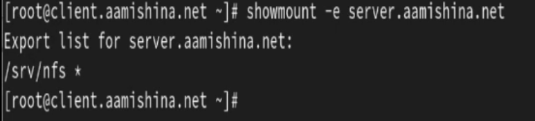
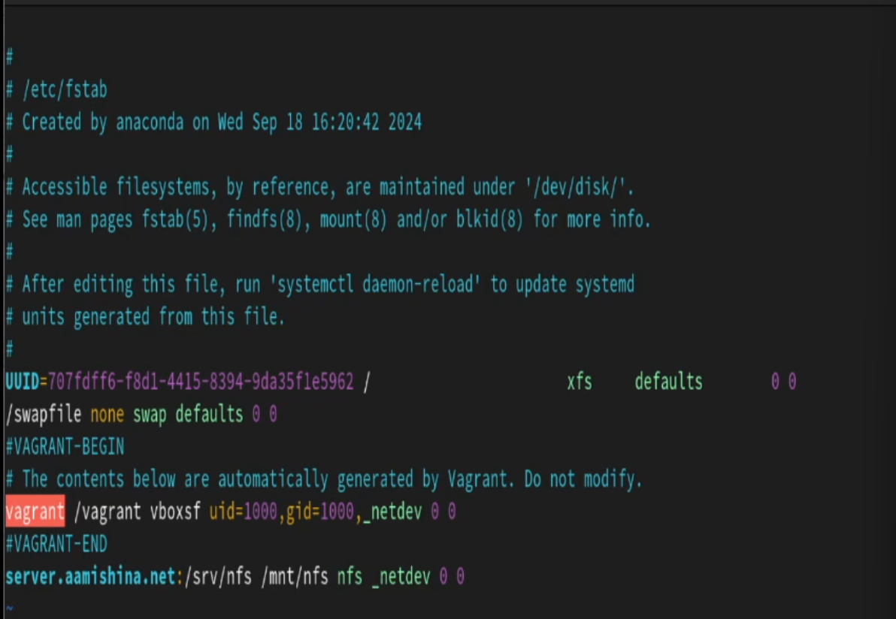

---
## Front matter
lang: ru-RU
title: Лабораторная работа №13
subtitle: Администрирование сетевых подсистем
author:
  - Мишина А. А.
date: 29 ноября 2024

## i18n babel
babel-lang: russian
babel-otherlangs: english

## Formatting pdf
toc: false
toc-title: Содержание
slide_level: 2
aspectratio: 169
section-titles: true
theme: metropolis
header-includes:
 - \metroset{progressbar=frametitle,sectionpage=progressbar,numbering=fraction}
 - '\makeatletter'

 - '\makeatother'
---

# Вводная часть

## Цель работы

- Приобретение практических навыков настройки сервера NFS для удалённого доступа к ресурсам.

# Выполнение лабораторной работы

## Настройка сервера NFSv4

На сервере установили необходимое программное обеспечение:

```
dnf -y install nfs-utils
```

Затем создали каталог, который предполагается сделать доступным всем пользователям сети(корень дерева NFS):

```
mkdir -p /srv/nfs
```

## Настройка сервера NFSv4

{#fig:001 width=70%}

## Настройка сервера NFSv4

{#fig:002 width=70%}

## Настройка сервера NFSv4

{#fig:003 width=70%}

## Настройка сервера NFSv4

На сервере остановим сервис межсетевого экрана с помощью команды `systemctl stop firewalld.service`

{#fig:004 width=70%}

## Настройка сервера NFSv4

{#fig:005 width=70%}

## Настройка сервера NFSv4

{#fig:006 width=70%}

## Настройка сервера NFSv4

{#fig:007 width=40%}

## Настройка сервера NFSv4

{#fig:008 width=70%}

## Монтирование NFS на клиенте

{#fig:009 width=40%}

## Монтирование NFS на клиенте

{#fig:010 width=70%}

## Монтирование NFS на клиенте

{#fig:011 width=70%}

## Монтирование NFS на клиенте

{#fig:012 width=40%}

## Подключение каталогов к дереву NFS

```
mkdir -p /srv/nfs/www
mount -o bind /var/www/ /srv/nfs/www/
```

## Подключение каталогов к дереву NFS

{#fig:013 width=70%}

{#fig:014 width=70%}

## Подключение каталогов к дереву NFS

{#fig:015 width=70%}

## Подключение каталогов к дереву NFS

{#fig:016 width=70%}

## Подключение каталогов к дереву NFS

{#fig:017 width=50%}

## Подключение каталогов к дереву NFS

{#fig:018 width=70%}

## Подключение каталогов для работы пользователей

```
mkdir -p -m 700 ~/common
cd ~/common
touch aamishina@server.txt
```
## Подключение каталогов для работы пользователей

{#fig:019 width=70%}

## Подключение каталогов для работы пользователей

{#fig:020 width=70%}

## Подключение каталогов для работы пользователей

{#fig:021 width=50%}

## Подключение каталогов для работы пользователей

{#fig:022 width=70%}

## Подключение каталогов для работы пользователей

{#fig:023 width=70%}

## Подключение каталогов для работы пользователей

{#fig:024 width=70%}

## Внесение изменений в настройки внутреннего окружения виртуальных машины

{#fig:025 width=40%}

## Внесение изменений в настройки внутреннего окружения виртуальных машины

{#fig:026 width=50%}

## Внесение изменений в настройки внутреннего окружения виртуальных машины

```
server.vm.provision "server nfs",
  type: "shell",
  preserve_order: true,
  path: "provision/server/nfs.sh"

client.vm.provision "client nfs",
  type: "shell",
  preserve_order: true,
  path: "provision/client/nfs.sh"

```
# Заключение

## Выводы

- В результате выполнения данной работы были приобретены практические навыки настройки сервера NFS для удалённого доступа к ресурсам.