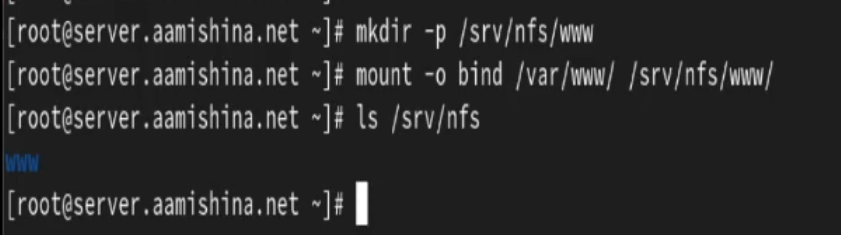

---
## Front matter
title: "Отчёт по лабораторной работе №13"
subtitle: "Дисциплина: Администрирование сетевых подсистем"
author: "Мишина Анастасия Алексеевна"

## Generic options
lang: ru-RU
toc-title: "Содержание"

## Bibliography
bibliography: bib/cite.bib
csl: pandoc/csl/gost-r-7-0-5-2008-numeric.csl

## Pdf output format
toc: true # Table of contents
toc-depth: 2
lof: true # List of figures
lot: true # List of tables
fontsize: 14pt
linestretch: 1.5
papersize: a4
documentclass: scrreprt
## I18n polyglossia
polyglossia-lang:
  name: russian
  options:
	- spelling=modern
	- babelshorthands=true
polyglossia-otherlangs:
  name: english
## I18n babel
babel-lang: russian
babel-otherlangs: english
## Fonts
mainfont: PT Serif
romanfont: PT Serif
sansfont: PT Sans
monofont: PT Mono
mainfontoptions: Ligatures=TeX
romanfontoptions: Ligatures=TeX
sansfontoptions: Ligatures=TeX,Scale=MatchLowercase
monofontoptions: Scale=MatchLowercase,Scale=0.9
## Biblatex
biblatex: true
biblio-style: "gost-numeric"
biblatexoptions:
  - parentracker=true
  - backend=biber
  - hyperref=auto
  - language=auto
  - autolang=other*
  - citestyle=gost-numeric
## Pandoc-crossref LaTeX customization
figureTitle: "Рис."
tableTitle: "Таблица"
listingTitle: "Листинг"
lofTitle: "Список иллюстраций"
lotTitle: "Список таблиц"
lolTitle: "Листинги"
## Misc options
indent: true
header-includes:
  - \usepackage{indentfirst}
  - \usepackage{float} # keep figures where there are in the text
  - \floatplacement{figure}{H} # keep figures where there are in the text
---

# Цель работы

Приобретение практических навыков настройки сервера NFS для удалённого доступа к ресурсам.

# Выполнение лабораторной работы

## Настройка сервера NFSv4

Запустим виртуальную машину server. На сервере установим необходимое программное обеспечение:

```
dnf -y install nfs-utils
```

Затем создадим каталог, который предполагается сделать доступным всем пользователям сети (корень дерева NFS):

```
mkdir -p /srv/nfs
```

В файле /etc/exports пропишем подключаемый через NFS общий каталог с доступом только на чтение(рис. @fig:001):

{#fig:001 width=70%}

Для общего каталога зададим контекст безопасности NFS и применим изменённую настройку SELinux к файловой системе, затем запустим сервер NFS и настроим межсетевой экран для работы сервера NFS(рис. @fig:002):

{#fig:002 width=70%}

На клиенте установим необходимое для работы NFS программное обеспечение:
```
dnf -y install nfs-utils
```
Попробуем посмотреть имеющиеся подмонтированные удалённые ресурсы(@fig:003):

{#fig:003 width=70%}

Увидим, что протокол удалённого вызова процедур (RPC) не может получить доступ к запрашиваемым ресурсам. 

На сервере остановим сервис межсетевого экрана с помощью команды `systemctl stop firewalld.service` и на клиенте вновь попробуем подключиться к удалённо смонтированному ресурсу(@fig:004):

{#fig:004 width=70%}

Теперь подключение к удаленно смонтированному ресурсу успешно произведено.

На сервере запустим сервис межсетевого экрана и посмотрим, какие службы задействованы при удалённом монтировании(@fig:005, @fig:006):

{#fig:005 width=70%}

{#fig:006 width=70%}

Затем добавим службы rpc-bind и mountd в настройки межсетевого экрана на сервере(@fig:007):

{#fig:007 width=70%}

Теперь на клиенте проверим подключение удалённого ресурса(@fig:008):

{#fig:008 width=70%}

## Монтирование NFS на клиенте

На клиенте создадим каталог, в который будет монтироваться удалённый ресурс, и подмонтируем дерево NFS. Затем проверим, что общий ресурс NFS подключён правильно(@fig:009):

{#fig:009 width=70%}

На клиенте в конце файла /etc/fstab добавьте следующую запись(@fig:010):

{#fig:010 width=70%}

Мы подключаем каталоги сервера для автоматического монтирования при загрузке через nfs, для этого указываются каталоги и _netdev -- опция, указывающая, что данный ресурс является сетевым(то есть монтироваться каталоги будут после загрузки сетевой подсистемы).

На клиенте проверьте наличие автоматического монтирования удалённых ресурсов при запуске операционной системы(рис. @fig:011):

{#fig:011 width=70%}

Перезапустим клиента и убедимся, что удалённый ресурс подключается автоматически(рис. @fig:012):

{#fig:012 width=70%}

## Подключение каталогов к дереву NFS

На сервере создадим общий каталог, в который затем будет подмонтирован каталог с контентом веб-сервера и подмонтируем каталог web-сервера:
```
mkdir -p /srv/nfs/www
mount -o bind /var/www/ /srv/nfs/www/
```

На сервере проверим, что отображается в каталоге /srv/nfs(@fig:013)

{#fig:013 width=70%}

На сервере проверим, что отображается в каталоге /mnt/nfs(@fig:014)

{#fig:014 width=70%}

На сервере в файле /etc/exports добавьте экспорт каталога веб-сервера с удалённого ресурса(@fig:015)

{#fig:015 width=70%}

Экспортируем все каталоги, упомянутые в файле /etc/exports командной `exportfs -r`. Проверим на клиенте каталог /mnt/nfs(@fig:016)

{#fig:016 width=70%}

На сервере в конце файла /etc/fstab добавим следующую запись(@fig:017)

{#fig:017 width=70%}

Повторно экспортируем каталоги, указанные в файле /etc/exports и на клиенте проверим каталог /mnt/nfs(@fig:018)

{#fig:018 width=70%}

## Подключение каталогов для работы пользователей

На сервере под пользователем aamishina в домашнем каталоге создадим каталог common с полными правами доступа только для этого пользователя, а в нём файл aamishina@server.txt:

```
mkdir -p -m 700 ~/common
cd ~/common
touch aamishina@server.txt
```
На сервере создадим общий каталог для работы пользователя aamishina по сети, подмонтируем каталог common пользователя aamishina в NFS. Затем посмотрим какие права доступа установлены на этот каталог(@fig:019):

{#fig:019 width=70%}

Подключим каталог пользователя в файле /etc/exports, прописав в нём(@fig:020):

{#fig:020 width=70%}

Внесем изменения в файл /etc/fstab(@fig:021):

{#fig:021 width=70%}

Затем повторно экспортируем каталоги и проверим на клиенте каталог mnt/nfs(@fig:022):

{#fig:022 width=70%}

На клиенте попробуем создать файл в каталоге /mnt/nfs/home/aamishina под пользователями aamishina и root (@fig:023):

{#fig:023 width=70%}

У пользователя root нет прав на переход в эту директорию, пользователь aamishina может и перейти, и создать файл.

Проверим появились ли изменения на сервере(@fig:024):

{#fig:024 width=70%}

Действительно, созданные файлы отразились на сервере.

## Внесение изменений в настройки внутреннего окружения виртуальных машины

На виртуальной машине server перейдем в каталог для внесения изменений в настройки внутреннего окружения /vagrant/provision/server/, создадим в нём каталог nfs, в который поместим в соответствующие подкаталоги конфигурационные файлы.

В каталоге /vagrant/provision/server создадим исполняемый файл nfs.sh и внесем скрипт(@fig:025):

{#fig:025 width=70%}

В каталоге /vagrant/provision/client создадим исполняемый файл nfs.sh и внесем скрипт(@fig:026):

{#fig:026 width=70%}

Затем для отработки созданных скриптов в конфигурационном файле Vagrantfile необходимо добавить в соответствующих разделах конфигураций для сервера и клиента:

```
server.vm.provision "server nfs",
  type: "shell",
  preserve_order: true,
  path: "provision/server/nfs.sh"

client.vm.provision "client nfs",
  type: "shell",
  preserve_order: true,
  path: "provision/client/nfs.sh"

```

# Контрольные вопросы

1. Как называется файл конфигурации, содержащий общие ресурсы NFS?

`/etc/exports`

2. Какие порты должны быть открыты в брандмауэре, чтобы обеспечить полный доступ к серверу NFS?

Cледует открыть TCP и UDP порты 2049 в брандмауэре.

3. Какую опцию следует использовать в `/etc/fstab`, чтобы убедиться, что общие
ресурсы NFS могут быть установлены автоматически при перезагрузке?

Для автоматической установки общих ресурсов NFS при перезагрузке следует использовать опцию `auto` в `/etc/fstab`.

# Выводы

В результате выполнения данной работы были приобретены практические навыки настройки сервера NFS для удалённого доступа к ресурсам.