---
## Front matter
lang: ru-RU
title: Лабораторная работа №14
subtitle: Администрирование сетевых подсистем
author:
  - Мишина А. А.
date: 1 декабря 2024

## i18n babel
babel-lang: russian
babel-otherlangs: english

## Formatting pdf
toc: false
toc-title: Содержание
slide_level: 2
aspectratio: 169
section-titles: true
theme: metropolis
header-includes:
 - \metroset{progressbar=frametitle,sectionpage=progressbar,numbering=fraction}
 - '\makeatletter'

 - '\makeatother'
---

# Вводная часть

## Цель работы

Приобретение навыков настройки доступа групп пользователей к общим ресурсам по протоколу SMB.

# Выполнение лабораторной работы

## Настройка сервера Samba

На сервере установим необходимые пакеты:

```
dnf -y install samba samba-client cifs-utils
```

## Настройка сервера Samba

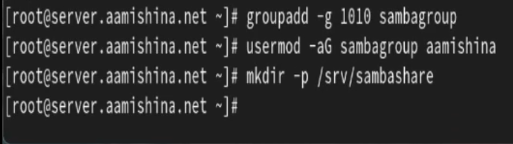{#fig:001 width=70%}

## Настройка сервера Samba

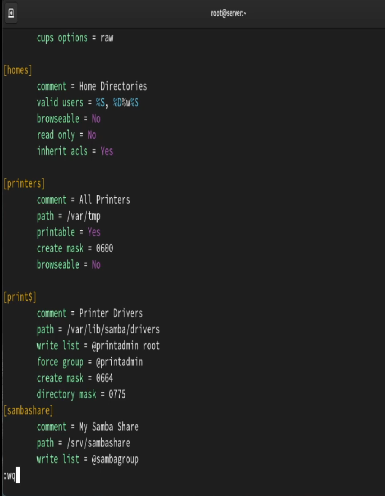{#fig:002 width=35%}

## Настройка сервера Samba

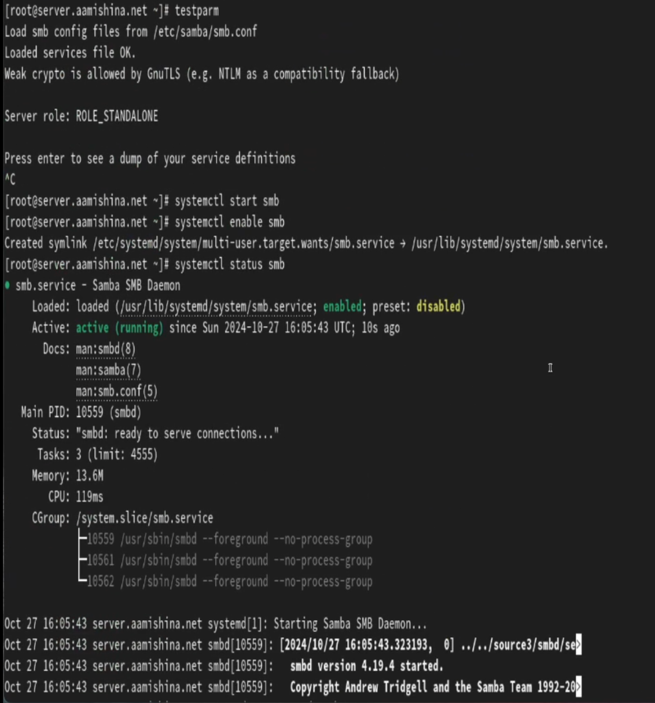{#fig:003 width=40%}

## Настройка сервера Samba

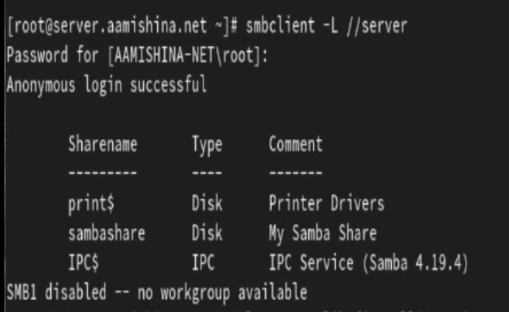{#fig:004 width=40%}

## Настройка сервера Samba

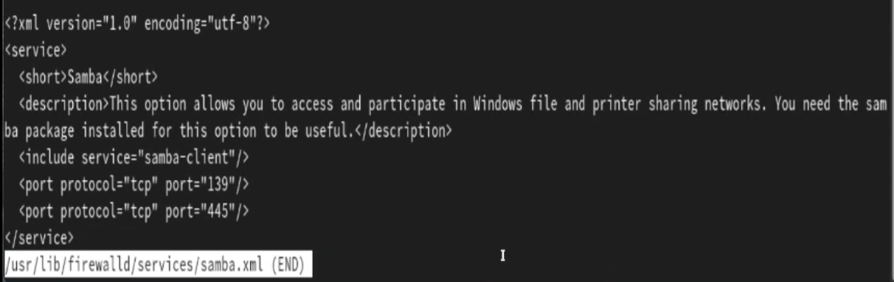{#fig:005 width=70%}

## Настройка сервера Samba

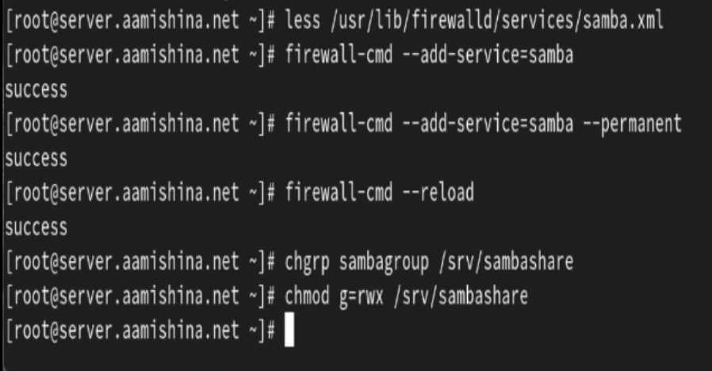{#fig:006 width=70%}

## Настройка сервера Samba

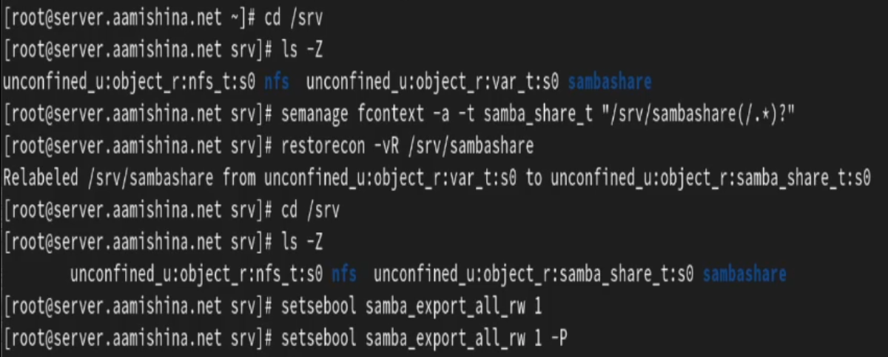{#fig:007 width=70%}

## Настройка сервера Samba

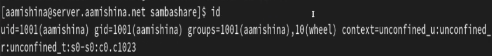{#fig:008 width=70%}

## Настройка сервера Samba

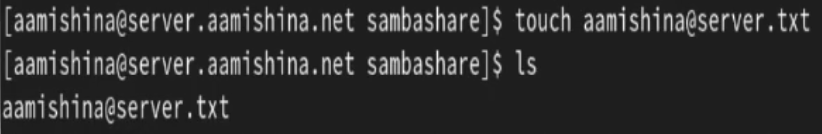{#fig:009 width=70%}

## Настройка сервера Samba

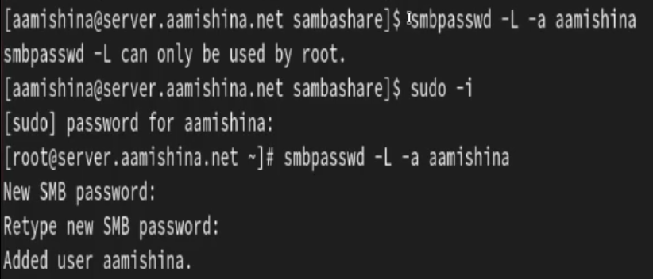{#fig:010 width=70%}

## Монтирование файловой системы Samba на клиенте

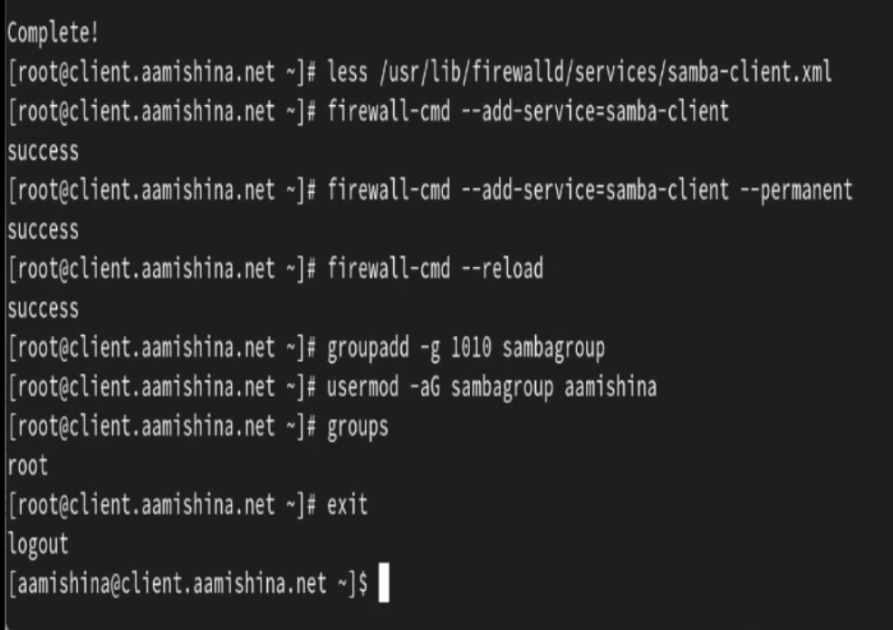{#fig:011 width=70%}

## Монтирование файловой системы Samba на клиенте

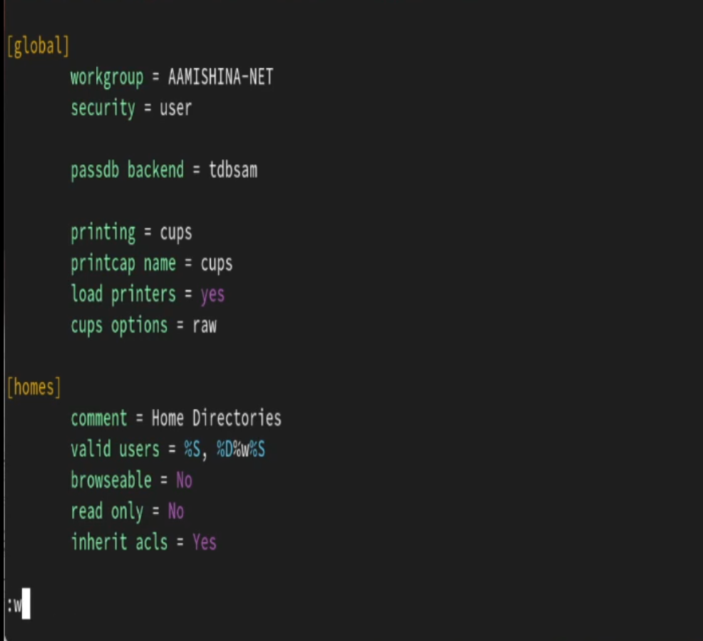{#fig:012 width=50%}

## Монтирование файловой системы Samba на клиенте

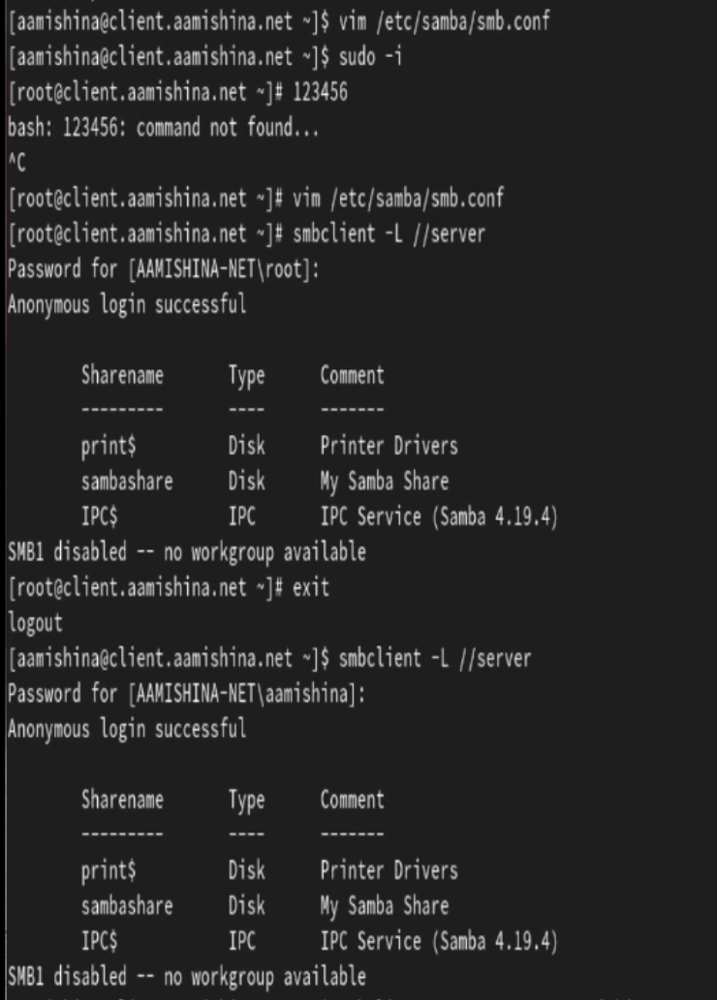{#fig:013 width=35%}

## Монтирование файловой системы Samba на клиенте

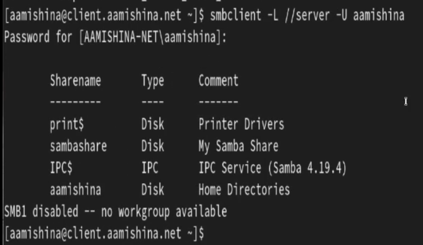{#fig:0131 width=70%}

## Монтирование файловой системы Samba на клиенте

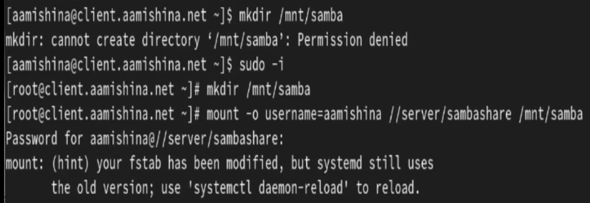{#fig:014 width=70%}

## Монтирование файловой системы Samba на клиенте

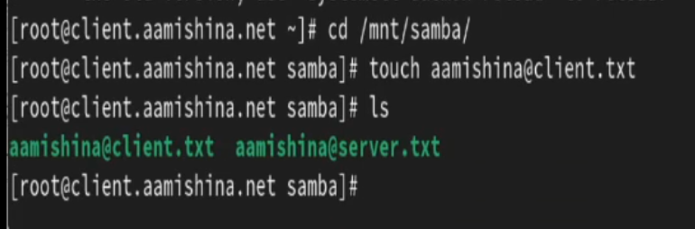{#fig:015 width=70%}

## Монтирование файловой системы Samba на клиенте

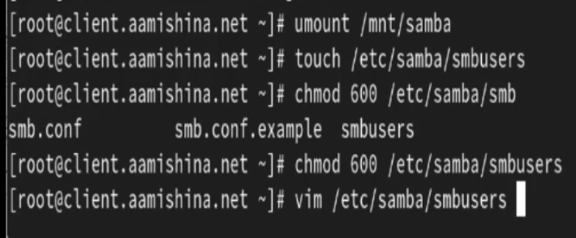{#fig:016 width=70%}

## Монтирование файловой системы Samba на клиенте

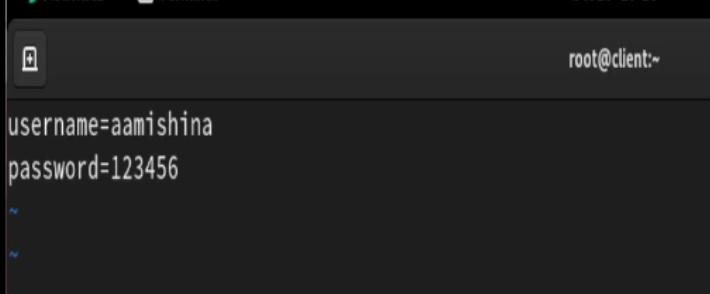{#fig:017 width=70%}

## Монтирование файловой системы Samba на клиенте

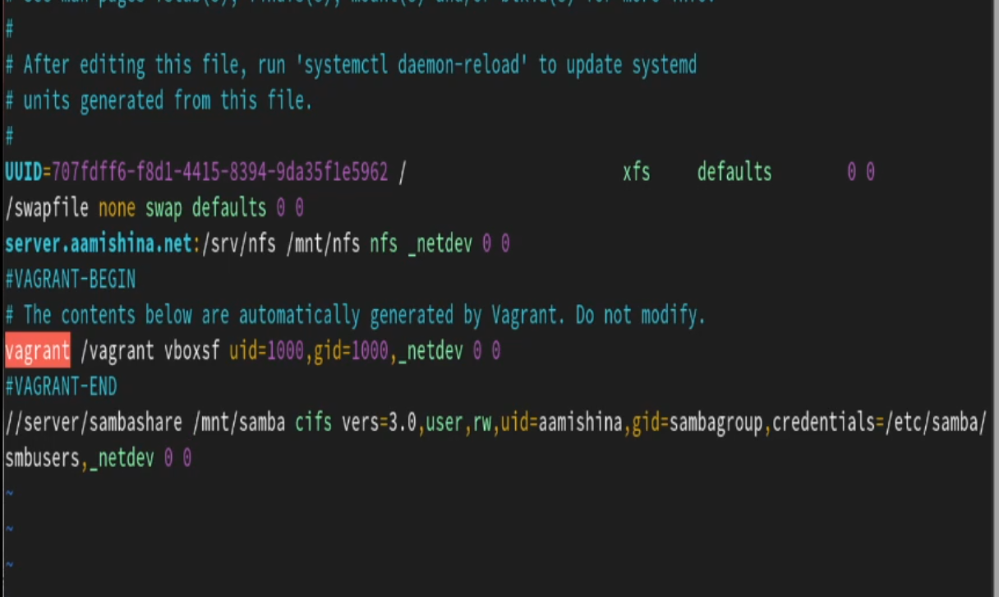{#fig:018 width=70%}

## Монтирование файловой системы Samba на клиенте

{#fig:019 width=70%}

## Монтирование файловой системы Samba на клиенте

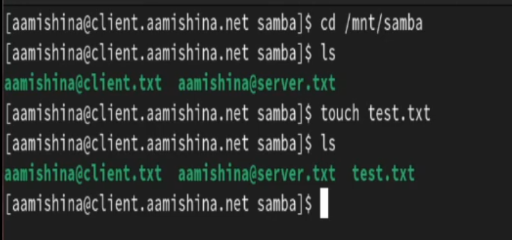{#fig:020 width=70%}

## Внесение изменений в настройки внутреннего окружения виртуальных машины

```
cd /vagrant/provision/server
mkdir -p /vagrant/provision/server/smb/etc/samba
cp -R /etc/samba/smb.conf /vagrant/provision/server/smb/etc/samba/

touch smb.sh
chmod +x smb.sh
```

## Внесение изменений в настройки внутреннего окружения виртуальных машины

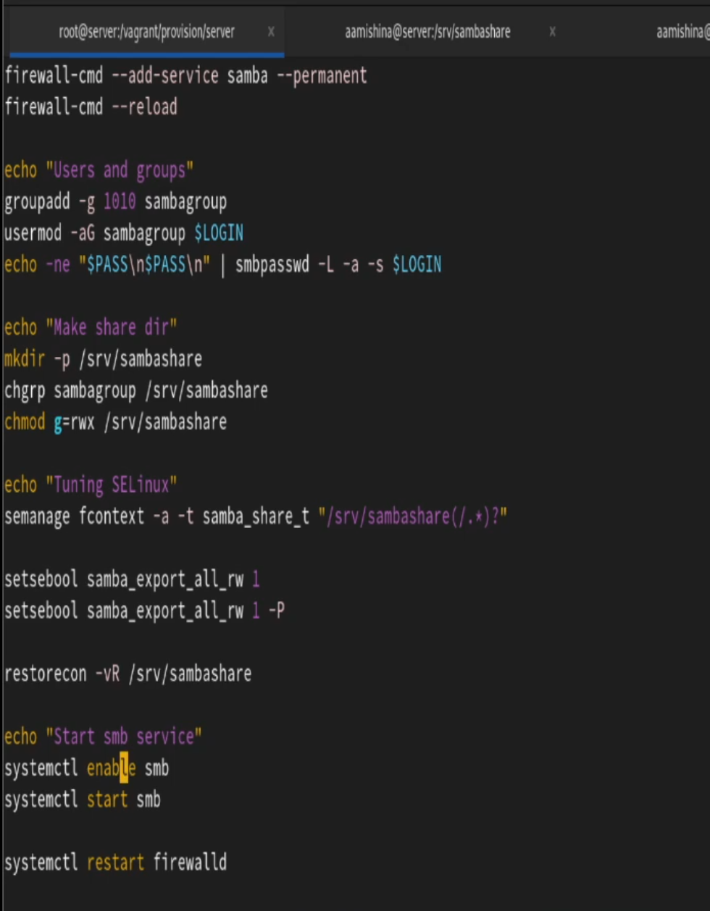{#fig:021 width=35%}

## Внесение изменений в настройки внутреннего окружения виртуальных машины

```
cd /vagrant/provision/client
mkdir -p /vagrant/provision/client/smb/etc/samba
cp -R /etc/samba/smb.conf /vagrant/provision/client/smb/etc/samba/
cp -R /etc/samba/smbusers /vagrant/provision/client/smb/etc/samba/

touch smb.sh
chmod +x smb.sh
```

## Внесение изменений в настройки внутреннего окружения виртуальных машины

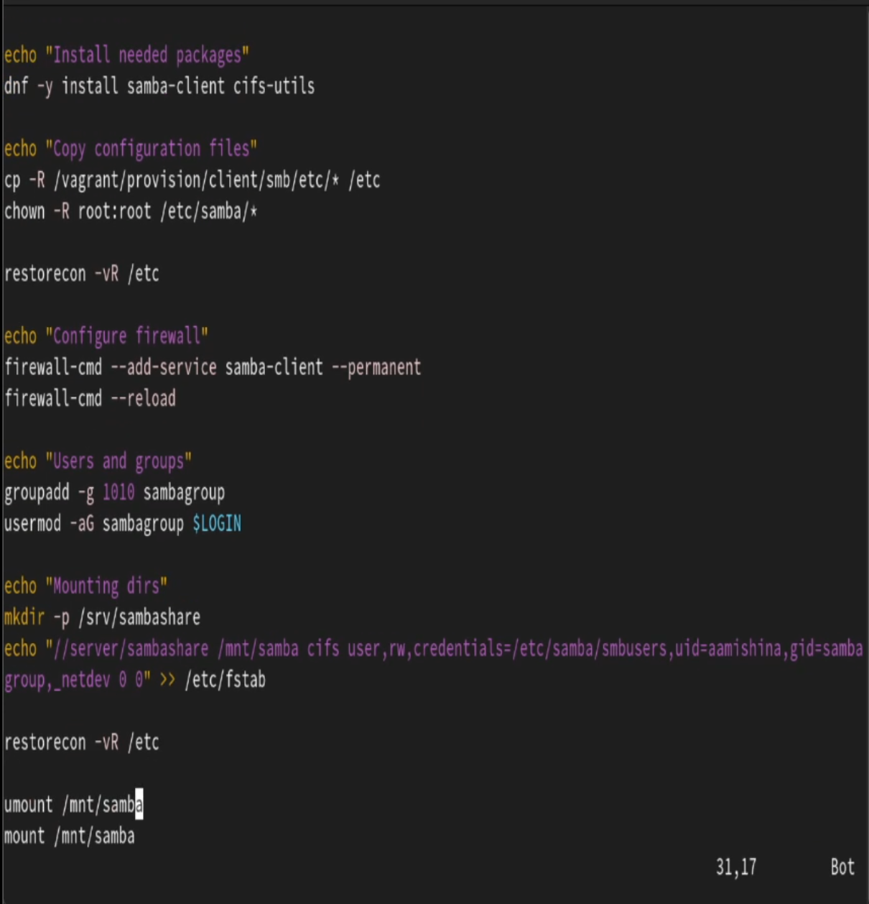{#fig:022 width=40%}

## Внесение изменений в настройки внутреннего окружения виртуальных машины

```
server.vm.provision "SMB server",
  type: "shell",
  preserve_order: true,
  path: "provision/server/smb.sh"
client.vm.provision "SMB client",
  type: "shell",
  preserve_order: true,
  path: "provision/client/smb.sh"

```

# Заключение

## Выводы

В результате выполнения данной работы были приобретены практические навыки настройки доступа групп пользователей к общим ресурсам по протоколу SMB.