---
## Front matter
title: "Отчёт по лабораторной работе №14"
subtitle: "Дисциплина: Администрирование сетевых подсистем"
author: "Мишина Анастасия Алексеевна"

## Generic options
lang: ru-RU
toc-title: "Содержание"

## Bibliography
bibliography: bib/cite.bib
csl: pandoc/csl/gost-r-7-0-5-2008-numeric.csl

## Pdf output format
toc: true # Table of contents
toc-depth: 2
lof: true # List of figures
lot: true # List of tables
fontsize: 14pt
linestretch: 1.5
papersize: a4
documentclass: scrreprt
## I18n polyglossia
polyglossia-lang:
  name: russian
  options:
	- spelling=modern
	- babelshorthands=true
polyglossia-otherlangs:
  name: english
## I18n babel
babel-lang: russian
babel-otherlangs: english
## Fonts
mainfont: PT Serif
romanfont: PT Serif
sansfont: PT Sans
monofont: PT Mono
mainfontoptions: Ligatures=TeX
romanfontoptions: Ligatures=TeX
sansfontoptions: Ligatures=TeX,Scale=MatchLowercase
monofontoptions: Scale=MatchLowercase,Scale=0.9
## Biblatex
biblatex: true
biblio-style: "gost-numeric"
biblatexoptions:
  - parentracker=true
  - backend=biber
  - hyperref=auto
  - language=auto
  - autolang=other*
  - citestyle=gost-numeric
## Pandoc-crossref LaTeX customization
figureTitle: "Рис."
tableTitle: "Таблица"
listingTitle: "Листинг"
lofTitle: "Список иллюстраций"
lotTitle: "Список таблиц"
lolTitle: "Листинги"
## Misc options
indent: true
header-includes:
  - \usepackage{indentfirst}
  - \usepackage{float} # keep figures where there are in the text
  - \floatplacement{figure}{H} # keep figures where there are in the text
---

# Цель работы

Приобретение навыков настройки доступа групп пользователей к общим ресурсам по протоколу SMB.

# Выполнение лабораторной работы

## Настройка сервера Samba

Запустим ВМ server. На сервере установим необходимые пакеты: dnf -y install samba samba-client cifs-utils.

Создадим группу sambagroup для пользователей, которые будут работать с Samba-сервером, и присвоим ей GID 1010 с помощью команды `groupadd -g 1010 sambagroup`. Затем добавим пользователя aamishina к группе sambagroup командой `usermod -aG sambagroup user`.  И создадим общий каталог в файловой системе Linux, в который предполагается монтировать разделяемые ресурсы:(рис. @fig:001):

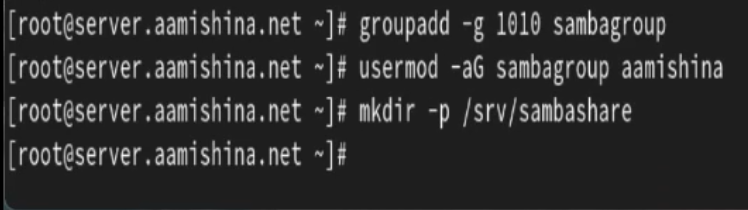{#fig:001 width=70%}

В файле конфигурации /etc/samba/smb.conf изменим параметр рабочей группы и в конец файла добавим раздел с описанием общего доступа к разделяемому ресурсу /srv/sambashare(рис. @fig:002):

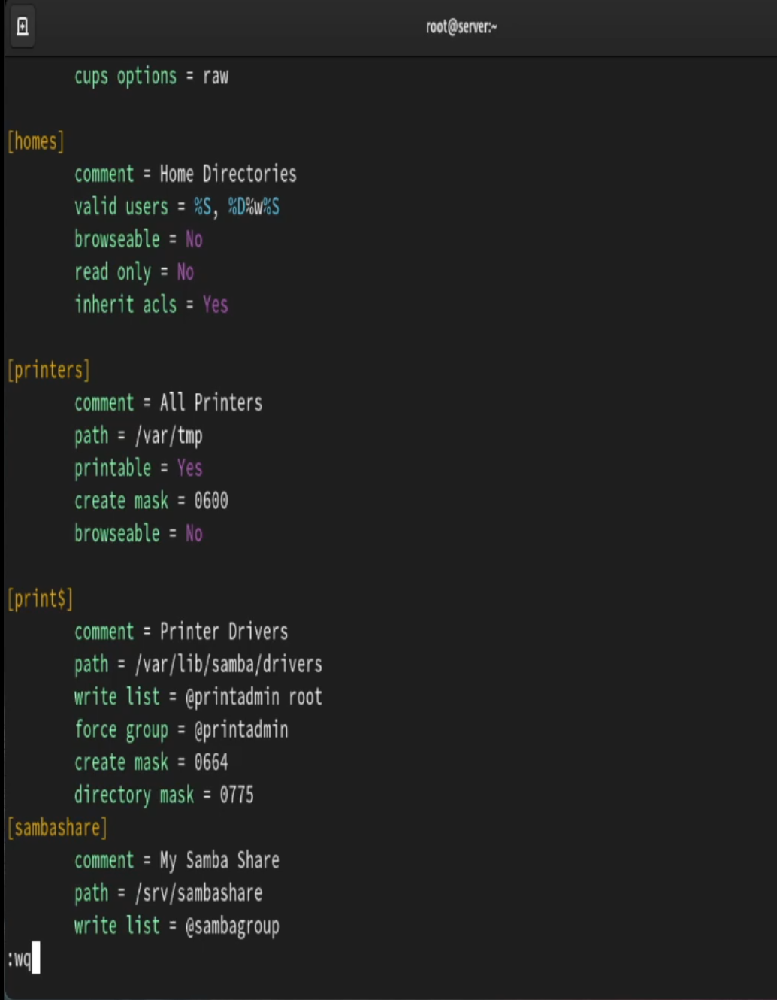{#fig:002 width=70%}

Убедимся, что не сделали синтаксических ошибок в файле smb.conf и запустим демон Samba, а затем посмотрим его статус(@fig:003):

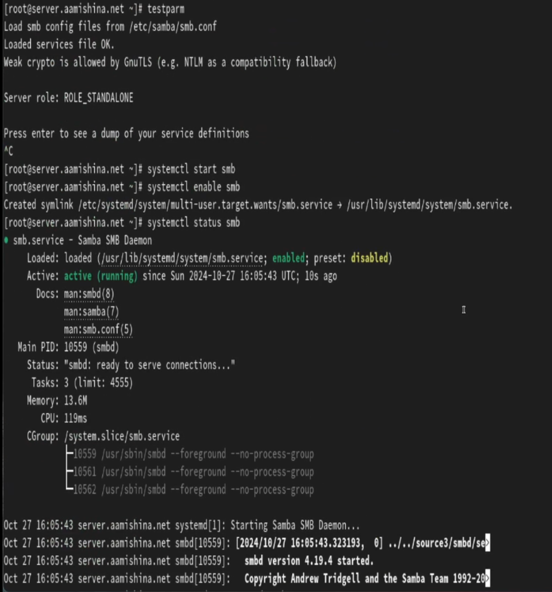{#fig:003 width=70%}

Для проверки наличия общего доступа попробуем подключиться к серверу с помощью smbclient(@fig:004):

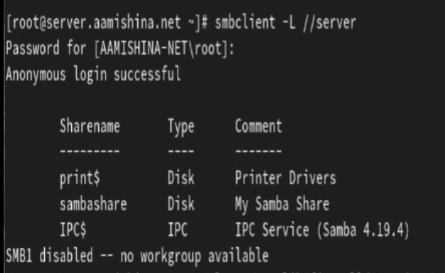{#fig:004 width=70%}

Посмотрите файл конфигурации межсетевого экрана для Samba(@fig:005):

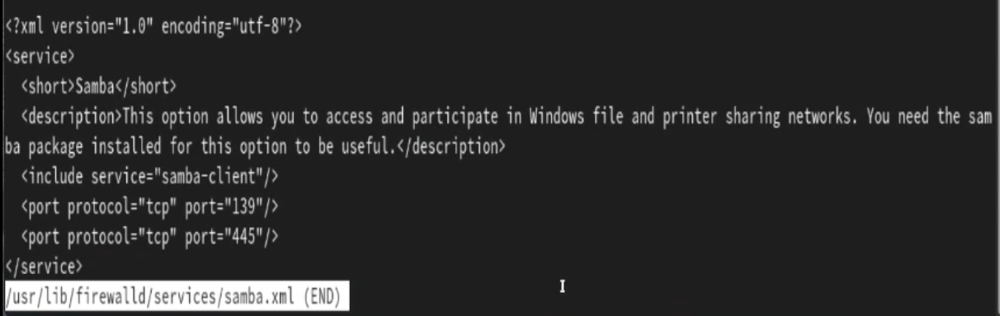{#fig:005 width=70%}

Настроим межсетевой экран и права доступа для каталога с разделяемым ресурсом(@fig:006):

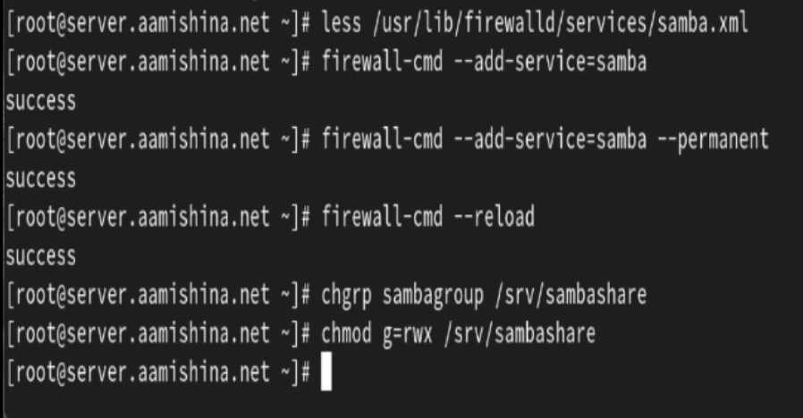{#fig:006 width=70%}

Посмотрим контекст безопасности SELinux и настроим его для каталога с разделяемым ресурсом. Затем проверим, что контекст безопасности изменился и резрешим экспортировать разделяемыйе ресурсы для чтения и записи(@fig:007):

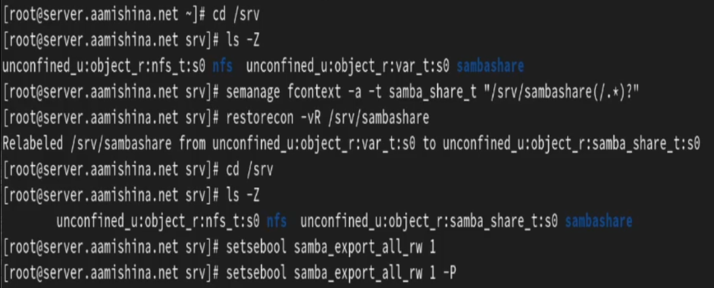{#fig:007 width=70%}

Посмотрим UID нашего пользователя и в какие группы он включён(@fig:008):

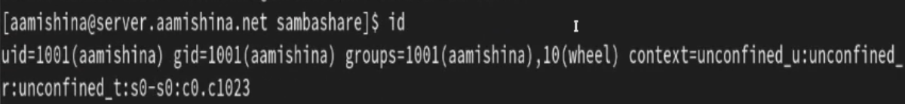{#fig:008 width=70%}

Затем под нашим пользователем aamishina попробуем создать файл на разделяемом ресурсе(@fig:009):

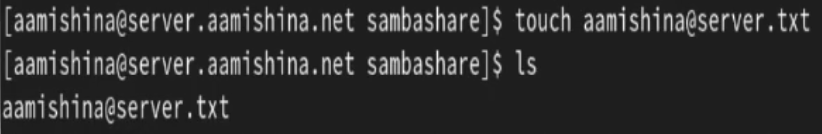{#fig:009 width=70%}

Добавим пользователя aamishina в базу пользователей Samba(@fig:010):

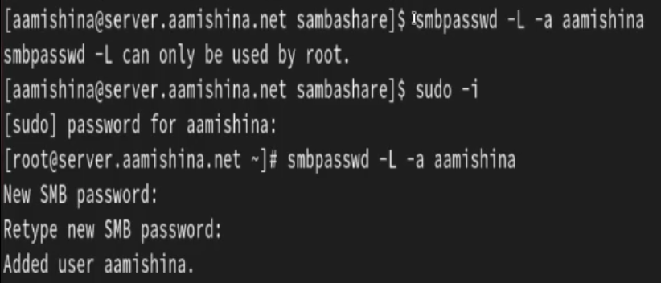{#fig:010 width=70%}

## Монтирование файловой системы Samba на клиенте

На клиенте установим необходимые пакеты. Затем посмотрим файл конфигурации межсетевого экрана для клиента Samba, настроим межсетевой экран и создадим группу sambagroup, добавим в неё пользователя aamishina(рис. @fig:011):

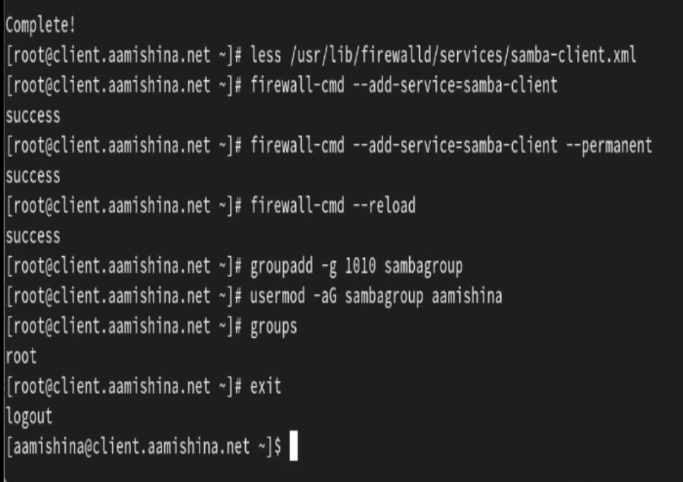{#fig:011 width=70%}

На клиенте в файле конфигурации /etc/samba/smb.conf изменим параметр рабочей группы(рис. @fig:012):

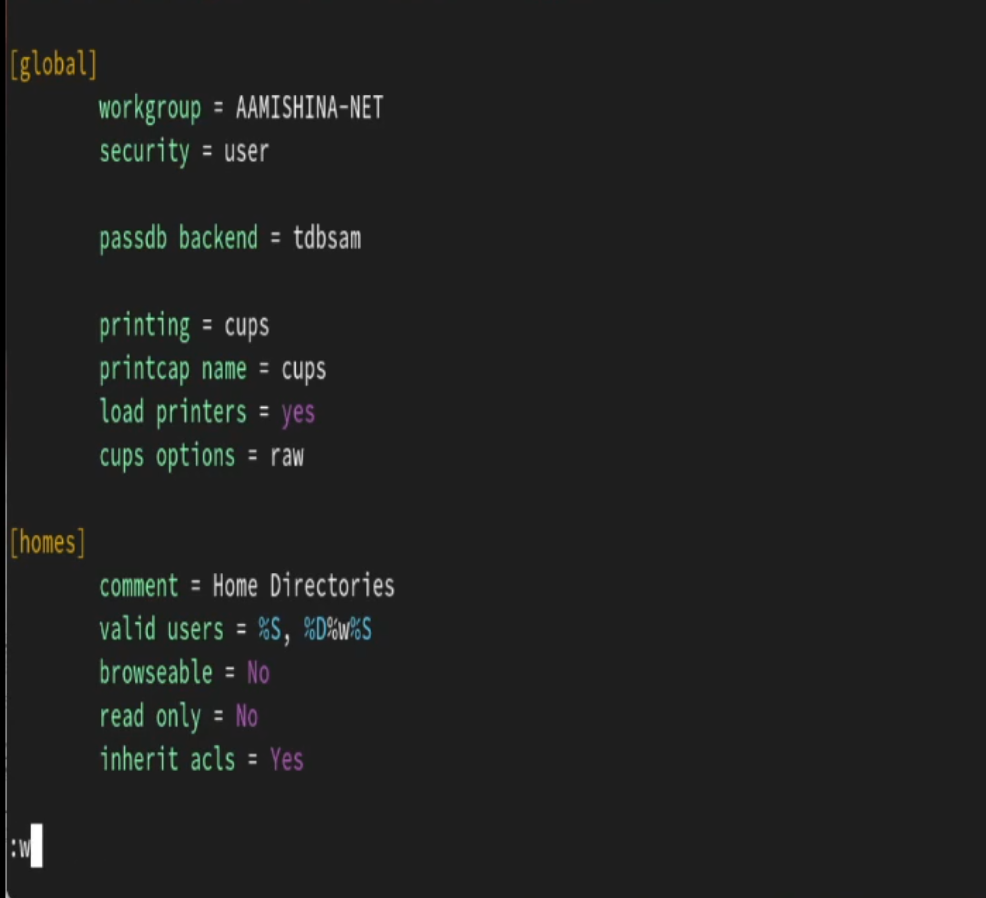{#fig:012 width=70%}

Для проверки наличия общего доступа попробуем подключиться с клиента к серверу с помощью smbclient под учетной записью root, зайдя как анонимный пользователь и под учетной записью aamishina. Затем подключемся к клиенту с сервера под учётной записью нашего пользователя(указав параметр -U можно авторизоваться под записью aamishina и с пользователя root) (рис. @fig:013), (рис. @fig:0131).

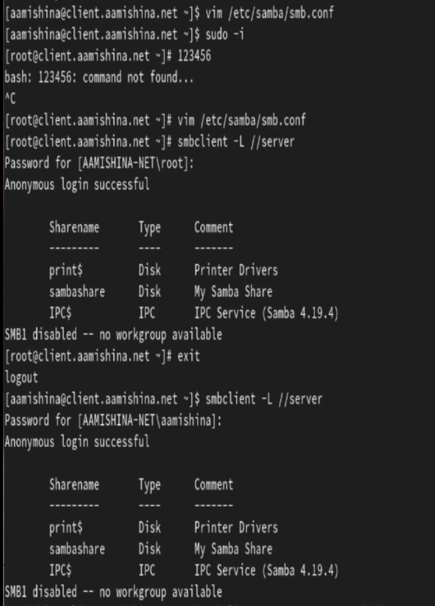{#fig:013 width=70%}

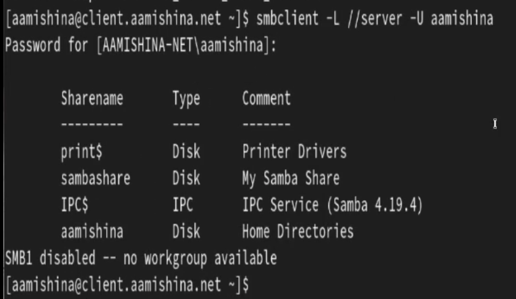{#fig:0131 width=70%}

Теперь создадим точку монтирования с помощью команды `mkdir /mnt/samba` и на клиенте получим доступ к общему ресурсу с помощью `mount`(@fig:014)

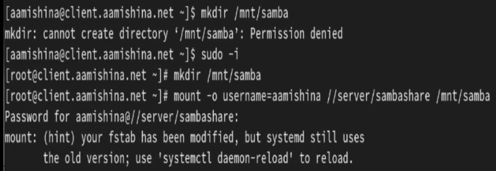{#fig:014 width=70%}

Убедимся, что наш пользователь может создавать файлы на разделяемом ресурсе(@fig:015)

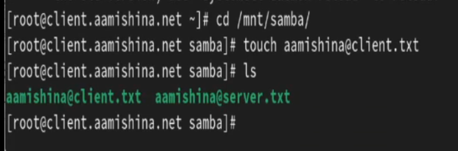{#fig:015 width=70%}

Отмонтируем каталог /mnt/samba и для настройки работы с Samba с помощью файла учётных данных на клиенте создадим файл smbusers в каталоге /etc/samba/(@fig:016)

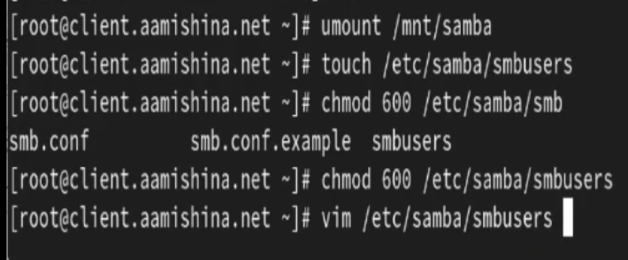{#fig:016 width=70%}

Внесём в этот файл следующее содержимое(@fig:017)

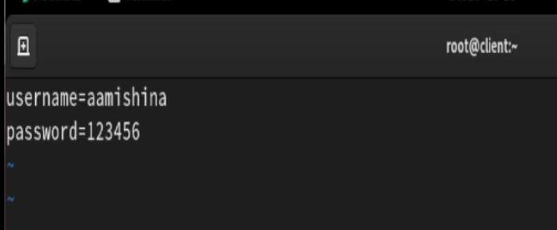{#fig:017 width=70%}

На клиенте в файле /etc/fstab добавим следующую строку(@fig:018)

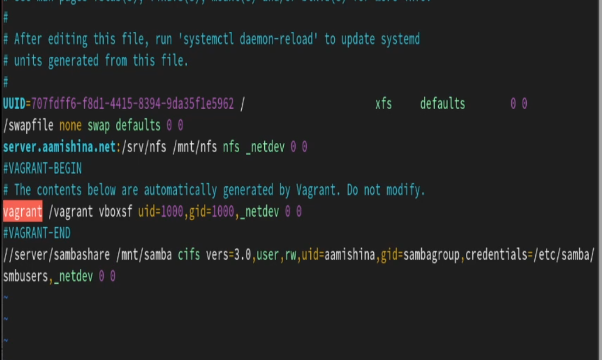{#fig:018 width=70%}

Подмонтируем общий ресурс(@fig:019):

{#fig:019 width=70%}

Перезапустим клиента и проверим, что ресурс монтируется и после перезагрузки, а у пользователя есть доступ к разделяемым ресурсам(@fig:020):

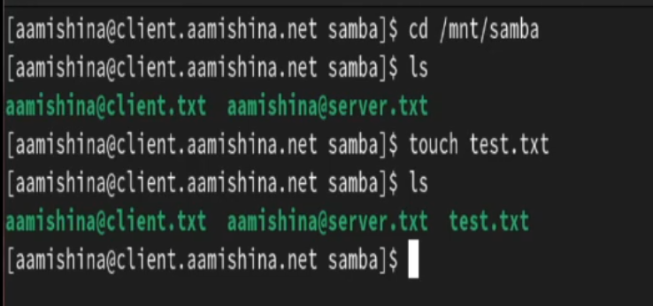{#fig:020 width=70%}

## Внесение изменений в настройки внутреннего окружения виртуальных машины

На виртуальной машине server перейдем в каталог для внесения изменений в настройки внутреннего окружения /vagrant/provision/server/, создадим в нём каталог smb, в который поместим в соответствующие подкаталоги конфигурационные файлы, а также создадим исполняемый файл smb.sh:

```
cd /vagrant/provision/server
mkdir -p /vagrant/provision/server/smb/etc/samba
cp -R /etc/samba/smb.conf /vagrant/provision/server/smb/etc/samba/

touch smb.sh
chmod +x smb.sh
```

В каталоге /vagrant/provision/server создадим исполняемый файл  smb.sh и внесем скрипт(@fig:021):

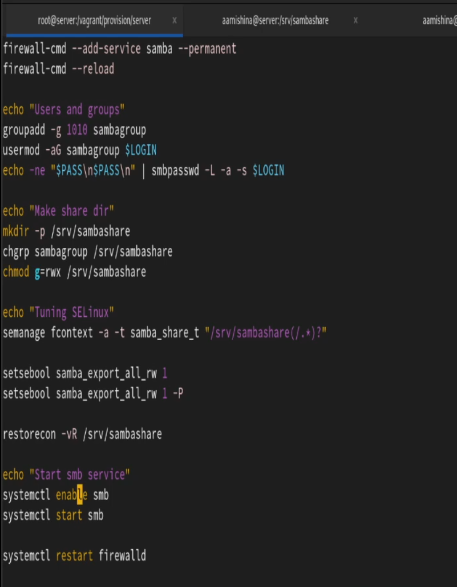{#fig:021 width=70%}

На виртуальной машине client перейдем в каталог для внесения изменений в настройки внутреннего окружения /vagrant/provision/client/, создадим в нём каталог smb, в который поместим в соответствующие подкаталоги конфигурационные файлы, а также создадим исполняемый файл smb.sh:

```
cd /vagrant/provision/client
mkdir -p /vagrant/provision/client/smb/etc/samba
cp -R /etc/samba/smb.conf /vagrant/provision/client/smb/etc/samba/
cp -R /etc/samba/smbusers /vagrant/provision/client/smb/etc/samba/

touch smb.sh
chmod +x smb.sh
```

В каталоге /vagrant/provision/client создадим исполняемый файл smb.sh и внесем скрипт(@fig:022):

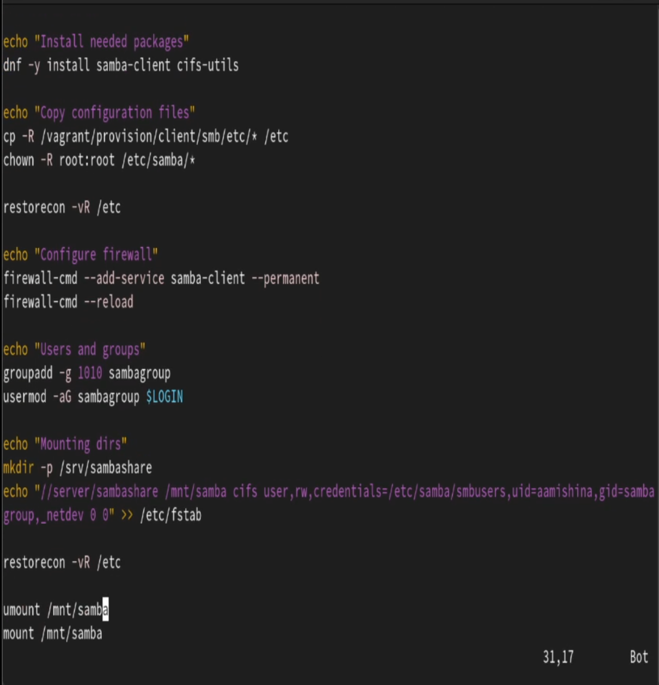{#fig:022 width=70%}

Затем для отработки созданных скриптов в конфигурационном файле Vagrantfile необходимо добавить в соответствующих разделах конфигураций для сервера и клиента:

```
server.vm.provision "SMB server",
  type: "shell",
  preserve_order: true,
  path: "provision/server/smb.sh"
client.vm.provision "SMB client",
  type: "shell",
  preserve_order: true,
  path: "provision/client/smb.sh"

```

# Контрольные вопросы

1. Какова минимальная конфигурация для `smb.conf` для создания общего ресурса, который предоставляет доступ к каталогу `/data`?

Минимальная конфигурация для `smb.conf` может включать следующие параметры:
```
[data]
path = /data
browsable = yes
read only = no
```

2. Как настроить общий ресурс, который даёт доступ на запись всем пользователям, имеющим права на запись в файловой системе Linux?

Для этого нужно установить параметр `read only = no`. Пример:
```
[data]
path = /data
browsable = yes
read only = no
```

3. Как ограничить доступ на запись к ресурсу только членам определённой группы?

Используйте параметр `write list`. Пример:
```
[data]
path = /data
browsable = yes
read only = yes
write list = @groupname
```

4. Какой переключатель SELinux нужно использовать, чтобы позволить пользователям получать доступ к домашним каталогам на сервере через SMB?

Необходимо включить переключатель `samba_enable_home_dirs` с помощью команды `setsebool -P samba_enable_home_dirs on`.

5. Как ограничить доступ к определённому ресурсу только узлам из сети 192.168.10.0/24?

Используйте параметр `hosts allow`. Пример:
```
[data]
path = /data
browsable = yes
read only = no
hosts allow = 192.168.10.
```

6. Какую команду можно использовать, чтобы отобразить список всех пользователей Samba на сервере?

Для этого используется команда `pdbedit -L`.

7. Что нужно сделать пользователю для доступа к ресурсу, который настроен как многопользовательский ресурс?

Пользователю необходимо иметь учётную запись Samba и соответствующие права доступа к ресурсу.

8. Как установить общий ресурс Samba в качестве многопользовательской учётной записи, где пользователь alice используется как минимальная учётная запись пользователя?

Для этого используется параметр `force user = alice`.

9. Как можно запретить пользователям просматривать учётные данные монтирования Samba в файле `/etc/fstab`?

Для этого используется параметр `credentials`, который позволяет хранить учётные данные в отдельном файле с ограниченным доступом. В файле `/etc/fstab` можно указать:
```
/mountpoint smbfs credentials=/path/to/credentials_file 0 0
```
Файл с учётными данными должен быть доступен только владельцу: `chmod 600 /path/to/credentials_file`

10. Какая команда позволяет перечислить все экспортируемые ресурсы Samba, доступные на определённом сервере?

Для этого используется команда `smbclient` с параметром -L и указанием имени сервера: `smbclient -L //server_address -U username`

# Выводы

В результате выполнения данной работы были приобретены практические навыки настройки доступа групп пользователей к общим ресурсам по протоколу SMB.