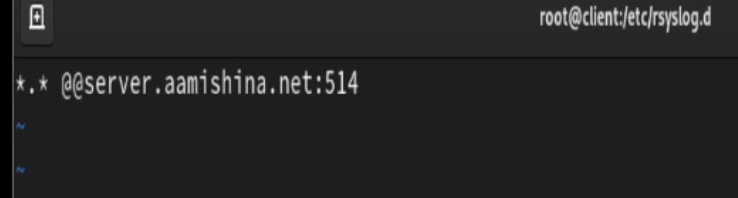
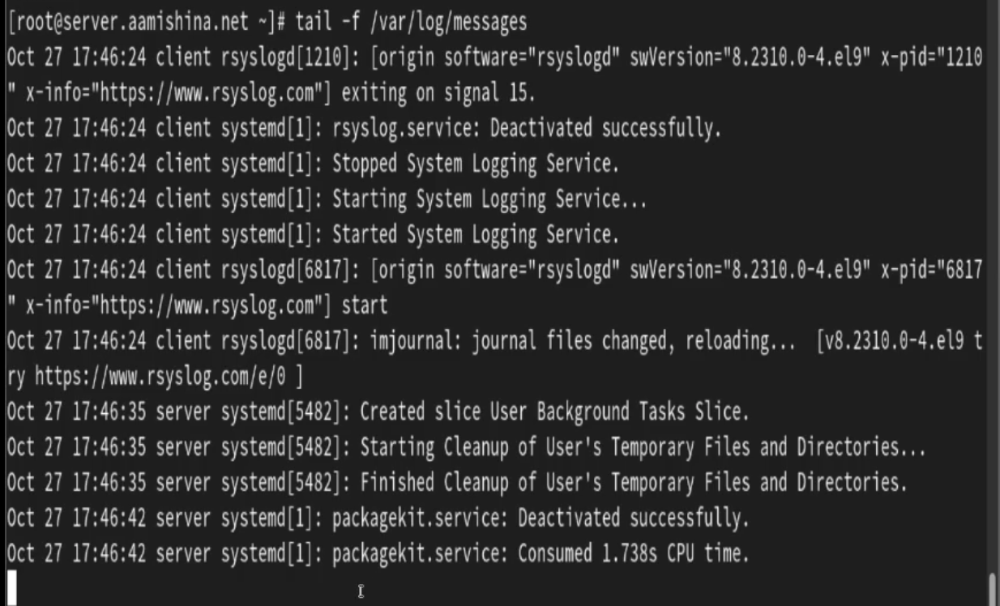

---
## Front matter
title: "Отчёт по лабораторной работе №15"
subtitle: "Дисциплина: Администрирование сетевых подсистем"
author: "Мишина Анастасия Алексеевна"

## Generic options
lang: ru-RU
toc-title: "Содержание"

## Bibliography
bibliography: bib/cite.bib
csl: pandoc/csl/gost-r-7-0-5-2008-numeric.csl

## Pdf output format
toc: true # Table of contents
toc-depth: 2
lof: true # List of figures
lot: true # List of tables
fontsize: 14pt
linestretch: 1.5
papersize: a4
documentclass: scrreprt
## I18n polyglossia
polyglossia-lang:
  name: russian
  options:
	- spelling=modern
	- babelshorthands=true
polyglossia-otherlangs:
  name: english
## I18n babel
babel-lang: russian
babel-otherlangs: english
## Fonts
mainfont: PT Serif
romanfont: PT Serif
sansfont: PT Sans
monofont: PT Mono
mainfontoptions: Ligatures=TeX
romanfontoptions: Ligatures=TeX
sansfontoptions: Ligatures=TeX,Scale=MatchLowercase
monofontoptions: Scale=MatchLowercase,Scale=0.9
## Biblatex
biblatex: true
biblio-style: "gost-numeric"
biblatexoptions:
  - parentracker=true
  - backend=biber
  - hyperref=auto
  - language=auto
  - autolang=other*
  - citestyle=gost-numeric
## Pandoc-crossref LaTeX customization
figureTitle: "Рис."
tableTitle: "Таблица"
listingTitle: "Листинг"
lofTitle: "Список иллюстраций"
lotTitle: "Список таблиц"
lolTitle: "Листинги"
## Misc options
indent: true
header-includes:
  - \usepackage{indentfirst}
  - \usepackage{float} # keep figures where there are in the text
  - \floatplacement{figure}{H} # keep figures where there are in the text
---

# Цель работы

Получение навыков по работе с журналами системных событий.

# Выполнение лабораторной работы

## Настройка сервера сетевого журнала

На сервере создаем файл конфигурации сетевого хранения журналов: cd /etc/rsyslog.d и touch netlog-server.conf.

В данном файле включаем прием записей журнала по TCP-порту 514 (рис. [-@fig:1]).

{#fig:1 width=70%}
 
Перезапускаем службу `rsyslog` - systemctl restart rsyslog и просматриваем прослушиваемые порты, которые связаны со службой - lsof | grep TCP (рис. [-@fig:2]).

{#fig:2 width=70%} 

На сервере настраиваем межсетевой экран для работы с TCP-портом 514 (рис. [-@fig:3]).

{#fig:3 width=70%} 

## Настройка клиента сетевого журнала
 
На клиенте создаем файл конфигурации сетевого хранения журналов:

```
cd /etc/rsyslog.d
touch netlog-client.conf
```

В данном файле включаем перенаправление сообщений журнала на 514 TCP-порт сервера и перезапускаем службу (рис. [-@fig:4]).

{#fig:4 width=70%}

## Просмотр журнала

На сервере просматриваем один из файлов журнала. Обращаем внимание, что выводятся сообщения как с сервера, так и с клиента (рис. [-@fig:5]).

{#fig:5 width=70%}

На сервере под пользователем `aamishina` запускаем графическую программу для просмотра журналов (рис. [-@fig:6]).

{#fig:6 width=70%}

Устанавливаем просмотрщик журналов системных событий `lnav`: dnf -y install lnav.

Используем `lnav` для просмотра логов (рис. [-@fig:7]). 

{#fig:7 width=70%}

## Внесение изменений в настройки внутреннего окружения виртуальной машины

На ВМ `server` переходим в каталог для внесения изменений в настройки внутреннего окружения `/vagrant/provision/server/` и копируем в соответствующие каталоги конфигурационные файлы:

```
cd /vagrant/provision/server
mkdir -p /vagrant/provision/server/netlog/etc/rsyslog.d
cp -R /etc/rsyslog.d/netlog-server.conf /vagrant/provision/server/netlog/etc/rsyslog.d
```

Вносим изменения в файл `/vagrant/provision/server/netlog.sh` (рис. [-@fig:8]).

{#fig:8 width=70%}

На ВМ `client` переходим в каталог для внесения изменений в настройки внутреннего окружения и копируем в соответствующие каталоги конфигурационные файлы:

```
cd /vagrant/provision/client
mkdir -p /vagrant/provision/client/netlog/etc/rsyslog.d
cp -R /etc/rsyslog.d/netlog-client.conf /vagrant/provision/client/netlog/etc/rsyslog.d/
```

Создаем и редактируем скрипт `/vagrant/provision/client/netlog.sh` (рис. [-@fig:9]).

{#fig:9 width=70%}

Для отработки созданных скриптов во время загрузки виртуальных машин `server` и `client` в конфигурационном файле `Vagrantfile` добавляем записи в соответствующих разделах конфигураций для сервера и клиента:

```
server.vm.provision “server netlog”,
type: “shell”,
preserve_order: true,
path: “provision/server/netlog.sh”

client.vm.provision “client netlog”,
type: “shell”,
preserve_order: true,
path: “provision/client/netlog.sh”
```

# Выводы

В результате выполнения работы были приобретены навыки по работе с журналами системных событий.

# Ответы на контрольные вопросы

1. Какой модуль `rsyslog` вы должны использовать для приёма сообщений от
`journald`?

Для приёма сообщений от `journald` следует использовать модуль `imjournal`.

2. Как называется устаревший модуль, который можно использовать для включения приёма сообщений журнала в `rsyslog`?

`imklog`

3. Чтобы убедиться, что устаревший метод приёма сообщений из `journald` в `rsyslog` не используется, какой дополнительный параметр следует использовать?

Cледует использовать параметр `“SystemCallFilter[include:omusrmsg.conf?]”` в конфигурационном файле `rsyslog.conf`.

4. В каком конфигурационном файле содержатся настройки, которые позволяют вам настраивать работу журнала?

Настройки, позволяющие настраивать работу журнала, содержатся в конфигурационном файле `rsyslog.conf`.

5. Каким параметром управляется пересылка сообщений из journald в rsyslog?

Пересылка сообщений из `journald` в `rsyslog` управляется параметром `“ForwardToSyslog”` в файле конфигурации `journald.conf`.

6. Какой модуль rsyslog вы можете использовать для включения сообщений из файла журнала, не созданного rsyslog?

Модуль `rsyslog`, который можно использовать для включения сообщений из файла журнала, не созданного `rsyslog`, называется `imfile`.

7. Какой модуль rsyslog вам нужно использовать для пересылки сообщений в базу данных MariaDB?

Для пересылки сообщений в базу данных MariaDB следует использовать модуль `ommysql`.

8. Какие две строки вам нужно включить в rsyslog.conf, чтобы позволить текущему журнальному серверу получать сообщения через TCP?

Для позволения текущему журнальному серверу получать сообщения через TCP нужно включить две строки в `rsyslog.conf`:
```
$ModLoad imtcp 
$InputTCPServerRun 514
```

9. Как настроить локальный брандмауэр, чтобы разрешить приём сообщений журнала через порт TCP 514?

```
firewall-cmd --add-port=514/tcp
firewall-cmd --add-port=514/tcp --permanent

```