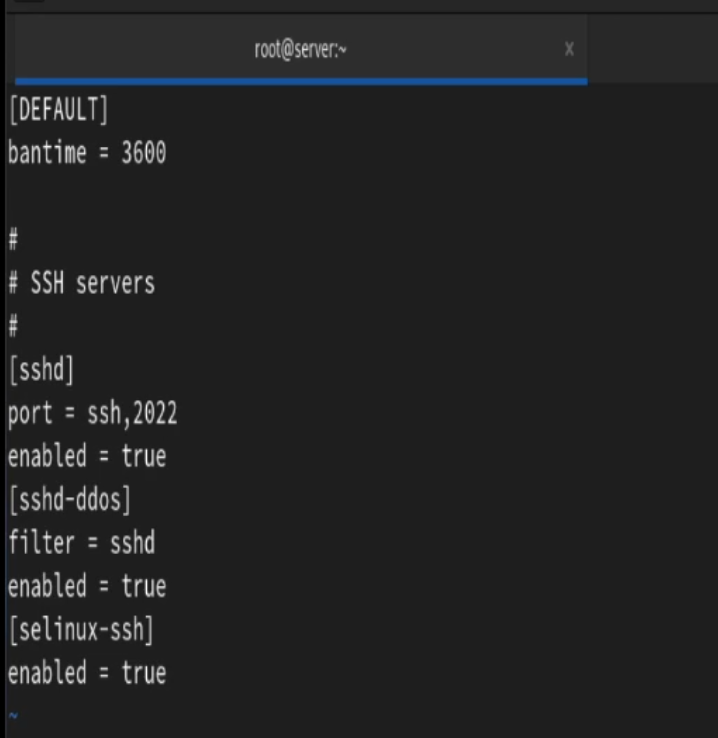
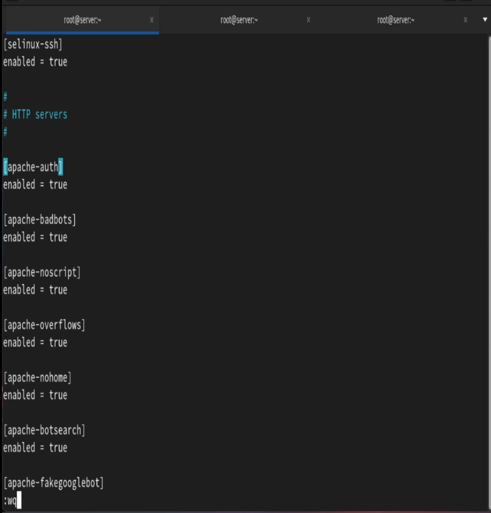
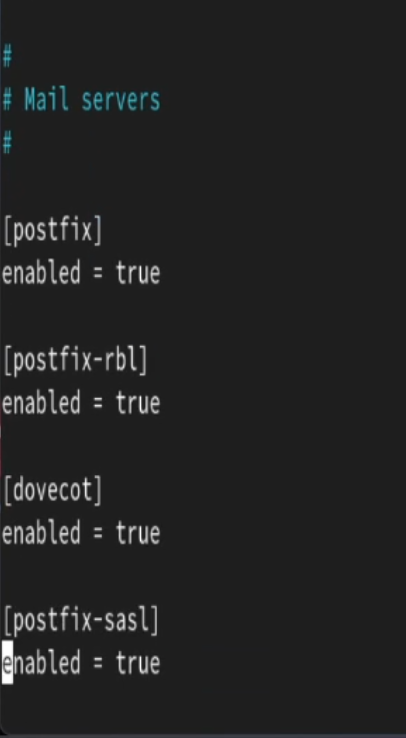
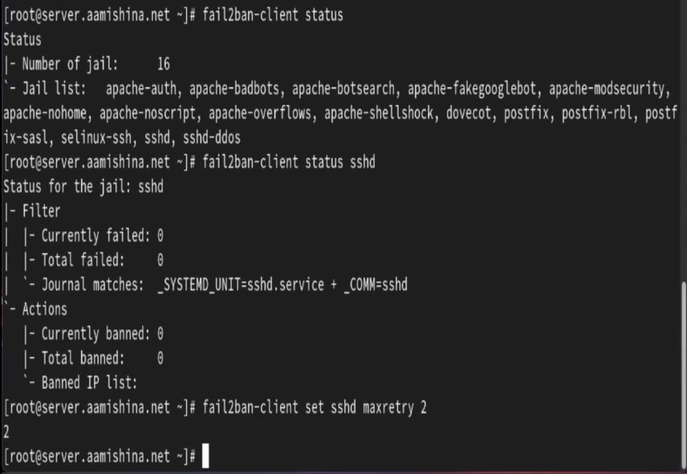
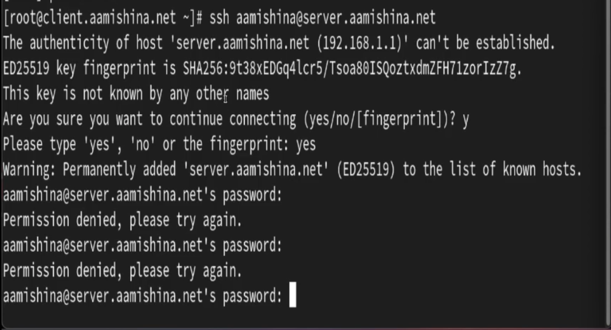
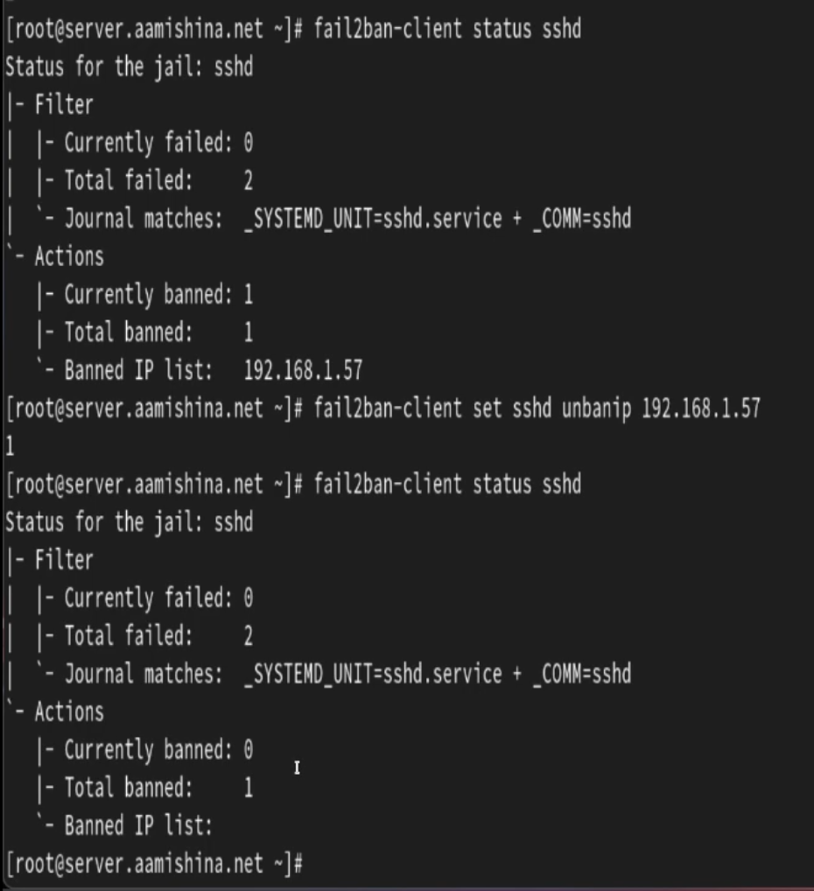
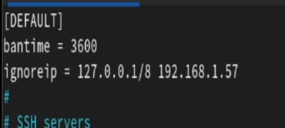
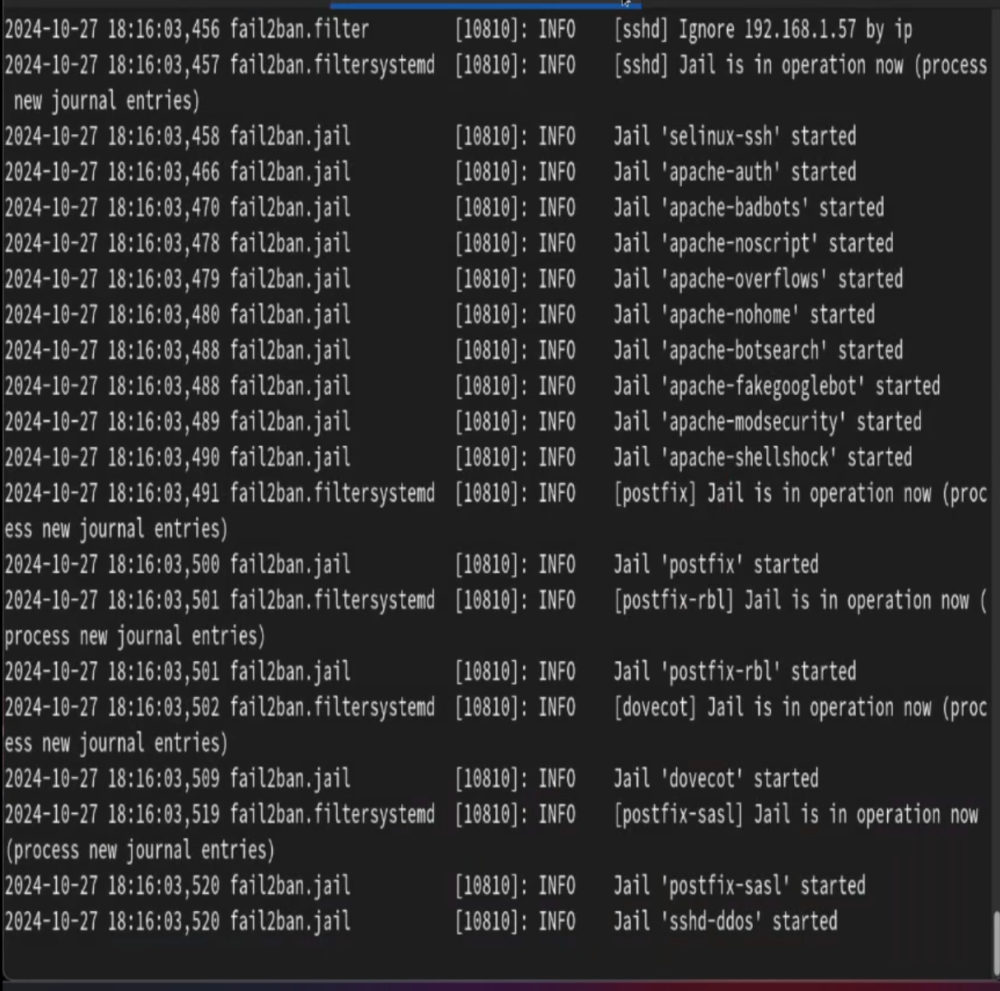
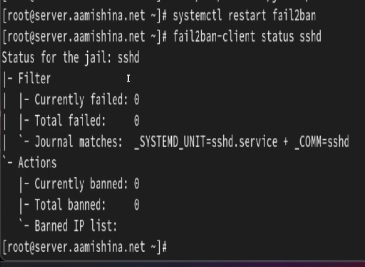
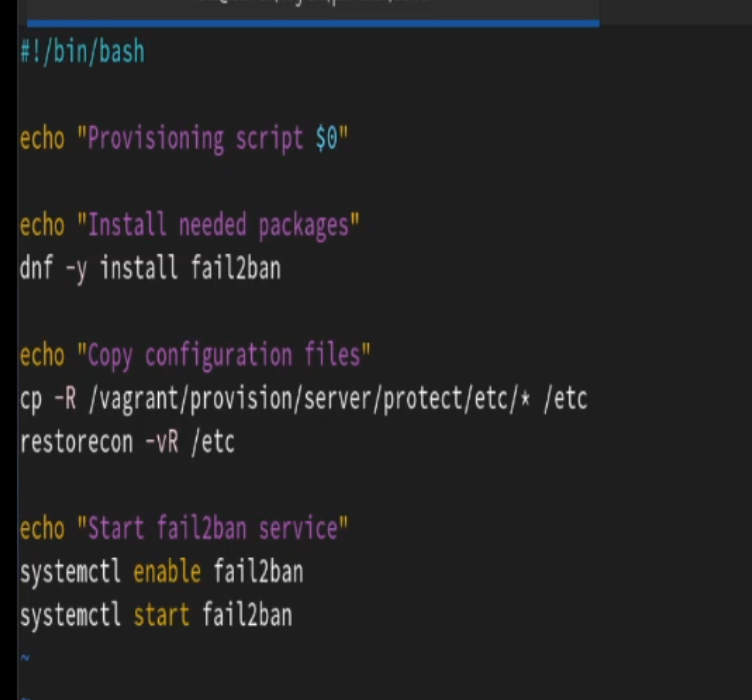

---
## Front matter
lang: ru-RU
title: Лабораторная работа №16
subtitle: Администрирование сетевых подсистем
author:
  - Мишина А. А.
date: 5 декабря 2024

## i18n babel
babel-lang: russian
babel-otherlangs: english

## Formatting pdf
toc: false
toc-title: Содержание
slide_level: 2
aspectratio: 169
section-titles: true
theme: metropolis
header-includes:
 - \metroset{progressbar=frametitle,sectionpage=progressbar,numbering=fraction}
 - '\makeatletter'

 - '\makeatother'
---

## Цели и задачи

Получить навыки работы с программным средством Fail2ban для обеспечения базовой защиты от атак типа «brute force».

# Защита с помощью Fail2ban

## Выполнение лабораторной работы

{#fig:1 width=40%}

## Выполнение лабораторной работы

{#fig:2 width=40%}

## Выполнение лабораторной работы

{#fig:3 width=40%}

## Выполнение лабораторной работы

{#fig:4 width=40%}

## Выполнение лабораторной работы

{#fig:5 width=60%}

## Выполнение лабораторной работы. 

{#fig:6 width=20%}

## Выполнение лабораторной работы 

{#fig:7 width=50%}

# Проверка работы Fail2ban

## Выполнение лабораторной работы

{#fig:8 width=70%}

## Выполнение лабораторной работы

{#fig:9 width=70%}

## Выполнение лабораторной работы

{#fig:10 width=40%}

## Выполнение лабораторной работы

{#fig:11 width=70%}

## Выполнение лабораторной работы

{#fig:12 width=50%}

## Выполнение лабораторной работы

{#fig:13 width=60%}

# Внесение изменений в настройки внутреннего окружения виртуальной машины

## Выполнение лабораторной работы

```
cd /vagrant/provision/server
mkdir -p /vagrant/provision/server/protect/etc/fail2ban/jail.d
cp -R /etc/fail2ban/jail.d/customisation.local
	/vagrant/provision/server/protect/etc/fail2ban/jail.d/
```

## Выполнение лабораторной работы

{#fig:14 width=50%}

## Выполнение лабораторной работы

```
server.vm.provision "server protect",
	type: "shell",
	preserve_order: true,
	path: "provision/server/protect.sh"
```

## Выводы

В результате выполнения работы были получены навыки работы с программным средством Fail2ban для обеспечения базовой защиты от атак типа «brute force».