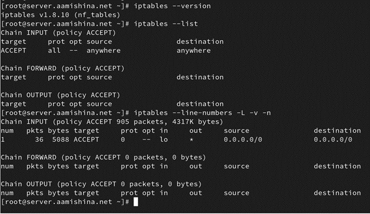

---
## Front matter
lang: ru-RU
title: Фильтр пакетов iptables
subtitle: Администрирование сетевых подсистем
author:
  - Мишина А. А.
date: 20 октября 2024

## i18n babel
babel-lang: russian
babel-otherlangs: english

## Formatting pdf
toc: false
toc-title: Содержание
slide_level: 2
aspectratio: 169
section-titles: true
theme: metropolis
header-includes:
 - \metroset{progressbar=frametitle,sectionpage=progressbar,numbering=fraction}
 - '\makeatletter'

 - '\makeatother'
---

## Введение

:::::::::::::: {.columns align=center}
::: {.column width="70%"}

  - Утилита для взаимодействия с Netfilter

  - Позволяет определить, какие пакеты будут пропускаться, блокироваться, перенаправляться

:::
::: {.column width="30%"}


:::
::::::::::::::

## Фильтр пакетов iptables

:::::::::::::: {.columns align=center}
::: {.column width="70%"}

  Фильтры пакетов нужны чтобы:

  - Контролировать трафик
  - Уведомление об отсылке пакетов

  Историческая справка

  - 1994 - Linux 1.1
  - 1998 - Linux 2.2
  - 1999 - Linux 2.4

:::
::: {.column width="30%"}


:::
::::::::::::::

## Принцип работы iptables

1. Правила - содержат критерии и цель;
Критерии: -protocol, -source, -destination, -jump, -in-interface, -dport, -sport и т.д.
Основные действия: ACCEPT, DROP, QUEUE, RETURN, REJECT, DENY, ESTABLISHED.

2. Модуль - добавляет новые опции;

3. Цепочка - набор правил;

4. Таблица - хранит цепочки правил. Raw (PREROUTING, OUTPUT), NAT (PREROUTING, POSTROUTING, OUTPUT), Filter (INPUT, FORWARD, OUTPUT), Mangle (все пять цепочек).

## Схема работы iptables

{#fig:1 width=35%}

## Практическое применение iptables

```
iptables [-t таблица] команда [критерии] [действие]
```

{#fig:2 width=60%}

## Блокировка IP-адресов

{#fig:3 width=100%}

## Блокировка портов

{#fig:4 width=90%}

## Разрешение IP-адреса

{#fig:5 width=80%}

## Открытие портов

{#fig:6 width=80%}

## Запрет и разрешение ICMP-трафика

{#fig:7 width=80%}

## Заключение

- Ключевой инструмент безопасности
- Обеспечивает защиту серверов от различных атак
- Имеет расширяемый функционал