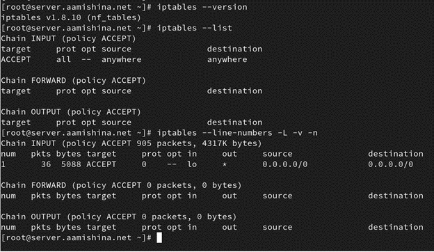
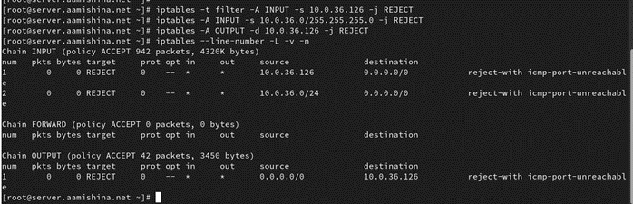
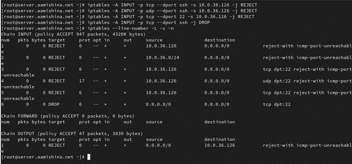
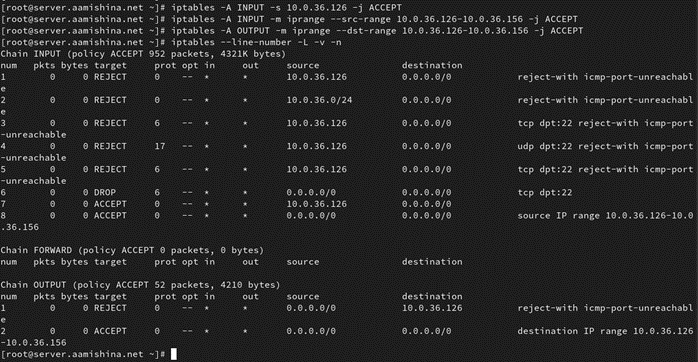
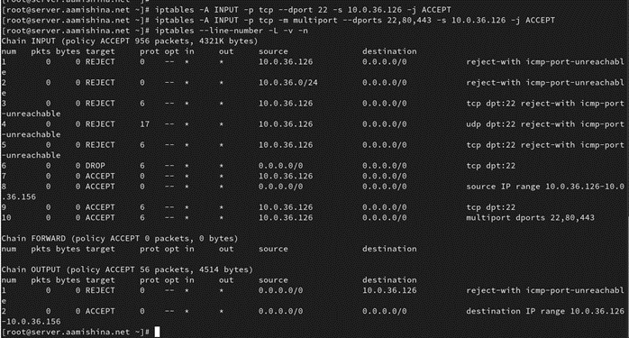
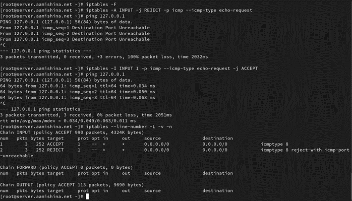

---
## Front matter
title: "Фильтр пакетов iptables"
subtitle: "Дисциплина: Администрирование сетевых подсистем"
author: "Мишина Анастасия Алексеевна"

## Generic options
lang: ru-RU
toc-title: "Содержание"

## Bibliography
bibliography: bib/cite.bib
csl: pandoc/csl/gost-r-7-0-5-2008-numeric.csl

## Pdf output format
toc: true # Table of contents
toc-depth: 2
lof: true # List of figures
lot: true # List of tables
fontsize: 14pt
linestretch: 1.5
papersize: a4
documentclass: scrreprt
## I18n polyglossia
polyglossia-lang:
  name: russian
  options:
	- spelling=modern
	- babelshorthands=true
polyglossia-otherlangs:
  name: english
## I18n babel
babel-lang: russian
babel-otherlangs: english
## Fonts
mainfont: PT Serif
romanfont: PT Serif
sansfont: PT Sans
monofont: PT Mono
mainfontoptions: Ligatures=TeX
romanfontoptions: Ligatures=TeX
sansfontoptions: Ligatures=TeX,Scale=MatchLowercase
monofontoptions: Scale=MatchLowercase,Scale=0.9
## Biblatex
biblatex: true
biblio-style: "gost-numeric"
biblatexoptions:
  - parentracker=true
  - backend=biber
  - hyperref=auto
  - language=auto
  - autolang=other*
  - citestyle=gost-numeric
## Pandoc-crossref LaTeX customization
figureTitle: "Рис."
tableTitle: "Таблица"
listingTitle: "Листинг"
lofTitle: "Список иллюстраций"
lotTitle: "Список таблиц"
lolTitle: "Листинги"
## Misc options
indent: true
header-includes:
  - \usepackage{indentfirst}
  - \usepackage{float} # keep figures where there are in the text
  - \floatplacement{figure}{H} # keep figures where there are in the text
---

# Введение

Фильтр пакетов iptables — это один из ключевых инструментов для управления сетевой безопасностью в Linux-системах. Он служит интерфейсом к подсистеме Netfilter в ядре Linux, которая обрабатывает входящие, исходящие и пересылаемые сетевые пакеты. С помощью iptables администраторы могут задавать правила фильтрации, которые определяют, какие пакеты будут пропускаться, блокироваться или перенаправляться.

Актуальность темы объясняется широким распространением Linux в качестве операционной системы для серверов, сетевых маршрутизаторов и межсетевых экранов.  Настройка iptables позволяет обеспечить гибкую и эффективную защиту систем от несанкционированного доступа и атак, таких как DDoS, сканирование портов и других угроз.

Примером использования iptables может служить настройка брандмауэров для серверов, фильтрация трафика на границе корпоративных сетей, а также реализация политик доступа в VPN и маршрутизации на уровне операционной системы. Кроме того, iptables может использоваться для управления трафиком в домашней сети, помогая защитить устройства и данные от внешних угроз.

# Фильтр пакетов iptables

Начнем с определения фильтра пакетов. Фильтр пакетов - программа, которая просматривает заголовки пакетов, по мере их прихода, и решает дальнейшую судьбу всего пакета. Фильтр может сбросить (DROP) пакет, т.е. как будто пакет и не приходил вовсе, принять (ACCEPT) пакет, т.е. пакет может пройти дальше, или сделать с ним что-то еще более сложное.

Зачем нужны фильтры пакетов?

1. Когда вы используете Linux для соединения своей локальной сети с другой сетью, например, с Интернетом, у вас есть возможность контролировать разрешение или блокировку различных типов трафика. Например, при использовании браузера может загружаться реклама какой-нибудь баннерной сети. Запрет через фильтр пакетов на прохождение всех пакетов к серверу баннерной сети или обратно, решает эту проблему.

2. Иногда плохо сконфигурированная машина отправляет в сеть какие-либо пакеты. В таком случае, можно настроить фильтр пакетов так, чтобы он уведомлял пользователя о таких действиях.

Как же можно фильтровать пакеты в Linux? Ядра Linux имеют способность фильтровать пакеты с версии 1.1. Однако, в середине 1998, для Linux 2.2, ядро было переработано и миру была представлена новая утилита для управления фильтром - ipchains. Далее в середине 1999, код ядра был снова полностью преписан для версии 2.4, появилась утилита четвертого поколения "iptables". О ней и пойдет речь в данном докладе.

# Принцип работы iptables

Iptables — популярная утилита командной строки для взаимодействия со встроенным в ядро Linux брандмауэром (он же firewall) под названием Netfilter. Утилита на текущий момент присутствует практически в любом дистрибутиве Linux.

В своей работе iptables использует механизм правил. Правила контролируют входящий и исходящий трафики и состоят в цепочках, которые разрешают или блокируют трафик.

При работе с iptables можно столкнуться со следующими терминами [@documentation]:

1. Правила — определенные действия. Правила, используемые в iptables, предназначены для контроля входящего и исходящего сетевого трафика. Также с помощью правил можно настраивать проброс портов и создавать правила для разных протоколов. Правила состоят из критериев (некоторые из них поддерживают логическую НЕ, если перед ними поставить знак !) и цели. Критерии правил сопоставляются, а действия применяются к целевому объекту. Если критерий не удается сопоставить, то происходит обработка следующего правила. В таблицах ниже приведены списки критериев (табл. [-@tbl:1]) и основных действий с соединениями (табл.[-@tbl:2]) [@book].

: Список критериев {#tbl:1}

| Полный вид | Сокращенный вид | Поддержка инверсии | Описание |
|---------|--------|--------|--------------------|
|—protocol|-p|да|указывает протокол, такие как tcp, udp, udplite и другие, поддерживаемые системой, ознакомиться со списком можно в файле /etc/protocols|
|—source|-s|да|указывает адрес источника пакета, в качестве значения можно указать как один IP-адрес, так и диапазон|
|—destination|-d|да|адрес получателя, синтаксис аналогичен предыдущему пункту|
|—match|-m|нет|подключает указанный модуль|
|—jump|-j|нет|когда правило подошло — выполнить указанное действие|
|—goto|-g|нет|перейти к указанной цепочке правил|
|—in-interface|-i|да|задает входящий сетевой интерфейс|
|—out-interface|-o|да|указывает исходящий сетевой интерфейс|
|—fragment|-f|да|указывает на фрагменты фрагментированных пакетов|
|—set-counters|-c|нет|устанавливает начальные значения счетчиков пакетов и байт|
|—destination-port|—dport|да|порт получателя пакета|
|—source-port|—sport|да|порт отправителя пакета|

: Основные действия с соединениями {#tbl:2}

| Действие | Описание |
|---------|----------------|
|ACCEPT|Открывает (разрешает) соединение.|
|DROP|Закрывает соединение без отправки ответа клиенту.|
|QUEUE|Отправляет пакет в очередь для дальнейшего взаимодействия со сторонним приложением.|
|RETURN|Возвращает пакет на одно правило назад, прерывая обработку текущего правила.|
|REJECT|Блокирует соединение. В ответ будет отправлено сообщение об ошибке.|
|DENY|Отбрасывает входящее соединение. Отправка ответа не предусмотрена.|
|ESTABLISHED|Соединение установлено так как поступил уже не первый пакет в рамках данного сеанса.|

2. Модуль — дополнительный функционал который добавляет новые опции в iptables. Благодаря чему можно создавать более обширные и сложные правила для фильтрации трафика;

3. Цепочка — последовательность или набор правил, которые определяют как будет обработан трафик;

4. Таблица — это абстракция в iptables, в которой хранятся цепочки правил. В iptables присутствуют следующие таблицы: Raw, NAT, Filter, Mangle. 

* Таблица Filter — таблица по умолчанию. Использует 3 цепочки: INPUT, FORWARD, OUTPUT (табл. [-@tbl:3]).

: Таблица Filter {#tbl:3}

| Цепочка | Описание |
|---------|----------------|
|INPUT|Управляет входящими соединениями. В качестве примера можно привести использование протокола SSH.|
|FORWARD|Управляет входящими соединениями, которые не поступают локально. Например, такая ситуация обычно происходит на маршрутизаторе.|
|OUTPUT|Управляет исходящими соединений. В качестве примера можно привести переход к какому-либо сайту при помощи браузера.|

* Таблица NAT. Использует 3 цепочки: PREROUTING, POSTROUTING, OUTPUT (табл. [-@tbl:4]).

: Таблица NAT {#tbl:4}

| Цепочка | Описание |
|---------|----------------|
|PREROUTING|Определяет IP-адрес назначения пакета.|
|POSTROUTING|Изменяет IP-адрес источника.|
|OUTPUT|Цепочка изменяет целевой адрес пакетов.|

* Таблица Mangle предназначена для изменения IP-заголовков пакета. Содержится во всех пяти стандартных цепочках: INPUT, FORWARD, OUTPUT, PREROUTING, POSTROUTING.

* Таблица Raw предназначена для предоставления механизма для маркировки пакетов, с целью отказа от отслеживания соединений. Содержитcя в цепочках PREROUTING и OUTPUT.

Более подробный алгоритм работы iptables описан ниже (рис. [-@fig:1]).

{#fig:1 width=70%}

Рассмотрим работу iptables. Сетевые пакеты поступают через сетевой интерфейс в стек TCP/IP и после базовых проверок (например, контрольной суммы) проходят через цепочки (chain). Первым обязательным этапом является цепочка PREROUTING. Далее, по таблице маршрутизации определяется, куда направить пакет: если он адресован не локальной системе, то идет в цепочку FORWARD, если локальной — в цепочку INPUT, после чего передается процессам системы.

После обработки локальной программой, при необходимости формируется ответ. Он проходит через цепочку OUTPUT (или FORWARD если пакет проходящий) по правилам маршрутизации и попадает в цепочку POSTROUTING. Таблица nat и mangle может модифицировать получателя или отправителя сетевого пакета. Именно поэтому сетевой пакет несколько раз сверяется с таблицей маршрутизации.

Каждая цепочка включает таблицы (table), не связанные между собой, даже если они имеют одинаковые названия, например, nat в PREROUTING и POSTROUTING.

При прохождении цепочек пакет последовательно проверяется в каждой таблице на соответствие правилам. Если он соответствует условию, выполняется действие. Если ни одно правило не сработало, применяется политика по умолчанию (существует в каждой таблице кроме пользовательских), чаще всего это ACCEPT (пропуск) или DROP (отклонение). Если пакет не отклонен, он передается на сетевой интерфейс в соответствии с маршрутизацией.

# Практическое применение iptables

Для начала ознакомимся с общим синтаксисом (команды в квадратных скобках необязательные) [@practice]:

```
iptables [-t таблица] команда [критерии] [действие]
```

Также ознакомимся со списком команд (табл. [-@tbl:5]).

: Команды iptables {#tbl:5}

|Полный вид|Сокращенный вид|Описание|
|----------|--------------|--------------------------|
|—append|-A|добавить правило в конец указанной цепочки|
|—check|-C|проверить существующие правила в заданной цепочке|
|—delete|-D|удалить правило с указанным номером в заданной цепочке|
|—insert|-I|вставить правило с заданным номером, без указания номера — правило будет по умолчанию добавлено первым|
|—replace|-R|заменить правило с указанным номером|
|—list|-L|вывести список всех действующих правил со всех цепочек, если указать интересующую цепочку — вывод будет сделан только по ней|
|—list-rules|-S|построчный вывод всех правил во всех цепочках, если после ключа указать имя цепочки — будут выведены только ее правила|
|—flush|-F|удалить все правила, при указании имени цепочки — правила удаляться только в ней|
|—zero|-Z|обнулить все счетчики во всех цепочках, при указании цепочки — обнуление произойдет только в ней|
|—new|-N|создать пользовательскую цепочку|
|—delete-chain|-X|удалить пользовательскую цепочку|
|—policy|-P|установить политику по умолчанию для цепочки, обычно это ACCEPT или DROP, она будет применена к пакетам, не попавшим ни под один критерий|
|—rename-chain|-E|переименовать цепочку, сначала указывается текущее имя, через пробел — новое|
|—help|-h|вывести справочную информацию по синтаксису iptables|

Проверим установлен ли iptables с помощью команды: `iptables --version`. Выведем текущую конфигурацию и посмотрим на доступные правила с помощью команды `iptables --list`. Также просмотрим более расширенный формат вывода, где отображаются количество и размер обработанных пакетов в цепочках INPUT, FORWARD и OUTPUT, а также вывод IP-адреса и номеров портов в числовом формате (рис. [-@fig:2]).

{#fig:2 width=70%}

При желании можно указать конкретную цепочку, чтобы отобразились только ее правила, например:

```
iptables -L INPUT
iptables -L FORWARD
iptables -L OUTPUT
```

При первом использование Iptables не создает и не хранит какие-либо цепочки правил, поэтому вывод команд выше будет пустым.

## Блокировка IP-адресов

Для блокировки IP-адрса необходимо добавить правило в цепочку INPUT, также необходимо указать таблицу (напомним, что если не использовать ключ -t, то правило попадет в таблицу Filter). Для примера возьмем адрес 10.0.36.126: `iptables -t filter -A INPUT -s 10.0.36.126 -j REJECT`, где опция

* -t указывает таблицу;
* -A указывает цепочку, в которую добавляем правила;
* -s указывает источник, к которому применяем действие;
* -j указывает действие, которое будет выполнено (REJECT - отклонение трафика)

Также заблокируем всю подсеть сразу, указав ее в опции -s: `iptables -A INPUT -s 10.0.36.0/255.255.255.0 -j REJECT`. А если необходимо заблокировать исходящий трафик на конкретный IP-адрес, то можно использовать цепочку OUTPUT и опцию -d: `iptables -A OUTPUT -d 10.0.36.126 -j REJECT` (рис. [-@fig:3]).

{#fig:3 width=100%}

## Блокировка портов

Для блокировки портов используется опция dport, где указывается порт необходимой службы или же имя службы. Например, заблокируем SSH-соединение с хоста 10.0.35.126 для протоколов TCP и UDP:

```
iptables -A INPUT -p tcp --dport ssh -s 10.0.36.126 -j REJECT
iptables -A INPUT -p udp --dport ssh -s 10.0.36.126 -j REJECT
```

И с использованием порта сервиса SSH: `iptables -A INPUT -p tcp --dport 22 -s 10.0.36.126 -j REJECT`.

Также заблокируем SSH-соединение с любого IP-адреса для протокола TCP: `iptables -A INPUT -p tcp --dport ssh -j DROP` (рис. [-@fig:4]).

{#fig:4 width=100%}

## Разрешение IP-адреса

Для открытия трафика по определенному IP-адресу используется действие ACCEPT: `iptables -A INPUT -s 10.0.36.126 -j ACCEPT`.

Можем разрешить трафик для сервера и с определенного диапазона IP-адресов, например с 10.0.36.126 до 10.0.36.156, использую модуль iprange и опцию --src-range: `iptables -A INPUT -m iprange --src-range 10.0.36.126-10.0.36.156 -j ACCEPT`.

Для выполнения обратной операции (разрешение трафика от сервера к определенным диапазонам IP-адресов) воспользуемся опцией --dst-range: `iptables -A OUTPUT -m iprange --dst-range 10.0.36.126-10.0.36.156 -j ACCEPT` (рис. [-@fig:5]).

{#fig:5 width=100%}

## Открытие портов

Открывается порт с помощью опции -p. Если вам интересен полный список поддерживаемых протоколов, то можете ознакомиться с ними в файле /etc/protocols.

Задаем порт опцией dports, для открытия используем действие ACCEPT: `iptables -A INPUT -p tcp --dport 22 -s 10.0.36.126 -j ACCEPT` - открытие 22 порта по протоколу TCP для адреса 10.0.35.126.

Присутствует возможность открывать сразу несколько портов за раз, используя модуль multiport и опцию dports. Например, мы хотим открыть сразу порты 22, 80 и 443: `iptables -A INPUT -p tcp -m multiport --dports 22,80,443 -s 10.0.36.126 -j ACCEPT` (рис. [-@fig:6]).

{#fig:6 width=100%}

## Запрет и разрешение ICMP-трафика

Одна из распространённых возможностей Iptables — блокировка ICMP-трафика, создаваемого утилитой ping. Чтобы запретить входящие ICMP-пакеты, следует выполнить следующую команду: `iptables -A INPUT -j REJECT -p icmp --icmp-type echo-request`. При запуске команды ping 127.0.0.1 видим, ошибки.

Чтобы разрешить трафик ICMP, необходимо выполнить команду: `iptables -I INPUT 1 -p icmp --icmp-type echo-request -j ACCEPT`. Однако, так как правила выполняются по порядку, то это правило перекроется нашим первым правилом о запрете трафика. Так что необходимо использовать опцию -I с указанием места, на которое мы хотим поставить правило. Теперь ping выплоняется успешно (рис. [-@fig:7]).

{#fig:7 width=100%}

# Заключение

В заключение, iptables остается одним из наиболее востребованных инструментов для фильтрации пакетов в среде Linux. Его основные преимущества заключаются в высокой гибкости и мощных возможностях настройки, что позволяет администраторам детально контролировать входящий и исходящий трафик. Благодаря поддержке различных протоколов и возможности создания сложных правил, iptables идеально подходит для защиты серверов и сетей от несанкционированного доступа и атак.

Спрос на iptables остается высоким, особенно в среде облачных технологий и контейнеризации, где безопасность играет ключевую роль. Его интеграция с другими инструментами, такими как nftables, также позволяет расширить функциональность и упростить управление правилами. Таким образом, iptables продолжает оставаться актуальным инструментом для обеспечения сетевой безопасности в современных IT-инфраструктурах.

# Список литературы{.unnumbered}

::: {#refs}
:::
